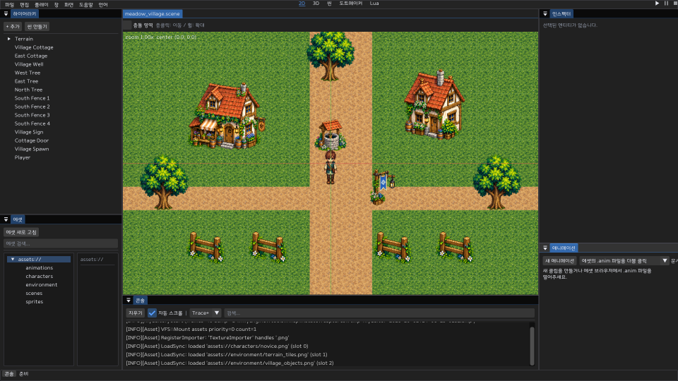

# MyEngine

A Windows C++20 game engine for 2.5D pixel art games. Build scenes from separate objects, connect collision and interaction components, write Lua behavior, and test in a separate game window.

Static embedded GLB meshes, camera-facing sprites and saved 3D game cameras share the official editor/player path. Movement and collision remain 2D; 3D physics and an authenticated online player are still in development. See the [component guide](docs/20-components.md) for supported formats and limits.

## Get started

Download the Windows x64 ZIP from [Releases](https://github.com/ekdms05/MyEngine/releases), extract it into a new folder and launch `MyEditor.exe`. The project window lets you create a blank project, create a project with the meadow village template, or open a `.myeproj` file. The [latest Microsoft Visual C++ v14 x64 Redistributable](https://learn.microsoft.com/en-us/cpp/windows/latest-supported-vc-redist) and DirectX 11 are required.



- Use **2D / 3D / Lua** in the header to change the central workspace.
- Create scenes and add objects from the Hierarchy. Select an object to edit its components in the Inspector. Component descriptions and field tooltips explain usage and units.
- Right-click the Asset Browser to import PNG, animation, Lua or WAV assets, create folders, or recycle an unused file. `.meta` GUIDs identify assets across scenes.
- Press Play to open the game window. WASD / arrow keys move the configured character; E interacts. Pause and Stop remain in the editor header. Playing never saves changes into the edit scene.
- Create pixel art and skeletal animation in external tools. Import PNG sheets and edit frame regions, timing, events and successor clips in the animation panel.

The [offline game creation guide](docs/guide/index.html), [Lua API](docs/19-lua-api.md) and [component guide](docs/20-components.md) describe the actual editor APIs and their limits. The engine's [architecture](docs/13-architecture-and-features.md) and [development priorities](docs/14-development-priorities.md) distinguish integrated features from library support.

## Build from source

Use Windows, Visual Studio 2022 Desktop development with C++, Windows SDK, and CMake 3.26 or later. Dependencies are vendored; no package download is needed to build the engine.

```powershell
cmake -S . -B build/dev -G "Visual Studio 17 2022" -A x64
cmake --build build/dev --config Debug
ctest --test-dir build/dev -C Debug --output-on-failure
cmake --build build/dev --config Release
```

For Visual Studio 2026, use a CMake version that supports the generator and replace `Visual Studio 17 2022` with `Visual Studio 18 2026`. Reuse an existing build tree with its original generator.

The Windows release workflow runs rendering tests with `MYE_DX11_WARP=1` to explicitly select Microsoft's software rasterizer on hosted runners. The packaged engine defaults to hardware DX11; WARP tests do not measure GPU performance.

The editor is `build/dev/apps/editor/Release/MyEditor.exe`. The build copies the template alongside it. Starting without `--project` opens the project window.

```powershell
build/dev/apps/editor/Release/MyEditor.exe --project game/starter/meadow_village/project.myeproj
build/dev/apps/game/Release/MyGame.exe --project game/starter/meadow_village/project.myeproj
```

`MyGame` is a standalone local project player. Network, server, persistence and game service libraries remain available for integration; the local player does not provide an online client. Play inside the editor uses a separate native window in the same process, so it does not isolate process crashes.

## Development tools

[MCP](docs/08-mcp.md) provides build, test, run, capture, project inspection, API reference and validated asset import. Node.js is needed only for these tools. [Skills and specialist roles](docs/15-skills-and-agents.md) are development aids, not engine runtime dependencies.

`VERSION` owns the release version. [Packaging](tools/package/package.ps1) creates a clean editor distribution with the current template, offline guide, license notices and SHA-256 manifests. Tagged releases use the [Windows release workflow](.github/workflows/release.yml).

## Structure and limits

| Path | Purpose |
|---|---|
| `engine/` | Shared core, ECS, DX11 render, assets, Lua, runtime, UI and editor libraries |
| `game/` | Current starter project and game-specific services/content |
| `apps/` | Editor, local player, server and pak tool entry points |
| `tests/` | Existing native test framework and regression checks |
| `tools/` | MCP, packaging and verification |
| `docs/` | Current user guides and API contracts |

The renderer uses a left-handed coordinate system, +Y up, 48 pixels per world unit and a 960×540 pixel target. Sprites and inserted 3D geometry share depth and alpha cutout contracts. DX11 is the implemented graphics backend. Visual game UI editing, full 3D scene tooling, script autocomplete/debugging, process-isolated play and production online integration remain development work.

Sol2 and the integrated pixel drawing/rigging tool have been removed. Lua 5.4.7, Dear ImGui, the currently used image/model/audio decoders and FreeType remain because they serve live loading, rendering and scripting paths. Third-party license notices are preserved. The editor bundles NanumSquareRound Regular with its SIL OFL 1.1 notice; Windows language fonts supplement Japanese/Chinese coverage and are not redistributed.
