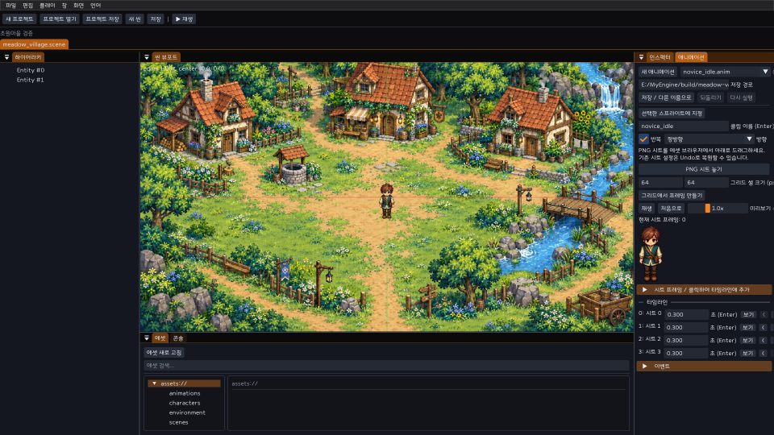
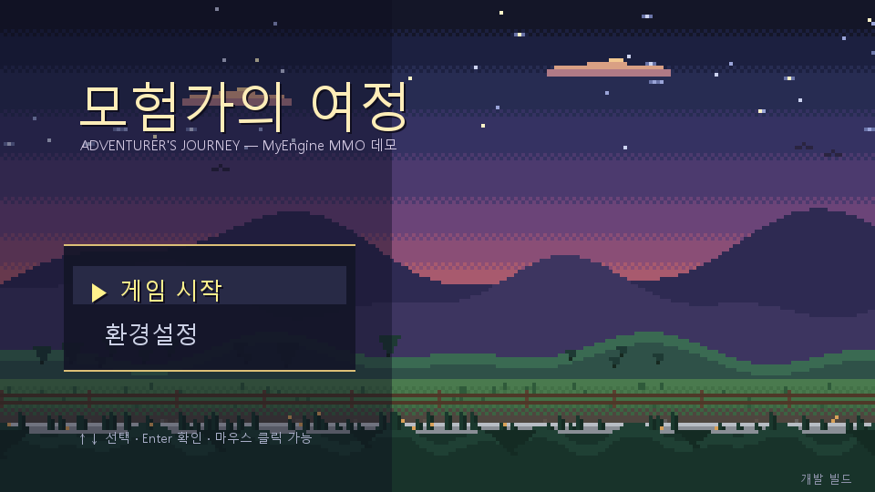

# MyEngine

A C++20 / DirectX 11 engine for 2.5D pixel-art games. Sprites, layered
maps and 3D props share one depth buffer. The repository includes a Dear
ImGui editor, Lua content tools and a local multiplayer server foundation.
The design favors clear ownership, small modules and measured performance.

> 한국어 문서: [문서 안내](docs/README.md) · [현재 구조와 기능](docs/13-architecture-and-features.md) · [개선·개발 우선순위](docs/14-development-priorities.md) · [스킬·에이전트 조사](docs/15-skills-and-agents.md).

## Applications

| Application | Purpose | Current behavior |
|-------------|---------|------------------|
| `MyEditor` | Edit scenes and content | Project/scene create, open and save; meadow village starter with a level-1 character; sprite animation editing, PNG preview, undo and isolated animation playback |
| `MyGame` | Run a game project | Title/settings, scene loading, local movement, audio and loopback multiplayer movement |
| `MyServer` | Host local multiplayer | Account authentication, authoritative movement, session snapshots, backups and metrics |
| `paktool` | Package assets | Build and inspect pak files through the asset/VFS layer |

The [implementation report](docs/13-architecture-and-features.md) describes each
application's modules and tested paths. Remaining integration and service work
has separate [completion criteria](docs/14-development-priorities.md).

The `bridge_demo` sample verifies that a character can walk
**over a bridge while another walks under it**, and step **behind a 3D statue**
with correct per-pixel occlusion — all 2D sprites and 3D meshes sharing one
depth buffer.

The **village integration sample** (`samples/village_demo`) demonstrates the content
stack: a dot character walks a layered village — sloped hill,
a one-way bridge over a creek, 3D fountain/statue props — and talks with three
NPCs (chief, merchant, guard) in **Korean**, complete with branching choices, an
opening cutscene, wandering NPCs, footsteps and BGM. Lua scripts and localization
tables load from assets at startup. The map and spawn layout are currently
constructed in C++; complete data-driven editing and automatic reload remain
integration work.

MyEditor includes a [meadow village starter](game/starter/meadow_village/README.md).
The first launch copies it into the user project directory; new projects can include
it from the creation dialog. Open a `.anim` file in the asset browser to edit frame
regions, pivots, timing and events, preview the PNG and assign it to a scene sprite.
The starter map is a background image with a separate character; editable terrain,
collision and movement controls remain integration work. See the [editor guide](docs/07-editor-ui.md).



## Key features

- **Hybrid 2D + 3D rendering** — pixel-art sprites and 3D meshes sorted in a
  single depth buffer via alpha-cutout depth writes + Y-sort-to-depth encoding
  and anchor-biased mesh depth (bridges, slopes, occlusion behind 3D objects).
- **Pixel-perfect pipeline** — 960×540 internal render target, integer upscale
  with letterbox, pixel-snapped camera with sub-pixel scroll (PPU 48).
- **Own RHI over DirectX 11** — opaque handles, bind groups, monolithic PSOs;
  the implemented backend is DX11.
- **Sparse-set ECS** — 64-bit entity handles, 5-phase scheduler, command buffer,
  transform hierarchy; runtime component registration for scripts/plugins.
- **Tilemap** — 32×32 chunks, multi-column cells for bridges, integer height +
  slopes.
- **Lightweight 2D physics** — AABB/circle colliders, spatial hash,
  move-and-slide, floor-level filtering, trigger events.
- **Reflection + serialization** — non-intrusive `Reflect<T>`, JSON archive with
  versioning, property paths.
- **Hot-reloadable assets** — file watcher → reimport → in-place handle swap.
- **Content import** — PNG (stb_image), glTF static meshes (cgltf),
  Aseprite/spritesheet + atlas packing, WAV/OGG audio.
- **Animation** — 8-direction directional sets, data-driven state machine,
  animation events (footsteps, hit frames).
- **Audio** — miniaudio backend, buses, cues with polyphony, BGM crossfade,
  positional panning.
- **Lua scripting** — single sol2 VM, per-entity script
  components, error isolation, hot reload with state survival, coroutines.
- **MCP dev-tools server** — a Model Context Protocol server (`tools/mcp`) that
  provides build, test, run, log and frame-capture commands.

## Runtime and server behavior

- MyGame: title/settings, pixel UI text, fixed-tick local movement, AudioModule
  output, scene rendering and loopback multiplayer movement.
- MyServer: validated input protocol v1, at most 64 local clients, active-session
  snapshots, backup/restore and PBKDF2-SHA256 password storage through Windows CNG.
- Save format: versioned `state.json`; complete legacy three-file saves are read
  and converted on the next save. One writer per directory, 64 MiB ceiling.
- Online combat/social integration, editor physics/Lua integration, encrypted
  transport and production operations remain in the [backlog](docs/14-development-priorities.md).
  The current UDP server binds to loopback because its credentials are unencrypted.

The [change record](docs/16-foundation-worklog.md) records evidence, verification,
measured reconciliation performance and known limits. Local development skill
installation and runtime prerequisites are documented [here](docs/15-skills-and-agents.md).



## Building

Requirements: **Windows**, **Visual Studio 2022/2026** (C++20 toolchain),
**CMake ≥ 3.26**.

```sh
cmake --preset dev
cmake --build --preset debug
cmake --build --preset release
```

Run the editor or game from the repository root:

```sh
build/dev/apps/editor/Release/MyEditor.exe
build/dev/apps/game/Release/MyGame.exe
```

`MyGame` uses `samples/mmo_demo` by default. `--project <directory>` selects
another project; `--auto-start` opens gameplay and `--settings` opens settings.
`MyEditor` creates and opens projects through the File menu or
`--project <folder-or-myeproj>`. Ctrl+Shift+N creates a project, Ctrl+Shift+O opens
one, Ctrl+S saves the current scene, and Ctrl+Alt+S saves all open scenes and the
project. See [editor workflows and file contracts](docs/07-editor-ui.md).

Run a demo (from the build tree):

```sh
build/dev/samples/sprite_demo/Debug/sprite_demo.exe       # WASD character and pixel scaling
build/dev/samples/bridge_demo/Debug/bridge_demo.exe       # bridge layers and 3D occlusion
build/dev/samples/character_demo/Debug/character_demo.exe # animation, Lua, footsteps, hot reload
build/dev/samples/village_demo/Debug/village_demo.exe      # dialogue, NPCs and runtime integration
```

### village_demo — content and runtime integration

`village_demo` is an integration demo: one executable that walks the whole
engine stack (RHI, ECS/scene, tilemap, physics, animation, audio, Lua scripting,
runtime dialogue/cutscene/NPC systems, Korean text, pixel-perfect hybrid render).

```sh
# Interactive: WASD to move, E to talk to an NPC, Esc to quit.
build/dev/samples/village_demo/Release/village_demo.exe

# Deterministic verification scenarios (headless-friendly, auto-exit):
village_demo.exe --scenario walk    --frames 45           # player renders + moves
village_demo.exe --scenario bridge  --frames 15           # player on the bridge (floor 1)
village_demo.exe --scenario talk    --frames 15 --dump-ui talk.bmp   # Korean dialogue box + choices
village_demo.exe --scenario wander  --frames 90           # NPCs wander the plaza
village_demo.exe --scenario behind_prop --frames 15 --dump prop.bmp # occlusion behind the 3D statue
```

CLI flags: `--frames N` (run N frames then exit 0), `--dump path.bmp` (dump the
last frame, no overlay), `--dump-ui path.bmp` (dump including the dialogue box),
`--scenario <name>`, `--headless`. Assets (map, character/tile PNGs, glTF props,
audio) are regenerated deterministically by
`samples/village_demo/tools/make_all.ps1`; map/dialogue/localization JSON and the
Lua scripts under `samples/village_demo/assets/` provide content inputs and
reference data. Localization and Lua source changes take effect on restart;
map layout changes currently require updating the sample C++ implementation.
`character_demo` has a separate scripted hot-reload verification scenario.

Run the tests:

```sh
ctest --preset debug
powershell -File tools/verify-foundation.ps1 -Configuration Debug
```

The `dev` preset uses Visual Studio 2026 and keeps both configurations in
`build/dev`. With Visual Studio 2022, configure the same directory with
`cmake -S . -B build/dev -G "Visual Studio 17 2022" -A x64` and use the existing
`--config Debug`/`--config Release` build commands. Choose the generator before
creating the build tree. Windows, DirectX 11 and the matching MSVC runtime
remain platform requirements.

Sources stay in `engine/`, `game/`, `apps/`, `samples/` and `tests/`. Generated
files stay under `build/`. Local verification records remain in
`build/foundation` and `build/docs-audit`; preserved legacy sources, captures
and save data are under `archive/build-cleanup-2026-10-01`. The archive is local
and excluded from Git. Its manifest records original paths and SHA-256 hashes;
old CMake caches are historical records and cannot be reused as moved builds.

## Repository layout

```
engine/
  core/      mye_core   — math, log, json, config, events, module/app loop, win32, input, jobs
  rhi/       mye_rhi    — RHI abstraction + DirectX 11 backend
  reflect/   mye_reflect— reflection + JSON serialization
  asset/     mye_asset  — asset DB, VFS, importers (PNG/glTF/Aseprite/audio), hot reload
  render/    mye_render — sprite batch, camera, pixel-perfect target, hybrid depth renderer
  scene/     mye_scene  — ECS, tilemap, physics, animation, render extract
  audio/     mye_audio  — miniaudio backend, mixer, buses, cues
  imgui/     mye_imgui  — Dear ImGui DX11/win32 backend + debug overlay
  script/    mye_script — Lua (sol2) runtime + bindings
  ui/        mye_ui     — in-game UI widgets + Korean text (FreeType) stack
  runtime/   mye_runtime— dialogue, cutscene, NPC, save, localization, scene transition
  editor/    mye_editor — documents, panels, inspector, undo, play-world support
  plugin/    mye_plugin — static and DLL plugin hosting
  ddc/       mye_ddc    — runtime schemas and dynamic components
  gameplay/  mye_gameplay — reusable RPG rules
  net/       mye_net    — UDP protocol, prediction, reconciliation, interpolation
  persist/   mye_persist— accounts, characters, ledger, JSON snapshots
  liveops/   mye_liveops— server settings, feature flags, metrics
  gameserver/ mye_gameserver — network/gameplay/persistence integration
game/        social and MMO content libraries
apps/        MyEditor, MyGame, MyServer, paktool
samples/     runnable demos (hello_triangle, asset_smoke, sprite_demo, bridge_demo,
             character_demo, village_demo)
tests/       mye_tests  — unit + integration tests
tools/mcp/   Model Context Protocol dev-tools server (TypeScript)
docs/        product and system references (Korean) + extension requirements
third_party/ vendored dependencies
```

Conventions: C++20, namespace `mye`, static linking, UTF-8 throughout, no
exceptions in engine code (`Expected<T, Error>`), `/W4`. Coordinate system is
left-handed, +Y up, PPU 48; see `docs/02-rendering.md` for the authoritative
spec.

## Documentation

Start with the [documentation index](docs/README.md) and follow the
[repository working rules](AGENTS.md) when making changes.
The Korean system references describe current responsibilities, data contracts,
source entry points and known limits: `00` overview, `01` core, `02` rendering,
`03` scene/ECS, `04` assets, `05` scripting/plugins, `06` runtime, `07` editor/UI
and `08` MCP. MMO extension requirements are kept separately in `docs/mmorpg/`.

## Third-party

Vendored under `third_party/`, each under its own license:

- [stb_image](https://github.com/nothings/stb) — PNG decode (public domain / MIT)
- [Dear ImGui](https://github.com/ocornut/imgui) (docking) — editor UI (MIT)
- [cgltf](https://github.com/jkuhlmann/cgltf) — glTF parsing (MIT)
- [miniaudio](https://github.com/mackron/miniaudio) — audio playback (public domain / MIT-0)
- [stb_vorbis](https://github.com/nothings/stb) — OGG decode (public domain / MIT)
- [Lua](https://www.lua.org/) — scripting language (MIT)
- [sol2](https://github.com/ThePhD/sol2) — Lua/C++ binding (MIT)

## License

[MIT](LICENSE). Do what you like with it, keep the copyright notice.
