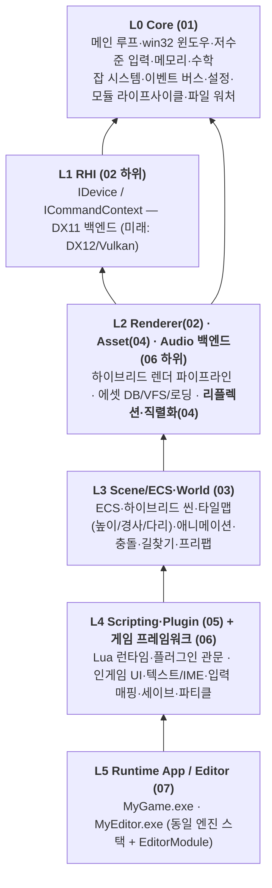
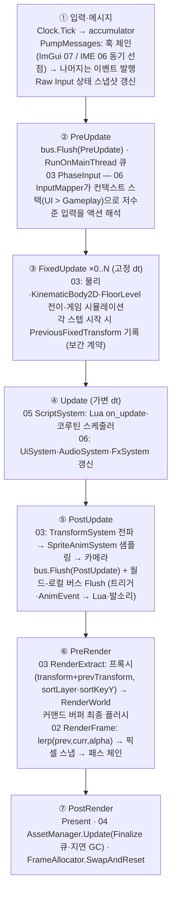

# 00. MyEngine 설계 개요 (Overview)

> 테일즈위버류 **2D 도트 + 3D 하이브리드** 게임을 위한 자체 게임엔진. 1인 개발, 기능설계 단계(그린필드).
> 이 문서는 [01](01-core-platform.md)~[07](07-editor-ui.md) 모듈 설계 문서 전체의 입구이자 요약이다.
> 상세 규약이 충돌해 보이면 **각 주제의 소유 문서가 정본**이다(§3 의존 규칙 참조).

---

## 1. 비전과 설계 철학

**MyEngine은 테일즈위버식(2D 위주 + 3D 삽입)과 HD-2D식(3D 월드 + 빌보드 스프라이트)을 하나의
씬 모델로 표현하는 하이브리드 엔진이며, 설계의 제1원칙은 "확장성 극대화"다.**

### 제1원칙 — 확장성 극대화가 아키텍처에 반영된 방식

| 장치 | 내용 | 소유 |
|---|---|---|
| **두 갈래 확장 모델** | 게임 로직 = Lua(sol2), 엔진 수준 확장(컴포넌트·렌더 패스·임포터·에디터 패널) = 네이티브 C++ 플러그인 DLL. 어느 쪽도 엔진 재빌드 없음 | 05 |
| **EngineContext 단일 관문** | 플러그인은 엔진 import lib를 링크하지 않고, 로드 시 받는 `EngineContext&`의 `ServiceId`(문자열 FNV-1a 해시 — DLL 경계 안전) 가상 게이트웨이로만 엔진에 접근. 새 기능 = 새 ServiceId 추가(기존 인터페이스 동결) | 01·05 |
| **등록형(registry-based) 설계** | 컴포넌트·시스템·렌더 패스·임포터·위젯·패널… 엔진의 모든 핵심 개념이 register/unregister 대칭 레지스트리다. 플러그인 언로드 안전성이 1급 요구사항 | 전 모듈 |
| **리플렉션 원-스톱 루프** | 타입을 04 리플렉션에 한 번 등록하면 직렬화(04)·에디터 인스펙터(07)·Lua 바인딩(05)이 전부 자동으로 따라온다. 이것이 이 엔진 확장성의 핵심 루프 | 04 |
| **"내장 = 1급 플러그인"** | 에디터의 모든 내장 기능은 확장 API 위에서 구현된다. "내장은 되는데 플러그인은 안 되는" API를 만들지 않는다 | 07 |
| **백엔드 인터페이스화** | RHI(`IDevice` — DX11→DX12/Vulkan), `IAudioBackend`(miniaudio→XAudio2), `IPhysicsWorld`(자체→Box2D), `IGamepadBackend`, `IFileSystem`(VFS — 모드 지원의 근간) | 02·03·04·06 |
| **이벤트 버스 = 공용 언어** | 이벤트 타입 ID를 문자열 해시로 정적 등록 — 엔진 재컴파일 없이 DLL 간 이벤트 교환. 우선순위+consumed로 플러그인이 엔진 기본 동작을 선점 가능 | 01 |

확장의 **비대칭 원칙**: "게임 디자이너가 만질 것만 Lua에 노출한다. 엔진 프로그래머의 도구는 C++ 플러그인으로 간다."
(RHI·잡 시스템·파일 원시 접근은 Lua에 비노출 — 05 바인딩 표면 원칙)

### 보조 원칙

- **1인 개발 현실주의**: 차별점이 아닌 곳은 검증된 기성품 채택(EnTT·sol2·miniaudio·FreeType).
  소비자가 등장하기 전에 인프라를 만들지 않는다(리플렉션은 에디터 직전, 플러그인 DLL 로더는 첫 수요 발생 시).
- **하이브리드 깊이 정렬 = 존재 이유이자 최대 리스크**: 2D 스프라이트·타일·3D 메시가 **단일 깊이 버퍼**에서
  정합하는 설계(02)를 로드맵 M2에서 최우선 검증한다.
- **WYSIWYG**: 에디터와 게임은 동일한 엔진 바이너리(L0~L4) 위의 L5 앱 두 개. 에디터에서 보는 것 = 게임에서 보는 것.
- **데이터 + Lua**: UI 문서·파티클·오디오 큐·입력 바인딩·문자열 테이블은 전부 에셋이고, 동작은 Lua가 붙는다.
- **의도적 봉인**: 메인 루프 구조(고정 스텝+보간), 에디터 도킹/CommandStack/SelectionManager는 확장 불가 —
  모든 확장이 딛고 서는 공통 가정을 지키는 뼈대이기 때문.

---

## 2. 확정 기술 스택

| 영역 | 결정 | 비고 |
|---|---|---|
| 언어·플랫폼 | **C++20**, 네임스페이스 `mye`, **Windows(win32) 우선** | 문자열 전면 UTF-8, 코어는 예외 비사용(`Expected<T,Error>`), STL 별칭 사용 |
| 그래픽 | **자체 RHI, DX11 1차 백엔드** → DX12/Vulkan 추가 가능 | PSO·BindGroup·RenderPass 3기둥. 셰이더 HLSL SM5.0(FXC→DXC 이행) |
| 씬 | **하이브리드 씬**(2D 레이어 + 3D 노드 공존), `Screen2D`/`HD2D` 공간 프리셋 | 단일 깊이 도메인 정렬(02), ECS는 EnTT 래핑(03) |
| 확장 | 게임 로직 **Lua 5.4 + sol2**, 엔진 확장 **네이티브 플러그인 DLL** | C 진입점(`myePluginEntry`) + C++ 인터페이스 하이브리드 ABI, 동일 툴체인 계약 |
| 에디터 | **Dear ImGui(도킹 브랜치)** 통합 에디터, **기본 언어 한국어 우선** | 인게임 UI는 06의 자체 리테인드 시스템(ImGui 침투 금지) |
| 오디오 | **miniaudio** 1차 백엔드 | `IAudioBackend` 추상 뒤. 버스 트리 + AudioCue 이벤트 재생 |
| 텍스트 | **FreeType** 동적 글리프 아틀라스(한글 온디맨드) | SDF 미채택 — 픽셀 정합 우선. 한글 char-wrap + 금칙 처리 |
| 링크 모델 | 엔진 = **정적 라이브러리 집합**을 각 exe(MyGame/MyEditor)에 정적 링크 | 플러그인은 `EngineContext`로만 접근, ImGui 심볼은 호스트 exe export, `lua54.dll` 공유 |
| 해상도·스케일 | **내부 해상도 960×540(16:9), PPU 48**(1 unit = 1타일 = 48px), 권장 캐릭터 스프라이트 높이 64~96px | 정수배 래더 1080p ×2 / 4K ×4. 비정수배(1440p 등)는 sharp-bilinear 풀스크린 옵션, 유저 설정으로 순수 정수배+레터박스 선택 가능 |
| 수학 | **자체 경량 구현**(Vec/Mat4/Quat/Rect/Color, 픽셀 유틸 통합) | 성능 문제 확인 시 공개 API는 유지한 채 내부 구현만 DirectXMath로 교체 |
| 루프·타이밍 | **시뮬레이션 60Hz 고정 스텝**(프로젝트 설정으로 변경 가능) + **가변 프레임레이트 렌더** | vsync 토글·프레임 캡 옵션. 무제한 설정 시 고주사율 모니터(144/240/300Hz)에서 보간 렌더로 지원 |

**채택 외부 라이브러리**: EnTT(ECS, MIT) · sol2 + Lua 5.4 · Dear ImGui(docking) · FreeType · miniaudio ·
ImGuizmo(에디터 3D 기즈모, 1차) · imgui-node-editor(P2 검토) · Aseprite 공식 CLI(임포트 도구, 라이브러리 아님)

**전 모듈 공통 규약(02 소유, 여기서는 인용)**: 왼손 좌표계, +Y 업, 1 unit = 1 m, **PPU 기본 48**(48px 타일 = 1 unit),
스크린 좌표는 좌상단 원점 +Y 아래, NDC 깊이 0~1, 텍스처 sRGB → 리니어 연산 → sRGB 백버퍼.

---

## 3. 전체 아키텍처

### 레이어 다이어그램

- 초안의 "L2 Input"은 설계 과정에서 분해되었다: **저수준 입력(Raw Input·게임패드)은 L0 플랫폼(01)**,
  **입력 매핑(액션·축·컨텍스트 스택)은 06**이 담당한다. 06은 L2의 오디오 백엔드와 L4 높이의
  게임 프레임워크(UI·세이브 등)에 걸쳐 있다.

### 의존 규칙

1. **상위 레이어만 하위 레이어에 의존**(역방향 금지). 같은 레이어 간 역주입은 인터페이스 등록으로 해소한다 —
   예: "04는 02를 모른다"를 유지하기 위해 텍스처/셰이더의 GPU 업로드 로더는 02가 04의 API에 **등록**한다.
2. 모듈 간 결합은 **인터페이스 + 이벤트 버스**로 최소화. 단 이벤트 버스는 브로드캐스트 전용이며,
   1:1 요청-응답("에셋 로드해줘")은 해당 모듈 인터페이스를 직접 호출한다(01 규칙).
3. 상위 모듈은 코어를 구체 클래스가 아니라 **`EngineContext`**를 통해 접근한다.
4. 데이터 흐름은 단방향: 02는 씬을 모른다 — 03이 렌더 프록시(`RenderWorld`)를 **추출해 밀어준다**.
   04는 컴포넌트의 의미를 모른다 — 리플렉션 메타데이터만 소비한다.

### 교차 소유권 (소유 문서가 확정, 나머지는 인용만)

| 주제 | 소유 | 비고 |
|---|---|---|
| 좌표계·축·단위(PPU)·레이어 밴드·`SpriteProxy` 정렬 계약 | **02** | 03·06·07은 인용 |
| 리플렉션·직렬화 프레임워크(`refl::TypeId` 정본, `PropertyPath`, 메모리 스트림) | **04** | 05·07은 소비자 요구사항만 기술 |
| 이벤트 버스·모듈 라이프사이클·파일 워처 저수준 | **01** | 05는 플러그인이 이를 확장하는 방법을 기술 |
| 인게임 UI·리치 텍스트 태그 문법·IME 의미 해석 | **06** | ImGui는 07(에디터)·디버그 오버레이 전용 |
| 게임플레이 이벤트(충돌·트리거·애니 이벤트) | **03** | 전역 버스가 아닌 **월드-로컬 버스**(`World::events()`)로 발행 — 에디터 이중 World 격리 |
| Lua 스테이트 소유 | **05** | 게임 스테이트 1(Play 진입 시 생성/Stop 시 파기) + 에디터 스테이트 1(07 소유, 에디터 빌드 한정) |

---

## 4. 프레임 실행 흐름

01의 메인 루프(**고정 60Hz 시뮬레이션 + 가변 렌더 + 보간 alpha**)가 전 모듈의 페이즈 틱을 구동한다.
렌더는 vsync 토글·프레임 캡 옵션을 제공하며, 무제한 설정 시 고주사율 모니터(144/240/300Hz)에서 보간 렌더로 지원된다.
03의 페이즈 스케줄러는 독립 루프가 아니라 01 `UpdatePhase` 틱 내부의 하위 스케줄러다.

⑥의 패스 체인(Screen2D 기준, 02 소유):
`Opaque3D → TerrainTiles → WorldSorted(Y-sort 깊이 인코딩) → SilhouetteFX → Transparent → Lighting2D →
PostProcess → Upscale(내부 RT 960×540 → 정수배, 비정수배는 sharp-bilinear 옵션) → UI(06, 네이티브 해상도) → Overlay(ImGui, 개발 전용)`

핵심 계약:

- 게임플레이·물리는 **FixedUpdate에서만 상태를 바꾸고**, 렌더는 alpha로 직전/현재 고정스텝을 보간한다.
  적용 순서는 **보간 → 픽셀 스냅**(02).
- 스레드 세이프 이벤트 발행은 지연 채널(`Enqueue`)만 허용 — 구독자(Lua 포함) 호출은 항상 메인 스레드.
- 비동기 에셋 로딩: IO 전용 큐에서 블롭 읽기 → 워커에서 Parse → 메인 스레드 Finalize(GPU 업로드) 커밋.
- 에디터(07)는 같은 루프를 쓰되 `PlayModeController`가 tick 대상 World(편집/Play)를 제어한다 — 루프 분기 없음.

---

## 5. 모듈 인덱스

| 문서 | 요약 |
|---|---|
| [01-core-platform.md](01-core-platform.md) | 전 모듈이 딛는 최하층: `GuardedMain`·고정 스텝 메인 루프·win32 윈도우·Raw Input·메모리 할당자·수학·잡 시스템(Compute/IO 큐 분리)·`DirectoryWatcher`. **이벤트 버스**(문자열 해시 타입 ID)와 **모듈 라이프사이클**(`IModule`·`RegisterBatch`·`EngineContext` 서비스 게이트웨이)을 소유 — 플러그인 확장 모델의 기반. 링크 모델(정적 링크)은 종결. |
| [02-rendering.md](02-rendering.md) | 자체 RHI(DX11 1차, PSO·BindGroup·RenderPass) 위의 하이브리드 렌더러. **좌표계·PPU 규약 소유.** 핵심 설계는 단일 깊이 버퍼 + Y-sort 깊이 인코딩(레이어 밴드·flat depth·`AnchorBiased`)으로 "다리 위/아래·큰 3D 뒤로 돌아 들어가기"를 해결. 픽셀 퍼펙트(내부 RT+정수배+픽셀 스냅 카메라), 2D/3D 분리 라이팅, ImGui 백엔드, `IRenderPass` 플러그인 확장. |
| [03-scene-world.md](03-scene-world.md) | 게임 세계의 상태: EnTT 래핑 ECS(희소집합 — 동적 컴포넌트 등록이 근거)·페이즈 스케줄러·CommandBuffer·3D 단일 Transform 계층. 타일맵은 **셀당 다중 컬럼**(다리·경사·`FloorLevel`)으로 테일즈위버 지형을 표현하고, 층 인지 충돌·`(cell,level)` A*·8방향 애니메이션·페이퍼돌·프리팹을 포함. 게임플레이 이벤트는 월드-로컬 버스로 발행. |
| [04-asset-pipeline.md](04-asset-pipeline.md) | 소스→임포트 캐시→런타임 포맷 3단계 파이프라인, GUID 에셋 DB(.meta·서브 에셋), VFS(루즈/pak/모드 오버레이), 비동기 로딩·핸들·핫 리로드 전파. **리플렉션·직렬화 프레임워크 소유**(비침투적 `Reflect<T>`, Json/Binary 이중 아카이브, `PropertyPath`, 메모리 스트림) — 인스펙터·프리팹·세이브·Lua 바인딩의 공유 기반. Aseprite CLI 임포터 포함. |
| [05-scripting-plugins.md](05-scripting-plugins.md) | 확장성 목표의 실행 모듈. Lua(sol2) 런타임: ScriptComponent·`on_*` 콜백·코루틴 연출·핫 리로드(`self.state` 생존)·protected 에러 격리. 네이티브 플러그인: C 진입점+C++ 인터페이스 ABI·매니페스트 의존성 정렬·버전 협상·`mye-sdk`. 리플렉션 기반 Lua 자동 바인딩과 엔진 전체 확장 표면 총람을 정리. |
| [06-runtime-systems.md](06-runtime-systems.md) | 게임이 플레이어와 만나는 접점: 자체 리테인드 인게임 UI(위젯 트리·9-slice·스킨·드래그&드롭·`UiDocument`+Lua 컨트롤러), FreeType 한글 동적 글리프 아틀라스·금칙 줄바꿈·리치 텍스트, win32 IME 동기 훅 처리, miniaudio 오디오(버스·Cue·크로스페이드·2.5D), 입력 매핑 컨텍스트 스택, 파티클/EffectAsset, 세이브·로컬라이제이션·씬 전환, `INetworkProvider` 훅. |
| [07-editor-ui.md](07-editor-ui.md) | ImGui 도킹 통합 에디터 — 엔진 위의 특권 L5 앱. 모든 편집은 `IEditorCommand`로 Undo/Redo(리플렉션 제네릭 `PropertyEditCommand`), 플레이 모드는 인메모리 스냅샷 복제(저장 없이 Play). 씬 뷰포트(2D/3D·픽킹·기즈모)·타일맵 인플레이스 편집·애니메이션/이펙트 타임라인·페이퍼돌 프리뷰·콘솔·REPL·프로파일러. 에디터 확장 API(C++/Lua)로 "내장 = 1급 플러그인". |
| [08-mcp.md](08-mcp.md) | AI 에이전트를 엔진의 1급 사용자로 만드는 MCP 시스템. Stage A(즉시): `tools/mcp`의 TS MCP 서버 — 빌드·테스트·샘플 실행·프레임 캡처(BMP→PNG 이미지 반환, "AI의 눈")·로그·상태 툴, 에러 중심 요약으로 토큰 절약. Stage B(M4): 에디터 `RemoteControl` 모듈 — TCP(localhost)+NDJSON+토큰으로 씬 조작·Lua REPL·뷰포트 스크린샷을 원격 수행하되 모든 변경은 `IEditorCommand` 경유(AI 조작도 Undo). `RemoteCommandRegistry`로 플러그인·Lua 커맨드가 MCP 툴로 자동 노출 — 리플렉션 루프에 "+원격 API" 추가. |

---

## 6. 확장 포인트 총괄

전 모듈 확장 표면을 한눈에. (상세는 각 문서의 "확장 포인트" 섹션과 05의 확장 표면 총람이 정본)

| 확장 대상 | 담당 | 플러그인(C++) | Lua | 관문 API |
|---|---|---|---|---|
| 엔진 서브시스템(모듈) 추가 | 01 | O — `IPlugin::onLoad`에서 `IModule` late-register | X | `ModuleRegistry::RegisterBatch` |
| 이벤트 정의·구독·발행 | 01 | O (`MYE_EVENT` 문자열 해시) | O (`mye.events.on/emit`, 리플렉션 등록 시 페이로드 접근) | `EventBus` / `SubscribeRaw` |
| 윈도우 메시지 훅 | 01 | O (IME·ImGui·캡처 도구) | X | `IWindowMessageHook` |
| 로그 싱크 / 게임패드 백엔드 / 할당자 | 01 | O | X | `ILogSink` / `IGamepadBackend` / `IAllocator` |
| 설정 섹션 | 01 | O | 읽기 | `ConfigSystem::RegisterSection` |
| 콘솔 명령·CVar | 01(제안) | O | O | `Console::registerCommand` — **소유 미확정(§8)** |
| 커스텀 렌더 패스 | 02 | O — `(PassStage, priority)` 삽입 | X (성능·안전) | `Renderer::RegisterPass` |
| 머티리얼·셰이더 | 02 | O (+ HLSL/.material 에셋 데이터 주도) | 파라미터 set만 | `MaterialRegistry` / 리플렉션 자동 노출 |
| 포스트 이펙트 | 02 | O | on/off·파라미터 | `IPostEffect` 체인 |
| RHI 백엔드 | 02 | **X — 컴파일 타임 내장 한정** | X | `CreateDevice` 팩토리 |
| 컴포넌트 타입 | 03 | O — 리플렉션 연동 시 직렬화·인스펙터·Lua 자동 | O (`mye.component.define`) | `registerComponent` |
| 시스템(업데이트 로직) | 03 | O — 페이즈 + before/after | O (배치 호출, 성능 민감은 네이티브 권장) | `registerSystem` |
| 커스텀 렌더러블 추출 | 03 | O | X | `IRenderExtractor` |
| 물리 교체 / 길찾기 보정 | 03 | O | X | `IPhysicsWorld` / `setCostModifier`·`INavProvider` |
| 타일 속성·오토타일 룰·타일 이벤트 | 03 | O | 이벤트 핸들러 | `TileProps.custom` / `IAutotileRule` |
| 프리팹 후처리 | 03 | O | O (`OnPrefabInstantiated`) | 월드-로컬 버스 |
| 임포터·에셋 타입·로더 | 04 | O — 3단계 등록으로 인스펙터·핫리로드·쿡 자동 | X (소비만 — 타입 정의는 오픈 이슈) | `IAssetImporter` / `IAssetLoader` / `Reflect<T>` |
| 파일시스템·모드 오버레이 | 04 | O — 모드 로더도 이 API의 소비자일 뿐 | X | `IFileSystem` + 마운트 우선순위 |
| 임포트 후처리·쿡 훅 | 04 | O | X | `IAssetPostProcessor` / 쿡 파이프라인 훅 |
| Lua 바인딩 추가 | 05 | O — 자기 타입 노출 | — | `ILuaBinder::addBinder` |
| 커스텀 스크립트 콜백 | 05 | O — 임의 `on_*` 디스패치 | 정의·수신 | `ScriptSystem::callOnEntity` |
| UI 위젯 | 06 | O — 07 UI 에디터 팔레트 자동 노출 | 조합(Composite)+컨트롤러 | `UiSystem::registerWidgetType` |
| UI 로직·화면 | 06 | — | **O — 100% Lua**(핫 리로드) | `UiDocument` + Lua 컨트롤러 |
| 파티클 모듈 / 오디오 백엔드·DSP / 입력 컨텍스트 | 06 | O | 재생·조회 API | `IFxModule` / `IAudioBackend` / `InputMapper::pushContext` |
| 세이브 참여자 / 로컬라이제이션 포맷터 | 06 | O | O | `ISaveParticipant` / 로케일별 Lua 훅 |
| 네트워크 | 06 | O (미래의 유일한 공식 통로) | X | `INetworkProvider` |
| 에디터 패널·메뉴·툴바 | 07 | O (`editorOnly`, ImGui 전체 API) | O (`editor.addPanel` 등, `ui.*` 서브셋) | `EditorExtensionRegistry` |
| 인스펙터 드로어·컴포넌트 에디터 | 07 | O | O (`addComponentInspector`) | `IPropertyDrawer` / `IComponentEditor` |
| 기즈모·뷰포트 툴·오버레이·설정 페이지 | 07 | O | 확장 단계 검토 | `IGizmoExtension` / `IViewportTool` / `ISettingsPage` |
| 에디터 자동화 스크립트 | 07 | — | O — `<project>/editor/` 자동 로드(게임 빌드 미포함) | 에디터 Lua 스테이트 |

**비확장 지점(의도적 봉인)**: 메인 루프 구조(01), RHI 백엔드의 런타임 플러그인화(02),
에디터 도킹·CommandStack·SelectionManager 교체(07).

---

## 7. 전역 마일스톤 로드맵 (M0 → M6)

**원칙**
- 마일스톤 게이트는 모듈 완성도가 아니라 **눈으로 확인 가능한 데모**다. 데모에 필요 없는 것은 그 마일스톤에 넣지 않는다.
- 각 문서의 로컬 단계 번호(02의 M0~M5, 03의 M1~M6, 04의 M0~M5, 05의 M1~M5+, 06의 MVP/Phase2/3, 07의 P0~P3)와
  이 전역 번호는 **다르다**. 각 항목에 `(문서 로컬단계)`로 대응을 표기했다 — 7개 문서의 "단계별 구현 범위"는 이 표기에 맞춰 정렬한다.
- 인프라는 소비자가 등장하는 마일스톤 **직전**에 만든다: 리플렉션→에디터 직전(M3~M4), 파일 워처→핫 리로드 직전(M3),
  플러그인 DLL→슬라이스 이후, IME→채팅이 필요할 때.

### M0 — 부트스트랩: 창 띄우고 삼각형
**목표**: 엔진 뼈대(루프·로그·RHI) 위에서 DX11 삼각형을 그린다.

**포함 기능**
- 01 (Phase 0): `GuardedMain`·`Application`, `Win32Window`+메시지 펌프, `Clock`·고정 60Hz 루프+보간 alpha,
  로그(콘솔·파일)·어서트 3종, 수학 핵심(Vec/Mat4/Quat/Rect/Color), `IModule`/`ModuleRegistry`(`RegisterBatch` 포함),
  `EngineContext` 서비스 게이트웨이, 이벤트 버스 최소(Subscribe/Publish/Enqueue/Flush), 설정은 JSON 리더+Engine/Project 스코프
- 02 (M0): RHI 인터페이스+DX11 백엔드(디바이스·스왑체인·버퍼·텍스처·PSO·BindGroup·프레임 지연 파괴),
  `WriteTexture` 부분 업로드·시저 렉트, BeginRenderPass/클리어, FXC 런타임 셰이더 컴파일(임시), ImGui 백엔드
- 08 (Stage A — M0과 병행): `tools/mcp` 개발도구 MCP 서버 — 빌드·테스트·샘플 실행·프레임 캡처(BMP→PNG, "AI의 눈")·로그·상태 6툴,
  리포 루트 `.mcp.json` 등록. 샘플 CLI 계약 `--frames`/`--dump`는 01·02가 `hello_triangle`부터 구현
- **결정 확정(M0 완료 조건)**: 링크 모델은 문서상 종결(01 오픈 이슈 #5 — 정적 링크 + `EngineContext` 접근)이므로
  CMake 구조로 **실증**해 닫는다. 서드파티 채택 목록 고정(sol2/lua54/imgui/freetype/miniaudio/**EnTT** — 03에서 채택 확정).
  §8 A그룹 중 A1(아트 스케일·스케일 정책)·A2(타임스텝)·A4(수학)와 B3(Lua 5.4)·에디터 기본 언어(한국어)는
  ✅ 확정(2026-07) — M0 착수 전 잔여 결정은 A3·A5·A6

**완료 기준(데모)**: `MyGame.exe` 실행 → 클리어 컬러 위에 삼각형. 창 리사이즈·최소화·복원에도 크래시 없음.
ESC 종료 시 릭 리포트 0건, 로그 파일 생성 확인.

### M1 — 픽셀 퍼펙트 스프라이트: 도트가 움직인다
**목표**: PNG 도트 스프라이트를 픽셀 퍼펙트 파이프라인으로 그리고 키보드로 움직인다.

**포함 기능**
- 02 (M1): 스프라이트 배처·아틀라스, Screen2D 직교 카메라, 내부 RT 960×540+정수배 업스케일(1080p ×2 / 4K ×4)+픽셀 스냅 카메라(서브픽셀 오프셋),
  고정스텝 보간(보간→스냅 순서), CPU Y-sort(sortLayer·orderInLayer), 히트 플래시·틴트, `WorldToScreen`/`ScreenToWorld`,
  ImGui 디버그 오버레이
- 04 (M0 슬림): VFS `LooseFileSystem`+`assets://` 마운트, `AssetGuid`+`.meta`, `AssetManager` 동기 로드,
  TextureImporter(PNG, 포인트 샘플·premultiplied·패딩). 리플렉션은 **의도적으로 제외**(소비자 부재)
- 01 (Phase 1 일부): Raw Input 키보드·마우스+`InputState` 폴링, `FrameAllocator`

**완료 기준(데모)**: 정수배 스케일 창에서 도트 캐릭터가 WASD로 부드럽게 이동(60Hz 고정 시뮬+보간)하고
지터·텍셀 번짐이 없다. ImGui 오버레이에 FPS·드로우콜 표시. 카메라가 캐릭터를 따라가도 픽셀 그리드가 유지된다.

### M2 — 하이브리드 씬 코어: 다리 밑을 지나간다 (최대 기술 리스크 검증)
**목표**: 타일맵+3D 삽입 오브젝트가 단일 깊이 버퍼에서 올바르게 정렬되는 하이브리드 씬을 걷는다.

**포함 기능**
- 03 (로컬 M1~M3 + M4 일부): EnTT 래핑 ECS·Transform 계층·페이즈 스케줄러·CommandBuffer,
  SpriteRenderer/MeshRenderer/TilemapRenderer+RenderExtract(FloorLevel→World 밴드 변환 포함),
  타일맵 32×32 청크(heightLevel·SlopeType), **다중 컬럼 셀 최소형(다리 1케이스)**,
  Collider2D(AABB·원)+공간 해시+KinematicBody2D+FloorLevel 전이·층 인지 충돌, 트리거 Enter/Exit(월드-로컬 버스)
- 02 (M2): cutout+뎁스 기록, flat depth 스프라이트, 레이어 밴드, 타일 청크 렌더(경사 램프 깊이),
  3D 메시 포워드+`AnchorBiased`, **다리 위/아래 검증 씬**, 엔티티 ID 버퍼 패스+1px 리드백·GPU 타임스탬프(07 대비)
- 04 (M1 일부 + M4 선행): 비동기 로딩(Parse/Finalize 분리·IO 큐), 폴백 에셋, glTF 정적 메시 임포트 최소(04 로컬 M4에서 당김)
- 01 (Phase 1 잔여): 잡 시스템(전역 MPMC 큐, Compute/IO 분리)+`RunOnMainThread`

**완료 기준(데모)**: 코드로 구성한 테스트 맵에서 캐릭터가 경사로로 언덕을 오르고, 같은 화면에
"다리 위를 걷는 A"와 "다리 아래를 지나는 B"가 동시에 올바른 깊이로 그려진다. 큰 3D 석상 뒤로
캐릭터가 돌아 들어갈 때 픽셀 단위 가림이 정상 동작한다.

### M3 — 캐릭터와 Lua: 8방향 캐릭터가 스크립트로 산다
**목표**: Aseprite에서 임포트한 8방향 캐릭터가 걷고, 게임 로직이 Lua로 돌며 저장 즉시 반영된다.

**포함 기능**
- 01 (Phase 1 마감): `DirectoryWatcher`(ReadDirectoryChangesW+디바운스) — 핫 리로드 파이프라인의 소비자 직전 편성
- 04 (M1 잔여+M2 슬림+M3 착수): 파일 워처→리임포트→핸들 스왑→`AssetReloadedEvent`,
  Aseprite 임포트(**CLI 익스포트 경로 우선**, 태그→클립·슬라이스→pivot), AtlasPacker, AudioImporter(wav/ogg),
  **리플렉션·직렬화 v1**(TypeBuilder+JsonArchive, 버전 필드만 — 마이그레이션 고도화는 첫 스키마 변경 시로 명시적 유예)
- 03 (로컬 M5 슬림): SpriteAnimClip·DirectionalAnimSet·8방향(flipX 공유), 상태 머신, 애니메이션 이벤트(월드-로컬 버스 발행)
- 05 (로컬 M1+M2): sol2 통합·게임 스테이트 단일·protected 에러 격리, ScriptComponent(`on_init/on_update/on_event/on_trigger_*`),
  Lua 핫 리로드(`self.state` 생존, `on_hot_reload`), 코루틴 v1(`wait_seconds/wait_event`)
- 06 (MVP 오디오): miniaudio 백엔드+버스(BGM/SFX/UI)+AudioCue, BGM 2보이스 크로스페이드

**완료 기준(데모)**: 8방향 걷기↔대기 전환이 자연스럽고, 발소리가 애니메이션 이벤트→AudioCue로 재생된다.
NPC의 `.lua`를 수정·저장하면 게임 실행 중 즉시 반영되고, 스크립트 런타임 에러가 나도 해당 엔티티만 멈추고
게임은 계속 돈다.

### M4 — 에디터 1차: 씬을 만들고 저장하고 플레이한다
**목표**: 에디터에서 씬을 열고 편집·저장·Undo하고, 저장 없이 즉석 플레이한다.

**포함 기능**
- 04 (로컬 M3 완성 — 에디터 전제): 리플렉션 확장 — **UI 힌트 어트리뷰트·`PropertyPath` read/write·메모리 스트림 직렬화**,
  AssetDatabase(시작 시 전체 스캔·임포트 캐시·캐시 키·의존성 그래프), 씬/프리팹 JSON 직렬화(`ReflectedAssetImporter` 공용 경로)
- 07 (P0): ImGui 도킹 셸+레이아웃 저장+다크 테마+한글 폰트, 씬 뷰포트(2D 팬/줌, **CPU 렉트 픽킹**, 이동 기즈모),
  하이어라키(트리·재부모화), 리플렉션 자동 인스펙터, 콘솔, CommandStack+PropertyEditCommand+구조 커맨드,
  씬 저장/로드 (런처 UI 없음 — `--project` 인자)
- 07 (P1 선발): 플레이 모드(인메모리 스냅샷→Play World, Stop 시 파기, Pause/Step — 05의 게임 스테이트 생성/파기 규약과 연동),
  에셋 브라우저 v1(리스트·드래그드롭 배치)
- 03: 프리팹 v1(오버라이드 없이 인스턴스화 — 로컬 M2 일부)
- 08 (Stage B v1): 에디터 `RemoteControl` 모듈 — TCP(localhost)+NDJSON+세션 토큰, `RunOnMainThread` 마샬링,
  엔티티 조회/수정·Undo/Redo·플레이 제어·Lua eval·뷰포트 스크린샷을 MCP 툴로 노출. 모든 변경은 `IEditorCommand` 경유(AI 조작 Undo 통합)

**완료 기준(데모)**: 에디터에서 스프라이트·3D 프랍·NPC 프리팹을 뷰포트에 드래그 배치→인스펙터로 값 수정→
`Ctrl+S` 저장→`▶Play`로 즉시 걸어보고→`■Stop`으로 편집 상태 복귀. 모든 편집(값·생성·삭제·재부모화)이
`Ctrl+Z`로 되돌려진다.

### M5 — 콘텐츠 도구: 맵과 캐릭터를 에디터만으로 만든다
**목표**: 높이·경사·다리가 있는 타일맵과 애니메이션을 에디터에서 제작하고, 인게임 UI로 한글 텍스트를 띄운다.

**포함 기능**
- 07 (P1 잔여+P1.5): 타일맵 인플레이스 편집(브러시·사각형·채우기·지우개·스포이드)+Tile Palette 패널,
  Height/Slope/Collision 모드, 오토타일 브러시, 스트로크 단위 Undo, **ID 버퍼 픽킹 전환**(02 M2 산출물 소비),
  애니메이션 에디터(타임라인·duration·이벤트 트랙·8방향 세트), 에셋 브라우저 썸네일.
  상태머신은 리스트 기반 전이 편집으로 시작(노드 그래프는 백로그)
- 03 (로컬 M4 잔여+오토타일): 다중 컬럼 셀 완성·오토타일 룰 평가(에디터·임포트 시점),
  그리드 A* `(cell,level)` 비동기 길찾기·청크 내비 리베이크
- 06 (MVP UI/텍스트): FreeType 한글 동적 글리프 아틀라스(그림자·아웃라인·char-wrap 줄바꿈·`{color}` 태그),
  위젯(Label/Image 9-slice/Button/Window)+앵커 레이아웃, UiDocument+Lua 컨트롤러, UiSkin v1,
  입력 매핑 컨텍스트 스택(UI>Gameplay), 세이브 settings 슬롯 착수 — **IME·TextInput 제외**(06 Phase 3)

**완료 기준(데모)**: 빈 프로젝트에서 시작해 **에디터만으로** 언덕·다리가 있는 마을 맵을 제작(높이·충돌·오토타일 포함)하고,
NPC에 트리거를 달아 캐릭터가 접근하면 한글 텍스트 박스가 뜨는 것까지 에디터 Play로 확인한다.

### M6 — 수직 슬라이스: 테일즈위버풍 데모 (최종)
**목표**: 콘텐츠·연출·안정성을 묶어 수직 슬라이스를 완성한다.

**포함 기능**
- 06 (Phase 2 일부): 대화 UI(이름표·초상화·선택지 버튼), 씬 전환(페이드+로딩 UiDocument+진행률),
  세이브 settings 슬롯 완성(볼륨·키 바인딩), 2.5D 오디오 감쇠(리스너=플레이어, 카메라 아님)
- 05 (로컬 M2 완성+M3 관문 검증): 대화·컷신 코루틴 프리미티브(`say/choose/move_to/camera.focus`), `on_interact` 라우팅,
  `EngineContext`·레지스트리 관문 API를 정적 링크 내장 모듈로 검증(DLL 로더는 백로그)
- 03: NPC 배회(길찾기 사용)·상호작용 트리거, (선택) additive 씬 합성(로컬 M6 일부)
- 02 (M3 일부, 선택): 라이트 버퍼(앰비언트+포인트)·컬러 그레이딩 LUT — 저녁 분위기 연출
- 전체: 프레임 예산 검증(내부 해상도 기준 60fps), 미니덤프, 데모 콘텐츠 제작(마을 맵 1개·NPC 3인·BGM 1곡·SFX 한 벌)

**완료 기준(데모)**: **테일즈위버풍 데모 — 도트 캐릭터가 하이브리드 맵(경사·다리·3D 프랍)을 걸어다니고
NPC와 대화하는 수직 슬라이스.** 실행 파일 하나로 처음부터 끝까지 시연 가능하고, 맵·대사·게임 로직 수정이
엔진 재빌드 없이(에디터+Lua 핫 리로드) 이루어진다.

### M6 이후 백로그 (마일스톤 아님 — 필요가 증명된 순서로 승격)
- **05**: 네이티브 플러그인 DLL 시스템(매니페스트·ABI 검증·SDK 패키징·버전 협상, 로컬 M4) + 07 에디터 확장 API(C++/Lua) 개통 —
  첫 실제 플러그인 수요가 생겼을 때. 이후 네이티브 핫 리로드·Lua 디버거(로컬 M5+)
- **06**: IME 조합·채팅창(ListViewWidget)·인벤토리 그리드·드래그&드롭·툴팁, 파티클·EffectAsset 타임라인(+07 이펙트 에디터와 짝),
  로컬라이제이션 확장, `INetworkProvider` 정식화 (Phase 2 잔여~Phase 3)
- **03**: 페이퍼돌·장비 레이어링(+07 페이퍼돌 에디터), 씬 스트리밍·HPA*, `IPhysicsWorld` 플러그인 교체 검증, 시스템 병렬 디스패치
- **04**: pak 쿡·배포 모드·모드 오버레이(로컬 M4), `.ase` 직접 파싱(CLI 한계 실측 시), 코드젠 리플렉션,
  에셋 DB 인덱스 영속화(에셋 5,000개+ 또는 콜드 스타트 2초+ 실측 시)
- **02**: HD2D 프리셋(빌보드·실깊이)·섀도맵·노멀맵 2D 라이팅·라이트맵(07 베이크 도구와 함께)(로컬 M4),
  (장기) DX12 백엔드+`DeclareResources` 기반 프레임 그래프(로컬 M5)
- **01**: 창 모드 전환(보더리스 풀스크린·`EnumerateDisplays`)·멀티 윈도우·work-stealing 데크·잡 프로파일링 훅·GameInput 백엔드 (Phase 2~3)
- **07**: 멀티 뷰포트(OS 창 분리·다중 스왑체인), 프로파일러 풀 탭, 상태머신/이펙트 노드 그래프·타임라인 에디터,
  Lua REPL·런처 UI (P2~P3)
- **08**: Stage B v2 — 타일맵 원격 편집·이벤트 구독·`RemoteCommandRegistry` 동적 툴 노출(M5의 타일맵 도구와 함께),
  이후 골든 이미지 회귀·record/replay·헤드리스 씬 검증

**리스크 노트**: 가장 무거운 마일스톤은 **M2**(하이브리드 깊이×높이 지형 — 이 엔진의 존재 이유이자 최대 미지수)와
**M5**(에디터 도구 물량)다. M2가 계획대로 검증되지 않으면 이후 전부가 흔들리므로, M2를 앞당겨 작게라도
통과시키는 것이 이 로드맵의 핵심 의도다.

---

## 8. 오픈 이슈 통합 목록

각 문서의 오픈 이슈를 취합·중복 제거하고 **사용자(개발자) 결정이 필요한 순서**로 정렬했다.
`(문서#번호)`는 출처. 종결된 이슈: 링크 모델(01#5 — 정적 링크 확정), 2D 정렬 방식(03#1 — 02 확정안 채택),
에셋 DB 인덱스(04#1 — 인메모리 확정, 조건부 재개), 아트 스케일·스케일 정책(A1), 타임스텝(A2), 수학(A4),
Lua 런타임(B3), 에디터 기본 언어(한국어 우선) — 2026-07 확정, 아래 표에 ✅ 표기.

### A. 지금 결정 (M0~M1 착수 전 — 프로젝트 방향을 정의)

| # | 이슈 | 출처 | 내용·제안 |
|---|---|---|---|
| A1 | **PPU·내부 해상도·UI 스케일 정책** | 02#1·02#2·06#2 | ✅ 확정(2026-07): 내부 해상도 960×540(16:9)·타일 48×48px·PPU 48(1 unit = 1타일 = 48px)·캐릭터 64~96px, 정수배 래더 1080p ×2 / 4K ×4. 비정수배는 sharp-bilinear 풀스크린 옵션(유저 설정으로 순수 정수배+레터박스 선택 가능) |
| A2 | **고정 타임스텝 기본값** | 01#4 | ✅ 확정(2026-07): 시뮬레이션 60Hz 유지(프로젝트 설정으로 변경 가능) + 가변 렌더(vsync 토글·프레임 캡, 무제한 시 고주사율 144/240/300Hz 보간 렌더) |
| A3 | **설정 파일 포맷** | 01#3 | 제안: MVP는 JSON, 필요 시 JSON5 완화. 손편집 빈도가 높다면 TOML 재고 |
| A4 | **수학 라이브러리** | 01#2 | ✅ 확정(2026-07): 자체 경량 구현으로 시작 — 성능 문제 확인 시 공개 API는 유지한 채 내부 구현만 DirectXMath로 교체 |
| A5 | **예외 정책 승인** | 01#1 | 제안: `/EHsc` 유지 + 엔진 코드는 `Expected<T,Error>`만, 예외는 Lua 경계에서 05가 흡수 — 승인만 필요 |
| A6 | **콘솔 명령·CVar 레지스트리 소유** | 05 총람 노트 | 현재 어느 문서도 소유하지 않는 **문서 공백**. 제안: 01이 ConfigSystem RuntimeOverlay 위에 소유, 06·07이 프론트엔드. 확정 시 01 문서 반영 필요 |

### B. M2~M3 즈음 결정

| # | 이슈 | 출처 | 내용·제안 |
|---|---|---|---|
| B1 | 높이 레벨 양자화 단위(1레벨 = 반 칸? 한 칸?) | 03#2 | 원작 감성 재현 직결 — A1(PPU) 확정 후 프로토타입 맵으로 검증 |
| B2 | Screen2D 삽입 3D 연출 규약 | 02#3 | 모델을 기울여 배치(아트 대응) vs 페이크-피치 투영(엔진 대응) — 아트 파이프라인과 함께 |
| B3 | Lua 5.4 vs LuaJIT | 05#1 | ✅ 확정(2026-07): 표준 Lua 5.4 채택(LuaJIT 미채택) |
| B4 | 오디오 스레딩 모델 | 06#4 | MVP는 메인 스레드 틱 + 큐 친화적 API까지 합의 필요(M3 오디오 착수 전) |
| B5 | 씬 저장 포맷 | 07#1 | 04 결정 사안. 에디터 의견: VCS diff를 위해 텍스트(JSON) 강권, 대형 타일맵만 바이너리 블록 분리 검토 |
| B6 | Lua `props` 스키마 추출 방식 | 05#6 | 선언 전용 청크 실행 vs 정적 파싱 — 04 임포터 설계와 맞물림(M3~M4) |
| B7 | UiDocument 저작 포맷 | 06#1 | 04 직렬화 포맷 그대로 vs 손편집용 선언 포맷(XAML류). 07 UI 에디터 완성 전까지 손편집이 주 수단이라 **결정이 급함**(M5 전) |

### C. M4~M5 즈음 결정

| # | 이슈 | 출처 | 내용 |
|---|---|---|---|
| C1 | 채팅·본문 폰트 전략(도트 비트맵 vs TTF 힌팅) | 06#3 | 저해상도 한글 가독성 문제 |
| C2 | 노드 그래프 라이브러리(imgui-node-editor vs 자체) | 07#3 | 상태머신+이펙트+미래 셰이더그래프 3용도 |
| C3 | ImGuizmo 채택·2D 사각 트랜스폼 혼용 UX | 07#4 | 픽셀 스냅은 자체 구현 필요 |
| C4 | 에디터 Lua `ui.*` 바인딩 서브셋 범위 | 07#5 | 05와 공동 확정 |
| C5 | 플레이 중 수정 화이트리스트(타일 페인팅 등) | 07#2 | 기본은 "휘발 + Copy Play Value" |
| C6 | 자동 저장 정책(임시 파일·크래시 복구 스냅샷) | 07#8 | Undo 스택·파일 워처와의 상호작용 |
| C7 | 서브 에셋 주소 표기 `guid#anim/idle` 공식화 | 04#4 | 가독성·Lua 편의 vs 리네임 안전성 |
| C8 | 아틀라스 그룹 소유 위치(.meta vs .myeatlas 중앙 관리) | 04#5 | 페이지 예산·플랫폼 제한 고려 |
| C9 | 텍스트 에셋 미지 필드 보존(JSON 라운드트립) | 04#2 | 협업·모드 호환성 vs 구현 복잡도 |
| C10 | 씬 단위 Lua 상태 격리(sandbox env vs VM 분리) | 05#2 | 씬 전환 상태 누수 방지 수준 |
| C11 | 인게임 UI의 Lua 주도 정도(데이터 정의만 vs 위젯 트리 구성까지) | 05#3 | 05·06 공동 확정 |
| C12 | Children 캐시 유지 여부 | 03#4 | 07 하이어라키 성능 요구 확정 후 재검토 |

### D. 기획·규모 의존 (M6~백로그 — 필요가 증명될 때)

| # | 이슈 | 출처 | 내용 |
|---|---|---|---|
| D1 | 본격 물리(Box2D 플러그인) 필요성 | 03#5 | 낙하물·넉백·투사체 반사 등 기획 확정 시 |
| D2 | 씬 스트리밍의 실제 필요 규모 | 03#6 | 첫 게임의 맵 크기 확정 후 |
| D3 | 상태 머신 소유권 경계(시각 상태 vs 전투 로직) | 03#7 | 현재 설계는 "로직은 Lua" 지향 |
| D4 | **모드·배포 정책 묶음**: pak 암호화·서명 / Lua 원문 vs 바이트코드 / 세이브 무결성 | 04#6·05#5·06#6 | 모드 지원(열린 포맷)과 보호가 상충 — 한 번에 결정할 정책 |
| D5 | 서드파티 플러그인 배포 생태계(C ABI 셸 조기 투자) | 05#4 | 현재는 "본인+소수 협력자" 가정(동일 툴체인 강제) |
| D6 | 게임 C++ 모듈 DLL 핫리로드(Unreal식) 지원 | 07#6 | 05 플러그인 메커니즘 재사용 가능하나 안정성 비용 큼 |
| D7 | 반투명 대형 스프라이트의 하이브리드 정렬 허용 수준 | 02#4 | flat depth 정밀도 한계 케이스 |
| D8 | 렌더 확장 시점 판단: 노멀맵 2D 라이팅(MRT)/HDR·블룸(RGBA16F)/Reversed-Z/Slang | 02#5~8 | HD2D 연출 수요·아트 부담 대비 효용 |
| D9 | 렌더 스레드 분리 시점 | 02#9 | RenderWorld 더블 버퍼 구조는 준비됨 — 프레임 타임 데이터 확보 후 |
| D10 | glTF 머티리얼 → 02 머티리얼 매핑 규약 | 04#7 | HD-2D 라이팅 범위 확정 후 |
| D11 | 리플렉션 코드젠 도입 시점(타입 100개+) / Lua 정의 에셋 타입 | 04#8·04#3 | 등록 타이핑이 병목이 될 때 |
| D12 | EnTT 컴파일 타임 타입 id의 DLL 경계 안정성 검증 | 03#8 | 문제 시 `addDynamic` 경로 강제 또는 부분 자체 구현(공개 API 불변) |
| D13 | Lua 컴포넌트 저장 방식(테이블 ref vs 수치 미러링) | 03#3 | 수천 엔티티 GC 부담 측정 후 |
| D14 | 잡 시스템 파이버 재검토 / 멀티 윈도우 MVP 편입 / RawMouseMove 병합 발행 | 01#6·7·8 | 대규모 스트리밍·에이밍 장르 확장 시 |
| D15 | IME 후보창(OS 기본 vs 자체 스킨) / 에디터 다중 인스턴스 락 / 에디터 최소 사양 프로파일링 | 06#7·07#7·07#9 | 각 기능 도입 시점에 |

---

*문서 버전: 2026-07-19. 01~07 리뷰 반영 최종본 기준으로 작성. 2026-07 확정 결정 6건(아트 스케일·스케일 정책·타임스텝·수학·Lua 5.4·에디터 언어) 반영.*
