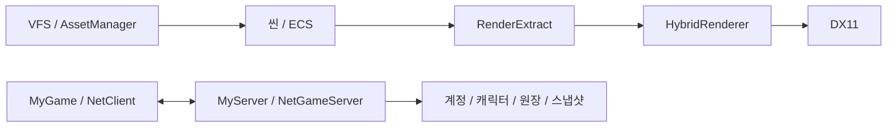

# 00. MyEngine 제품 개요

기준일: **2026-10-01**. MyEngine은 Windows·C++20·DirectX 11 기반의 2.5D 픽셀아트 게임 엔진이다. 이 문서는 현재 실행 파일과 공용 모듈을 설명한다. 자세한 소스 의존성은 [구조와 기능](13-architecture-and-features.md), 개선 항목과 완료 조건은 [개발 우선순위](14-development-priorities.md)에 있다.

## 제품 구성

| 실행 파일 | 용도 | 현재 사용자 흐름 |
|---|---|---|
| MyEditor | 씬·콘텐츠 편집 | 도킹 패널 → 엔티티 선택 → Inspector/Undo → 편집 월드와 분리한 Play |
| MyGame | 게임 프로젝트 실행 | 타이틀 → 설정·캐릭터 선택 → 씬 렌더링·로컬 이동 또는 루프백 서버 접속 |
| MyServer | 로컬 권위 서버 | 계정 인증 → 세션·이동 → 스냅샷 복제 → 활성 세션 저장·백업 |
| paktool | 에셋 패키징 | 파일 목록 → pak 생성 → VFS 소비 |

[README](../README.md)의 명령으로 `build/dev`를 구성하고 Debug/Release를 빌드한다. 에디터 Release 경로는 `build/dev/apps/editor/Release/MyEditor.exe`다. 실행 조합은 `apps/`, 게임 고유 규칙·콘텐츠는 `game/`, 재사용 기반은 `engine/`에 둔다.

## 기술과 계약

| 영역 | 현재 구현 |
|---|---|
| 플랫폼·빌드 | Win32, C++20, CMake, MSVC; 엔진 모듈은 정적 라이브러리 |
| 렌더링 | 자체 RHI의 DX11 백엔드, HLSL/FXC, 스프라이트·타일·3D 메시의 단일 깊이 버퍼 |
| 월드 | 자체 sparse-set ECS, 64비트 엔티티 핸들, 시스템 스케줄러, 타일맵·간이 물리·애니메이션 |
| 콘텐츠 | VFS·GUID·AssetManager, PNG/glTF/Aseprite/WAV/OGG 임포트, JSON 직렬화 |
| 스크립트·확장 | Lua 5.4/sol2, 보호된 엔티티 콜백·코루틴, 리플렉션·DDC·플러그인 호스트 |
| UI·오디오 | ImGui 에디터, 자체 게임 위젯·FreeType 텍스트, miniaudio 믹서·버스·큐 |
| 서버·저장 | Winsock UDP, 예측·재조정·보간, 계정·캐릭터·원장, version=1 JSON 스냅샷·백업 |
| 개발 도구 | TypeScript MCP 서버의 빌드·테스트·실행·캡처·로그·상태·픽셀 도구 |

좌표는 왼손 좌표계·+Y 위, PPU 48, 내부 픽셀 타깃 960×540이다. UI는 좌상단 원점·+Y 아래다. 좌표·alpha cutout·깊이 규약의 정본은 [렌더링](02-rendering.md)이다.

## 실행 흐름

```text
GuardedMain → 설정·입력·창·서비스 준비 → 모듈 의존 순서 초기화
→ 입력/메시지 → PreUpdate → FixedUpdate → Update → PostUpdate
→ PreRender → PostRender → 모듈 역순 종료
```

코어 시뮬레이션의 기본 고정 스텝은 60Hz다. 앱은 필요한 씬 시스템을 명시적으로 연결한다. 모듈을 링크했다는 사실만으로 물리·Lua·대화가 자동 실행되지는 않는다. 현재 MyGame의 네트워크 입력 주기와 MyServer의 서버 틱도 별도로 구성되어 있다.


```mermaid
flowchart LR
    Assets[VFS / AssetManager] --> Scene[씬 / ECS]
    Scene --> Extract[RenderExtract]
    Extract --> Render[HybridRenderer]
    Render --> GPU[DX11]
    Client[MyGame / NetClient] <--> Server[MyServer / NetGameServer]
    Server --> Store[계정 / 캐릭터 / 원장 / 스냅샷]
```

## 모듈별 문서

| 문서 | 책임 |
|---|---|
| [코어·플랫폼](01-core-platform.md) | 부팅·루프·서비스·입력·이벤트·잡·설정 |
| [렌더링](02-rendering.md) | GPU 자원·픽셀 타깃·단일 깊이 계약 |
| [씬·월드](03-scene-world.md) | 엔티티·시스템·층·충돌·애니메이션·렌더 추출 |
| [에셋](04-asset-pipeline.md) | 식별·로딩·임포트·재임포트·직렬화·pak |
| [스크립트·플러그인](05-scripting-plugins.md) | Lua 수명·콜백·바인딩·DDC·네이티브 확장 |
| [런타임](06-runtime-systems.md) | 게임 UI·텍스트·오디오·대화·NPC·세이브 |
| [에디터](07-editor-ui.md) | 문서·선택·편집 커맨드·PlayWorld·콘텐츠 패널 |
| [MCP](08-mcp.md) | 현재 등록된 개발 도구와 CLI/파일 경계 |

## 기능 범위와 개선

렌더·콘텐츠 모듈의 통합 사용 예는 `village_demo`, 깊이 시나리오는 `bridge_demo`, Lua·애니메이션·발소리는 `character_demo`에서 확인한다. 제품 앱에서의 연결 상태는 [현재 기능 표](13-architecture-and-features.md)에 별도로 기록한다.

현재 서버는 루프백과 최대 64개 스냅샷 엔티티 범위다. 보호되는 인증 전송·운영 DB·대규모 MMO 운영, 에디터 실제 프로젝트/씬 열기와 MyGame의 온라인 전투·소셜 연결은 완료 기능으로 표시하지 않는다. 우선순위는 영향과 검증 조건을 기준으로 [14](14-development-priorities.md)에서 관리한다.

Simple Is Best를 따른다. 기존 모듈·표준 라이브러리를 먼저 사용하고, 실제 사용처와 측정된 병목이 있을 때 확장한다. 소유권·실패 경계·데이터 보존 계약은 간소화하지 않는다. 변경 이유와 삭제 근거는 [작업 기록](16-foundation-worklog.md)에 남긴다.
