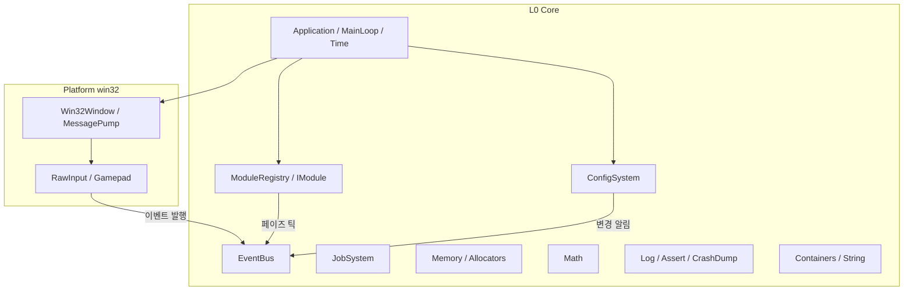

# 01. 코어·플랫폼 계층 (Core & Platform)

- 레이어: **L0 Core** (+ win32 플랫폼 구현)
- 네임스페이스: `mye` (플랫폼 구현 세부는 `mye::win32`)
- 언어: C++20, 1차 타깃: Windows(win32)
- 이 문서가 소유하는 교차 주제: **이벤트 버스**, **모듈 라이프사이클**, **파일 워처 저수준 API**
- 이 문서가 소유하지 않는 주제: 좌표계·PPU 규약(02), 리플렉션·직렬화(04), 입력 매핑·IME 처리(06)

---

## 목표와 책임

코어·플랫폼 계층은 엔진의 **가장 낮은 층**으로, 위의 모든 모듈(RHI, 렌더러, 씬, 스크립팅, 에디터)이
공통으로 딛고 서는 기반을 제공한다. 이 계층의 설계 품질이 곧 엔진 전체의 확장성을 결정하므로,
"기능을 많이 넣는 것"보다 **경계가 명확하고 교체·확장 가능한 최소 기반**을 만드는 것을 목표로 한다.

### 책임 (이 모듈이 하는 일)
- **애플리케이션 프레임워크**: 엔트리포인트, 메인 루프(고정 타임스텝 + 가변 렌더 + 보간), 시간 시스템,
  게임 런타임과 에디터가 공유하는 `Application` 베이스.
- **win32 윈도우·메시지 펌프**: 윈도우 생성/파괴, DPI, 포커스, 리사이즈 이벤트.
- **저수준 입력**: Raw Input(키보드·마우스), 게임패드 폴링. *물리 입력 이벤트를 만들어 이벤트 버스에 흘려보내는 것까지*가 책임.
- **메모리**: 할당자 인터페이스와 구현(system/arena/pool/frame), 할당 추적·릭 검출.
- **수학 라이브러리**: Vec/Mat/Quat/Rect/Color, 픽셀 스냅 유틸. (타입·연산만. 좌표계 규약은 02)
- **컨테이너·문자열 정책**: STL 사용 범위 확정, UTF-8 정책, 보조 컨테이너.
- **로깅·어서트·크래시 덤프**.
- **잡 시스템**: 워커 스레드, parallel-for, 잡 의존성, **컴퓨트/IO 분리 큐**.
- **파일 워처(DirectoryWatcher)**: `ReadDirectoryChangesW` 기반 저수준 디렉터리 감시. 변경 이벤트를
  버스(지연 채널) 또는 콜백으로 전달. 핫 리로드 파이프라인(04 리임포트, 05 Lua 핫 리로드, 07 스크립트
  저장 감지)이 공통으로 딛는 기반 — 감지 이후의 "무엇을 다시 로드할지"는 각 소비자 소유.
- **이벤트 버스**: 타입 세이프 pub/sub, 즉시/지연 디스패치. 모듈 디커플링의 핵심 인프라.
- **설정 시스템**: 엔진/프로젝트/유저 3계층 설정.
- **모듈 라이프사이클**: `IModule` 등록, 의존성 기반 초기화/종료 순서, 업데이트 페이즈.

### 비책임 (다른 모듈로 위임)
| 주제 | 담당 | 이 모듈의 역할 |
|---|---|---|
| 입력 "매핑"(액션·축·리바인딩) | 06 | 물리 입력 이벤트 발행까지만 |
| IME 조합·후보창 처리 | 06 | `WM_IME_*` 메시지를 이벤트로 변환해 전달하는 통로만 |
| 좌표계·축·PPU 규약 | 02 | 수학 타입·연산 제공. 규약에 중립적으로 설계 |
| 리플렉션·직렬화 프레임워크 | 04 | 설정 파일용 최소 파서만 자체 보유(부트스트랩 문제 회피) |
| 플러그인 DLL 로딩·SDK | 05 | `IModule`·이벤트 버스·C ABI 안정 타입 ID 등 기반 제공 |
| 렌더링·스왑체인 | 02 | `IWindow`가 네이티브 핸들(HWND)만 노출 |

---

## 설계 개요

### 하위 모듈 구성



원칙:
- Core 내부에서도 **의존 방향은 한 방향**: `Math/Containers/Log/Memory`(무의존 기반) ← `EventBus/JobSystem/Config` ← `Module/Application` ← `Platform 구현`.
- 상위 모듈은 Core를 **구체 클래스가 아니라 `EngineContext`를 통해** 접근한다(테스트·플러그인에서 대체 가능).

### 애플리케이션 프레임워크와 메인 루프

엔진이 `WinMain`을 소유하고, 실행 파일(게임 런타임 / 에디터)은 `CreateApplication()` 팩토리 함수 하나만 제공한다.
크래시 핸들러 설치 → 설정 로드 → 모듈 초기화 → 메인 루프 → 역순 종료의 순서를 `GuardedMain`이 보장한다.

메인 루프는 **고정 타임스텝 시뮬레이션 + 가변 렌더 + 보간** 구조를 채택한다.
시뮬레이션은 **60Hz 고정으로 확정**(프로젝트 설정으로 변경 가능)하고, 렌더링은 **가변 프레임레이트**로
vsync 토글·프레임 캡 옵션을 제공한다. 무제한(uncapped) 설정 시 고주사율 모니터(144/240/300Hz)에서도
보간 렌더로 부드러운 출력을 지원한다.

```
frameDelta = clock.Tick()
frameDelta = min(frameDelta, maxFrameDelta)        // 죽음의 나선(spiral of death) 방지
accumulator += frameDelta * timeScale

PumpMessages()                                     // win32 메시지 → 이벤트 버스
bus.Flush(EventChannel::PreUpdate)                 // 지연 이벤트 1차 배출

while (accumulator >= fixedDelta):                 // 고정 스텝 (기본 60Hz, 설정 가능)
    modules.Tick(UpdatePhase::FixedUpdate, fixedStep)
    accumulator -= fixedDelta

alpha = accumulator / fixedDelta                   // 렌더 보간 계수 [0,1)
modules.Tick(UpdatePhase::PreUpdate .. PostUpdate, variableStep)
bus.Flush(EventChannel::PostUpdate)
modules.Tick(UpdatePhase::PreRender, variableStep) // 02가 alpha로 트랜스폼 보간 후 렌더
modules.Tick(UpdatePhase::PostRender, variableStep)
```

- 게임플레이·물리·타일 이동 로직(03)은 `FixedUpdate`에서만 상태를 바꾸고, 렌더러(02)는 `alpha`로
  이전/현재 상태를 보간해 그린다. **픽셀아트에서 보간 결과를 픽셀 그리드에 스냅할지는 02가 결정**한다.
- 에디터(07)는 같은 루프를 쓰되, 플레이 모드가 아닐 때 `FixedUpdate` 대상 월드를 정지시키는 방식으로 구현한다
  (루프 구조 자체는 분기하지 않는다).
- `maxFrameDelta`(기본 250ms) 초과분은 버린다. 브레이크포인트·창 드래그 후 폭주 방지.

### 시간 시스템

- 내부 시계는 `QueryPerformanceCounter` 기반, **정수 나노초(`uint64`)로 누적**하여 부동소수 누적 오차를 피한다.
  프레임 델타만 `double` 초 단위로 변환해 배포한다.
- 시간 축 구분:
  - **RealTime**: 스케일·일시정지 영향 없음(프로파일링, 에디터 UI).
  - **GameTime**: `timeScale` 적용, 일시정지 가능(게임플레이).
  - **FixedTime**: 고정 스텝 누적 시간(결정성 필요 로직).
- `TimeStep` 구조체 하나로 델타·스케일·프레임 인덱스를 함께 전달해, 각 시스템이 전역 싱글턴을 읽지 않게 한다.

### 윈도우·메시지 펌프·저수준 입력

- `IWindow` 추상 + `Win32Window` 구현. 멀티 윈도우를 처음부터 허용하는 API 형태로 설계하되,
  MVP 구현은 메인 윈도우 1개만 지원한다(에디터 멀티 뷰포트는 ImGui viewports가 자체 처리).
- WndProc은 메시지를 직접 처리하지 않고 **이벤트로 변환해 버스에 발행**한다. 단, ImGui(07)·IME(06)처럼
  메시지를 선점해야 하는 소비자를 위해 **WndProc 훅 체인**(`IWindowMessageHook`, 우선순위 순 처리,
  handled 반환 시 중단)을 제공한다. 이것이 "IME 메시지는 06으로 전달하는 통로만 제공"의 구현 수단이다.
- 키보드·마우스는 **Raw Input**(`WM_INPUT`)으로 받는다. 이유: 고해상도 마우스 델타(카메라·에디터 조작),
  키 반복 없는 물리 키 상태. 문자 입력은 별도로 `WM_CHAR`/IME 결과를 `TextInputEvent`(UTF-8)로 발행한다.
  즉 **"물리 키"와 "문자 입력" 스트림을 처음부터 분리**한다 — 06의 입력 매핑과 UI 텍스트 입력이 각각 소비.
- 게임패드: 1차는 **XInput** 폴링(프레임당 1회, 상태 diff를 이벤트로 발행). 이후 GameInput API로 교체 가능하도록
  `IGamepadBackend` 뒤에 숨긴다.
- **창 모드·전체화면**: `IWindow::SetWindowMode(Windowed | BorderlessFullscreen)`로 런타임 전환을 지원한다
  (배타적 전체화면은 비목표 — DXGI 플립 모델에서 보더리스로 충분). 디스플레이 열거(`EnumerateDisplays`:
  해상도·주사율·작업 영역)와 `WindowModeChangedEvent`를 제공하며, Alt+Enter는 코어가 기본 훅으로 감지해
  전환을 수행한다(설정으로 비활성 가능). 전환 시 이벤트 흐름은 `WindowModeChangedEvent` →
  `WindowResizedEvent` 순으로 발행되고, **스왑체인 재구성과 픽셀퍼펙트 정수배 업스케일 재계산은 02가 구독해
  처리**한다. 출시 게임의 그래픽 설정 화면(06)이 이 API를 소비한다. Phase 2에 편성.
- 키 코드는 **물리 스캔코드 기반 `KeyCode` 열거형**(USB HID 순서 준용)으로 정규화한다. 가상 키(VK_*)는
  레이아웃 의존적이므로 내부 표준으로 쓰지 않는다. 레이아웃 문자 변환이 필요하면 06이 요청.

### 메모리

- 모든 할당자는 `IAllocator` 인터페이스를 구현. 컨테이너·서브시스템은 생성 시 할당자를 주입받을 수 있다
  (기본값은 시스템 할당자 — **강제하지 않는 opt-in 설계**로 1인 개발 부담을 낮춘다).
- 제공 할당자:
  - `SystemAllocator`: malloc 래퍼 + 추적. 전역 기본.
  - `ArenaAllocator`: 선형 할당, 일괄 해제. 로딩·임포트(04) 작업 단위에 적합.
  - `PoolAllocator`: 고정 크기 슬롯. 이벤트 노드·잡 노드·파티클 등 대량 동일 크기 객체.
  - `FrameAllocator`: 더블 버퍼 선형 할당자. `Tick` 시작 시 이전 프레임 버퍼를 리셋. 렌더 커맨드·임시 문자열 등
    "이번 프레임만 사는" 데이터 전용. **2프레임 이상 참조 금지**가 계약.
- 추적: 빌드 스위치 `MYE_MEMORY_TRACKING`이 켜지면 모든 할당에 `MemoryTag`(서브시스템 분류)·크기·(선택) 콜스택을
  기록. 종료 시 릭 리포트, 에디터에서 태그별 사용량 그래프(07이 UI 제공). `MYE_NEW/MYE_DELETE` 매크로 경유가 권장 경로.

### 수학 라이브러리

- **자체 경량 구현으로 확정**(외부 의존 최소화 + 픽셀아트 특화 유틸을 같은 헤더군에 두기 위함).
  성능 문제가 확인되면 공개 API는 유지한 채 내부 구현만 DirectXMath로 교체하는 전략이다. (오픈 이슈 #2 종결)
- 타입: `Vec2/Vec3/Vec4`(float), `Vec2i/Vec3i`(int32), `Mat3/Mat4`, `Quat`, `Rect`(float)/`RectInt`,
  `Color`(float RGBA, linear)/`Color32`(8bit RGBA, sRGB 저장용), `Transform2D`(pos/rot/scale)/`Transform3D`.
- 행렬 규약: **저장은 row-major, 곱셈은 row-vector (`v * M`)** — DirectXMath·HLSL 기본과 정합.
  단, **핸디드니스·클립 공간 깊이 범위·Y축 방향·PPU는 02가 확정**하며, 수학 라이브러리는 LH/RH 양쪽
  투영 생성 함수를 모두 제공해 규약 결정에 중립을 지킨다.
- 픽셀 스냅 유틸(`mye::pixel`): PPU를 인자로 받는 순수 함수 집합(`Snap`, `SnapRect`, `IsOnPixelGrid`).
  PPU 상수 자체는 02가 소유하므로 여기서는 항상 파라미터.

### 컨테이너·문자열 정책

- **STL을 기본으로 사용한다**: `std::vector/array/span/optional/variant/unordered_map/string(_view)/function`.
  1인 개발에서 자체 컨테이너 전면 재작성은 비용 대비 이득이 없다. 단 전 코드가 `mye::Vector<T>` 등
  **별칭을 통해** 사용하게 하여, 특정 컨테이너가 병목이 되면 그 별칭만 교체할 수 있게 한다.
- 보조 컨테이너(자체 구현): `SmallVector<T, N>`(인라인 버퍼), `FixedRingBuffer<T, N>`(로그·이벤트 큐),
  `SlotMap<T>`(세대 카운터 핸들 — 03의 엔티티, 04의 에셋 핸들이 같은 패턴을 쓰도록 기반 제공).
- **문자열은 엔진 전체가 UTF-8** (`std::string` = UTF-8 바이트). win32 API 경계에서만 UTF-16 변환
  (`Widen/Narrow` 유틸 제공, 내부에서 `W` 계열 API만 사용). 파일 경로도 UTF-8 문자열로 통일하고
  `mye::Path` 얇은 래퍼로 구분자 정규화(`/`)만 담당.
- 예외·RTTI: 엔진 코어는 예외를 **던지지 않는다**(오류는 반환값 `Expected<T, Error>` + 로그/어서트).
  단 sol2(05)가 예외를 요구하므로 **컴파일 옵션으로 예외를 끄지는 않는다**. `dynamic_cast`는 금지,
  타입 판별은 자체 타입 ID 사용. → 오픈 이슈 #1

### 로깅·어서트·크래시 덤프

- 로그: `카테고리(정적 등록) × 심각도(Trace~Fatal)` 필터링. 포매팅은 `std::format`.
  싱크(sink) 플러그인 구조: 콘솔(VT 컬러) / 파일(회전) / `FixedRingBuffer`(에디터 콘솔 패널·07이 소비) /
  win32 `OutputDebugString`. 싱크 추가는 확장 포인트(플러그인이 원격 로그 싱크 등록 가능).
- 스레드 안전: 발행 측은 락 프리 MPSC 큐에 쓰고, 전용 스레드(또는 프레임 말미)에서 싱크로 배출.
  `Fatal`은 즉시 플러시.
- 어서트 3종:
  - `MYE_ASSERT(expr, ...)`: Debug 전용. 실패 시 브레이크.
  - `MYE_VERIFY(expr, ...)`: 모든 빌드에서 평가, 실패 시 로그+브레이크(릴리스는 로그만).
  - `MYE_CHECK(expr)`: 릴리스 포함 치명 검사. 실패 시 크래시 덤프 후 종료.
- 크래시 덤프: `GuardedMain`이 `SetUnhandledExceptionFilter` 설치 →
  `MiniDumpWriteDump`(별도 감시 프로세스 없이 in-process, MVP 범위)로 `.dmp` + 최근 로그 링버퍼를 저장.

### 잡 시스템

- 구조: 메인 스레드 + 워커 `(hardware_concurrency - 1)`개. **워커별 work-stealing 데크**(MVP는 단일 전역
  MPMC 큐로 시작, 인터페이스 동일 유지).
- 잡 = "함수 포인터 + 데이터 포인터 + 카운터". **파이버 없음**(1인 개발 복잡도 대비 이득 낮음, 오픈 이슈 #6).
  따라서 잡 내부에서 다른 잡을 `Wait` 하면 그 워커는 대기 대신 **다른 잡을 훔쳐 실행**(busy-help)한다.
- 의존성: 각 잡은 `JobCounter`를 감소시키고, 후속 잡은 "카운터가 0이 되면 실행 가능" 조건으로 스케줄된다.
  임의 그래프보다 단순한 **카운터 기반 조인 모델**을 채택 — parallel-for·에셋 로딩 파이프라인(04)에 충분.
- `ParallelFor(count, batchSize, body)` 제공. batchSize로 캐시/오버헤드 균형 조절.
- 메인 스레드 전용 작업(예: DX11 immediate context, win32 API)은 `RunOnMainThread(fn)` 큐로 마샬링 —
  04의 비동기 로딩이 "디코드는 워커, 디바이스 업로드는 메인" 패턴으로 사용.
- **컴퓨트/IO 큐 분리**: `Schedule`은 `QueueKind::Compute | IO` 인자를 받는다. IO 큐는 **전용 스레드 1~2개**가
  소비하며, 블로킹 파일 IO 잡이 컴퓨트 워커를 점유해 프레임 잡(parallel-for)을 굶기는 것을 막는다.
  계약: **IO 블로킹 잡은 컴퓨트 워커에서 실행 금지**이며, busy-help `Wait`는 IO 큐의 잡을 훔치지 않는다
  (워커 하나가 통째로 IO에 묶이는 것 방지). 04의 비동기 로딩 시퀀스가 말하는 "JobSystem (IO 큐)"가 이것이다.

### 파일 워처 (DirectoryWatcher)

- `ReadDirectoryChangesW` 기반. 감시는 IO 전용 스레드(잡 시스템 IO 큐와 공유)에서 수행하고,
  변경 이벤트는 **버스 지연 채널(`Enqueue`)로 메인 스레드에 배출**하거나 등록된 콜백으로 전달한다.
- 저장 도구들이 만드는 중복 알림(임시 파일 생성 → 리네임 등)을 흡수하기 위해 **경로별 디바운스**
  (기본 수백 ms, 설정 가능)를 코어가 수행한다. 이벤트에는 변경 종류(Added/Modified/Removed/Renamed)와
  UTF-8 경로만 담는다.
- 소비자: 04(에셋 리임포트), 05(Lua 핫 리로드), 07(스크립트 저장 감지). **감지 이후의 해석·리로드 정책은
  전부 소비자 소유** — 코어는 "파일이 바뀌었다"까지만 책임진다.

### 이벤트 버스 — 모듈 디커플링의 중심

설계 목표: (a) 타입 세이프, (b) DLL 경계 안전, (c) 즉시/지연 선택 가능, (d) 구독 수명 자동 관리.

- **이벤트 = 평범한 struct** (POD 권장). 상속·가상 함수 불필요. 이벤트 타입 ID는
  `typeid`가 아니라 **이벤트 이름 문자열의 FNV-1a 64bit 해시**로 정적 등록한다.
  이유: `typeid`/static 지역변수 주소는 DLL마다 달라질 수 있어 플러그인(05) 경계에서 깨진다.
  `MYE_EVENT(TypeName)` 매크로가 `static constexpr EventTypeId`를 심는다.
- **즉시 디스패치 `Publish`**: 호출 스레드에서 구독자 동기 호출. 프레임 내 순서가 중요한 엔진 내부용.
  구독자 안에서의 재귀 발행 깊이 제한(기본 8)으로 무한 루프 검출.
- **지연 디스패치 `Enqueue`**: 락 프리 큐에 복사해 두었다가 `Flush(channel)` 시점(PreUpdate/PostUpdate)에
  메인 스레드에서 배출. **스레드 세이프 발행은 이 경로만 허용**(구독자 호출은 항상 메인 스레드 —
  Lua 핸들러(05)·게임플레이 코드가 스레드 안전을 고민하지 않게 하는 핵심 규칙).
- 구독은 `SubscriptionHandle`을 반환하며 `ScopedSubscription`(RAII)으로 감싸는 것이 표준.
  모듈·플러그인 언로드 시 남은 구독은 라이프사이클이 강제 해제하고 경고 로그.
- 우선순위(int, 낮을수록 먼저) + `consumed` 반환(bool)으로 입력 이벤트의 "선점"(에디터 UI가 게임보다 먼저)
  패턴 지원.
- 이벤트 버스는 **브로드캐스트 결합 축소용**이다. 1:1 요청-응답(예: "에셋 로드해줘")은 버스가 아니라
  해당 모듈 인터페이스를 직접 호출한다. 이 구분을 문서·코드리뷰 규칙으로 유지한다.

### 설정 시스템

- 3계층 스코프, 뒤가 앞을 오버라이드:
  1. **Engine**: 엔진 기본값 (`engine.json`, 엔진 배포물에 포함, 읽기 전용)
  2. **Project**: 프로젝트 설정 (`<project>/config/project.json`, VCS 커밋 대상 — 고정 스텝 Hz, 렌더 옵션 등)
  3. **User**: 사용자·머신 로컬 (`%LOCALAPPDATA%/MyEngine/<project>/user.json` — 창 위치, 에디터 레이아웃, 볼륨)
- 값 타입은 `bool/int64/double/string/배열` 최소 집합. 파서는 코어에 내장한 **최소 JSON 리더**
  (04의 리플렉션 직렬화는 L2라 여기서 못 씀 — 부트스트랩 의존성 역전 방지). 포맷은 오픈 이슈 #3.
- 키는 `"section.key"` 경로 문자열. 각 모듈·플러그인은 자기 섹션을 선언(`RegisterSection`)하고 기본값을 등록.
- 런타임 변경 시 `ConfigChangedEvent`가 버스로 발행 — 렌더러 해상도 변경, 에디터 옵션 반영 등이 구독.
- 콘솔 변수(CVar)는 별도 시스템을 만들지 않고 **설정 시스템의 런타임 오버레이**(저장되지 않는 4번째 스코프)로 취급.

### 모듈 라이프사이클

- 엔진의 모든 서브시스템(렌더러, 오디오, 씬, 스크립팅…)은 `IModule` 계약을 따른다.
  **05의 플러그인 DLL은 `IModule`을 직접 export 하지 않는다** — 플러그인 DLL은 05가 정의한
  `myePluginEntry` 하나만 export 하고 `IPlugin`(onLoad/onInit/onShutdown) 계약을 따르며,
  엔진 서브시스템을 추가하려는 플러그인은 **`IPlugin`의 onLoad에서 자신의 `IModule` 구현체들을
  `ModuleRegistry`에 late-register 하는 어댑터 모델**을 쓴다. 등록된 순간부터는 정적 모듈과 동일한
  수명 보장을 받는다.
- 수명 단계:
  1. `OnLoad(EngineContext&)` — 등록 직후. 설정 섹션 선언, 이벤트 타입 등록, **자기 레지스트리의
     서비스 등록(`RegisterServiceRaw`)** 만. 다른 모듈 접근 금지.
  2. `OnInitialize()` — 의존성 위상 정렬 순서대로. 다른 모듈 인터페이스 획득 가능. 지연 생성되는
     서비스는 이 시점까지 등록을 마쳐야 한다.
  3. `OnPostInitialize()` — 전 모듈 초기화 완료 후 교차 배선(에디터 패널 등록 등).
  4. 매 프레임: 등록한 `UpdatePhase` 틱 콜백 호출.
  5. `OnShutdown()` / `OnUnload()` — **초기화의 정확한 역순**(서비스 등록 해제 포함).
- **플러그인 로드 단계**: **코어 모듈(L0~L4) 초기화 완료 후, 프로젝트/씬 로드 전**에 05의 PluginManager가
  플러그인 DLL을 로드하는 공식 단계가 존재한다. 이를 지원하기 위해 `ModuleRegistry`는 **배치(batch) 단위
  후속 등록·초기화**를 제공한다: 초기 부팅이 끝난 뒤에도 `RegisterBatch`로 등록된 모듈 집합만 따로
  위상 정렬 → `OnLoad → OnInitialize → OnPostInitialize`를 수행한다. 04의 "모든 임포터 등록 완료 시점"
  요구는 이 단계가 끝나는 지점을 가리킨다.
- 의존성: 정적 모듈은 모듈 이름 문자열 목록으로 선언 → `ModuleRegistry`가 위상 정렬, 순환 시 초기화 거부 +
  명확한 에러. **플러그인 간 의존성은 05의 매니페스트 JSON을 PluginManager가 정렬**하며(05 소유),
  정렬된 순서대로 각 플러그인의 `IModule` 배치가 레지스트리에 도착한다.
- 업데이트 페이즈: `PreUpdate → FixedUpdate(0..N회) → Update → PostUpdate → PreRender → PostRender`.
  같은 페이즈 내 순서는 `orderKey`(int)로 결정적 정렬 — "대체로 무순서, 필요할 때만 명시"가 원칙.
- `EngineContext`는 **가상 서비스 게이트웨이**이자 유일한 전역 접근점이다. 핵심은
  `GetServiceRaw(ServiceId)` 하나이며(`ServiceId` = 서비스 이름 FNV-1a 64bit 해시 — 이벤트 타입 ID와
  같은 이유로 DLL 경계 안정), `Events()/Jobs()/Config()` 등은 그 위의 **인라인 편의 래퍼**다.
  플러그인(05)은 엔진 import lib를 링크하지 않고 이 vtable 포인터로만 엔진에 접근하므로,
  **각 모듈은 OnLoad/OnInitialize에서 자기 레지스트리(임포터 레지스트리, 컴포넌트 팩토리 등)를
  ServiceId 체계에 노출**하는 것이 규약이다. 전역 싱글턴 남발을 막는 울타리 역할은 동일.

---

## 핵심 타입·API 스케치

> 설계 단계 스케치이며 함수 본문은 생략. 시그니처와 계약이 산출물이다.

### 엔트리포인트와 Application

```cpp
namespace mye {

struct LaunchArgs {
    std::span<const std::string> args;   // UTF-8 변환된 커맨드라인
    std::string projectPath;             // --project=... (에디터/런타임 공통)
};

// 실행 파일(게임/에디터)이 구현하는 유일한 진입 함수
Application* CreateApplication(const LaunchArgs& args);

// 엔진이 소유: 크래시 필터 설치 → Config 로드 → 모듈 초기화 → 루프 → 역순 종료
int GuardedMain(const LaunchArgs& args);

class Application {
public:
    virtual ~Application() = default;
    virtual void OnConfigure(ConfigSystem& config) = 0;        // 설정 오버라이드 기회
    virtual void OnRegisterModules(ModuleRegistry& modules) = 0; // 정적 모듈 + 플러그인 로더 등록
    virtual void OnStart(EngineContext& ctx) {}
    virtual void OnStop(EngineContext& ctx) {}
    void RequestExit(int exitCode = 0);
protected:
    EngineContext& Context();
};

// 파생: RuntimeApplication(게임), EditorApplication(07) — 루프는 공유, 모듈 구성만 다름
} // namespace mye
```

### 시간

```cpp
namespace mye {

struct TimeStep {
    double deltaSeconds;          // timeScale 적용된 델타 (Fixed 페이즈에선 fixedDelta 고정값)
    double unscaledDeltaSeconds;  // 실시간 델타
    double gameTimeSeconds;       // 누적 게임 시간
    double realTimeSeconds;       // 누적 실시간
    uint64_t frameIndex;          // 렌더 프레임 카운터
    uint64_t fixedStepIndex;      // 고정 스텝 카운터 (결정성 로직용)
};

class Clock {                     // QPC 래퍼, 나노초 정수 누적
public:
    void     Reset();
    uint64_t TickNanoseconds();   // 직전 Tick 이후 경과
};

class TimeSystem {
public:
    void   SetTimeScale(double scale);      // 0 = pause
    void   SetFixedRate(double hz);         // 기본 60. project.json에서 로드
    double GetInterpolationAlpha() const;   // 렌더 보간 계수 [0,1)
    const TimeStep& CurrentStep() const;
};
} // namespace mye
```

### 윈도우·메시지 훅

```cpp
namespace mye {

struct WindowDesc {
    std::string title;            // UTF-8
    Vec2i clientSize   {1280, 720};
    bool  resizable    = true;
    bool  borderless   = false;
    bool  startMaximized = false;
};

enum class WindowMode : uint8_t { Windowed, BorderlessFullscreen };  // Exclusive는 비목표(DXGI 플립 모델)

struct DisplayInfo { Vec2i resolution; float refreshRate; Rect workArea; bool primary; };

class IWindow {
public:
    virtual ~IWindow() = default;
    virtual void*  GetNativeHandle() const = 0;   // HWND. 02의 스왑체인 생성용
    virtual Vec2i  GetClientSize()  const = 0;
    virtual float  GetDpiScale()    const = 0;
    virtual void   SetTitle(std::string_view utf8) = 0;
    virtual WindowMode GetWindowMode() const = 0;
    virtual void   SetWindowMode(WindowMode mode, int displayIndex = -1) = 0; // -1 = 현재 디스플레이
    virtual void   AddMessageHook(IWindowMessageHook* hook, int priority) = 0;
    virtual void   RemoveMessageHook(IWindowMessageHook* hook) = 0;
};

std::span<const DisplayInfo> EnumerateDisplays();  // 그래픽 설정 화면(06)이 소비

// ImGui(07)·IME(06)·플러그인이 win32 메시지를 선점하는 통로
class IWindowMessageHook {
public:
    virtual ~IWindowMessageHook() = default;
    // true 반환 = 메시지 소비(이후 훅·기본 처리 중단)
    virtual bool OnMessage(void* hwnd, uint32_t msg, uint64_t wparam, int64_t lparam) = 0;
};

// 버스로 발행되는 윈도우 이벤트 (일부)
struct WindowResizedEvent { MYE_EVENT(WindowResizedEvent); IWindow* window; Vec2i clientSize; };
struct WindowCloseRequestedEvent { MYE_EVENT(WindowCloseRequestedEvent); IWindow* window; };
struct WindowFocusEvent { MYE_EVENT(WindowFocusEvent); IWindow* window; bool focused; };
struct DpiChangedEvent  { MYE_EVENT(DpiChangedEvent);  IWindow* window; float dpiScale; };
struct WindowModeChangedEvent { MYE_EVENT(WindowModeChangedEvent);  // 02가 구독: 스왑체인 재구성·정수배 재계산
                                IWindow* window; WindowMode mode; Vec2i clientSize; };
} // namespace mye
```

### 저수준 입력 이벤트

```cpp
namespace mye {

enum class KeyCode : uint16_t { /* 물리 스캔코드 기반, USB HID 순서 준용 */ };
enum class MouseButton : uint8_t { Left, Right, Middle, X1, X2 };

struct RawKeyEvent        { MYE_EVENT(RawKeyEvent);        KeyCode key; bool pressed; bool repeat; };
struct RawMouseMoveEvent  { MYE_EVENT(RawMouseMoveEvent);  Vec2  delta;    // Raw Input 고해상도 델타
                                                           Vec2i position; /* 클라이언트 좌표 */ };
struct MouseButtonEvent   { MYE_EVENT(MouseButtonEvent);   MouseButton button; bool pressed; Vec2i position; };
struct MouseWheelEvent    { MYE_EVENT(MouseWheelEvent);    float deltaY; float deltaX; };
struct TextInputEvent     { MYE_EVENT(TextInputEvent);     char utf8[8]; };  // 확정 문자(코드포인트 1개)
struct GamepadButtonEvent { MYE_EVENT(GamepadButtonEvent); int padIndex; uint16_t button; bool pressed; };
struct GamepadAxisEvent   { MYE_EVENT(GamepadAxisEvent);   int padIndex; uint8_t axis; float value; };
struct GamepadConnectionEvent { MYE_EVENT(GamepadConnectionEvent); int padIndex; bool connected; };

// IME는 해석하지 않고 06으로 그대로 전달 (통로만 제공)
struct ImeRawMessageEvent { MYE_EVENT(ImeRawMessageEvent);
                            void* hwnd; uint32_t msg; uint64_t wparam; int64_t lparam; };

// 이벤트 외에 "현재 상태 조회"도 제공 (즉시성 필요한 소비자용 — 폴링 API)
class InputState {
public:
    bool  IsKeyDown(KeyCode key) const;
    Vec2i MousePosition() const;
    // 게임패드 스냅샷 등. 상태 갱신은 매 프레임 PumpMessages 직후 1회
};
} // namespace mye
```

### 메모리

```cpp
namespace mye {

enum class MemoryTag : uint8_t { General, Core, Renderer, Audio, Scene, Asset, Script, Editor, Plugin, Count };

class IAllocator {
public:
    virtual ~IAllocator() = default;
    virtual void* Allocate(size_t size, size_t alignment, MemoryTag tag) = 0;
    virtual void  Free(void* ptr) = 0;
};

class SystemAllocator final : public IAllocator { /* malloc + 추적 */ };
class ArenaAllocator  final : public IAllocator { public: explicit ArenaAllocator(size_t capacity); void Reset(); };
class PoolAllocator   final : public IAllocator { public: PoolAllocator(size_t elementSize, size_t count); };
class FrameAllocator  final : public IAllocator { public: void SwapAndReset(); /* 더블 버퍼, 프레임 경계 호출 */ };

// 추적 리포트 (MYE_MEMORY_TRACKING 빌드에서만 데이터 존재)
struct MemoryStats { size_t bytesByTag[(int)MemoryTag::Count]; size_t liveAllocations; };
class MemoryTracker {
public:
    static MemoryStats Snapshot();
    static void ReportLeaks();   // 종료 시 자동 호출, 태그·크기·콜스택 출력
};

#define MYE_NEW(Type, tag, ...)  /* 추적 경유 생성 */
#define MYE_DELETE(ptr)          /* 추적 경유 파괴 */
} // namespace mye
```

### 수학 (대표 시그니처만)

```cpp
namespace mye {

struct Vec2 { float x, y; /* 산술·내적·길이·Lerp */ };
struct Vec3 { float x, y, z; /* + Cross */ };
struct Vec4 { float x, y, z, w; };
struct Vec2i { int32_t x, y; };
struct Quat { float x, y, z, w;
    static Quat FromEuler(Vec3 radians);
    static Quat Slerp(const Quat& a, const Quat& b, float t);
};
struct Mat4 { // row-major 저장, row-vector 곱(v * M)
    static Mat4 TRS(Vec3 t, Quat r, Vec3 s);
    static Mat4 OrthoLH(float w, float h, float zn, float zf);   // LH/RH 모두 제공,
    static Mat4 OrthoRH(float w, float h, float zn, float zf);   // 채택은 02가 결정
    static Mat4 PerspectiveLH(float fovY, float aspect, float zn, float zf);
    static Mat4 PerspectiveRH(float fovY, float aspect, float zn, float zf);
};
struct Rect  { float x, y, w, h; bool Contains(Vec2 p) const; bool Overlaps(const Rect& o) const; };
struct Color { float r, g, b, a; };      // linear
struct Color32 { uint8_t r, g, b, a; };  // sRGB 저장·전송용

namespace pixel { // PPU 값은 항상 파라미터 — 규약 소유는 02
    Vec2  Snap(Vec2 world, float pixelsPerUnit);
    Rect  SnapRect(const Rect& r, float pixelsPerUnit);
    float SnapScalar(float v, float pixelsPerUnit);
}
} // namespace mye
```

### 잡 시스템

```cpp
namespace mye {

struct JobHandle { uint64_t opaque; };   // 내부 카운터 참조

// Compute: 워커 스레드 풀. IO: 전용 스레드 1~2개 — 블로킹 파일 IO는 반드시 IO 큐로.
// 계약: IO 잡은 컴퓨트 워커에서 실행되지 않으며, busy-help Wait는 IO 잡을 훔치지 않는다.
enum class QueueKind : uint8_t { Compute, IO };

class JobSystem {
public:
    JobHandle Schedule(void (*fn)(void*), void* data, const char* debugName = nullptr,
                       QueueKind queue = QueueKind::Compute);
    JobHandle ScheduleAfter(JobHandle dependency, void (*fn)(void*), void* data,
                            const char* debugName = nullptr, QueueKind queue = QueueKind::Compute);
    // 편의 오버로드: 캡처 람다 (내부적으로 FrameAllocator/Pool에 저장)
    template<typename Fn> JobHandle Schedule(Fn&& fn, QueueKind queue = QueueKind::Compute);

    template<typename Body> // Body: void(size_t begin, size_t end)
    JobHandle ParallelFor(size_t count, size_t batchSize, Body&& body);

    void Wait(JobHandle h);              // 대기 중 다른 잡을 훔쳐 실행(busy-help)
    bool IsComplete(JobHandle h) const;

    void RunOnMainThread(std::function<void()> fn);  // 다음 PreUpdate에 실행
    uint32_t WorkerCount() const;
};
} // namespace mye
```

### 파일 워처

```cpp
namespace mye {

enum class FileChangeKind : uint8_t { Added, Modified, Removed, Renamed };

// 버스 지연 채널로 배출 (디바운스 적용 후) — 04 리임포트 / 05 Lua 핫 리로드 / 07이 구독
struct FileChangedEvent { MYE_EVENT(FileChangedEvent);
                          FileChangeKind kind;
                          std::string_view path;      // UTF-8, 구분자 정규화됨
                          std::string_view oldPath; };// Renamed일 때만 유효

struct WatchHandle { uint64_t opaque; };

class DirectoryWatcher {  // ReadDirectoryChangesW 기반, IO 스레드에서 수신
public:
    // callback을 생략하면 FileChangedEvent를 버스(PostUpdate 채널)로 발행
    WatchHandle Watch(std::string_view utf8Dir, bool recursive,
                      std::function<void(const FileChangedEvent&)> callback = {});
    void Unwatch(WatchHandle h);
    void SetDebounceMs(uint32_t ms);   // 기본 300ms, 경로별 병합
};
} // namespace mye
```

### 이벤트 버스

```cpp
namespace mye {

using EventTypeId = uint64_t;  // 이벤트 이름 FNV-1a 해시 — DLL 경계에서 안정
#define MYE_EVENT(TypeName) \
    static constexpr ::mye::EventTypeId kEventTypeId = ::mye::HashFnv1a64(#TypeName)

template<typename E>
concept EventType = requires { { E::kEventTypeId } -> std::convertible_to<EventTypeId>; };

enum class EventChannel : uint8_t { PreUpdate, PostUpdate };

struct SubscriptionHandle { uint64_t opaque; };

class EventBus {
public:
    // handler가 true를 반환하면 이벤트 소비(후순위 구독자에게 전달 중단)
    template<EventType E>
    SubscriptionHandle Subscribe(std::function<bool(const E&)> handler, int priority = 0);
    void Unsubscribe(SubscriptionHandle h);

    template<EventType E> void Publish(const E& e);              // 즉시, 메인 스레드 전용
    template<EventType E> void Enqueue(const E& e,               // 지연, 모든 스레드 허용
                                       EventChannel channel = EventChannel::PostUpdate);
    void Flush(EventChannel channel);                            // 메인 루프가 호출

    // 플러그인/Lua 바인딩용 타입 소거 경로 (05가 사용)
    SubscriptionHandle SubscribeRaw(EventTypeId type,
                                    std::function<bool(const void* payload, size_t size)> handler,
                                    int priority = 0);
    void PublishRaw(EventTypeId type, const void* payload, size_t size);
};

class ScopedSubscription { /* RAII 해제. 모듈·패널·Lua 핸들러의 표준 보관 방식 */ };
} // namespace mye
```

### 설정 시스템

```cpp
namespace mye {

enum class ConfigScope : uint8_t { Engine, Project, User, RuntimeOverlay };

struct ConfigChangedEvent { MYE_EVENT(ConfigChangedEvent); std::string_view key; ConfigScope scope; };

class ConfigSystem {
public:
    void RegisterSection(std::string_view section, ConfigScope defaultScope); // 모듈·플러그인이 선언

    // 병합된 뷰 조회 (RuntimeOverlay > User > Project > Engine)
    bool        GetBool  (std::string_view key, bool fallback) const;
    int64_t     GetInt   (std::string_view key, int64_t fallback) const;
    double      GetFloat (std::string_view key, double fallback) const;
    std::string GetString(std::string_view key, std::string_view fallback) const;

    void Set(std::string_view key, /* variant */ ConfigValue value, ConfigScope scope);
    void Save(ConfigScope scope);   // Engine 스코프는 저장 불가(읽기 전용)
};
} // namespace mye
```

### 모듈 라이프사이클

```cpp
namespace mye {

enum class UpdatePhase : uint8_t {
    PreUpdate, FixedUpdate, Update, PostUpdate, PreRender, PostRender
};

using ServiceId = uint64_t;  // 서비스 이름 FNV-1a 64bit 해시 — 이벤트 타입 ID처럼 DLL 경계에서 안정
#define MYE_SERVICE(Name) /* static constexpr ServiceId 심기 — MYE_EVENT와 동일 패턴 */

// 가상 서비스 게이트웨이이자 유일한 전역 접근점.
// 플러그인(05)은 엔진 import lib를 링크하지 않고 이 vtable 포인터로만 엔진에 접근한다.
class EngineContext {
public:
    virtual ~EngineContext() = default;
    virtual void*    GetServiceRaw(ServiceId id) = 0;                  // 미등록 시 nullptr
    virtual void     RegisterServiceRaw(ServiceId id, void* service) = 0; // 모듈 OnLoad/OnInitialize에서
    virtual void     UnregisterServiceRaw(ServiceId id) = 0;           // OnShutdown 역순 해제
    virtual uint32_t GetEngineVersion() const = 0;                     // 05 버전 협상용
    virtual const EnginePaths& GetPaths() const = 0;                   // 엔진/프로젝트/유저 경로

    // 인라인 편의 래퍼 — 전부 GetServiceRaw 위임(가상 경계만 넘으므로 DLL 안전)
    EventBus&         Events();
    JobSystem&        Jobs();
    ConfigSystem&     Config();
    TimeSystem&       Time();
    IWindow&          MainWindow();
    DirectoryWatcher& FileWatcher();
    ModuleRegistry&   Modules();
    template<typename T> T* GetService();                     // T::kServiceId 사용
    template<typename T> T* GetModule(std::string_view name); // 다운캐스트는 모듈 자체 타입ID로 검증
};

class IModule {
public:
    virtual ~IModule() = default;
    virtual const char* GetName() const = 0;
    virtual std::span<const char* const> GetDependencies() const { return {}; }
    virtual void OnLoad(EngineContext& ctx) {}          // 등록만. 타 모듈 접근 금지
    virtual void OnInitialize(EngineContext& ctx) {}    // 의존성 순서 보장
    virtual void OnPostInitialize(EngineContext& ctx) {}
    virtual void OnShutdown(EngineContext& ctx) {}      // 초기화 역순
    virtual void OnUnload(EngineContext& ctx) {}
};

class ModuleRegistry {
public:
    void Register(std::unique_ptr<IModule> module);     // 부팅 시 정적 모듈 등록 경로
    // 플러그인 로드 단계(코어 초기화 후·프로젝트 로드 전)용 late-register:
    // 배치 단위로 위상 정렬 → OnLoad → OnInitialize → OnPostInitialize를 수행. 05의 IPlugin.onLoad가 호출.
    void RegisterBatch(std::vector<std::unique_ptr<IModule>> modules);
    void AddTick(IModule* module, UpdatePhase phase,
                 std::function<void(const TimeStep&)> tick, int orderKey = 0);
    // 내부: 위상 정렬 초기화 / 역순 종료 / 페이즈별 orderKey 정렬 틱 실행
};
} // namespace mye
```

---

## 다른 모듈과의 경계

| 상대 | 이 모듈이 제공 | 상대가 소유 |
|---|---|---|
| **02 렌더링** | `IWindow`(HWND), `WindowResizedEvent`·`WindowModeChangedEvent`(창모드 전환), 수학 타입, `PreRender/PostRender` 페이즈, FrameAllocator | 좌표계·핸디드니스·PPU 규약, 스왑체인·디바이스(전환 시 스왑체인 재구성·픽셀퍼펙트 정수배 재계산 포함), 픽셀 스냅 "정책"(스냅 유틸 함수는 코어) |
| **03 씬·월드** | `FixedUpdate` 페이즈와 `fixedStepIndex`(결정성), `SlotMap` 기반 컨테이너, 잡 시스템 | ECS·씬 그래프 자체. 코어는 ECS를 모름 |
| **04 에셋** | 잡 시스템(워커 디코드 + `QueueKind::IO` 큐 + `RunOnMainThread` 업로드), `DirectoryWatcher`(핫 리로드 감지), ArenaAllocator, VFS가 쓸 `Path`·UTF-8 정책 | 리플렉션·직렬화 프레임워크, 변경 감지 이후의 리임포트 정책. 코어의 설정 파서는 내장 최소 JSON으로 별도(의존 역전 방지) |
| **05 확장** | `IModule` 계약, `ModuleRegistry.RegisterBatch`(플러그인 로드 단계 late-register), 이벤트 버스(문자열 해시 타입 ID·Raw API), `EngineContext`(ServiceId 가상 서비스 게이트웨이) | `IPlugin`/`myePluginEntry` 계약, DLL 로딩·매니페스트 의존성 정렬·버전 협상·SDK 헤더 패키징·Lua 바인딩. 플러그인은 "코어가 정의한 수명"에 올라탐 |
| **06 런타임 시스템** | 물리 입력 이벤트 스트림(`RawKey/Mouse/Gamepad`), `TextInputEvent`, `ImeRawMessageEvent`, 메시지 훅 | 입력 매핑(액션·축·컨텍스트), IME 조합 처리, 인게임 UI. 코어는 "무슨 키가 눌렸다"까지만 |
| **07 에디터** | `Application` 베이스 공유, 메시지 훅(ImGui 입력 선점), 로그 링버퍼 싱크, `MemoryStats` | 에디터 UI 전부. 플레이 모드는 코어 루프 분기가 아니라 에디터가 월드 갱신을 제어하는 방식 |

---

## 확장 포인트

확장성은 이 엔진의 최상위 목표다. 코어 계층에서 플러그인(05)·Lua가 개입할 수 있는 지점을 명시한다.

1. **`IModule` — 최상위 확장 단위.** 네이티브 플러그인 DLL은 `IModule`을 직접 export 하지 않고
   05의 `IPlugin` 계약(`myePluginEntry` 단일 export)을 따르되, `IPlugin::onLoad`에서 자신의 `IModule`
   구현체들을 `ModuleRegistry.RegisterBatch()`로 late-register 한다(어댑터 모델). 등록되는 순간
   정적 모듈과 동일하게 의존성 정렬·초기화 순서·업데이트 페이즈·종료 역순의 수명 보장을 받는다.
   플러그인이 "엔진 서브시스템을 추가"하는 공식 경로가 이것 하나다.
2. **이벤트 버스 — 모듈 간 통신의 공용 언어.**
   - 플러그인은 자체 이벤트 struct를 정의하고 `MYE_EVENT` 매크로(문자열 해시)로 타입 ID를 얻는다.
     해시 기반이므로 **엔진 재컴파일 없이** DLL 간에 같은 이벤트를 주고받을 수 있다.
   - Lua(05 바인딩 경유)는 `SubscribeRaw/PublishRaw` 타입 소거 API 위에서 이벤트를 구독·발행한다.
     Lua 핸들러는 항상 지연 채널 배출 시(메인 스레드) 호출되므로 스크립트가 스레드 안전을 고민할 필요 없다.
   - 우선순위 + consumed 규약으로 플러그인이 엔진 기본 동작보다 먼저 이벤트를 가로챌 수 있다(입력 오버레이 등).
3. **윈도우 메시지 훅(`IWindowMessageHook`)** — win32 메시지 수준의 저수준 확장. IME(06)·ImGui(07)가
   1차 고객이지만, 플러그인도 등록 가능(예: 외부 캡처 도구, 특수 입력 장치).
4. **로그 싱크 플러그인** — `ILogSink` 등록으로 원격 로깅, 외부 크래시 리포터, 에디터 커스텀 콘솔 추가.
5. **게임패드 백엔드(`IGamepadBackend`)** — XInput 기본 구현을 GameInput·특수 컨트롤러 드라이버로 교체 가능.
6. **설정 섹션** — 플러그인은 `RegisterSection("myPlugin", ...)`으로 자기 설정 네임스페이스를 갖고,
   3계층 스코프·변경 알림을 그대로 활용한다. 별도 설정 파일을 만들 필요 없음.
7. **할당자 주입** — 서브시스템·컨테이너 별칭이 `IAllocator`를 받으므로, 플러그인이 자체 할당 전략
   (예: 콘솔 포팅 시 전용 힙)을 꽂을 수 있다. `MemoryTag::Plugin`으로 추적에도 잡힌다.
8. **잡 시스템 개방** — 플러그인·(제한적으로) Lua가 `ParallelFor`·`Schedule`을 사용할 수 있다.
   단 Lua 코드 자체는 워커에서 실행하지 않는다(Lua 상태는 메인 스레드 소유 — 05가 규칙 확정).
9. **업데이트 페이즈 orderKey** — 플러그인 틱이 엔진 모듈 틱의 앞/뒤 어디에 끼어들지 숫자 하나로 제어.

비확장 지점(의도적 봉인): 메인 루프 구조 자체(고정 스텝 + 보간)는 오버라이드 불가.
루프를 바꾸고 싶은 요구는 페이즈 틱과 이벤트로 흡수한다 — 루프가 갈라지면 모든 모듈의 가정이 깨지기 때문.

---

## 단계별 구현 범위 (MVP → 확장)

### Phase 0 — 부트스트랩 (엔진의 "Hello Window")
- `GuardedMain` + `Application` 베이스, 크래시 필터(로그만, 덤프 없이)
- `Win32Window` 1개, 메시지 펌프, `WindowResized/CloseRequested` 이벤트
- `Clock`/`TimeSystem`, 고정 스텝 메인 루프(보간 alpha 계산까지)
- 로그(콘솔+파일+OutputDebugString), `MYE_ASSERT/VERIFY/CHECK`
- 수학: `Vec2/3/4, Mat4, Quat, Rect, Color` 핵심 연산
- 이벤트 버스: `Subscribe/Publish/Enqueue/Flush` (우선순위·consumed 포함)
- `IModule`/`ModuleRegistry`: 등록·의존성 정렬·페이즈 틱 (`RegisterBatch` 포함 — 플러그인 로드 단계 대비)
- `EngineContext`: `GetServiceRaw/RegisterServiceRaw` 가상 게이트웨이 + 편의 래퍼
- 설정: 내장 JSON 리더, 3계층 로드·병합, `Save(User)`
- **링크 모델 확정(완료 기준)**: 엔진 = 정적 라이브러리 집합으로 각 exe(MyGame/MyEditor)에 정적 링크,
  플러그인은 import lib 없이 `EngineContext`로만 접근, ImGui 심볼은 에디터 exe export, lua54는 공유 DLL.
  이 결정이 Phase 0의 CMake 구조에 즉시 반영된다. → 오픈 이슈 #5 종결

### Phase 1 — 입력·메모리·잡 (다른 모듈이 본격 개발 가능한 상태)
- Raw Input 키보드·마우스, `TextInputEvent`, `ImeRawMessageEvent` 통로, `InputState` 폴링
- XInput 게임패드 (`IGamepadBackend` 뒤에)
- `SystemAllocator` 추적 + `MYE_NEW/DELETE` + 종료 시 릭 리포트
- `FrameAllocator`(더블 버퍼) + `ArenaAllocator`
- 잡 시스템: 전역 MPMC 큐 버전, `Schedule/Wait/ParallelFor/RunOnMainThread` + IO 전용 스레드 큐(`QueueKind::IO`)
- `DirectoryWatcher`(ReadDirectoryChangesW + 디바운스, `FileChangedEvent`) — 04 M1 핫 리로드 데모 이전에 완료
- `SmallVector/SlotMap/FixedRingBuffer`, `Widen/Narrow`, `Path`
- 미니덤프(`MiniDumpWriteDump`) + 최근 로그 링버퍼 첨부

### Phase 2 — 강화 (엔진이 커지면서 필요해지는 것)
- 잡 시스템 work-stealing 데크 전환, 잡 프로파일링 훅(타임라인 캡처 → 07이 시각화)
- `PoolAllocator`, 할당 콜스택 캡처, 태그별 사용량 스냅샷 API(07 메모리 패널용)
- 멀티 윈도우 지원(에디터 분리창·보조 게임 뷰)
- 창 모드 전환: `SetWindowMode`(창모드↔보더리스 풀스크린), `EnumerateDisplays`, Alt+Enter 기본 훅,
  `WindowModeChangedEvent`(02가 스왑체인 재구성·정수배 업스케일 재계산으로 대응)
- 로그 비동기 배출 스레드, 카테고리 런타임 필터
- 설정 RuntimeOverlay + 개발자 콘솔 연동(06/07)
- DPI per-monitor v2 대응, 고정 스텝 Hz 런타임 변경

### Phase 3 — 장기 (필요가 증명되면)
- 플랫폼 추상화 정리(Linux 포팅 대비 `IPlatform` 경계 감사) — 실제 포팅은 비목표
- GameInput 백엔드, 진동·트리거 피드백 이벤트
- 잡 시스템 파이버 도입 재검토(대규모 스트리밍이 병목일 때만)
- 크래시 리포트 자동 수집(외부 프로세스 감시자 방식)

---

## 오픈 이슈

1. **예외 정책의 최종 확정** — 코어는 "던지지 않는다"로 설계했지만, sol2(05)는 예외 활성 빌드를 전제한다.
   제안: 컴파일러 예외 지원은 켜두되(`/EHsc`) 엔진 코드는 `Expected<T, Error>`만 사용, 예외는
   Lua 경계에서 05가 흡수. 이 규칙으로 확정해도 되는가?
2. **수학 라이브러리: 자체 구현 vs DirectXMath 래핑** — ✅ 확정(2026-07): 자체 경량 구현(1안)으로 시작.
   성능 문제가 확인되면 공개 API는 유지한 채 내부 구현만 DirectXMath로 교체하는 전략.
3. **설정 파일 포맷** — JSON(주석 불가, 파서 단순) vs TOML(주석·가독성, 파서 복잡) vs JSON5.
   제안은 "MVP는 JSON, 필요 시 JSON5로 완화". 손편집 빈도가 높다면 TOML 재고.
4. **고정 타임스텝 기본값** — ✅ 확정(2026-07): 시뮬레이션 60Hz 유지(프로젝트 설정으로 변경 가능).
   렌더링은 가변 프레임레이트 — vsync 토글·프레임 캡 옵션 제공, 무제한 설정 시 고주사율 모니터(144/240/300Hz)를 보간 렌더로 지원.
5. **엔진 링크 형태 — 종결(정적 링크로 확정)** — 엔진은 각 실행 파일(MyGame/MyEditor)에 **정적 링크**한다.
   플러그인은 엔진 import lib를 링크하지 않고 `EngineContext` 서비스 인터페이스(vtable)로만 접근(05 설계 채택),
   ImGui 심볼은 에디터 exe가 export, Lua는 lua54.dll 공유. Phase 0 완료 기준에 포함되어 CMake 구조
   (엔진=정적 라이브러리 집합)에 즉시 반영된다.
   (이벤트 타입 ID·ServiceId를 문자열 해시로 한 것은 이 모델에서 DLL 경계를 안전하게 하는 방어이기도 함)
6. **잡 시스템 파이버 배제 유지 여부** — busy-help 모델은 깊은 의존 체인에서 스택이 깊어질 수 있다.
   1인 개발 복잡도를 근거로 배제했으나, 대규모 월드 스트리밍 계획이 확실하면 재검토.
7. **멀티 윈도우의 MVP 편입 여부** — ImGui viewports(07)가 OS 창을 직접 만들 수 있어 코어 멀티 윈도우 없이도
   에디터 분리창이 가능하다. 게임 자체가 보조 창을 쓸 계획이 없다면 Phase 2 유지가 타당.
8. **`RawMouseMoveEvent`의 이벤트 빈도** — Raw Input은 프레임당 수십 건 발생 가능. 이벤트 개별 발행 대신
   프레임당 병합(누적 델타 1건) 발행으로 제안하려 하나, 고정밀 입력이 필요한 장르 확장(에임 등)을 고려해
   병합 여부를 설정으로 둘지 결정 필요.
