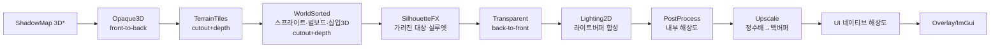

# 02. 렌더링 (RHI + Hybrid Renderer)

> 소유 주제: **좌표계·축·단위(PPU) 규약** — 다른 모든 문서는 본 문서의 규약을 인용한다.
> 관련 문서: 01(윈도우·수학·잡·이벤트), 03(렌더 데이터 공급자), 04(셰이더·텍스처·머티리얼 에셋), 06(인게임 UI 렌더 소비자), 07(에디터 뷰포트 소비자)

---

## 목표와 책임

- **RHI(Render Hardware Interface)**: DX11을 1차 백엔드로 하되, DX12/Vulkan 백엔드를 *코드 구조 변경 없이 추가*할 수 있는 그래픽 API 추상화를 제공한다.
- **하이브리드 렌더 파이프라인**: 2D 레이어(테일즈위버식 도트 맵)와 3D 지오메트리(삽입 오브젝트, HD-2D 월드)가 **하나의 깊이 도메인**에서 올바르게 정렬·가림 처리되는 렌더러를 제공한다. 이것이 본 모듈의 핵심 난제이자 차별점이다.
- **픽셀아트 특화**: 픽셀 퍼펙트 저해상도 렌더링, 정수배 업스케일, 팔레트 스왑·아웃라인 등 도트 게임 관용 효과를 1급 기능으로 지원한다.
- **확장성**: 커스텀 렌더 패스·머티리얼·포스트 이펙트를 플러그인이 등록할 수 있는 구조. ImGui 렌더러 백엔드도 RHI 위에 자체 구현한다.
- 비책임: 씬 그래프·컬링용 공간 자료구조(03), 에셋 로딩·셰이더 오프라인 컴파일 파이프라인(04), 인게임 UI 위젯 로직(06), 윈도우 생성(01).

---

## 설계 개요

### 좌표계·단위 규약 (본 문서가 확정 — 전 모듈 공통)

| 항목 | 규약 | 비고 |
|---|---|---|
| 핸드니스 | **왼손 좌표계(Left-handed)** | DX11 관행. DirectXMath `*LH` 계열과 일치 |
| 월드 업 축 | **+Y** | |
| 월드 전방 | **+Z** ("북쪽") | 카메라 기본 시선 방향 = +Z |
| 지면 평면 (3D/HD2D) | **XZ 평면** | 캐릭터 발이 닿는 면 |
| 월드 단위 | **1.0 unit = 1 m** (3D 기준) | 물리·오디오 감쇠 등 전 모듈 공통 |
| PPU (Pixels Per Unit) | **기본 48** (프로젝트 설정으로 변경 가능) | **1 unit = 1타일 = 48px** (48×48px 타일 = 1×1 unit) |
| 내부 해상도 (PixelPerfect) | **기본 960×540 (16:9)** | 정수배 래더: 1080p ×2, 4K ×4. 비정수배는 sharp-bilinear (아래 해상도 모드) |
| 권장 캐릭터 스프라이트 | **높이 64~96px** | 타일 48px 기준. 아트 제작 가이드 기준값 |
| 스크린 좌표 | **좌상단 원점, +X 오른쪽, +Y 아래**, 단위 px | 인게임 UI(06)·에디터(07)·입력(01) 공통 |
| UV 좌표 | 좌상단 원점 (DX 관행) | |
| NDC 깊이 | **0(near) ~ 1(far)** | Reversed-Z는 3D 원근 카메라 한정 옵션(오픈 이슈) |
| 회전 | 내부 라디안, 에디터 표기는 도(deg) | 수학 타입·행렬 저장 규약 자체는 01 소유 |
| 색 공간 | 텍스처 sRGB, 라이팅·블렌딩은 리니어, 최종 sRGB 백버퍼 | 픽셀아트 순수 2D 모드에서는 sRGB 패스스루 옵션 |

#### 씬 공간 프리셋 — 하이브리드의 출발점

하나의 축 규약 안에서, 씬(Scene)은 둘 중 하나의 **공간 프리셋**을 선택한다. (씬별 설정, 03이 씬 에셋에 저장)

| | `Screen2D` (테일즈위버식) | `HD2D` (옥토패스식) |
|---|---|---|
| 콘텐츠 배치 평면 | **XY 평면** (X=화면 오른쪽, +Y=화면 위) | XZ 지면 + Y 높이 |
| 카메라 | 직교, 시선 +Z (정면 응시) | 원근(저 FOV) 또는 직교, 피치 약 -30°~-60° |
| "화면 위로 이동" | 월드 +Y 이동 | 월드 +Z 이동 |
| 깊이 정렬 | **레이어 밴드 + Y-sort → 깊이 버퍼 값으로 인코딩** | 카메라 실거리(진짜 깊이 버퍼) |
| 스프라이트 | XY 평면 쿼드 (빌보드 불필요) | 업라이트 빌보드 (Y축 고정 빌보드) |
| 삽입 3D 오브젝트 | 아트의 페이크 원근에 맞춰 기울여 배치 + 깊이 오버라이드 | 그냥 3D |
| 타일 좌표 → 월드 | `x = col·tileW/PPU`, `y = −row·tileH/PPU` (row는 아래로 증가) | `x = col·tileW/PPU`, `z = −row·tileH/PPU` |

> 03(타일맵·엘리베이션), 06(UI), 07(기즈모)은 위 표를 인용만 하고 재정의하지 않는다.

### 아키텍처 층 구성

```
[03 Scene/ECS] --extract--> [RenderWorld(프록시 스냅샷)] --> [Renderer(패스 오케스트레이션)]
                                                                 |  IRenderPass 목록 (플러그인 확장점)
                                                                 v
                                                        [RHI ICommandContext]
                                                                 v
                                                  [DX11 백엔드]  (미래: DX12 / Vulkan)
```

- **RenderWorld**: 씬에서 추출한 렌더 프록시(스프라이트·메시·라이트·타일 청크)의 평탄한 배열. 씬 그래프를 렌더러가 직접 걷지 않는다. MVP는 단일 스레드지만, 추출/렌더 분리를 지금 잡아두어 미래 렌더 스레드 분리를 가능하게 한다.
- **Renderer**: 카메라(뷰)별로 스테이지 슬롯에 등록된 `IRenderPass`들을 순서대로 실행. MVP는 고정 패스 리스트, 단 패스가 입출력 리소스를 *선언*하게 하여 미래 프레임 그래프로의 이행 비용을 낮춘다(아래 논의).

---

## 핵심 타입·API 스케치

### RHI 계층 (`mye::rhi`)

설계 원칙 — **무엇을 추상화하고 무엇을 하지 않는가**:

| 추상화한다 (DX12/Vulkan 대비) | 추상화하지 않는다 (백엔드 내부에 숨김) |
|---|---|
| 모놀리식 **PipelineState** (셰이더+블렌드+뎁스+래스터+입력레이아웃+RT포맷을 한 덩어리로) | 리소스 배리어/상태 전이 (백엔드가 추적·자동 삽입) |
| **BindGroup** 바인딩 모델 (슬롯 나열이 아닌 리소스 묶음 단위) | 명시적 GPU 메모리 힙·서브얼로케이션·residency |
| `BeginRenderPass/EndRenderPass` 로 RT 바인딩+클리어를 묶음 | 멀티 큐·비동기 컴퓨트 (미래에 *추가적* API로 도입) |
| 커맨드 기록 스타일 API (DX11은 즉시 실행으로 구현) | Vulkan RenderPass/서브패스 최적화 (내부 처리) |
| 핸들 기반 리소스 + 프레임 지연 파괴 | 바인드리스 디스크립터 (미래 additive 확장) |

핵심: **DX11에서 손해 보지 않으면서 DX12에서 다시 설계하지 않아도 되는 최소 교집합 + 미래 지향 형태**를 취한다. PSO·BindGroup·RenderPass 묶음이 그 세 기둥이다.

```cpp
namespace mye::rhi {

// ---- 핸들: 불투명 32+32bit(index+generation). dangling 접근을 세대 검증으로 탐지 ----
template <typename Tag> struct Handle { uint32_t index = kInvalid; uint32_t gen = 0; bool IsValid() const; };
using BufferHandle    = Handle<struct BufferTag>;
using TextureHandle   = Handle<struct TextureTag>;
using SamplerHandle   = Handle<struct SamplerTag>;
using ShaderHandle    = Handle<struct ShaderTag>;     // 스테이지별 바이트코드 1개
using PipelineHandle  = Handle<struct PipelineTag>;
using BindGroupHandle = Handle<struct BindGroupTag>;

// ---- 리소스 서술자 (발췌) ----
struct BufferDesc  { uint64_t size; BufferUsage usage /*Vertex|Index|Uniform|Structured*/; CpuAccess access /*None|WriteDiscardRing*/; };
struct TextureDesc { TextureDim dim; Format format; uint32_t width, height; uint16_t depthOrLayers, mips;
                     SampleCount samples; TextureUsage usage /*Sampled|RenderTarget|DepthStencil|CopySrc...*/; };
struct SamplerDesc { Filter filter /*Point|Linear|...*/; AddressMode u, v, w; /* ... */ };

// ---- 파이프라인: DX12 PSO 형태를 정본으로. DX11 백엔드는 개별 상태 객체로 분해·캐싱 ----
struct GraphicsPipelineDesc {
    ShaderHandle vs, ps;                       // (gs/hs/ds는 도입하지 않음 — 이식성)
    VertexLayoutDesc     vertexLayout;
    BlendStateDesc       blend;
    DepthStencilStateDesc depthStencil;
    RasterizerStateDesc  raster;
    PrimitiveTopology    topology;
    RenderTargetFormats  rtFormats;            // RT/DS 포맷을 생성 시점에 고정 (DX12 PSO 호환성)
    std::span<const BindGroupLayoutDesc> bindGroupLayouts; // 셰이더 리플렉션에서 유도 가능
};

// ---- 바인딩: WebGPU식 BindGroup. DX11은 슬롯 바인딩으로 평탄화, DX12/VK는 디스크립터 테이블/셋 ----
struct BindGroupEntry { uint32_t binding; BindingType type; /* union: */ BufferHandle buf; TextureHandle tex; SamplerHandle smp; };
struct BindGroupDesc  { BindGroupLayoutHandle layout; std::span<const BindGroupEntry> entries; };
// 그룹 슬롯 규약: 0 = PerFrame(뷰·시간), 1 = PerPass, 2 = PerMaterial, 3 = PerDraw(인스턴스)

class ICommandContext {
public:
    virtual void BeginRenderPass(const RenderPassBeginDesc& rt) = 0;  // RT 세트 + LoadOp(Clear/Load) + ClearValue
    virtual void EndRenderPass() = 0;
    virtual void SetPipeline(PipelineHandle p) = 0;
    virtual void SetBindGroup(uint32_t slot, BindGroupHandle g, std::span<const uint32_t> dynamicOffsets = {}) = 0;
    virtual void SetVertexBuffer(uint32_t slot, BufferHandle b, uint64_t offset) = 0;
    virtual void SetIndexBuffer(BufferHandle b, IndexFormat fmt) = 0;
    virtual void SetViewport(const Viewport& vp) = 0;
    virtual void SetScissor(const RectI& r) = 0;
    virtual void Draw(uint32_t vertexCount, uint32_t firstVertex) = 0;
    virtual void DrawIndexed(uint32_t indexCount, uint32_t firstIndex, int32_t baseVertex) = 0;
    virtual void DrawIndexedInstanced(uint32_t idxCount, uint32_t instCount, uint32_t firstIdx, int32_t baseVtx, uint32_t firstInst) = 0;
    virtual void* MapDynamic(BufferHandle b, uint64_t size) = 0;      // 링 버퍼 WRITE_DISCARD 스타일
    virtual void Unmap(BufferHandle b) = 0;
    virtual void CopyTexture(TextureHandle dst, TextureHandle src, const TextureCopyRegion& rgn) = 0;
    virtual void WriteTexture(TextureHandle dst, const TextureCopyRegion& rgn,
                              const void* srcData, uint32_t srcRowPitch) = 0;   // CPU→텍스처 부분 업로드 (글리프 아틀라스 R8(06)·팔레트 LUT·타일 청크 갱신)
    virtual void CopyTextureToBuffer(BufferHandle dst, TextureHandle src, const TextureCopyRegion& rgn) = 0; // 리드백 준비 (ID 픽킹·썸네일 캡처)
    virtual void WriteTimestamp(uint32_t queryIndex) = 0;                       // GPU 타임스탬프 기록 (07 프로파일러 GPU 탭)
    virtual void PushDebugMarker(const char* name) = 0; virtual void PopDebugMarker() = 0;
};

class IDevice {
public:
    virtual BufferHandle    CreateBuffer(const BufferDesc&, const void* initialData = nullptr) = 0;
    virtual TextureHandle   CreateTexture(const TextureDesc&, const TextureInitData* init = nullptr) = 0;
    virtual SamplerHandle   CreateSampler(const SamplerDesc&) = 0;
    virtual ShaderHandle    CreateShader(ShaderStage stage, std::span<const std::byte> bytecode) = 0;
    virtual PipelineHandle  CreateGraphicsPipeline(const GraphicsPipelineDesc&) = 0;
    virtual BindGroupHandle CreateBindGroup(const BindGroupDesc&) = 0;
    virtual void Destroy(BufferHandle) = 0;   // 즉시 해제 아님: N(=최대 in-flight 프레임)프레임 지연 파괴 큐
    /* Destroy 오버로드 각 핸들 타입별 … */
    virtual std::unique_ptr<ISwapChain> CreateSwapChain(void* nativeWindowHandle, const SwapChainDesc&) = 0;
                                                          // 창별 스왑체인 생성·파괴 — ImGui 멀티 뷰포트(07 P1)·보조 창 대응
    virtual ReadbackHandle  EnqueueReadback(BufferHandle src, uint64_t offset, uint64_t size) = 0;
    virtual bool            TryGetReadback(ReadbackHandle, std::span<std::byte> out) = 0;
                                                          // GPU→CPU 리드백: N(=in-flight)프레임 지연 폴링. 스톨 유발 즉시 Map 금지
    virtual bool            ResolveTimestamps(std::span<uint64_t> outTicks, uint64_t& outFrequency) = 0;
                                                          // WriteTimestamp 결과 리졸브 (N프레임 지연, disjoint 시 false)
    virtual ICommandContext& GetImmediateContext() = 0;   // MVP: 단일 컨텍스트. 미래: CreateDeferredContext 추가
    virtual void BeginFrame() = 0;  virtual void EndFrame() = 0;      // 지연 파괴 큐 처리·링 버퍼 리셋 시점
    virtual ImTextureID GetImGuiTextureID(TextureHandle t) = 0;       // ImGui/에디터 노출용 (SRV 래핑)
    virtual const DeviceCaps& GetCaps() const = 0;
};

class ISwapChain {
public:
    virtual void Resize(uint32_t w, uint32_t h) = 0;
    virtual TextureHandle GetCurrentBackBuffer() = 0;
    virtual void Present(bool vsync) = 0;
};

std::unique_ptr<IDevice> CreateDevice(Backend backend /*DX11*/, const DeviceCreateInfo&);
} // namespace mye::rhi
```

**리소스 수명 관리**: RHI 계층은 수동 생성/파괴 + 프레임 지연 파괴만 제공(참조 카운트 없음 — DX12에서 GPU-in-flight 안전성의 기반). 참조 카운트·핸들 공유는 상위(렌더러의 `TextureRef`, 04의 에셋 핸들)에서 담당한다.

**DX11 백엔드 구현 전략**: immediate context 단독 사용. `SetPipeline`은 캐싱된 `ID3D11BlendState/DepthStencilState/RasterizerState/InputLayout` 묶음으로 분해 적용하고 중복 바인딩은 상태 섀도잉으로 걸러낸다. `BeginRenderPass` → `OMSetRenderTargets`+`Clear*`. 동적 버퍼는 `MAP_WRITE_DISCARD` 링. BindGroup은 그룹 생성 시 슬롯 배열로 미리 구워두고 `SetBindGroup`에서 일괄 바인딩한다. `WriteTexture`는 `UpdateSubresource`로 매핑(DX12에서는 내부 링 스테이징 버퍼 + 카피 큐). 리드백은 스테이징 텍스처/버퍼에 복사 후 N프레임 지연 `Map(READ)`으로 스톨 없이 처리. 타임스탬프는 `D3D11_QUERY_TIMESTAMP` + 프레임당 `TIMESTAMP_DISJOINT` 쌍으로 구현한다.

### 셰이더 전략

- **HLSL(SM 5.0)이 소스 정본**. MVP는 FXC 컴파일, 이후 DXC로 이행(SM6 + SPIR-V 크로스컴파일 → Vulkan 대비).
- **오프라인 컴파일은 04 에셋 파이프라인의 셰이더 임포터가 수행**(개발 중 핫 리로드 포함). 본 모듈은 컴파일된 바이트코드+리플렉션 메타데이터를 소비하는 런타임(`ShaderSystem`)만 소유한다.
- **리플렉션**: 임포트 시 `D3DReflect`로 cbuffer 레이아웃·리소스 바인딩·버텍스 입력 시그니처를 추출해 셰이더 에셋에 저장 → 런타임이 `BindGroupLayout`과 머티리얼 파라미터 UI(07)를 자동 생성.
- **퍼뮤테이션**: 셰이더 소스 상단에 키워드 선언(`#pragma mye_keyword PALETTE_SWAP LIT OUTLINE`). 키워드 조합 = 비트마스크 키. *구조적* 차이(팔레트 모드, 라이팅 유무)만 퍼뮤테이션으로, *가벼운 토글*(히트 플래시 강도)은 동적 브랜치 + 머티리얼 파라미터로 처리해 조합 폭발을 억제한다. 개발 중 온디맨드 컴파일, 배포용은 사용 조합 목록 기반 사전 빌드.

### 머티리얼 시스템 (`mye::render`)

```cpp
struct MaterialDesc {                 // 04가 .material 에셋으로 직렬화 (리플렉션 프레임워크 사용)
    AssetRef<ShaderAsset> shader;
    KeywordSet            keywords;   // 퍼뮤테이션 선택
    ParamBlock            params;     // 리플렉션 기반 이름→값 (float/color/texture...)
    RenderStateOverride   state;      // 블렌드 모드, 컬링, 뎁스 비교 등 (파이프라인 캐시 키에 반영)
    SortHint              sortHint;   // Opaque / Cutout / Transparent / UI
};
class MaterialInstance {              // 부모 머티리얼 + 파라미터 오버라이드. 스프라이트 인스턴스 데이터로 패킹
public:
    void SetFloat(NameHash p, float v);  void SetColor(NameHash p, Color v);  void SetTexture(NameHash p, TextureRef t);
};
```

Lua(05)는 `MaterialInstance` 파라미터 조작까지만 허용(셰이더 작성 불가). 신규 셰이더·머티리얼 정의는 에셋 또는 네이티브 플러그인 몫.

### 렌더러·패스 프레임워크

```cpp
enum class PassStage : uint16_t {     // 고정 스테이지 슬롯. 플러그인 패스는 (Stage, priority)로 삽입
    ShadowMap,        // 3D 섀도 (확장 단계)
    Opaque3D,         // 3D 불투명 (front-to-back)
    TerrainTiles,     // 타일맵 청크 (cutout, 뎁스 기록)
    WorldSorted,      // Y-sort 스프라이트·빌보드·삽입 3D (cutout, 뎁스 기록) — 하이브리드 핵심
    SilhouetteFX,     // 가려진 캐릭터 실루엣/X-ray (스텐실 + depth GREATER) — 아래 "가려진 캐릭터 가시성"
    Transparent,      // 진짜 반투명·이펙트 (back-to-front, 뎁스 기록 안 함)
    Lighting2D,       // 2D 라이트 버퍼 합성
    PostProcess,      // 내부 해상도 포스트 체인
    Upscale,          // 저해상 RT → 백버퍼 (정수배/sharp-bilinear)
    UI,               // 인게임 UI (06) — 네이티브 해상도
    Overlay,          // 디버그 오버레이·ImGui (에디터/개발 전용)
};

struct PassContext {
    rhi::ICommandContext& cmd;
    const ViewInfo&       view;        // 카메라 행렬·뷰포트·프리셋(Screen2D/HD2D)·픽셀스냅 정보
    const RenderWorld&    world;       // 프록시 스냅샷
    TransientRTPool&      rtPool;      // 프레임 일시 RT 할당 (선언 기반)
};
class IRenderPass {
public:
    virtual ~IRenderPass() = default;
    virtual const char* Name() const = 0;
    virtual PassStage   Stage() const = 0;
    virtual int         Priority() const { return 0; }
    virtual void DeclareResources(PassResourceBuilder& b) = 0;  // 읽기/쓰기 RT 선언 → 미래 프레임 그래프 이행점
    virtual void Execute(PassContext& ctx) = 0;
};

class Renderer {
public:
    void RegisterPass(std::unique_ptr<IRenderPass> pass);       // 플러그인 확장점
    void UnregisterPass(std::string_view name);
    void RenderFrame(const RenderWorld& world, std::span<const ViewInfo> views); // 카메라 스택 순회
    PostEffectChain& GetPostChain();
    SpriteBatcher&   GetSpriteBatcher();  // 06 UI·디버그 드로잉도 이 2D 저수준 API를 사용
};
```

**프레임 그래프 도입 여부**: MVP는 **도입하지 않는다**. 근거 — (1) DX11은 배리어·트랜지언트 앨리어싱 이득이 거의 없음, (2) 1인 개발에서 초기 복잡도 대비 효용 낮음. 대신 `DeclareResources()`로 패스의 입출력 선언을 지금부터 강제해, DX12 백엔드 도입 시 선언 정보를 그대로 소비하는 프레임 그래프(트랜지언트 RT 앨리어싱·자동 배리어·패스 컬링)로 **재작성 없이 이행**한다.

### 렌더 프록시 (03 → 02 데이터 계약)

```cpp
struct SpriteProxy {
    Mat3x4    transform;        // 현재 고정스텝의 월드 변환 (Screen2D: XY 평면 / HD2D: 빌보드 원점)
    Mat3x4    prevTransform;    // 직전 고정스텝의 월드 변환 — alpha 보간용 (아래 보간 계약)
    RectF     atlasRect;        TextureRef atlas;
    Vec2      pivotPx;          // 스프라이트 픽셀 기준 피벗(보통 발밑)
    uint16_t  sortLayer;        // 03의 SortLayer 컴포넌트 값 (다리 위/아래 등)
    int16_t   orderInLayer;     // 03이 공급하는 동일 sortKeyY 내 미세 순서 (타이브레이커)
    float     sortKeyY;         // "논리적 지면 Y" — 정렬용. 시각적 오프셋(점프·엘리베이션)과 분리
    MaterialInstance* material; BillboardMode billboard;  uint32_t flags;   // flags: Silhouette 대상 등 (03의 플래그 컴포넌트에서 추출)
};
struct MeshProxy {
    Mat3x4 transform;  Mat3x4 prevTransform;  MeshRef mesh;  MaterialRef material;
    DepthMode depthMode;    // Geometry | AnchorFlat | AnchorBiased (아래 정렬 전략 참조)
    float     anchorSortY;  uint16_t sortLayer;
};
struct TileChunkProxy { /* 03이 구운 청크 메시 + 레이어·엘리베이션 램프 정보 */ };
struct Light2DProxy { Vec3 pos; float radius; Color color; TextureRef falloff; };
struct Light3DProxy { LightType type; /* dir/point/spot 파라미터 */ };
```

**고정스텝 보간 계약 (01의 "고정 60Hz 시뮬레이션 + alpha 보간 렌더" 이행)**:
- 03은 매 FixedUpdate 시작 시 각 엔티티의 `PreviousFixedTransform`을 기록하고, 렌더 추출(RenderExtract) 시 `transform`(현재 고정스텝)과 `prevTransform`(직전 고정스텝)을 **모두** 프록시에 공급한다.
- 02는 렌더 시 `lerp(prevTransform, transform, alpha)`로 보간해 그린다. 보간 대상은 **위치·회전·스케일 전체**를 기본으로 하되, 텔레포트 등 불연속 이동은 03이 프록시 플래그(`NoInterpolate`)로 표시해 스냅시킨다.
- **적용 순서: 보간 → 픽셀 스냅.** PixelPerfect 모드의 픽셀 그리드 스냅은 보간이 끝난 최종 위치에 적용한다(스냅 후 보간하면 계단 현상 재발).

---

## 하이브리드 깊이 정렬 — 핵심 설계 (가장 중요)

### 대원칙: 단일 깊이 버퍼 + 통일된 깊이 함수

월드에 속한 모든 것(타일·스프라이트·3D 메시)은 **하나의 깊이 버퍼**를 공유하고, 깊이 값은 프리셋별 단일 함수로 결정된다. CPU Y-sort만으로는 "큰 3D 오브젝트 *중간*에 캐릭터가 끼는" 픽셀 단위 가림을 표현할 수 없으므로, **Y-sort를 깊이 값으로 인코딩해 깊이 버퍼가 최종 심판**이 되게 한다.

### 알파 정책 — 이 설계를 가능하게 하는 전제

| 분류 | 예 | 블렌드 | 뎁스 기록 | 정렬 |
|---|---|---|---|---|
| **Cutout** (기본) | 도트 스프라이트·타일·나무 | alpha test (clip) | **기록함** | 깊이 버퍼가 처리 (CPU 정렬은 배칭 최적화용) |
| **Transparent** | 글로우·고스트·물·이펙트 | alpha blend | 기록 안 함 | CPU back-to-front (뎁스 *테스트*는 함) |

픽셀아트는 경계가 hard edge이므로 cutout이 자연스럽다. 안티앨리어싱된 반투명 가장자리를 가진 HD 스프라이트는 Transparent로 분류하되 하이브리드 정렬 정밀도가 떨어짐을 감수한다(오픈 이슈).

### Screen2D 프리셋의 깊이 함수

```
depth = LayerBand(sortLayer).base
      + saturate((viewTopY − sortKeyY) / viewRangeY) × LayerBand(sortLayer).width
```

- `sortKeyY` = **논리적 지면 Y**(발밑 기준). 점프·엘리베이션에 의한 *시각적* Y 오프셋은 sortKeyY에 반영하지 않는다(같은 칸에서 점프해도 앞뒤가 안 바뀜). 엘리베이션이 있는 지형에서는 03의 높이 데이터로 `sortKeyY = groundY(tile)`을 계산해 전달.
- **레이어 밴드 표** (뎁스 0~1 분할, 프로젝트 설정으로 조정 가능):

| sortLayer | 밴드 | 용도 |
|---|---|---|
| BackgroundFar/Near | 0.95~1.0 / 0.90~0.95 | 원경·패럴랙스 (뎁스 테스트 무의미, 순서 그리기) |
| Ground | 0.85~0.90 | 지면 타일 (Y-sort 불필요, 평면 뎁스) |
| World 0..N | 0.20~0.85를 N분할 | **Y-sort 대상** — 캐릭터·오브젝트·삽입 3D. N층 = 다리/고가 층 |
| OverheadFX | 0.10~0.20 | 머리 위 연출 (나뭇잎 그림자 등) |

- **스프라이트 = "flat depth"**: 버텍스 셰이더가 쿼드 전체에 *발밑(sortKeyY) 기준 단일 깊이*를 출력한다. 키 큰 스프라이트의 머리가 뒤 오브젝트를 잘못 뚫는 고전 문제를 원천 차단.
- **경사면(slope) 타일**: 경사 타일 청크는 타일 메시가 **램프 깊이**(타일 하단→상단으로 sortKeyY가 연속 변화)를 기록한다. 경사 위에 선 캐릭터는 03이 보간한 `groundY`를 sortKeyY로 넘기므로 자연스럽게 끼어든다.
- **다리 위/아래 통과**: 렌더러는 `sortLayer` 밴드만 제공한다. 캐릭터가 다리 계단 트리거를 지나면 03(충돌/월드 로직)이 캐릭터의 `sortLayer`를 `World k` → `World k+1`로 바꾼다. 다리 상판 타일은 상위 밴드, 교각·아래 길은 하위 밴드 → 같은 화면에서 "다리 위를 걷는 A"와 "다리 밑을 지나는 B"가 깊이 버퍼로 동시에 올바르게 그려진다. 렌더러 쪽 특수 처리 불필요 — *밴드 분리가 곧 해법*.

### 삽입 3D 오브젝트의 깊이 모드 (`MeshProxy::depthMode`)

| 모드 | 깊이 계산 | 용도 |
|---|---|---|
| `AnchorFlat` | 오브젝트 전체를 anchorSortY의 flat depth로 | 소형 오브젝트(항아리·의자). 스프라이트와 동일 취급 |
| `AnchorBiased` (기본) | `depth = anchorDepth + (viewZ − anchorViewZ) × ε` | **대형 오브젝트(석상·풍차·마차)**. 전체 정렬은 앵커(발밑 라인) 기준으로 Y-sort 도메인에 참여하되, 오브젝트 *내부* 픽셀 간에는 실제 지오메트리 깊이의 축소본(ε)을 더해 자기 앞뒤가 유지됨 |
| `Geometry` | 실제 카메라 깊이 | HD2D 프리셋, 또는 Screen2D에서 밴드 전체를 점유하는 배경 구조물 |

**구체 사례 — 큰 3D 석상 뒤로 캐릭터가 돌아 들어감**: 석상(AnchorBiased)의 앵커는 석상 발밑 라인. 캐릭터가 석상 발밑보다 위(sortKeyY가 큼, 화면상 더 뒤)로 가면 캐릭터 깊이 > 석상 앵커 깊이 → 깊이 테스트로 석상의 해당 픽셀들에 가려진다. 석상 *앞*(아래)에 서면 반대. 석상의 튀어나온 팔 부분과 캐릭터가 겹치는 미세 케이스는 ε 바이어스가 근사 처리한다. ε는 레이어 밴드 폭 대비 충분히 작게 잡아 인접 오브젝트 정렬을 침범하지 않게 한다.

### 가려진 캐릭터 가시성 — 실루엣과 오버헤드 페이드

깊이 정렬이 *정합*해도, 대형 구조물·건물 내부가 흔한 이 장르에서는 **가려진 플레이어를 계속 보이게 하는 수단**이 별도로 필요하다. 두 장치를 병행 제공한다.

1. **실루엣(X-ray) 패스 — `SilhouetteFX` 스테이지 (WorldSorted 직후)**
   - 대상 스프라이트/메시(플레이어·파티원 등, 03이 플래그 컴포넌트로 지정 → `SpriteProxy::flags`의 Silhouette 비트)를 WorldSorted에서 그릴 때 스텐실에 마킹해 둔다.
   - SilhouetteFX 패스가 같은 대상을 **depth-test `GREATER`**(가려진 픽셀만 통과) + 스텐실 제외 조건으로 다시 그려, 가려진 부분만 단색(또는 패턴) 실루엣으로 표시한다. 뎁스 기록 없음.
2. **가림 오브젝트 페이드 — 근접 페이드 규약**
   - 대상: `AnchorBiased` 대형 메시(석상·건물), `Overhead`류 sortLayer(지붕·나무 캐노피·다리 상판) 콘텐츠.
   - 플레이어가 해당 오브젝트 뒤/아래로 진입하면(트리거 판정은 03 책임 — 플레이어 위치·FloorLevel 공급) 렌더러가 페이드 계수를 받아 **디더링 컷아웃 페이드**(스크린도어 패턴으로 clip 임계 조절)로 사라지게 한다. cutout·premultiplied 정책과 정합 — 뎁스 기록·정렬을 깨지 않으면서 반투명처럼 보이게 하는 관용 기법.
   - 페이드 대상 지정·트리거 조건(플레이어 위치, FloorLevel, 볼륨)은 03 소유. 02는 프록시의 페이드 계수(`flags` + per-instance 파라미터)를 소비해 렌더만 담당한다.

### HD2D 프리셋

전부 실제 깊이(`Geometry`). Y-sort 비활성. 스프라이트는 업라이트 빌보드로 지면에 "서고", 깊이 버퍼가 모든 가림을 처리한다. 빌보드가 경사·지면에 파고드는 문제는 (a) 빌보드 하단 피벗 + 약간의 카메라 방향 기울임, (b) 뎁스 바이어스 옵션으로 완화. Transparent만 카메라 거리 back-to-front CPU 정렬.

### 패스 파이프라인 전체 흐름 (Screen2D 기준)



(*는 확장 단계. HD2D 프리셋은 D가 실깊이 불투명·컷아웃 패스로 단순화되고 F가 3D 라이팅으로 대체/병행된다.)

---

## 픽셀아트 특화 렌더링

### 해상도 모드

| | **PixelPerfect 모드** | **Native 모드** |
|---|---|---|
| 월드 렌더 | 고정 내부 RT (기본 960×540) | 윈도우 해상도 직접 |
| 업스케일 | **정수배 우선 + 포인트 샘플** — 정수배 래더: 1080p ×2, 4K ×4. 1440p 등 비정수배 해상도는 **sharp-bilinear**(정수배 근사+경계만 보간)로 전체 화면을 채움. 유저 설정으로 순수 정수배+레터박스도 선택 가능 | 해당 없음 |
| 스프라이트 | 텍셀:픽셀 = 1:1 보장, 도트 무결성 완전 | PPU 기반 스케일, 회전·줌 자유 |
| UI(06)·ImGui | **네이티브 해상도에서 별도 렌더** (텍스트 선명) | 동일 |
| 카메라 이동 | 픽셀 스냅 + 서브픽셀 오프셋 (아래) | 자유 |

**픽셀 스냅 카메라**: 카메라 위치를 내부 해상도 픽셀 그리드(1/PPU 단위)로 스냅해 렌더하고, 스냅으로 버린 서브픽셀 잔여를 Upscale 패스의 UV 오프셋으로 되돌린다(내부 RT를 상하좌우 1px 여유 있게 렌더). → 부드러운 카메라 이동과 스프라이트 지터 방지를 양립.

### 텍스처 필터링 정책

- 픽셀아트 텍스처: **포인트 샘플링 + 밉맵 없음**이 기본(임포터 프리셋, 04). 아틀라스는 타일/프레임 간 **여백(padding) + 가장자리 확장(extrusion)** 필수 — 04 임포터 규약으로 지정.
- 알파는 **premultiplied alpha**로 통일(블리딩 방지, 블렌드 상태 단순화).
- 3D 텍스처·UI 폰트: 통상 linear + 밉맵.

### 스프라이트 배칭

- 프레임당 동적 버텍스 버퍼(링)에 쿼드 스트리밍. 소트 키 = `(sortLayer, material, texture, depth)` 64비트 패킹 → 같은 아틀라스·머티리얼끼리 드로우콜 병합.
- 퍼-인스턴스 데이터(틴트·플래시 강도·팔레트 인덱스)는 인스턴스 스트림 또는 structured buffer로 전달해 배치 분절을 막는다.
- 타일맵은 스프라이트 배처를 쓰지 않고 03이 구운 **청크 정적 메시**(TileChunkProxy)로 렌더 — 대형 맵에서 CPU 비용 제거.

### 도트 셰이더 효과 (스프라이트 uber-shader 키워드/파라미터)

| 효과 | 구현 | 분류 |
|---|---|---|
| 팔레트 스왑 | 스프라이트를 인덱스 텍스처(R8)로 임포트 + 팔레트 LUT(256×N) 룩업. 캐릭터 색상 변형·염색 | 퍼뮤테이션 `PALETTE_SWAP` |
| 히트 플래시 | `lerp(color, flashColor, flashAmount)` — 인스턴스 파라미터 | 동적 브랜치 (상시 포함) |
| 아웃라인 | 아틀라스 패딩 영역 내 4/8방향 이웃 샘플. 선택 강조·타겟팅 | 퍼뮤테이션 `OUTLINE` |
| 디졸브/그레이스케일/틴트 | 노이즈 텍스처·컬러 매트릭스 파라미터 | 동적 브랜치 |
| 노멀맵 2D 라이팅 | 보조 노멀 텍스처 → Lighting2D 연동 | 퍼뮤테이션 `LIT2D` (확장 단계) |

---

## 카메라

```cpp
struct CameraDesc {
    Projection projection;        // Orthographic | Perspective
    float orthoHeightUnits;       // 직교: 세로 뷰 크기 (내부해상도/PPU와 연동)
    float fovY, nearZ, farZ;      // 원근
    CameraPreset preset;          // Screen2D | TopDown | HD2D_45 | HD2D_60 | Custom
    bool  pixelSnap;              // PixelPerfect 모드에서 픽셀 스냅 카메라
    RenderTargetRef target;       // null = 화면 (에디터 뷰포트는 오프스크린 RT 지정)
    int   priority;  LayerMask cullingMask;  RectF viewportRect;
};
```

- **프리셋**: `Screen2D`(직교 정면), `HD2D_45/60`(피치 고정 + 요 스냅 회전 옵션 — 2.5D 고정각), `Custom`(자유). 프리셋은 깊이 함수 선택(위 정렬 전략)과 결합된다.
- **Screen↔World 변환 API (본 모듈 소유·정본)**: PixelPerfect 모드는 내부 RT + 정수배 업스케일 + 레터박스 + 픽셀 스냅 + 서브픽셀 UV 오프셋을 거치므로 변환이 자명하지 않다. 카메라/`ViewInfo`에 다음을 제공한다.

```cpp
// ViewInfo 멤버 — 내부 RT 스케일·레터박스 오프셋·서브픽셀 오프셋·카메라 스택(뷰포트 렉트)을 모두 반영
Vec2  WorldToScreen(Vec3 world) const;                  // → 네이티브 해상도 px (좌상단 원점)
Ray   ScreenToWorldRay(Vec2 nativePx) const;            // 원근(HD2D) 일반형
Vec3  ScreenToWorld(Vec2 nativePx, float planeCoord = 0) const; // 직교(Screen2D): XY 평면 / HD2D: XZ 지면 교점
```

  사용처: (a) 런타임 마우스 타게팅(NPC 클릭·툴팁), (b) 06 월드 앵커 UI(머리 위 HP바·이름표·데미지 숫자 — 네이티브 해상도 UI가 월드 좌표 추적), (c) 07 에디터 뷰포트 픽킹·기즈모. 06·07은 이 API를 인용만 하고 자체 변환을 구현하지 않는다. Lua에도 노출한다(확장 포인트 4).
- **카메라 스택**: `priority` 순으로 월드 카메라들(분할 화면·미니맵 RT 포함)을 렌더 → Upscale → **UI 카메라(스크린 공간, 네이티브 해상도, 06 소유 콘텐츠)** → Overlay. UI 카메라는 월드 깊이 버퍼를 공유하지 않는다.
- 에디터(07) 뷰포트는 `target`에 오프스크린 RT를 지정하고 `GetImGuiTextureID()`로 ImGui 이미지에 표출.
- **엔티티 ID 버퍼 패스 (정식 기능, M2)**: 07 P0(최소 에디터)의 픽킹 필수 요건. 뷰포트 카메라 옵션으로 활성화하면 WorldSorted/Opaque3D와 동일한 깊이 규칙·**알파 컷아웃(clip) 반영**으로 오프스크린 `R32_UINT` RT에 엔티티 ID를 기록한다. 픽킹은 마우스 위치 1px 영역을 `CopyTextureToBuffer` + N프레임 지연 리드백(`TryGetReadback`)으로 읽는다. 썸네일 캡처도 동일한 리드백 경로를 사용.

---

## 라이팅

**전략: 2D와 3D 라이팅 파이프라인은 분리하되, 라이트 데이터 소스(03의 Light 컴포넌트)와 전역 환경(데이/나이트)은 공유한다.**

### 2D 라이팅 (Screen2D 주력)

- **라이트 버퍼**: 내부 해상도 RGBA16F RT에 포인트/스팟/영역 라이트를 가산 블렌딩(감쇠 텍스처 또는 해석적 falloff). 합성: `final = albedo × (ambient + lightBuffer) + emissive`.
- **데이/나이트**: 전역 `ambient` 컬러·강도 커브(시간 → 색) + 포스트 단계 컬러 그레이딩 LUT. 06/스크립트가 시간을 구동, 렌더러는 파라미터만 수신.
- **라이트맵 (M4+, 생산자 연동 필수)**: 정적 맵 조명은 에디터(07)에서 베이크한 맵 단위 라이트맵 텍스처를 TerrainTiles 합성 시 곱한다(동적 라이트 버퍼와 가산 결합). 단, 07에 베이크 워크플로우 마일스톤이 실제로 잡히는 시점과 짝지어 도입한다 — 그 전까지 분위기 연출은 앰비언트+동적 라이트 버퍼+그레이딩 LUT로 충당.
- **노멀맵 2D 라이트(확장)**: `LIT2D` 머티리얼이 WorldSorted 패스에서 컬러+노멀 MRT로 출력 → Lighting2D가 노멀 기반 음영 계산. MRT 도입 시점은 오픈 이슈.
- 그림자: MVP는 "발밑 블롭 그림자" 스프라이트. 2D 캐스트 섀도(스프라이트를 기울여 찍는 방식)는 확장.

### 3D 라이팅

- MVP: **포워드** — 디렉셔널 1 + 드로우당 포인트 라이트 최대 4개. 확장: Forward+(클러스터드, DX12 시점), 섀도맵(디렉셔널 CSM 1단부터).
- **HD2D에서 스프라이트 조명**: 빌보드 스프라이트가 머티리얼 플래그로 3D 라이팅에 opt-in — 고정 노멀(카메라 지향 + 상향 틸트) 또는 작가 제작 노멀맵 사용. 옥토패스식 "빛 받는 도트 캐릭터"를 위한 핵심 장치.
- 두 파이프라인 모두 동일한 `Light` 컴포넌트(03)에서 추출하며, 2D/3D 적용 여부는 라이트의 플래그로 구분.

---

## 다른 모듈과의 경계

| 상대 | 이쪽(02) 책임 | 저쪽 책임 |
|---|---|---|
| **01 Core** | 스왑체인 생성(`IDevice::CreateSwapChain`)·리사이즈 대응, 프레임 타이밍·보간 alpha 소비 | win32 윈도우·메시지 루프, 수학 타입 정의, 잡 시스템, `WindowResized` 등 이벤트 버스 |
| **03 Scene** | 프록시 구조체(`SpriteProxy` 등)와 정렬 의미론(sortLayer 밴드·sortKeyY·orderInLayer 규칙) **정의**, 타일 청크 버텍스 포맷 정의, 실루엣·페이드 렌더 실행 | ECS 컴포넌트 → 프록시 **추출**·컬링(현재+직전 고정스텝 트랜스폼 공급), 다리/경사 트리거로 sortLayer 변경, 타일 청크 메시 빌드, groundY 계산, 실루엣 대상 플래그·오버헤드 페이드 트리거(플레이어 위치·FloorLevel) 판정 |
| **04 Asset** | 셰이더 리플렉션 메타·머티리얼 스키마 **정의**, 텍스처 임포트 요구사항(아틀라스 패딩·premultiplied·sRGB 플래그) 명세 | 셰이더 오프라인 컴파일·핫 리로드 훅, 텍스처/메시/머티리얼 에셋 로딩·GUID·핸들, 직렬화 프레임워크 |
| **05 Scripting/Plugin** | 플러그인용 렌더러 확장 API(아래) 및 Lua 노출 표면 정의 | 바인딩 생성·플러그인 로딩 |
| **06 Runtime** | UI 스테이지 슬롯 + 저수준 2D 드로우 API(`SpriteBatcher`)·글리프 아틀라스용 텍스처 API(`WriteTexture` R8 부분 업로드·시저 렉트) 제공, 월드 앵커 UI용 `WorldToScreen`/`ScreenToWorld` API | 인게임 UI 위젯·레이아웃·한글 텍스트 셰이핑, 파티클 *시뮬레이션*(렌더는 02의 Transparent 패스 사용) |
| **07 Editor** | 오프스크린 뷰포트 RT, `ImTextureID` 노출, **엔티티 ID 버퍼 패스+1px 리드백(정식, M2)**, GPU 타임스탬프 쿼리 API, 창별 스왑체인(`CreateSwapChain`)·ImGui 멀티 뷰포트 지원, 뷰포트 픽킹·기즈모용 `WorldToScreen`/`ScreenToWorld`, 기즈모용 디버그 드로우 API | 에디터 UI 전반, 라이트맵 베이크 워크플로우(02의 라이트맵 소비(M4+)는 이 워크플로우의 마일스톤 확정에 의존) |

좌표계·PPU 규약은 본 문서가 소유하며 전 모듈이 인용한다. ImGui는 Overlay 스테이지(에디터·디버그) 전용 — 인게임 UI는 06의 별도 시스템이 UI 스테이지에서 렌더한다.

---

## 확장 포인트

1. **커스텀 렌더 패스 (네이티브 플러그인)**: 플러그인이 `IRenderPass` 구현을 `Renderer::RegisterPass()`로 등록. `(PassStage, priority)`로 삽입 위치를 지정하므로 기존 패스 코드를 수정하지 않고 아웃라인 패스·미니맵 캡처·커스텀 G-buffer 등을 추가할 수 있다. 모듈 라이프사이클(01)의 `OnLoad`에서 등록, `OnUnload`에서 해제하는 규약(상세는 05).
2. **커스텀 머티리얼·셰이더**: 플러그인/프로젝트가 HLSL 셰이더 에셋 + `.material` 에셋을 추가하면 리플렉션 기반으로 파라미터가 자동 노출된다(에디터 인스펙터 포함). 엔진 코드 수정 불필요 — 데이터 주도.
3. **포스트 이펙트 체인**: `IPostEffect { DeclareResources; Execute(src, dst, PassContext); }`를 체인에 순서 지정 등록. 내장(컬러 그레이딩 LUT·비네트·CRT 스캔라인·블룸)과 동일한 인터페이스로 플러그인 이펙트가 끼어든다. Lua는 체인 on/off와 파라미터 조절까지 허용.
4. **Lua 노출 표면 (05가 바인딩)**: 카메라 제어(프리셋·줌·흔들림), `WorldToScreen`/`ScreenToWorld` 좌표 변환, `MaterialInstance` 파라미터, 라이트 파라미터·데이/나이트 시간, 포스트 이펙트 파라미터, 디버그 드로우(선·박스·텍스트). 패스 등록·RHI 직접 접근은 Lua에 노출하지 않는다(성능·안전).
5. **ImGui 렌더러 백엔드**: `imgui_impl_mye_rhi`를 RHI 위에 자체 구현(전용 파이프라인 + 링 버퍼). 백엔드 교체 시 ImGui 쪽 코드는 불변. `IDevice::GetImGuiTextureID()`로 임의 엔진 텍스처를 에디터에 표시. **멀티 뷰포트(platform viewports) 지원**: ImGui의 뷰포트 생성/파괴 콜백을 `IDevice::CreateSwapChain`으로 대응해 도킹 창을 별도 OS 창으로 분리할 수 있게 한다(07 P1 멀티 뷰포트 요건, M3).
6. **RHI 백엔드 추가**: `IDevice` 등 순수 인터페이스 구현 + `CreateDevice` 팩토리 등록으로 추가. 단, 백엔드는 **컴파일 타임 엔진 내장 모듈**로 한정하고 런타임 플러그인 DLL로는 열지 않는다(ABI 표면이 과도하게 넓어짐).

---

## 단계별 구현 범위 (MVP → 확장)

| 단계 | 범위 |
|---|---|
| **M0 부트스트랩** | RHI 인터페이스 + DX11 백엔드(디바이스·스왑체인·버퍼·텍스처·파이프라인·BindGroup), **텍스처 부분 업데이트 `WriteTexture`(DX11 `UpdateSubresource` 매핑)**, 시저 렉트(`SetScissor` — 06 UI 클리핑 요건), 클리어+삼각형, ImGui 백엔드, 셰이더 FXC 런타임 컴파일(임시) |
| **M1 2D 기초** | 스프라이트 배처·아틀라스, Screen2D 카메라, PixelPerfect 내부 RT + 정수배 업스케일 + 픽셀 스냅(06 정수 픽셀 스냅 요건), 고정스텝 alpha 보간(보간→스냅 순서), sortLayer·orderInLayer + CPU Y-sort(깊이 트릭 없이), 히트 플래시·틴트, `WorldToScreen`/`ScreenToWorld` |
| **M2 하이브리드 핵심** | **단일 깊이 도메인**: cutout 뎁스 기록, flat depth 스프라이트, 레이어 밴드, 타일 청크 렌더(경사 램프 깊이), 3D 메시 포워드 렌더 + `AnchorBiased` 깊이 모드, 다리 위/아래 검증 씬, **엔티티 ID 버퍼 패스 + 1px 리드백(07 P0 픽킹)**, GPU 타임스탬프 쿼리(07 프로파일러) |
| **M3 표현력** | Lighting2D(라이트 버퍼(포인트/스팟)·데이/나이트 앰비언트), 포스트 체인(컬러 그레이딩 LUT·비네트), 실루엣(SilhouetteFX)·오버헤드 디더 페이드, 팔레트 스왑·아웃라인, Transparent 패스·파티클 렌더 지원, 창별 스왑체인+ImGui 멀티 뷰포트(07 P1), 셰이더 임포터 연동(04)·핫 리로드·퍼뮤테이션 키 |
| **M4 HD2D·3D 강화** | HD2D 프리셋(빌보드·실깊이), 디렉셔널 섀도맵, 스프라이트 3D 라이팅 opt-in, 노멀맵 2D 라이팅(MRT), sharp-bilinear 업스케일, 카메라 스택 완성(분할·RT 카메라), 라이트맵 소비(07 베이크 워크플로우 마일스톤 확정과 짝지어 착수) |
| **M5 차세대** | DX12 백엔드 + `DeclareResources` 기반 프레임 그래프 활성화, 멀티스레드 커맨드 기록, Forward+, DXC/SM6·SPIR-V 경로(Vulkan 준비), 바인드리스 검토 |

---

## 오픈 이슈

1. **PPU 기본값·내부 해상도**: ✅ 확정(2026-07): PPU 48, 타일 48×48px(1 unit = 1타일 = 48px), 내부 해상도 960×540(16:9), 권장 캐릭터 스프라이트 높이 64~96px. 정수배 래더는 1080p ×2 / 4K ×4.
2. **비정수배 스케일 정책**: ✅ 확정(2026-07): 정수배 우선, 비정수배 해상도(1440p 등)는 sharp-bilinear 업스케일로 전체 화면 채움 — 유저 설정으로 순수 정수배+레터박스도 선택 가능.
3. **Screen2D 삽입 3D의 연출 규약**: 3D 모델을 아트의 페이크 원근에 맞춰 기울여 배치(모델 측 대응) vs 전용 페이크-피치 투영 행렬 제공(엔진 측 대응) — 아트 파이프라인과 함께 결정.
4. **반투명 대형 스프라이트의 하이브리드 정렬**: Transparent 분류 시 flat depth 정밀도가 떨어지는 케이스(반투명 유령이 다리 아래 통과 등)의 허용 수준.
5. **2D 노멀맵 라이팅 도입 시점**: MRT 비용과 아트 제작 부담(노멀맵 작가 작업) 대비 효용 — M3에 당길지 M4 유지할지.
6. **HDR·블룸**: 도트 감성 유지 관점에선 불필요하나 HD2D 연출(옥토패스식 블룸·DoF)에는 사실상 필수 — 내부 RT를 처음부터 RGBA16F로 갈지.
7. **Reversed-Z**: 3D 원근 깊이 정밀도 개선 옵션. Screen2D 깊이 밴드 인코딩과의 상호작용 정리 필요.
8. **셰이더 언어 장기 전략**: HLSL + DXC→SPIR-V 유지 vs Slang 도입(퍼뮤테이션·모듈화 우수, 의존성 추가).
9. **렌더 스레드 분리 시점**: RenderWorld 더블 버퍼링 구조는 준비하되, 실제 스레드 분리를 M5 이전에 할 이유가 생기는지(프레임 타임 데이터 확보 후 판단).
