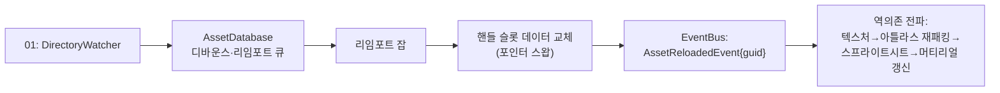
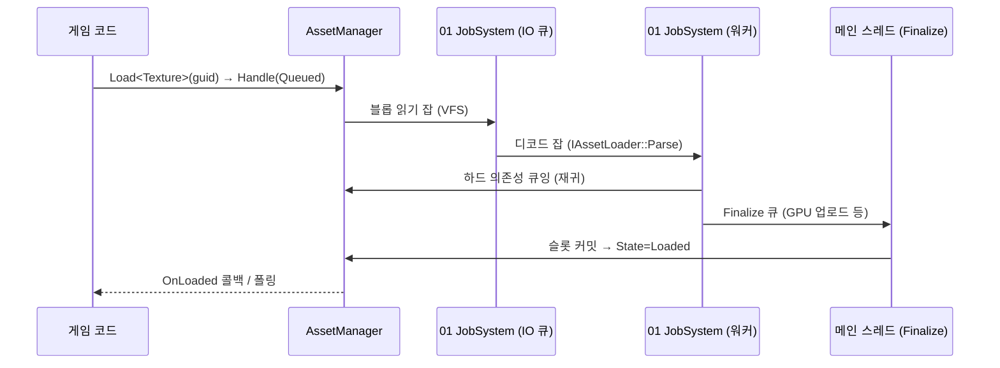

# 04. 에셋 파이프라인 · 리소스 (Asset Pipeline & Resources)

> 소유 주제: **에셋 DB(GUID·메타)** · **임포터** · **VFS** · **비동기 로딩·핸들** · **리플렉션·직렬화 프레임워크**
> 레이어: L2 (Core·RHI 위, Scene/ECS·Scripting 아래)
> 네임스페이스: `mye::asset`, 리플렉션은 `mye::refl`, 직렬화는 `mye::ser`

---

## 목표와 책임

1. **원본(소스) 에셋 → 임포트 캐시 → 런타임 포맷**의 3단계 파이프라인을 제공한다. 개발 중에는 소스에서 자동 임포트·핫 리로드하고, 배포 시에는 쿡(cook)된 런타임 포맷만 pak에 담는다.
2. **GUID 기반 에셋 데이터베이스**로 파일 경로가 아닌 안정적 식별자로 에셋을 참조한다. 파일 이동·이름 변경에도 참조가 깨지지 않아야 한다.
3. **`AssetHandle<T>` 핸들 시스템**으로 레퍼런스 카운팅, 비동기 로딩, 로딩 상태 조회, 에셋 간 의존성 로딩을 일원화한다.
4. **VFS(Virtual File System)**로 루즈 파일/`pak` 아카이브/모드 오버레이를 동일한 경로 체계(`assets://...`)로 접근하게 한다. 모드 지원은 VFS 마운트 우선순위로 구현한다.
5. **리플렉션·직렬화 프레임워크를 이 모듈이 소유한다.** 에디터 인스펙터(07), Lua 바인딩(05), 프리팹·씬(03), 세이브(06)가 전부 이 하나의 리플렉션 위에서 동작하는 공유 인프라다.
6. **확장성**: 플러그인 DLL이 커스텀 임포터·커스텀 에셋 타입·커스텀 파일시스템을 등록할 수 있는 구조를 1급 설계 목표로 둔다.

비책임(다른 모듈 소유):
- GPU 리소스 생성(텍스처·메시의 VRAM 업로드) — 02가 로더를 통해 수행
- 한글 폰트 래스터라이즈·글리프 아틀라스 — 06 소유 (04는 `FontAsset` = TTF 블롭 + 설정만 전달)
- 파일 워처·잡 시스템·이벤트 버스의 저수준 구현 — 01 소유 (04는 소비자)

---

## 설계 개요

### 3단계 파이프라인

```mermaid
flowchart LR
    subgraph Dev["개발(에디터) 모드"]
        SRC["소스 에셋<br/>assets/hero.ase + hero.ase.meta"]
        IMP["임포터<br/>AsepriteImporter"]
        CACHE["임포트 캐시<br/>cache/8f4c…/0.bin (런타임 포맷)"]
        SRC -->|파일 변경 감지| IMP --> CACHE
    end
    subgraph Ship["배포 모드"]
        PAK["base.pak<br/>카탈로그 + 쿡된 런타임 포맷"]
    end
    CACHE -->|쿡(빌드) 시 패킹| PAK
    CACHE --> LOAD["AssetManager::Load"]
    PAK --> LOAD
    LOAD --> HANDLE["AssetHandle&lt;T&gt;"]
```

- **소스**: 아티스트/개발자가 만지는 원본(.ase, .png, .gltf, .ttf, .wav, .myemap …). 항상 사이드카 `.meta`(JSON)와 짝을 이룬다. VCS에 커밋되는 것은 이 둘뿐이다.
- **임포트 캐시**: 임포터가 소스를 파싱해 만든 **엔진 네이티브 런타임 포맷**(바이너리). `cache/` 폴더는 언제든 삭제 가능하고 VCS에서 제외한다. 캐시 키 = `hash(소스 내용) ⊕ importerVersion ⊕ hash(importSettings) ⊕ engineFormatVersion` — 넷 중 하나라도 바뀌면 자동 리임포트.
- **런타임 포맷**: 로더가 파싱 없이 거의 memcpy 수준으로 읽을 수 있는 포맷. 개발 모드에서는 캐시에서, 배포 모드에서는 pak에서 동일 바이트를 읽는다. **로더는 개발/배포 모드를 구분하지 않는다** — VFS가 흡수한다.

배포 모드에는 임포터·에셋 DB·파일 워처가 아예 링크되지 않는다(에디터 전용 코드). 런타임은 pak 안의 **AssetCatalog**(GUID → 오프셋·크기·타입·의존성)만 사용한다.

### 에셋 데이터베이스와 .meta

- GUID는 128비트, 최초 임포트 시 생성되어 `.meta`에 기록. 파일을 옮기면 `.meta`가 따라가므로 참조 유지.
- 하나의 소스가 **여러 아티팩트(서브 에셋)**를 낳을 수 있다: `.ase` → SpriteSheet + AnimationClip×N, `.gltf` → Mesh + Material + Skeleton + Clip. 서브 에셋도 각자 GUID를 갖고 `.meta`의 `subAssets` 맵에 **이름 → GUID**로 고정 기록(리임포트해도 GUID 불변).

```json
// hero.ase.meta (스케치)
{
  "guid": "8f4c2d1e-....",
  "importer": "AsepriteImporter",
  "importerVersion": 2,
  "settings": { "atlas": "characters", "pivotSlice": "pivot", "hitboxLayer": "@hitbox" },
  "subAssets": { "sheet": "a1b2-...", "anim/idle": "c3d4-...", "anim/walk": "e5f6-..." }
}
```

- **에셋 DB**(에디터 전용)는 시작 시 전체 `assets/` 트리를 스캔해 (경로 ↔ GUID ↔ 캐시 상태 ↔ 의존성 그래프)를 **인메모리 인덱스**로 유지한다. 리임포트 필요 여부는 캐시 키 비교만으로 판정한다. 1인 개발 규모(수백~수천 파일)에서 콜드 스타트 스캔은 밀리초~수십 밀리초 수준이므로 영속 인덱스는 두지 않는다(재검토 트리거는 오픈 이슈 #1 참조).

### 핫 리로드와 리로드 전파



- 핸들은 에셋 데이터를 직접 가리키지 않고 **슬롯(간접 테이블)**을 가리킨다. 리로드는 슬롯의 데이터 포인터만 스왑하므로, 값을 매 프레임 `Get()`으로 읽는 소비자는 자동으로 새 데이터를 본다.
- 파생 상태(GPU 텍스처 뷰, 아틀라스 UV, Lua 캐시 등)를 가진 소비자는 01의 이벤트 버스로 `AssetReloadedEvent`를 구독해 갱신한다.
- 에셋 DB는 **의존성 그래프의 역방향 간선**을 유지한다. 예: `hero.png` 변경 → 이를 포함한 아틀라스 페이지 재패킹 → 해당 아틀라스를 참조하는 SpriteSheet들의 UV 갱신 → SpriteSheet를 쓰는 머티리얼/렌더러에 이벤트. 전파는 위상 정렬 순서로 배치 처리(한 프레임에 몰아서, 중복 제거).

### VFS와 마운트

| 마운트 포인트 | 개발 모드 | 배포 모드 | 비고 |
|---|---|---|---|
| `assets://` | `project/assets/` 루즈 파일 + `cache/` | `base.pak` (+ 패치 pak, 모드 pak) | 우선순위 높은 마운트가 가림 |
| `user://` | `%LOCALAPPDATA%/MyGame/` | 동일 | 세이브·설정(06 사용) |
| `cache://` | `project/cache/` | 없음 | 에디터 전용 |

- 같은 마운트 포인트에 여러 파일시스템을 **우선순위 정수**로 겹쳐 마운트한다. `mods/coolmod.pak`을 `assets://`에 base보다 높은 우선순위로 마운트하면 동일 카탈로그 GUID·경로가 오버라이드된다 — **모드 지원의 근간**.
- pak 포맷: 헤더 + AssetCatalog + (선택 LZ4 블록압축) 데이터 청크. 대용량 오디오·비디오는 무압축 저장으로 스트리밍 지원.

### 비동기 로딩 흐름



- `Load()`는 즉시 핸들을 반환하고 상태는 `Queued → Loading → Loaded | Failed`로 전이.
- **하드 의존성**(예: SpriteSheet→아틀라스 텍스처)은 함께 로드 완료돼야 `Loaded`. **소프트 참조**(예: 씬이 참조하는 다른 씬)는 별도 로드하며 폴백 사용.
- `Parse`(CPU 디코드)는 임의 워커 스레드, `Finalize`(GPU 리소스 생성 등)는 기본 메인 스레드 페이즈. DX11의 free-threaded 리소스 생성은 02가 로더 구현에서 선택적 최적화로 활용 가능.
- 언로드: refcount 0이 되면 즉시 파괴하지 않고 **지연 GC**(프레임 예산 + 유예 시간)로 스래싱 방지. `Pin()`으로 상주 고정 가능.

### 리플렉션 전략 — 비교와 선택

| 전략 | 장점 | 단점 |
|---|---|---|
| A. 순수 수동 등록 (builder API 직접 호출) | 완전한 제어, 도구 불필요 | 보일러플레이트, 필드 추가 시 등록 누락 위험 |
| B. 침투적 매크로 (클래스 내부 `MYE_FIELD(...)`) | 선언과 등록이 붙어 있어 누락 적음 | 매크로 지옥, 디버깅 어려움, 서드파티 타입 등록 불가 |
| C. 코드젠 (libclang 헤더 파서, UHT 방식) | 보일러플레이트 0, 최고 충실도 | 1인 개발에 인프라 비용 과다, 빌드 복잡, 플러그인 DLL 경계에서 도구 배포 문제 |

**선택: A 기반 — 비침투적 `Reflect<T>` 템플릿 특수화 + 얇은 보조 매크로. C로 가는 마이그레이션 경로를 열어둔다.**

근거:
1. 플러그인 DLL과 (장기적으로) Lua 정의 타입은 어차피 **런타임 등록 API**가 필요하다. 코드젠을 하더라도 그 출력은 이 API 호출이어야 하므로, API-우선 설계가 선행돼야 한다.
2. 비침투적이라 `glm`류 수학 타입·서드파티 타입도 등록 가능. 엔진 헤더가 리플렉션 헤더에 오염되지 않는다.
3. 1인 개발에서 코드젠 툴체인 유지비 > 필드 등록 타이핑 비용. 훗날 필드 수가 감당 불가해지면 **같은 builder 호출을 뱉는 코드젠 툴**을 추가하면 되고 소비자 코드는 불변.

### 직렬화 — 이중 포맷과 마이그레이션

- 하나의 리플렉션 워크를 두 개의 아카이브가 소비: **JsonArchive**(에디터·.meta·프리팹·씬·커스텀 에디터 포맷 — VCS diff 친화), **BinaryArchive**(임포트 캐시·pak·세이브 — 청크 기반, 타입 테이블 포함).
- 타입마다 `version` 정수. 구버전 데이터 로드 시 **선언적 마이그레이션 연산**(rename / 기본값 주입 / 타입 변환) + 커스텀 훅 함수를 버전 순서대로 적용.
- 미지(unknown) 필드: 바이너리는 스킵 가능하도록 필드마다 (nameHash, size) 프레이밍. JSON은 경고 후 드롭(에디터 라운드트립 보존은 오픈 이슈).
- `AssetRef`(= GUID + 타입) 필드는 직렬화기가 특별 취급 — 로드 시 자동으로 의존성 목록에 수집되어 의존성 로딩·쿡 시 pak 포함 판단에 쓰인다.
- **파일/메모리 대칭**: 두 아카이브 모두 파일 스트림뿐 아니라 **메모리 스트림(`MemoryStream`)을 대상으로 생성**할 수 있다. 07의 플레이 모드 인메모리 씬 스냅샷(복원용)과 Undo 값 blob이 이 메모리 경로의 공식 소비자다.

### 임포터 라인업

| 소스 | 임포터 | 산출 아티팩트 | 비고 |
|---|---|---|---|
| .png | TextureImporter | Texture (또는 아틀라스 엔트리) | 필터=Point 기본(픽셀아트), sRGB 여부, 아틀라스 그룹 지정 |
| .ase/.aseprite | AsepriteImporter | SpriteSheet + AnimationClip×N (+아틀라스 엔트리) | **Aseprite 공식 CLI 호출 기반**(`--sheet --data` JSON 익스포트 → 시트 PNG+JSON 파싱). 태그→클립(방향·반복 포함), 프레임 duration→클립 타이밍, 슬라이스→pivot·9-slice·히트박스, `@hitbox`/`@collision` 등 이름 규약 레이어→히트박스 데이터, 일반 레이어 분리 익스포트→페이퍼돌(03) 파츠. .ase 바이너리 **직접 파싱은 조건부 후속 항목**(CLI 경로의 한계 — 레이어 분리 익스포트 자동화·임포트 속도 — 가 실측으로 확인되면; `IAssetImporter` 경계 동일하므로 교체 비용은 임포터 내부 국한). **페이퍼돌 파츠 규약 검증**: 파츠용 .ase는 `.meta` settings에 바디 템플릿 `AssetRef`를 두고, 임포트 시 프레임 수·태그 집합·캔버스 크기·프레임 duration을 템플릿과 대조해 불일치를 임포트 에러/경고로 리포트(07 파츠 브라우저의 규약 위반 배지와 연동) |
| (그룹) | AtlasPacker | AtlasPage 텍스처 + UV 테이블 | 임포터가 아닌 **후처리 단계**. `.meta`의 atlas 그룹 단위로 MaxRects 패킹, 픽셀아트용 1px extrude 패딩. 멤버 하나 변경 시 해당 페이지만 재패킹 |
| .gltf/.glb | GltfImporter | Mesh, Material, Texture, Skeleton(선택), AnimationClip | MVP는 정적 메시+머티리얼, 스켈레탈은 확장 단계. 머티리얼은 02의 머티리얼 에셋으로 매핑 |
| .ttf/.otf | FontImporter | FontAsset (원본 블롭 + 폴백 체인·기본 크기 설정) | 래스터라이즈하지 않음 — 한글 글리프 동적 아틀라스는 06 소유 |
| .wav | AudioImporter | AudioClip (PCM 또는 ADPCM) | 짧은 SFX는 메모리 상주 |
| .ogg | AudioImporter | AudioClip (vorbis 유지, 스트리밍 플래그) | BGM은 VFS 스트림으로 재생(06) |
| .hlsl | (02가 등록) ShaderImporter | ShaderAsset (바이트코드+리플렉션) | 04는 프레임워크만 제공 |
| .lua | (05가 등록) ScriptImporter | ScriptAsset | 핫 리로드 대상 |
| .myemap·.myeanim·.myeprefab·.myefx | ReflectedAssetImporter (공용) | 각 타입의 바이너리 쿡 | 에디터 커스텀 포맷은 전부 "리플렉션 JSON → BinaryArchive 쿡"이라는 단일 경로. 새 에디터 포맷 추가 = 타입 등록 한 번 |

---

## 핵심 타입·API 스케치

### 식별자·핸들

```cpp
namespace mye::asset {

struct AssetGuid {                       // 128-bit, .meta에서 생성·영속
    std::uint64_t hi = 0, lo = 0;
    static AssetGuid Generate();
    bool IsValid() const;
    auto operator<=>(const AssetGuid&) const = default;
};

using AssetTypeId = refl::TypeId;        // 에셋 시스템 한정 별칭 — 정본은 refl::TypeId(FNV-1a 64bit 이름 해시, 등록 시 충돌 검사)

struct AssetRef {                        // 직렬화되는 에셋 참조(필드 타입)
    AssetGuid   guid;
    AssetTypeId type = 0;
};

enum class AssetState : std::uint8_t { Unloaded, Queued, Loading, Loaded, Failed };

template <typename T>
class AssetHandle {                      // 강한 참조. 복사=refcount+1
public:
    AssetHandle() = default;             // null 핸들
    T*         Get() const;              // Loaded가 아니면 nullptr
    T*         GetOrFallback() const;    // 미완이면 타입별 폴백(체커 텍스처 등)
    AssetState State() const;
    AssetGuid  Guid() const;
    bool       IsLoaded() const;
    void       Pin();                    // GC 면제(상주)
    void       Unpin();
};

template <typename T>
class WeakAssetHandle;                   // refcount 미보유, Lock() → AssetHandle<T>

} // namespace mye::asset
```

### AssetManager (런타임·에디터 공용)

```cpp
namespace mye::asset {

enum class LoadPriority : std::uint8_t { Low, Normal, High, Blocking };

class AssetManager {
public:
    template <typename T> AssetHandle<T> Load(AssetGuid guid,
                                              LoadPriority pri = LoadPriority::Normal);
    template <typename T> AssetHandle<T> Load(std::string_view vpath);   // "assets://..."
    template <typename T> AssetHandle<T> LoadSync(AssetGuid guid);       // 부트스트랩·에디터용

    void RegisterLoader(AssetTypeId type, std::unique_ptr<IAssetLoader> loader);
    void RegisterFallback(AssetTypeId type, AssetGuid fallbackGuid);

    void Update(FrameBudget budget);     // Finalize 큐 처리 + 지연 GC (메인 루프에서 호출)
    void CollectGarbage(bool force = false);

    // 리로드 알림은 01 EventBus로 발행: struct AssetReloadedEvent { AssetGuid guid; AssetTypeId type; };
};

class IAssetLoader {                     // 런타임 포맷(캐시/pak 블롭) → 메모리 객체
public:
    virtual ~IAssetLoader() = default;
    virtual AssetTypeId Type() const = 0;
    // 워커 스레드: 블롭 파싱, 하드 의존성 선언
    virtual Result<ParsedAsset> Parse(LoadContext& ctx, BlobView runtimeData) = 0;
    // 메인 스레드(또는 free-threaded 옵트인): GPU 업로드 등 마무리
    virtual Result<void> Finalize(LoadContext& ctx, ParsedAsset& parsed) = 0;
    virtual void Unload(void* assetObject) = 0;
};

struct LoadContext {
    AssetGuid guid;
    void AddHardDependency(AssetRef ref);     // 이것까지 Loaded여야 본 에셋 Loaded
    AssetHandle<void> AddSoftReference(AssetRef ref);  // 독립 로드, 폴백 허용
};

} // namespace mye::asset
```

### VFS

```cpp
namespace mye::vfs {

class IFileSystem {                      // 확장 포인트: 플러그인이 구현 가능
public:
    virtual ~IFileSystem() = default;
    virtual bool Exists(std::string_view path) const = 0;
    virtual Result<Blob> ReadAll(std::string_view path) = 0;
    virtual Result<std::unique_ptr<IStream>> OpenStream(std::string_view path) = 0; // 오디오 등
    virtual void Enumerate(std::string_view dir, const EnumerateFn& fn) const = 0;
};

class VirtualFileSystem {
public:
    void Mount(std::string_view mountPoint, std::unique_ptr<IFileSystem> fs, int priority);
    void Unmount(std::string_view mountPoint, IFileSystem* fs);
    Result<Blob> ReadAll(std::string_view vpath);      // "assets://x/y.bin"
    // 우선순위 내림차순으로 첫 매치. 모드 pak은 base보다 높은 priority로 마운트
};

class LooseFileSystem final : public IFileSystem { /* OS 디렉터리 매핑 */ };
class PakFileSystem   final : public IFileSystem { /* pak 카탈로그 + 블록 읽기 */ };

} // namespace mye::vfs
```

### 임포터 프레임워크 (에디터 전용)

```cpp
namespace mye::asset {

class IAssetImporter {                   // 확장 포인트: 플러그인 등록 가능
public:
    virtual ~IAssetImporter() = default;
    virtual std::span<const std::string_view> SourceExtensions() const = 0; // {".ase"}
    virtual std::uint32_t Version() const = 0;          // 올리면 전체 리임포트
    virtual const refl::TypeInfo* SettingsType() const = 0; // .meta settings의 타입(07이 인스펙터 자동 생성)
    virtual Result<void> Import(ImportContext& ctx) = 0;
};

struct ImportContext {
    AssetGuid          primaryGuid;
    std::string        sourcePath;                       // 절대 경로
    const void*        settings;                         // SettingsType 인스턴스
    // 산출물 등록 — name으로 서브 에셋 GUID가 .meta에 안정 매핑됨
    AssetGuid AddArtifact(AssetTypeId type, std::string_view name, Blob runtimeData);
    void      AddSourceDependency(std::string_view path); // 이 파일 변경 시에도 리임포트
    void      AddAtlasEntry(std::string_view group, ImageView image, std::string_view name);
};

class AssetDatabase {                    // 에디터 전용
public:
    void RegisterImporter(std::unique_ptr<IAssetImporter> importer);
    void UnregisterImporter(const IAssetImporter* importer);   // 플러그인 언로드 시
    AssetGuid   GuidFromPath(std::string_view assetPath) const;
    std::string PathFromGuid(AssetGuid guid) const;
    void ImportDirty();                  // 워처 큐 소진(에디터 틱에서 호출)
    void ReimportAll(AssetTypeId type = 0);
    // 의존성 그래프 질의(07 에셋 브라우저·리팩터링 도구용)
    std::vector<AssetGuid> FindReferencers(AssetGuid guid) const;
};

} // namespace mye::asset
```

### 리플렉션 (`mye::refl`)

```cpp
namespace mye::refl {

using TypeId = std::uint64_t;   // 타입 이름의 FNV-1a 64bit 해시 — 리플렉션 타입 식별자의 **정본(canonical)**.
                                // 03의 ComponentTypeId·07의 TypeId는 이 타입의 인용/별칭이고,
                                // asset::AssetTypeId는 에셋 시스템 한정 별칭이다(01 EventTypeId만 01 소유 별개).

class TypeInfo;   class FieldInfo;   class EnumInfo;   class MethodInfo;

// UI 힌트 어트리뷰트(07 인스펙터가 소비하는 공식 집합):
//   Range, Tooltip, Category, HideInInspector, ReadOnly, Units, Multiline
// 그 외: LuaHidden(05) 등. 플러그인이 커스텀 Attribute 추가 가능.
class FieldInfo {
public:
    std::string_view Name() const;
    const TypeInfo&  Type() const;
    std::span<const Attribute> Attributes() const;      // Range, Tooltip, Category, HideInInspector, ReadOnly, Units, Multiline, LuaHidden ...
    void* GetPtr(void* instance) const;                 // 인스펙터·직렬화·Lua가 공용 사용
};

class TypeInfo {
public:
    std::string_view Name() const;                      // "mye::SpriteRenderer"
    TypeId           Id() const;                        // 이름 해시(모듈 경계 안전)
    std::uint32_t    Version() const;
    std::span<const FieldInfo> Fields() const;
    void* Construct(void* mem) const;                   // 기본 생성(프리팹·Lua 인스턴스화)
    // 마이그레이션 파이프라인, 커스텀 Serialize 오버라이드 훅 보유
};

class TypeRegistry {                                    // 프로세스 전역, DLL-safe
public:
    static TypeRegistry& Get();
    const TypeInfo* Find(TypeId id) const;
    const TypeInfo* Find(std::string_view name) const;
    void Unregister(std::span<const TypeId> ids);       // 플러그인 언로드 시 일괄 해제
};

// ---- PropertyPath: 경로 단위 read/write ----
// 03 프리팹 오버라이드('프로퍼티 경로 표현과 값 직렬화')와
// 07 PropertyEditCommand{ PropertyPath, ValueBlob }·Undo가 인용하는 공급 계약.
// 문법: `.`으로 중첩 필드(struct 포함), `[i]`로 배열/컨테이너 인덱스.
//   예: "transform.position.x", "slots[2].part"
struct PropertyPath {
    static Result<PropertyPath> Parse(std::string_view text);
    std::string ToString() const;                       // 파싱 결과의 정규형(라운드트립 보장)
    auto operator<=>(const PropertyPath&) const = default;
};

struct ResolvedProperty {                               // 경로가 가리키는 리프 필드
    const TypeInfo*  type;                              // 리프 값의 타입
    const FieldInfo* field;                             // 리프 필드 메타(어트리뷰트 조회용)
    void*            ptr;                               // 인스턴스 내 리프 값 포인터
};
Result<ResolvedProperty> ResolvePath(const TypeInfo& root, void* instance, const PropertyPath& path);
// 경로 단위 값 직렬화 — out/in은 파일·메모리 스트림 모두 가능(07 Undo 값 blob이 메모리 경로 소비)
Result<void> ReadValue (const TypeInfo& root, const void* instance, const PropertyPath& path, ser::IArchive& out);
Result<void> WriteValue(const TypeInfo& root, void* instance,       const PropertyPath& path, ser::IArchive& in);

// ---- 등록: 비침투적 템플릿 특수화 + 보조 매크로 ----
template <typename T> class TypeBuilder {
public:
    TypeBuilder& Version(std::uint32_t v);
    template <typename F> TypeBuilder& Field(std::string_view name, F T::* member);
    TypeBuilder& Attr(Attribute a);                     // 직전 필드에 부착
    TypeBuilder& RenamedFrom(std::uint32_t sinceVersion, std::string_view oldName);
    TypeBuilder& Migrate(std::uint32_t fromVersion, MigrationFn fn);  // 커스텀 훅
    TypeBuilder& Base<U>();                             // 상속 평탄화
};

template <typename T> void Reflect(TypeBuilder<T>& b);  // 각 타입이 특수화(선언만, 본문은 등록 코드)

#define MYE_REFLECT(Type) /* Reflect<Type> 특수화 전방선언 + 자동 등록 스텁 생성 */

} // namespace mye::refl
```

### 직렬화 (`mye::ser`)

```cpp
namespace mye::ser {

class IArchive {                          // 읽기/쓰기 대칭 인터페이스
public:
    virtual ~IArchive() = default;
    virtual bool IsReading() const = 0;
    // 리플렉션 워커가 호출하는 프리미티브 — 사용자 코드는 보통 직접 안 씀
    virtual void Key(std::string_view name) = 0;
    virtual void Value(bool&) = 0;  virtual void Value(std::int64_t&) = 0;
    virtual void Value(double&) = 0; virtual void Value(std::string&) = 0;
    virtual void Value(asset::AssetRef&) = 0;           // 특별 취급: 의존성 수집
    virtual void BeginObject(std::string_view typeName, std::uint32_t& version) = 0;
    virtual void EndObject() = 0;
    virtual void BeginArray(std::size_t& count) = 0;  virtual void EndArray() = 0;
};

class MemoryStream;                       // 성장 가능한 인메모리 버퍼(읽기/쓰기)

// 두 아카이브 모두 파일 스트림과 MemoryStream을 대칭으로 지원한다.
// 메모리 경로의 공식 소비자: 07 플레이 모드 인메모리 씬 스냅샷, 07 Undo 값 blob(PropertyPath ReadValue/WriteValue와 조합)
class JsonArchive   final : public IArchive { /* 에디터·.meta·프리팹·씬. 파일 또는 MemoryStream 대상 */ };
class BinaryArchive final : public IArchive { /* 캐시·pak·세이브·인메모리 스냅샷. (nameHash,size) 프레이밍. 파일 또는 MemoryStream 대상 */ };

// 리플렉션 기반 제네릭 진입점 — 03(프리팹), 06(세이브), 임포터가 공용
template <typename T> Result<void> Serialize(IArchive& ar, T& obj);
Result<void> SerializeDynamic(IArchive& ar, const refl::TypeInfo& type, void* obj);

} // namespace mye::ser
```

---

## 다른 모듈과의 경계

| 모듈 | 04가 제공 | 04가 소비 | 경계 규칙 |
|---|---|---|---|
| **01 Core** | — | 잡 시스템(IO 큐·워커), EventBus(`AssetReloadedEvent` 발행), DirectoryWatcher, 로그, 모듈 라이프사이클 | 파일 워처의 **저수준 API는 01 소유**, 디바운스·리임포트 정책은 04 소유 |
| **02 Renderer** | 로더 프레임워크, 아틀라스 패커, 런타임 블롭 | — | **04는 02를 모른다.** Texture/Mesh/Shader의 GPU 업로드가 필요한 `IAssetLoader`·`ShaderImporter`는 02가 04의 API로 등록(같은 L2 사이 역주입). 좌표계·PPU 규약은 02 문서 인용만 |
| **03 Scene/ECS** | 리플렉션·직렬화(프리팹·씬 저장의 기반), **`PropertyPath` 경로 표현·값 직렬화**(프리팹 오버라이드가 인용), `AssetHandle`(타일맵·클립 참조) | — | 타일맵·AnimationClip·Prefab의 **데이터 스키마는 03 소유**, 04는 그 타입을 `ReflectedAssetImporter`로 쿡·로드만. 03의 `ComponentTypeId`는 04 `refl::TypeId`의 별칭/인용 |
| **05 Scripting/Plugin** | 리플렉션(=Lua 바인딩 자동 생성의 원천), 임포터·타입·VFS 등록 API | 플러그인 로드/언로드 시점 훅 | Lua에서 `AssetHandle`은 userdata로 노출(05가 바인딩). 플러그인 언로드 시 04의 `Unregister*` 일괄 호출은 05의 책임 |
| **06 Runtime Systems** | `FontAsset`(TTF 블롭), `AudioClip`·오디오 스트림, `user://` VFS, 세이브용 직렬화 | — | 한글 래스터라이즈·동적 글리프 아틀라스는 06. 세이브 파일 포맷 정책은 06, 직렬화 엔진은 04 |
| **07 Editor** | AssetDatabase 질의(브라우저·의존성 뷰), 리플렉션(인스펙터 자동 생성)·UI 힌트 어트리뷰트(Range/Tooltip/Category/HideInInspector/ReadOnly/Units/Multiline), **`PropertyPath` 경로 단위 read/write**(`PropertyEditCommand`용), **메모리 스트림 직렬화**(플레이 모드 스냅샷·Undo 값 blob), 임포터 `SettingsType`(임포트 설정 UI 자동 생성) | 에디터 틱에서 `ImportDirty()` 호출 | Undo/Redo는 07 소유이되 리플렉션 필드 단위 diff를 04가 가능하게 함. 07의 `TypeId`는 04 `refl::TypeId`의 인용 |

---

## 확장 포인트

이 엔진의 최상위 목표가 확장성이므로, 04의 모든 레지스트리는 **등록 대칭 해제(register/unregister)**를 지원해 플러그인 DLL의 로드/언로드에 안전해야 한다.

1. **커스텀 임포터 (플러그인)**
   - 플러그인이 `IAssetImporter` 구현을 `AssetDatabase::RegisterImporter`로 등록. 예: `.ldtk` 맵 임포터, `.psd` 임포터.
   - `Version()`이 캐시 키에 들어가므로 플러그인 업데이트 시 자동 리임포트. `SettingsType()` 리플렉션으로 07이 임포트 설정 UI를 공짜로 얻는다.
   - 확장자 충돌 시 우선순위 정책: 나중 등록(플러그인)이 내장을 오버라이드하되 로그 경고.

2. **커스텀 에셋 타입 (플러그인·게임 코드)**
   - 새 타입 = ① `Reflect<T>` 등록 → ② `IAssetLoader` 등록(순수 CPU 타입이면 기본 리플렉션 로더로 충분) → ③ (에디터) 임포터 또는 `ReflectedAssetImporter` 재사용. 세 단계면 인스펙터·직렬화·핫 리로드·pak 쿡이 전부 자동으로 따라온다.
   - 예: 대화 그래프 에셋, 퀘스트 데이터, 사운드뱅크.

3. **커스텀 파일시스템 (VFS 마운트)**
   - `IFileSystem` 구현을 임의 우선순위로 마운트. 예: 암호화 pak, 네트워크 개발 서버, 메모리 오버레이. **모드 로더도 이 API의 소비자일 뿐** — 특별 취급 없음.

4. **임포트 후처리 훅**
   - `IAssetPostProcessor`(온-임포트 콜백): 이름 규약 검증, 자동 임포트 설정 부여(예: `ui/` 폴더 텍스처는 자동 sRGB), 통계 수집. 아틀라스 패커 자체가 이 훅의 내장 구현.

5. **Lua에서의 소비 (05가 바인딩)**
   - `mye.assets.load("assets://sprites/hero.ase#anim/idle")` → 핸들 userdata, `handle.state`, `handle:on_loaded(fn)`.
   - 리플렉션 등록된 모든 타입의 필드는 Lua에서 자동 접근 가능(`LuaHidden` 어트리뷰트로 제외). Lua가 **새 에셋 타입을 정의**하는 것은 확장 단계 과제(오픈 이슈 참조).

6. **쿡(빌드) 파이프라인 훅**
   - pak 빌드 시 플러그인이 참여: 포함 필터, 플랫폼별 변환(추후 DX12/모바일 텍스처 압축), 카탈로그 후처리.

---

## 단계별 구현 범위 (MVP → 확장)

**M0 — 파일·식별자 최소 기반**
- VFS: `LooseFileSystem` + 마운트/우선순위, `assets://`·`user://`
- `AssetGuid`·`.meta` 생성·`AssetHandle<T>`·`AssetManager`(동기 로드만)
- TextureImporter(PNG)
- 리플렉션·직렬화는 **이 단계에 포함하지 않는다** — 전역 M0~M2(부트스트랩·스프라이트 이동·하이브리드 씬 검증)까지는 리플렉션 소비자가 없다(설정 파서는 01 자체 보유, 셰이더는 02가 FXC 런타임 컴파일로 임시 대응). 가장 추상적인 프레임워크를 소비자 등장 전에 만드는 것을 의도적으로 피한다.

**M1 — 파이프라인 성립**
- AssetDatabase(시작 시 전체 스캔 + 인메모리 인덱스 — 캐시 키 비교로 리임포트 필요 여부만 판정, 영속화 없음), 임포트 캐시·캐시 키
- 비동기 로딩(01 잡 시스템 연동, Parse/Finalize 분리), 하드 의존성 로딩, 폴백 에셋
- 파일 워처 → 리임포트 → 핸들 스왑 → `AssetReloadedEvent` (텍스처 핫 리로드 데모)

**M2 — 2D 콘텐츠 파이프라인 (테일즈위버류 핵심)**
- AsepriteImporter(**Aseprite CLI 호출 기반**: 시트 PNG+JSON 파싱, 태그→클립·슬라이스→pivot 매핑), AtlasPacker(그룹 패킹·부분 재패킹)
- 페이퍼돌 파츠 규약 검증(바디 템플릿 `AssetRef` 대조: 프레임 수·태그 집합·캔버스·duration → 임포트 에러/경고)
- AudioImporter(WAV/OGG), FontImporter(블롭 전달)
- 리로드 전파(역의존 그래프) 완성
- (조건부 후속) .ase 바이너리 직접 파싱 — CLI 경로의 한계(레이어 분리 익스포트 자동화, 임포트 속도)가 실측으로 확인되면 착수

**M3 — 리플렉션·직렬화 (프리팹 v1·에디터 인스펙터 착수 직전 = 전역 로드맵 M3~M4)**
- `mye::refl` 등록 API + `TypeRegistry`(정본 `refl::TypeId`), `JsonArchive`/`BinaryArchive`
- **`PropertyPath` 타입과 경로 단위 get/set API**(`ResolvePath`/`ReadValue`/`WriteValue`) — 03 프리팹 오버라이드·07 `PropertyEditCommand`의 공급 계약
- **메모리 스트림 지원**(`IArchive`의 파일/메모리 대칭, `MemoryStream`) — 07 플레이 모드 인메모리 스냅샷·Undo 값 blob
- **UI 힌트 어트리뷰트 집합**: Range/Tooltip/Category/HideInInspector/ReadOnly/Units/Multiline (+LuaHidden)
- `ReflectedAssetImporter`로 커스텀 에디터 포맷(.myemap 등) 공용 경로 확립
- 타입 `version` 정수와 기본값 주입까지만. **rename·커스텀 마이그레이션 훅 고도화는 실제 스키마 변경이 처음 발생한 시점으로 명시적으로 미룬다.**

**M4 — 3D·배포·확장성**
- GltfImporter(정적 메시 → 스켈레탈·클립), pak 포맷·쿡 커맨드·AssetCatalog·배포 모드 분기
- 플러그인 임포터/타입/VFS 등록의 언로드 안전성 검증(05와 합동)
- 지연 GC 예산화, 스트리밍 오디오 소스, 모드 오버레이 마운트 데모

**M5 — 품질·스케일**
- 커스텀 마이그레이션 훅 고도화(첫 실제 스키마 변경 발생 이후), 에셋 리팩터링 도구(참조 추적 이동·삭제 안전성, 07 연동)
- 쿡 훅·플랫폼 변형, (선택) 코드젠 툴로 `Reflect<T>` 자동 생성

---

## 오픈 이슈

1. **에셋 DB 인덱스 저장소** *(닫힘 — 조건부 재개)*: 시작 시 전체 스캔 + 인메모리 인덱스로 확정. **에셋 5,000개+ 또는 콜드 스타트 2초+가 실측되면** SQLite(첫 외부 의존성) vs 자체 단일 바이너리 인덱스 논의를 재개한다.
2. **텍스트 에셋의 미지 필드 보존**: 구버전 에디터로 연 프리팹을 저장할 때 미지 필드를 드롭할지, JSON 라운드트립으로 보존할지(협업·모드 호환성 vs 구현 복잡도).
3. **Lua 정의 커스텀 에셋 타입**: Lua 테이블 스키마를 리플렉션에 동적 등록하는 수준까지 지원할지, 아니면 "Lua는 소비만, 타입 정의는 C++/플러그인"으로 선을 그을지.
4. **서브 에셋 주소 표기**: `guid#anim/idle` 경로 문법을 공식 API로 승격할지(가독성·Lua 편의) vs GUID 직접 참조만 허용할지(리네임 안전성).
5. **아틀라스 그룹의 소유 위치**: `.meta` 개별 지정(현안) vs 별도 아틀라스 정의 에셋(.myeatlas)로 중앙 관리 — 페이지 예산·플랫폼별 크기 제한을 고려하면 후자가 커질 수 있음.
6. **pak 암호화·서명**: 모드 지원과 상충(모드는 열린 포맷이 유리). 배포 정책 결정 필요.
7. **glTF 머티리얼 → 02 머티리얼 매핑 규약**: PBR 파라미터를 어느 수준까지 보존할지 — HD-2D식 라이팅 범위가 02에서 확정된 후 정렬 필요.
8. **코드젠 도입 시점**: 리플렉션 등록 타이핑이 병목이 되는 시점(대략 타입 100개+)에 libclang 툴을 붙일지, 그 전까지 수동 유지할지.
