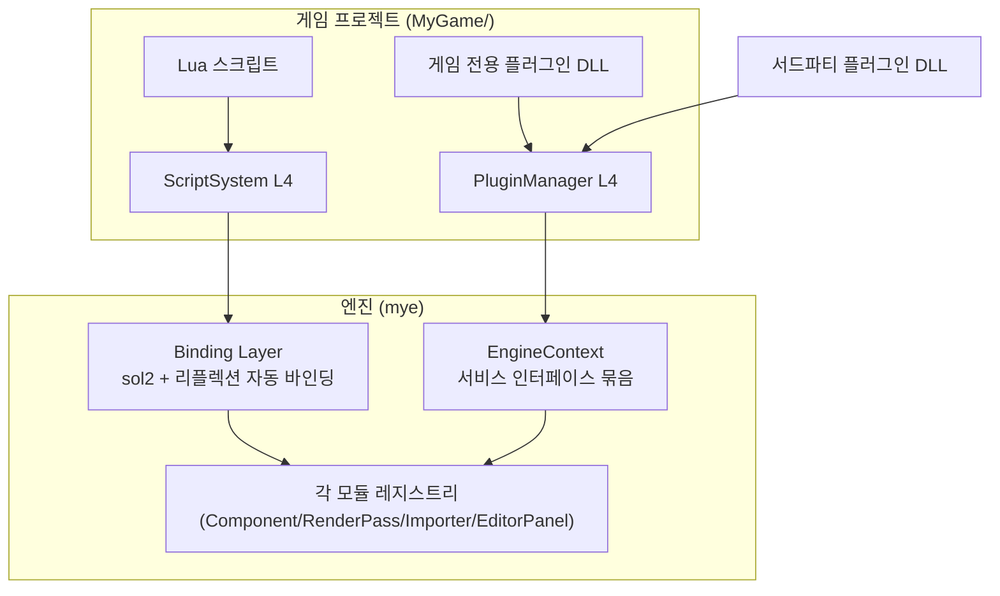
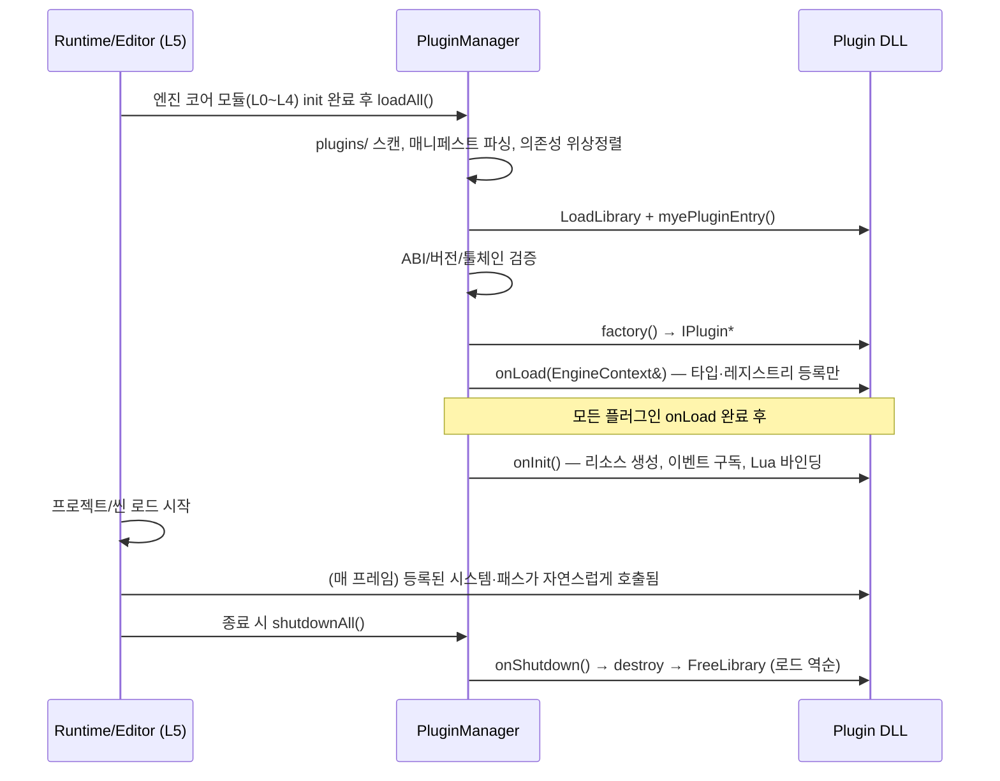
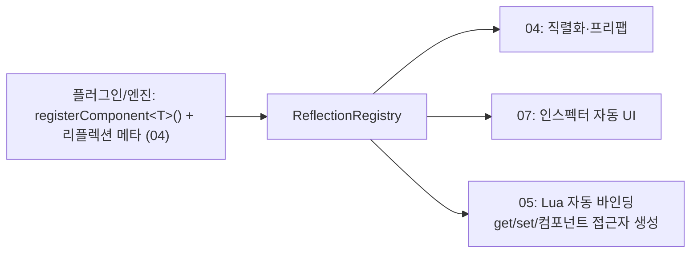

# 05. 확장 시스템 (Lua Scripting & Native Plugins)

> 소유 범위: 네이티브 C++ 플러그인(DLL) 시스템, Lua(sol2) 스크립팅 런타임, 엔진 API SDK, 바인딩 계층.
> "확장성 극대화"라는 엔진 최상위 목표를 실제로 구현하는 모듈이다.

---

## 목표와 책임

### 목표
- **두 갈래 확장 모델의 확립.** 게임 로직은 Lua로, 엔진 수준 확장(새 컴포넌트 타입, 렌더 패스, 임포터, 에디터 패널)은 네이티브 C++ 플러그인 DLL로 작성한다. 두 경로 모두 엔진 본체를 재빌드하지 않는다.
- **엔진 소스 없이 개발 가능한 SDK.** 플러그인 개발자는 `mye-sdk` 헤더와 매니페스트 규약만으로 플러그인을 빌드할 수 있어야 한다.
- **안전한 격리.** 스크립트 에러는 해당 스크립트만 멈추고 엔진은 계속 돈다. 플러그인 로드 실패는 명확한 진단 메시지와 함께 해당 플러그인만 배제한다.
- **반복 속도.** Lua 스크립트는 저장 즉시 핫 리로드된다. 네이티브 플러그인은 개발 모드 한정 리로드를 장기 목표로 둔다.

### 책임
| 책임 | 내용 |
|---|---|
| PluginManager | DLL 탐색·로드·버전 검증·라이프사이클 관리·언로드 |
| Engine SDK | 플러그인이 include하는 공개 헤더 집합과 ABI/버저닝 정책 |
| ScriptSystem | 게임 Lua 스테이트(sol2) 소유, ScriptComponent 실행, 코루틴 스케줄링, 핫 리로드. 에디터 스테이트(07 소유)의 생성·바인딩 재생 API 제공 |
| Binding 계층 | 엔진 API의 Lua 노출(수동 바인딩 + 리플렉션 기반 자동 바인딩) |
| 에러 격리·리포팅 | 스크립트/플러그인 오류를 이벤트 버스(01)로 에디터 콘솔(07)에 전달 |

### 비책임 (다른 모듈 소유)
- 리플렉션·직렬화 프레임워크 자체 → **04 소유**. 본 모듈은 소비자다.
- 이벤트 버스·모듈 라이프사이클 정의 → **01 소유**. 본 모듈은 플러그인이 그것을 확장하는 방법만 정의한다.
- 각 확장 표면의 등록 레지스트리 구현(ComponentRegistry, RenderPassRegistry 등) → 각 소유 모듈(02/03/04/07). 본 모듈은 그 레지스트리에 도달하는 관문(`EngineContext`)을 정의한다.

---

## 설계 개요

### 전체 그림



핵심 아이디어 세 가지:

1. **EngineContext = 단일 관문.** 플러그인은 엔진 전역에 직접 접근하지 않는다. 로드 시 전달받는 `EngineContext&` 하나를 통해서만 엔진 서비스(레지스트리, 이벤트 버스, 로그, Lua 상태)에 접근한다. 이것이 SDK 표면을 좁게 유지하고, 훗날 DX12/Vulkan 백엔드 추가나 멀티스레드화 시 플러그인 호환을 지키는 방어선이다.
2. **Lua 스테이트는 2개 — 게임 스테이트 1 + 에디터 스테이트 1(에디터 빌드 한정).** 게임 로직(ScriptComponent·코루틴)은 ScriptSystem이 소유한 게임 `sol::state`에서 실행되고, 에디터(07)는 이와 분리된 에디터 전용 `sol::state`를 가진다(아래 절 참조). 플러그인이 바인딩을 추가할 때도 자기 스테이트를 만들지 않고 엔진이 소유한 스테이트에 등록한다. Lua는 공유 DLL(`lua54.dll`)로 빌드하여 엔진·플러그인이 같은 런타임과 할당자를 쓴다(서로 다른 CRT 힙에서 lua_newstate가 만든 객체를 free하는 사고 방지).
3. **바인딩은 2계층.** 핫패스 타입(Vec2, Entity 핸들 등)은 수동 sol2 바인딩으로 최적화하고, 일반 컴포넌트 프로퍼티는 04의 리플렉션 정보로 자동 바인딩한다. 플러그인이 리플렉션에 컴포넌트를 등록하면 Lua 노출이 공짜로 따라온다.

### Lua 스테이트 소유 모델 — 게임 1 + 에디터 1 (07과 합의)

| 구분 | 게임 스테이트 | 에디터 스테이트 |
|---|---|---|
| 소유 | ScriptSystem | 에디터(07) — ScriptSystem이 생성·바인딩 재생 API 제공 |
| 스크립트 출처 | `scripts/` (ScriptComponent, `main.lua`) | `editor/` 폴더 전용 |
| 노출 바인딩 | `mye.*` | `mye.*` + `editor.*`(07 정의) |
| 존재 빌드 | 모든 빌드 | 에디터 빌드 한정 — 게임 빌드에 미포함 |
| 수명 | 런타임(게임 exe): 프로세스 수명. 에디터: **Play 진입 시 생성, Stop 시 파기** | 에디터 프로세스 수명 |

- **플레이 모드 격리(07):** 편집 World에는 Lua 인스턴스가 존재하지 않는다 — ScriptComponent는 편집 중에는 데이터(`script` 핸들, `properties`)만 가진다. Play 진입 시 07이 편집 World를 복제해 Play World를 만들면, 그 시점에 새 게임 스테이트를 생성하고 **Play World의 ScriptComponent만** 그 안에 실체화한다. Stop 시 게임 스테이트를 통째로 파기하므로 두 World 간 스크립트 상태 격리와 상태 누수 방지가 구조적으로 보장된다.
- 07의 REPL(콘솔)은 실행 컨텍스트를 선택한다: 평시에는 에디터 스테이트, Play 중에는 게임 스테이트도 선택 가능.
- `ILuaBinder`에 등록된 바인딩 함수는 각 스테이트가 (재)생성될 때마다 해당 스테이트에 다시 적용된다 — 플러그인이 sol 객체를 저장해두면 안 되는 이유다.

### ABI 경계: 순수 C ABI vs C++ 인터페이스 — 논의와 결정

| 기준 | 순수 C ABI | C++ 순수가상 인터페이스 | 하이브리드(채택) |
|---|---|---|---|
| 컴파일러/STL 버전 자유도 | 최고 | 낮음(같은 툴체인 강제) | 낮음(같은 툴체인 강제) |
| 확장 표면 표현력 | 낮음 — 템플릿·sol2·ImGui 노출 불가, 모든 걸 함수포인터 테이블로 감싸야 함 | 높음 | 높음 |
| 1인 개발 생산성 | 낮음(래퍼 유지비 큼) | 높음 | 높음 |
| 로드 시 안전성 검증 | 쉬움 | 어려움 | C 진입점에서 버전·툴체인 태그 검사로 보완 |

**결정: "C 진입점 + C++ 인터페이스 본체" 하이브리드.**
- DLL이 export하는 심볼은 `extern "C"` 함수 **단 하나**(`myePluginEntry`)다. 이 함수는 POD 구조체 `PluginDesc`를 반환하며, 여기에 ABI 버전·툴체인 태그·팩토리 함수 포인터가 담긴다.
- 로더는 `PluginDesc`의 `abiVersion`·`toolchainTag`(예: `"msvc-v143-md-cpp20"`)가 엔진과 일치할 때만 팩토리를 호출한다. 불일치 시 명확한 에러 로그 후 해당 DLL을 건너뛴다.
- 팩토리가 반환하는 `IPlugin*`부터는 일반 C++ 순수가상 인터페이스다. 이후의 모든 확장 등록은 C++로 이뤄진다.

**근거:** 이 엔진의 확장 표면(ECS 컴포넌트 등록, sol2 바인딩, ImGui 에디터 패널)은 본질적으로 C++ 템플릿 세계다. 순수 C ABI로 전부 감싸면 래퍼 코드가 엔진 본체보다 커지고, 1인 개발에서 그 유지비는 치명적이다. 대신 "플러그인은 엔진과 동일 툴체인(MSVC, 동일 CRT 링크 방식 `/MD`, C++20)으로 빌드한다"를 **명시적 계약**으로 삼고, C 진입점의 검증으로 계약 위반을 로드 시점에 잡는다. 서드파티 배포 생태계가 커져 툴체인 자유도가 필요해지면, 그때 C ABI 셸을 추가하는 것은 가능하지만 역방향은 불가능하다 — 지금은 생산성을 택한다.

### 엔진 API 버저닝 정책
- `MYE_API_VERSION_MAJOR` / `MINOR` 두 정수. SDK 헤더에 상수로 박히고 `PluginDesc`에 기록된다.
- **MAJOR 불일치 → 로드 거부.** 파괴적 변경(인터페이스 시그니처 변경·삭제) 시에만 올린다.
- **플러그인 MINOR > 엔진 MINOR → 로드 거부.** (플러그인이 엔진에 없는 API를 요구) MINOR는 추가만 있는 변경에서 올린다.
- 파괴적 변경을 피하는 규칙: 인터페이스에는 메서드를 **끝에 추가만** 하지 말고(그것도 vtable 파괴다), 새 기능은 `EngineContext::getService(ServiceId)`로 얻는 **새 인터페이스**로 추가한다. 기존 인터페이스는 MAJOR 범프 전까지 동결.

### 플러그인 라이프사이클과 01 모듈 라이프사이클의 정렬



- **onLoad(등록)와 onInit(초기화)을 분리**하는 이유: 플러그인 A가 등록한 컴포넌트 타입을 플러그인 B의 onInit에서 참조할 수 있어야 하고, 씬 로드는 모든 타입 등록이 끝난 뒤에만 안전하기 때문이다. 04의 에셋 DB도 "모든 임포터 등록 완료" 시점을 알아야 한다.
- 로드 순서는 매니페스트 `dependencies`의 위상 정렬로 결정. 순환 의존은 로드 거부.

### 플러그인 매니페스트
DLL 옆에 동명의 `*.myeplugin`(JSON) 파일을 둔다. DLL을 열기 전에 메타데이터만으로 의존성 그래프를 만들기 위함이다.

```json
{
  "name": "mye.sample.weather",
  "displayName": "Weather FX",
  "version": "0.3.1",
  "apiVersion": { "major": 1, "minor": 2 },
  "binary": "WeatherFx.dll",
  "dependencies": [ { "name": "mye.sample.particles", "minVersion": "0.2.0" } ],
  "editorOnly": false,
  "description": "비/눈 렌더 패스와 WeatherComponent 추가"
}
```

- `editorOnly: true`인 플러그인은 런타임(게임 배포본)에서는 로드하지 않는다 — 에디터 패널 전용 플러그인용.
- 탐색 경로: `<엔진>/plugins/`(엔진 표준 플러그인) → `<프로젝트>/plugins/`(게임 전용). 이름 충돌 시 프로젝트 쪽이 이기고 경고 로그.

### SDK 헤더 구성
플러그인은 엔진 소스 트리 없이 `mye-sdk` 패키지만으로 빌드한다.

```
mye-sdk/
  include/mye/
    PluginApi.h          // PluginDesc, myePluginEntry 규약, 버전 상수
    IPlugin.h            // IPlugin 인터페이스
    EngineContext.h      // 서비스 게이트웨이
    core/                // 01 공개 표면: Log.h, EventBus.h, Math.h(Vec2/3, Mat4), Handle.h
    rhi/                 // 02 공개 표면: 렌더 패스/머티리얼 등록 인터페이스 (DX11 내부 타입 비노출)
    scene/               // 03 공개 표면: ComponentRegistry.h, SystemRegistry.h, Entity.h
    asset/               // 04 공개 표면: IAssetImporter.h, AssetHandle.h, Reflect.h
    script/              // 본 모듈: ILuaBinder.h (sol2 state_view 접근)
    editor/              // 07 공개 표면: IEditorPanel.h, IGizmo.h (editorOnly)
  lib/                   // 없음 — import lib 링크 불필요 (아래 참조)
  third_party/           // sol2 헤더, lua 헤더 + lua54.lib(공유 DLL용 import lib), imgui 헤더
  cmake/MyePlugin.cmake  // add_mye_plugin() 헬퍼: 매니페스트 생성·출력 경로까지 처리
```

- **엔진 import lib를 링크하지 않는다.** 엔진 기능은 전부 `EngineContext`가 건네주는 인터페이스 포인터로 접근한다. 따라서 SDK는 (lua/imgui 제외) 헤더 온리이고, 에디터 exe든 런타임 exe든 같은 플러그인 바이너리가 동작한다.
- 예외적으로 인라인 수학 타입(Vec2 등)은 헤더에 구현을 포함한다 — 값 타입이고 ABI 위험이 낮다.
- ImGui 심볼은 호스트 exe가 export하고 플러그인은 호스트의 ImGui 컨텍스트를 공유한다. ImGui가 부재한 것은 **출시(shipping) 빌드뿐**이다 — 개발용 런타임 빌드는 디버그 오버레이(06)용 ImGui를 포함하며, 이때의 심볼 export·컨텍스트 공유 규약은 에디터 exe와 동일하다. 단 `editorOnly` 플러그인 로드 정책은 별개다: 개발용 런타임에 ImGui가 있어도 `editorOnly` 플러그인은 에디터에서만 로드된다.

### 네이티브 플러그인 핫 리로드 — 논의
- **MVP에서는 지원하지 않는다.** 근거: 플러그인이 등록한 컴포넌트 타입의 인스턴스가 씬에 살아있는 상태에서 vtable·레이아웃이 바뀌면 상태 이전(state migration)이 필요한데, 이는 04 직렬화와 03 ECS의 협조가 필요한 큰 작업이다. 1인 개발에서 초기 투자 대비 효용이 낮다.
- 대신 **개발 반복은 Lua 핫 리로드가 담당**한다. "자주 바뀌는 로직은 Lua에" 원칙이 이 결정을 뒷받침한다.
- 확장 단계에서 도입한다면: (a) DLL을 임시 경로에 복사 후 로드(원본 파일 잠금 해제, PDB 이름 충돌 해결), (b) 리로드 시 해당 플러그인 소유 컴포넌트를 04 직렬화로 저장 → 언로드 → 재로드 → 역직렬화 복원, (c) 상태 없는 플러그인(렌더 패스·임포터만 등록)부터 우선 지원. 에디터 전용 기능으로 한정한다.

---

## 핵심 타입·API 스케치

### 플러그인 ABI 경계

```cpp
// mye/PluginApi.h — 이 파일만 C ABI 세계
namespace mye { class IPlugin; }

extern "C" {

struct MyePluginDesc {
    uint32_t abiVersion;        // MYE_PLUGIN_ABI_VERSION 고정값
    uint32_t apiMajor;          // 빌드에 사용한 MYE_API_VERSION_MAJOR
    uint32_t apiMinor;
    const char* toolchainTag;   // 예: "msvc-v143-md-cpp20"
    const char* name;           // 매니페스트 name과 일치해야 함
    mye::IPlugin* (*createPlugin)();
    void (*destroyPlugin)(mye::IPlugin*);  // 생성한 모듈이 파괴 (힙 경계 준수)
};

// 플러그인 DLL이 export하는 유일한 심볼
MYE_PLUGIN_EXPORT const MyePluginDesc* myePluginEntry();

} // extern "C"
```

```cpp
// mye/IPlugin.h
namespace mye {

class IPlugin {
public:
    virtual ~IPlugin() = default;
    // 1단계: 타입·레지스트리 등록과 자기 서비스 공개(registerService)만.
    //         다른 플러그인의 등록물·서비스를 참조하면 안 됨
    virtual bool onLoad(EngineContext& ctx) = 0;
    // 2단계: 모든 플러그인 onLoad 완료 후. 리소스 생성, 이벤트 구독, Lua 바인딩,
    //         의존 플러그인 서비스 획득(getService)
    virtual bool onInit(EngineContext& ctx) = 0;
    // 역순 정리. 이벤트 구독 해제·등록 철회 포함
    virtual void onShutdown(EngineContext& ctx) = 0;
};

} // namespace mye
```

### EngineContext — 서비스 게이트웨이

```cpp
// mye/EngineContext.h
namespace mye {

// ServiceId = 문자열 이름의 FNV-1a 해시 (01의 이벤트 타입 ID와 동일 전략).
// 폐쇄형 enum이 아니므로 엔진뿐 아니라 플러그인도 자기 서비스를 정의·공개할 수 있다.
using ServiceId = uint32_t;
consteval ServiceId serviceId(std::string_view name);  // FNV-1a

// 엔진 내장 서비스의 표준 이름 (SDK 헤더에 상수로 제공):
//   "mye.Log", "mye.EventBus", "mye.JobSystem"              // 01
//   "mye.RenderPassRegistry", "mye.MaterialRegistry"        // 02
//   "mye.ComponentRegistry", "mye.SystemRegistry"           // 03
//   "mye.AssetImporterRegistry", "mye.ReflectionRegistry"   // 04
//   "mye.LuaBinder"                                         // 05
//   "mye.EditorRegistry"                                    // 07 (에디터에서만 존재)

class EngineContext {
public:
    // 서비스 공개. version은 서비스별 호환성 정수(파괴적 변경 시 증가).
    // 같은 id 중복 등록은 실패(false) — 이름 충돌은 로드 시점에 드러난다.
    virtual bool registerService(ServiceId id, uint32_t version, void* service) = 0;

    // 서비스 획득. 없거나 등록된 version < minVersion이면 nullptr
    // (예: 런타임에서 EditorRegistry 요청, 구버전 플러그인 서비스)
    virtual void* getServiceRaw(ServiceId id, uint32_t minVersion = 0) = 0;

    template<typename T>
    T* getService(uint32_t minVersion = 0) {
        return static_cast<T*>(getServiceRaw(T::kServiceId, minVersion));
    }

    virtual const EngineVersion& engineVersion() const = 0;
    virtual const ProjectPaths&  paths() const = 0;   // 프로젝트/플러그인/에셋 루트
};

} // namespace mye
```

- 새 확장 표면이 생기면 새 서비스 이름과 인터페이스를 **추가**한다(기존 인터페이스는 동결) — 이것이 MINOR 버전 업의 실체다.
- `getService()`가 nullptr을 반환할 수 있으므로 플러그인은 에디터/런타임 어느 쪽에서도 안전하게 동작한다.
- **플러그인 간 서비스 공개·획득 규약:** 플러그인 A는 `onLoad`에서 `registerService(serviceId("weather.IWeatherService"), version, ptr)`로 자기 API를 공개하고, 이에 의존하는 플러그인 B는 `onInit`에서 `getService`로 획득한다. 매니페스트 `dependencies` 위상정렬이 A의 onLoad를 B보다 먼저 보장하므로, 이 규약은 onLoad(등록)/onInit(참조) 2단계 분리와 정합한다. 호환성은 서비스별 버전 정수(`minVersion`)로 검증한다. "새 기능은 새 ServiceId"라는 확장 규칙이 엔진 개발자만이 아니라 플러그인 개발자에게도 열려 있는 것이 이 설계의 요점이다.

### PluginManager

```cpp
namespace mye {

struct PluginRecord {
    PluginManifest manifest;
    void*          dllHandle;
    IPlugin*       instance;
    enum class State { Discovered, Loaded, Initialized, Failed } state;
    std::string    failureReason;
};

class PluginManager {
public:
    // plugins/ 디렉터리들을 스캔, 매니페스트 파싱, 의존성 위상정렬 후 일괄 로드
    void discoverAndLoadAll(std::span<const std::filesystem::path> searchDirs);
    void initAll();        // 전 플러그인 onInit
    void shutdownAll();    // 역순 onShutdown + FreeLibrary
    std::span<const PluginRecord> plugins() const;  // 에디터 플러그인 매니저 패널용
};

} // namespace mye
```

### ScriptSystem과 ScriptComponent

```cpp
namespace mye {

// 03의 ECS에 등록되는 컴포넌트. 데이터만 가진다.
struct ScriptComponent {
    AssetHandle<ScriptAsset> script;   // 04가 로드하는 .lua 에셋
    // 에디터에서 편집 가능한 노출 프로퍼티 (스크립트의 props 선언에서 스키마 유도)
    ScriptPropertyBag properties;
    // 런타임 전용: Lua 인스턴스 테이블 참조 (직렬화 제외)
    LuaRef instance;                   // sol::table 래퍼
    bool enabled = true;
    bool hasError = false;             // 에러 시 실행 중지 플래그
};

class ScriptSystem /* : ISystem (03) */ {
public:
    void onSceneStart();               // 전 엔티티 on_init 호출
    void update(float dt);             // on_update + 코루틴 스케줄러 tick
    void dispatchEvent(const Event& e);// on_event 라우팅 (01 이벤트 버스 구독)
    void hotReload(AssetId scriptId);  // 04 파일 워처 이벤트에 반응
    sol::state& luaState();            // 바인딩 계층·플러그인(ILuaBinder 경유)용
};

// 플러그인이 Lua 바인딩을 추가하는 서비스
class ILuaBinder {
public:
    static constexpr ServiceId kServiceId = serviceId("mye.LuaBinder");
    // 등록 함수는 VM 재생성(프로젝트 리로드) 때마다 다시 호출되므로 플러그인은 저장해두면 안 됨
    virtual void addBinder(std::string_view pluginName,
                           std::function<void(sol::state_view)> registerFn) = 0;
};

} // namespace mye
```

### Lua 스크립트 규약

스크립트 파일은 **엔티티 클래스 테이블**을 반환한다. 콜백은 스네이크 케이스.

```lua
-- scripts/entities/chest.lua
local Chest = mye.script("Chest")

-- 에디터 인스펙터에 노출되는 프로퍼티 (04 직렬화 대상)
Chest.props = {
    gold        = mye.prop.int(100, { min = 0 }),
    open_sound  = mye.prop.asset("AudioClip"),
    loot_table  = mye.prop.asset("LootTable"),
}

function Chest:on_init()            -- 씬 시작 또는 스폰 직후 1회
    self.state = self.state or { opened = false }   -- 핫 리로드 생존 영역
end

function Chest:on_update(dt) end    -- 매 프레임 (정의하지 않으면 호출 자체를 생략)

function Chest:on_event(name, payload) end          -- 구독한 이벤트 수신
function Chest:on_collision_enter(other) end        -- 03 충돌 시스템에서 라우팅
function Chest:on_interact(player)                  -- 게임 정의 커스텀 콜백
    if self.state.opened then return end
    self.state.opened = true
    mye.audio.play(self.open_sound)
    self.entity:get(mye.SpriteAnimator):play("open")
end
function Chest:on_destroy() end

return Chest
```

**라이프사이클 콜백 표준 목록:** `on_init`, `on_start`(첫 update 직전), `on_update(dt)`, `on_late_update(dt)`, `on_event(name, payload)`, `on_collision_enter/exit(other)`, `on_trigger_enter/exit(other)`, `on_enable/on_disable`, `on_destroy`. 정의된 콜백만 디스패치 테이블에 올려 미정의 콜백의 호출 비용을 0으로 만든다.

### 코루틴 기반 연출

컷신·대사·이동 시퀀스는 코루틴으로 절차적으로 쓴다. ScriptSystem이 프레임마다 대기 조건을 검사해 재개한다.

```lua
function Npc:on_interact(player)
    mye.co.start(function()
        mye.co.wait(mye.camera.focus_on(self.entity, 0.5))  -- 완료 대기형 액션
        mye.co.wait(mye.dialogue.say(self.entity, "dlg.npc.greet.1"))
        local choice = mye.co.wait(mye.dialogue.choose("dlg.npc.q1", {"yes","no"}))
        if choice == "yes" then
            mye.co.wait(mye.move.to(self.entity, mye.Vec2(10, 3)))  -- 03 길찾기 사용
            mye.co.wait_seconds(0.5)
        end
        mye.camera.release()
    end)
end
```

대기 프리미티브: `wait_seconds(t)`, `wait_frames(n)`, `wait_until(fn)`, `wait_event(name)`, `wait(awaitable)` — awaitable은 완료 신호를 가진 핸들(카메라 이동, 대사, 이동 명령 등 C++ 측 비동기 액션)이다. 코루틴은 소유 엔티티 파괴 시 자동 취소된다.

### 에러 격리

- 모든 콜백·코루틴 재개는 `sol::protected_function`으로 호출한다.
- 에러 발생 시: (1) 해당 ScriptComponent에 `hasError = true` 설정 후 콜백 실행 중지(스팸 방지), (2) traceback 포함 `ScriptErrorEvent`를 이벤트 버스(01)에 발행 → 에디터 콘솔(07)이 파일·라인 링크로 표시, (3) 에디터에서는 해당 엔티티에 에러 배지 표시(07), (4) 핫 리로드 성공 시 `hasError` 해제 후 재개.
- 런타임(배포본)에서는 로그 파일 기록 후 계속 진행. 스크립트 에러로 프로세스가 죽는 일은 없어야 한다.
- 무한 루프 방어: 개발 모드에서 `lua_sethook` 명령 카운트 훅으로 프레임당 명령 수 상한 초과 시 강제 에러 처리(옵션).

---

## 다른 모듈과의 경계

| 상대 | 본 모듈이 하는 것 | 상대가 하는 것 |
|---|---|---|
| 01 Core | 플러그인 로드를 코어 모듈 init **이후**, 프로젝트 로드 **이전** 단계에 삽입. Lua/플러그인에서 이벤트 버스 구독·발행 API 노출 | 이벤트 버스·모듈 라이프사이클 자체의 정의와 구현 |
| 02 Renderer | `RenderPassRegistry`·`MaterialRegistry` 인터페이스를 SDK에 포함시켜 전달 | 레지스트리 구현, 좌표계·PPU 규약(Lua API도 이 규약의 단위를 그대로 사용) |
| 03 Scene/ECS | ScriptSystem을 03의 시스템 스케줄에 등록. ScriptComponent 정의. 충돌 콜백 라우팅 수신 | ECS·ComponentRegistry·SystemRegistry 구현, 충돌 이벤트 생산 |
| 04 Asset | `.lua`를 ScriptAsset으로 취급(핫 리로드는 04 파일 워처 이벤트에 반응). `props` 스키마를 04 직렬화 형식으로 저장. 리플렉션 정보를 읽어 자동 바인딩 생성 | 리플렉션·직렬화 프레임워크 소유, ScriptAsset 임포트·GUID 부여 |
| 06 Runtime | 인게임 UI·오디오·입력 매핑의 Lua 바인딩 표면을 함께 정의(구현은 06) | 인게임 UI 시스템 자체 |
| 07 Editor | `IEditorPanel`/`IGizmo` 등록 관문 제공, ScriptErrorEvent 발행, `props` 스키마 제공 | 인스펙터 UI, 콘솔, 플러그인 매니저 패널, 스크립트 에러 표시 |

**바인딩 표면 설계 원칙 — 무엇을 노출하고 무엇을 감추는가:**
- 노출: 엔티티/컴포넌트 접근, 이벤트, 에셋 핸들(값으로), 입력 매핑 조회(06), 오디오 재생(06), 인게임 UI 조작(06), 씬 전환, 코루틴·연출 프리미티브, 수학 타입.
- 은닉: RHI·GPU 리소스 전체(02 내부), 메모리 할당자·잡 시스템(01 — Lua는 단일 스레드 계약), 파일 시스템 원시 접근(04 VFS 핸들 경유만 허용), 에디터 내부(07), 플러그인 로더 자체.
- 원칙: "게임 디자이너가 만질 것만 노출한다. 엔진 프로그래머의 도구는 C++ 플러그인으로 간다."

**Lua 네이밍 컨벤션:** 전역은 `mye` 테이블 하나만. 함수·필드는 `snake_case`, 타입·컴포넌트는 `PascalCase`(`mye.Vec2`, `mye.SpriteAnimator`), 상수는 `mye.Key.SPACE` 형식. 콜백은 `on_*`. 게임 프로젝트 자체 코드는 `game` 네임스페이스 테이블 사용을 권장해 `mye`와 분리.

---

## 확장 포인트

이 모듈은 확장 시스템 그 자체이므로, 엔진 전체의 확장 표면을 여기에 총정리한다.

### 확장 표면 총람

| 확장 표면 | 소유 | 네이티브 플러그인 | Lua | 등록 API (관문) |
|---|---|---|---|---|
| 컴포넌트 타입 추가 | 03 | O (리플렉션 등록 포함 → 직렬화·인스펙터·Lua 자동 지원) | 스크립트 클래스로 유사 표현 (ScriptComponent) | `ComponentRegistry::registerComponent<T>()` |
| 시스템(업데이트 로직) 추가 | 03 | O — 페이즈 + before/after 토폴로지 지정 | `on_update`로 엔티티 단위 로직 | `SystemRegistry::registerSystem(SystemDesc)` — 03의 SystemDesc(페이즈, before/after, 업데이트 함수 포인터) |
| 렌더 패스 추가 | 02 | O — (스테이지, 우선순위) 슬롯 지정 | X (성능·안전상 비노출) | `RenderPassRegistry::registerPass(PassStage, priority, IRenderPass*)` — 02의 슬롯 등록 계약 |
| 머티리얼·셰이더 타입 | 02 | O | 파라미터 set만 가능 | `MaterialRegistry` |
| 에셋 임포터·에셋 타입 | 04 | O — 확장자 매핑 | X | `AssetImporterRegistry::registerImporter(ext, IAssetImporter*)` |
| 에디터 패널·메뉴·기즈모 | 07 | O (`editorOnly`, ImGui 직접 사용) | 확장 단계에서 검토 | `EditorRegistry::addPanel / addMenuItem / addGizmo` |
| Lua 바인딩 추가 | 05 | O — 자기 타입을 Lua에 노출 | — | `ILuaBinder::addBinder(fn)` |
| 이벤트 구독·발행 | 01 | O | O (`mye.events.on / emit`) | `EventBus::subscribe / publish` |
| 콘솔 명령·CVar | 01 (제안) | O | O | `Console::registerCommand` — 아래 노트 참조 |
| 커스텀 스크립트 콜백 | 05 | O — C++에서 임의 `on_*` 디스패치 | 정의·수신 | `ScriptSystem::callOnEntity(e, "on_x", args...)` |

> **콘솔 명령 소유 노트:** 콘솔 명령 레지스트리는 현재 어느 문서도 소유하지 않은 공백이다. 본 문서는 **01이 ConfigSystem RuntimeOverlay(CVar) 위에 `Console::registerCommand`를 소유**하고, 06의 개발자 콘솔과 07의 콘솔 패널이 그 프론트엔드가 되는 구도를 제안한다. 확정 시 01 문서에 반영이 필요하다.

### 리플렉션(04)과 Lua 바인딩 자동화



- 리플렉션에 등록된 컴포넌트는 `entity:get(mye.Foo).bar = 3` 형태의 접근이 **자동으로** 가능해진다. 구현은 sol2 usertype을 리플렉션 메타를 순회하며 동적 생성하는 방식.
- **Lua에 노출할 이벤트 struct는 04 리플렉션 등록이 필수다.** `mye.events.on`은 01의 raw 구독(`void*`, size) 위에 있으므로, 페이로드 필드를 Lua에서 읽으려면 바인딩 계층이 EventTypeId → TypeInfo 매핑으로 POD 페이로드를 Lua 테이블로 변환해야 한다. 리플렉션에 등록되지 않은 이벤트 타입을 Lua에서 구독하면 경고 로그와 함께 페이로드 없이(`nil`) 전달된다.
- 자동 바인딩은 프로퍼티 get/set과 등록된 메서드까지만. 성능이 중요한 타입(Vec2, Transform)은 수동 바인딩이 자동 바인딩을 **오버라이드**한다(같은 이름이면 수동 우선).
- 결과: 플러그인 개발자는 컴포넌트를 한 번 등록하면 직렬화(04)·인스펙터(07)·Lua(05)를 모두 공짜로 얻는다. 이것이 이 엔진 확장성의 핵심 루프다.

### 게임 코드 배치 모델 — 게임 프로젝트 구조

"게임 = 데이터 + 스크립트, 엔진 재빌드 없음"이 기본. C++이 필요한 게임 한정 기능(커스텀 렌더 패스, 무거운 시뮬레이션)만 게임 전용 플러그인으로 뺀다.

```
MyGame/
  project.myeproj            // 프로젝트 매니페스트: 엔진 버전, 시작 씬, 로드할 플러그인 목록
  assets/                    // 04가 관리 (GUID·메타)
    scenes/  sprites/  maps/  audio/  fonts/
  scripts/                   // ScriptAsset — assets/와 동급으로 04가 임포트
    main.lua                 // 게임 진입점 (씬 로드 전 1회 실행)
    entities/                //  엔티티 클래스 스크립트
    systems/                 //  전역 게임 로직 (퀘스트 매니저, 게임 상태 머신)
    cutscenes/               //  코루틴 연출 스크립트
    lib/                     //  게임 공용 유틸 (require 경로에 포함)
  plugins/                   // (선택) 게임 전용 C++ 플러그인 DLL + 매니페스트
    MyGameNative.dll
    MyGameNative.myeplugin
  build/                     // 패키징 산출물
```

- 세이브는 프로젝트 폴더가 아니라 `user://`(`%LOCALAPPDATA%/MyGame/`)에 저장된다 — 04 VFS·06 세이브 규약을 따른다. 개발 중 테스트 세이브가 필요하면 `user://` 마운트를 프로젝트 폴더로 재지정하는 개발 옵션으로 해결한다(프로젝트 구조에 `saves/`를 두지 않는다).
- 배포본 = 런타임 exe + 엔진 표준 플러그인 + 프로젝트 plugins/ + 패키징된 에셋(스크립트 포함). `editorOnly` 플러그인은 제외된다.
- Lua `require`는 04 VFS 위에 커스텀 로더로 구현 — 파일 시스템 직접 접근을 막고 패키징 후에도 동일하게 동작.

### 성능 가이드 (C++ ↔ Lua 경계)

| 원칙 | 내용 |
|---|---|
| 경계 횟수가 비용 | 호출 1회가 문제가 아니라 프레임당 총 횟수가 문제. 목표: 프레임당 크로스 콜 수천 회 이내 |
| 미정의 콜백 0비용 | `on_update` 없는 스크립트는 update 루프에서 아예 순회하지 않음 (디스패치 리스트 분리) |
| 폴링보다 이벤트 | 매 프레임 상태 검사(Lua)보다 C++ 측 조건 감지 → `on_event` 푸시 |
| 값 타입은 경량으로 | Vec2는 sol2 usertype 대신 스택 경량 표현 검토, 문자열 키는 인터닝 |
| C++에 두는 것 | 이동·물리·충돌 해석, 길찾기 실행, 파티클, 애니메이션 재생, 타일맵, 대량 순회 |
| Lua에 두는 것 | 게임 규칙, 퀘스트·대화·컷신, AI 의사결정(실행은 C++ 명령), UI 플로우, 아이템·스킬 데이터 로직 |
| 계약 | Lua는 메인 스레드에서만 실행. 잡 시스템(01)과 접점 없음 |
| GC | 프레임당 incremental GC step 예산 할당(스파이크 방지), 프로파일러(07)에 Lua 시간·GC 시간 노출 |

### 스크립트 핫 리로드 — 상태 보존 문제와 해법
- 파일 저장 → 04 파일 워처 → `ScriptSystem::hotReload`.
- 새 청크 로드 성공 시: 클래스 테이블(함수들)만 교체하고, 각 인스턴스의 메타테이블을 새 클래스로 스왑. **인스턴스 데이터는 유지**된다.
- 규약: `self.state` 테이블에 담긴 데이터는 리로드에서 생존함을 보장. `on_init`은 재호출하지 않고, 정의돼 있으면 `on_hot_reload`를 호출해 스크립트가 마이그레이션 기회를 가짐.
- 로드 실패(문법 에러) 시: 기존 클래스 유지 + 에러를 콘솔 리포트. 게임은 이전 버전으로 계속 돈다.
- `props` 스키마가 바뀐 경우: 추가된 프로퍼티는 기본값, 삭제된 것은 무시 — 04 직렬화의 관용적(lenient) 로드 규칙을 따른다.

---

## 단계별 구현 범위 (MVP → 확장)

### M1 — Lua 최소 실행 (MVP)
- sol2 통합, 게임 `sol::state` 1개, protected call 기반 에러 격리와 로그 리포트
- ScriptComponent + `on_init/on_update/on_destroy`, `mye` 코어 바인딩(로그·엔티티·Transform·수학)
- 파일 변경 감지 없는 수동 리로드(콘솔 명령)

### M2 — 스크립팅 본격화
- 코루틴 스케줄러 + 대기 프리미티브, `on_event/on_collision_*` 라우팅, `props` 인스펙터 노출(07 연동)
- 자동 핫 리로드(04 워처) + `self.state` 생존 규약 + `on_hot_reload`
- 리플렉션 기반 자동 바인딩 1차(프로퍼티 get/set)
- 수직 슬라이스(NPC 대화·컷신)의 직접 전제이므로 M1에 연속 배치한다 — "개발 반복은 Lua가 담당" 원칙과 정합.

### M3 — 관문 API 확정과 정적 링크 검증
- `EngineContext` + FNV 기반 ServiceId, `registerService/getService`의 **API 표면은 여기서 확정**한다. 단, DLL 로더 구현은 미룬다.
- 확장성 검증은 **정적 링크 내장 모듈**이 `EngineContext::getService`와 각 레지스트리 API(02/03/04/07)를 플러그인과 동일하게 사용하는 것으로 대신한다.
- 렌더 패스·임포터·에디터 패널 등록 관문 개통(02/04/07 레지스트리 연결)
- Lua 디버깅 편의: 에러 시 파일·라인 점프(07), 무한 루프 훅

### M4 — 플러그인 DLL 골격 (수직 슬라이스 이후)
- 1인 개발에서 DLL의 사용자는 당분간 본인뿐이므로, **첫 실제 플러그인 수요(에디터 확장 또는 협력자)가 생기는 시점**에 착수한다. 그 전에 만들면 검증할 고객이 없는 죽은 코드다.
- PluginManager: 매니페스트 파싱, C 진입점·ABI/툴체인·버전 검증, onLoad/onInit/onShutdown, 의존성 위상정렬
- SDK 패키지 초판과 `add_mye_plugin()` CMake 헬퍼, 샘플 플러그인 1개(커스텀 컴포넌트 + 시스템)
- `editorOnly` 처리, 에디터 플러그인 매니저 패널 데이터 제공

### M5+ — 장기
- 네이티브 플러그인 개발용 핫 리로드(상태 없는 플러그인부터)
- Lua 디버거 프로토콜(중단점) 검토, 스크립트 프로파일러
- 자동 바인딩 메서드·오버로드 확대, 바인딩 문서 자동 생성(`mye` API 레퍼런스 추출)

---

## 오픈 이슈

1. **Lua 런타임 선택: 표준 Lua 5.4 vs LuaJIT.** ✅ 확정(2026-07): 표준 Lua 5.4 채택(LuaJIT 미채택). (교체 가능하도록 바인딩은 sol2 추상 뒤에 유지)
2. **씬(맵) 단위 Lua 상태 격리 여부.** 단일 VM은 단순하지만 씬 전환 시 상태 누수 위험이 있다. 씬별 환경 테이블(sandbox env)로 충분한지, VM 분리가 필요한지 결정 필요.
3. **인게임 UI(06)의 Lua 주도 정도.** UI 레이아웃·플로우를 Lua가 어디까지 소유할지(데이터 정의만 vs 위젯 트리 구성까지)는 06과 함께 확정해야 한다.
4. **서드파티 플러그인 배포 시나리오의 우선순위.** 현재 ABI 결정(동일 툴체인 강제)은 "본인+소수 협력자" 가정이다. 외부 배포 생태계를 진지하게 원한다면 C ABI 셸 계층의 조기 투자 여부를 결정해야 한다.
5. **Lua 스크립트의 배포 보호.** 배포본에서 `.lua` 원문 포함 vs 바이트코드 프리컴파일(luac) — 모드 지원 정책(원문 노출이 오히려 장점일 수 있음)과 함께 결정 필요.
6. **props 스키마의 소스 오브 트루스.** 스크립트 파일의 `props` 선언을 에디터가 읽으려면 스크립트를 (부분) 실행해야 한다. 안전한 선언 추출 방식(선언 전용 청크 실행 vs 정적 파싱) 결정 필요 — 04 임포터 설계와 맞물림.
