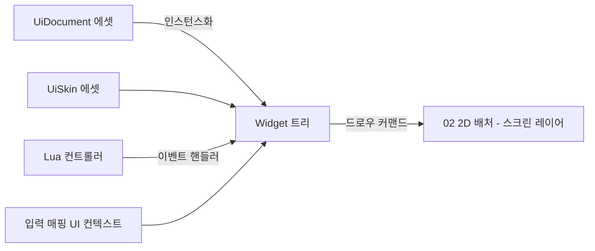

# 06. 런타임 시스템 (In-game UI · Text/IME · Audio · Input Mapping · Particle · Save · L10N · Network Hook)

> 소유 범위: 인게임 UI 시스템(본 문서가 단독 소유), 텍스트·한글 렌더링, IME, 오디오, 입력 매핑(고수준),
> 파티클/이펙트, 세이브/로드, 로컬라이제이션, 씬 전환/로딩 화면, 네트워크 확장 훅.
> ImGui는 07(에디터)·디버그 오버레이 전용이며, 인게임 UI는 여기서 설계하는 자체 시스템을 사용한다.

---

## 목표와 책임

- **게임이 플레이어와 만나는 모든 접점**을 담당한다. 화면 위의 UI, 글자, 소리, 입력 해석, 이펙트, 저장 — 즉 "엔진 코어 위에서 게임을 게임답게 만드는 계층".
- 테일즈위버류 MMO 스타일을 1급 시민으로 지원한다: 드래그 가능한 창(Window) 다수, 인벤토리 그리드, 퀵슬롯, 채팅창(한글 IME 포함), 아이템 드래그&드롭, BGM 크로스페이드.
- **한글은 폴백이 아니라 기본값**이다. 동적 폰트 아틀라스, 한글 줄바꿈, win32 IME 조합 표시를 설계 초기부터 포함한다.
- 모든 서브시스템은 "데이터(에셋)로 정의 + Lua로 로직"이라는 엔진 공통 철학을 따른다. UI 문서, 파티클 이펙트, 입력 바인딩, 문자열 테이블은 전부 에셋이고, 동작은 Lua 또는 C++ 플러그인으로 붙인다.
- 지금은 싱글 플레이 런타임만 구현하되, **시뮬레이션/표현 분리** 경계를 지켜 이후 네트워크 레이어가 끼어들 자리를 남긴다.

레이어 위치: L2(Audio)·L3(Scene) 위, L4(Scripting)와 같은 높이에서 동작하는 "게임 프레임워크" 계층. 01의 저수준 입력, 02의 2D 배처, 03의 ECS, 04의 에셋/직렬화를 소비한다.

---

## 설계 개요

### 1. 인게임 UI 시스템 (`mye::ui`)

**리테인드 모드 위젯 트리**를 채택한다. ImGui식 즉시 모드는 에디터에는 적합하지만, 스킨·애니메이션·드래그드롭·IME 조합 표시가 필요한 MMO UI에는 리테인드 트리가 맞다.

- **트리 구조**: `UiRoot`(화면당 1개) → `UiCanvas`(레이어/정렬 단위, 예: HUD 캔버스, 창 캔버스, 툴팁 캔버스) → `Widget` 트리. 창(Window)들은 창 캔버스 안에서 z-order를 가지며, 클릭 시 최상단으로 올라온다.
- **레이아웃**: Unity RectTransform과 유사한 **앵커(anchorMin/anchorMax) + 피벗 + 오프셋** 모델을 기본으로 하고, 그 위에 컨테이너형 위젯(`StackLayout`, `GridLayout`)이 자식을 자동 배치한다. 해상도 대응은 `UiScalePolicy`(정수 배율 스케일 — 픽셀아트 유지 — 또는 참조 해상도 비율 스케일)로 캔버스 단위 지정.
- **9-slice**: `ImageWidget`이 `SlicedSprite` 모드를 지원. 슬라이스 마진은 스프라이트 에셋 메타(04)에 저장하고 UI는 읽기만 한다. 픽셀아트 특성상 모서리는 정수 배율로만 스케일하는 옵션 제공.
- **스킨/테마**: `UiSkin` 에셋 = 스타일 클래스 이름 → {스프라이트, 9-slice, 폰트, 색, 패딩, 사운드 큐} 매핑. 위젯은 스프라이트를 직접 참조하는 대신 `styleClass="window.frame"`처럼 스킨 키를 참조 → 스킨 교체만으로 전체 테마 변경.
- **이벤트 모델**: 라우티드 이벤트. 히트 테스트로 최상단 위젯을 찾고 **터널링(capture) → 타깃 → 버블링** 순으로 전파, `handled` 플래그로 소비. 이벤트 종류: PointerEnter/Leave/Down/Up/Click, DragStart/Drag/Drop, FocusGained/Lost, KeyDown/TextInput(IME 경유), Scroll, TooltipRequest.
- **드래그&드롭**: `DragPayload { string type; Variant data; SpriteHandle ghost; }`. 인벤토리 슬롯 → 퀵슬롯, 슬롯 ↔ 슬롯 이동을 페이로드 타입 문자열로 매칭. 드롭 실패 시 원위치 애니메이션은 UI 레벨에서 처리.
- **툴팁**: `TooltipRequest` 이벤트에 위젯이 `UiDocument` 조각 또는 리치 텍스트로 응답. 지연 시간·위치 정책은 `UiSystem` 전역 설정.
- **애니메이션**: `UiTween` 시스템 — 위젯 프로퍼티(위치·크기·알파·색)를 대상으로 이징 커브·시퀀스(순차/병렬)를 재생. 창 열림/닫힘·페이드·슬라이드 연출을 담당하며, `UiSkin`/`UiDocument`에서 선언적으로 정의하고 Lua 컨트롤러가 트리거한다. 리테인드 모드 채택 근거인 "애니메이션"의 실제 메커니즘이 이것이다.
- **가상화 리스트**: `ListViewWidget` — 수백~수천 라인 스크롤백(채팅창 등)을 위해 **가시 범위만 레이아웃**하고 라인별 `TextLayout`을 캐시하는 가상화(virtualized) 리스트. 하단 고정(follow-tail) 스크롤 지원. `ScrollView`+`Label` 조합은 전 라인 레이아웃을 유지해 리치 텍스트 채팅에서 비용이 누적되므로 채팅창은 이 위젯을 쓴다.
- **UI = 데이터 + Lua**: 화면 하나는 `UiDocument` 에셋(위젯 트리 선언, 04의 직렬화 프레임워크 포맷)이고, 문서마다 Lua 컨트롤러 스크립트를 바인딩한다. C++ 엔진 코드는 위젯 타입과 이벤트 배관만 제공하고, "인벤토리 창의 동작"은 전부 Lua에 있다.
- **렌더링**: UI는 02의 2D 스프라이트 배처를 스크린 스페이스 레이어에서 사용한다. UI 전용 렌더 패스를 갖지 않고, 클리핑(ScrollView)은 배처의 시저 렉트 기능을 요구사항으로 02에 전달한다(경계 섹션 참고).



### 2. 텍스트·한글 렌더링 (`mye::text`)

한글 11,172자(현대 한글 전체)를 미리 굽는 것은 아틀라스 낭비이므로 **FreeType 기반 온디맨드 글리프 캐싱**을 기본으로 한다.

- **동적 아틀라스**: `GlyphCache`가 (fontId, pixelSize, styleFlags) 별로 글리프를 요청 시점에 래스터라이즈해 아틀라스 페이지(1024×1024, R8)에 shelf-packing으로 적재. 페이지가 차면 새 페이지 추가, 프레임 카운터 기반 LRU로 오래 안 쓴 글리프 슬롯 회수. 게임 시작 시 ASCII + KS X 1001 완성형 2,350자 정도를 워밍업 프리로드(옵션)해 첫 채팅 프레임 스파이크를 줄인다.
- **SDF는 채택하지 않는다**. 도트 게임 미학상 글꼴도 픽셀 정합(정수 좌표 스냅, 힌팅 `FT_LOAD_TARGET_MONO` 또는 LIGHT)이 우선이고, 자유 스케일링 수요가 없다. 크기별로 따로 굽는다.
- **비트맵 폰트**: 도트 느낌 폰트를 위해 BMFont(.fnt) / Aseprite 시트 기반 `BitmapFont`를 FreeType 폰트와 동일한 `IFont` 인터페이스로 지원. 한글 도트 폰트(예: 갈무리, Neo둥근모)는 TTF라도 MONO 힌팅으로 구우면 도트 느낌이 유지된다.
- **아웃라인·그림자**: 아웃라인은 FT_Stroker로 별도 글리프(아틀라스에 outline 변형으로 캐시)를 굽고, 그림자는 동일 글리프를 오프셋+색으로 한 번 더 그린다. 드로우 순서: 그림자 → 아웃라인 → 본체. 셰이더 트릭보다 배처 3패스가 단순하고 픽셀 정확하다.
- **레이아웃 엔진**: `TextLayout`이 리치 텍스트 파싱 → 셰이핑(한글/라틴은 단순 advance로 충분, 초기엔 HarfBuzz 미도입) → 줄바꿈 → 정렬을 수행하고, 결과 `PositionedGlyph[]`를 캐시한다. 
  - **한글 줄바꿈 규칙**: 한글은 음절 단위로 어디서든 줄바꿈 가능(word-wrap이 아닌 char-wrap), 라틴 단어는 단어 단위 유지. **금칙 처리**: 행두 금칙(닫는 괄호·구두점 `.,!?」)』` 등은 줄 첫머리에 못 옴), 행말 금칙(여는 괄호는 줄 끝에 못 옴)을 간단한 금칙 문자표로 처리.
  - **리치 텍스트 태그**: `{color=#RRGGBB}...{/color}`, `{outline=...}`, `{icon=item_potion}`(인라인 스프라이트, 채팅 아이템 링크용), `{link=item:1234}...{/link}`(클릭 가능한 범위 — 히트 렉트를 레이아웃 결과에 포함). 태그 문법은 이 문서가 확정하고 UI·채팅·툴팁이 공유한다.

### 3. IME (win32 조합 입력)

- **메시지 수신 경로는 지연 이벤트 버스가 아니라 01의 동기 `IWindowMessageHook` 훅 체인이다.** 06의 `ImeSession`이 훅을 등록해 `WM_IME_SETCONTEXT / WM_IME_STARTCOMPOSITION / WM_IME_COMPOSITION / WM_IME_ENDCOMPOSITION / WM_IME_NOTIFY`를 **메시지 시점에 동기 처리하고 소비 여부를 반환**한다(메시지 배관·훅 체인은 01 소유, 의미 해석·조합 상태는 06 소유). OS 기본 조합창 억제 — `WM_IME_SETCONTEXT`에서 `ISC_SHOWUICOMPOSITIONWINDOW` 플래그 제거, `WM_IME_COMPOSITION`을 `DefWindowProc`에 넘기지 않고 소비 — 는 동기 훅으로만 가능하며, 지연 버스 이벤트 경로로는 인라인 조합 표시가 성립하지 않는다. 확정 문자열(`TextCommitted`) 등 **파생 이벤트만 이벤트 버스로 발행**한다(버스는 보조 통지용).
- **조합 중 문자열(composition string)**은 훅이 `WM_IME_COMPOSITION` 메시지 시점에 `ImmGetCompositionString`으로 획득해 확정 텍스트와 별도 상태로 유지하고, 입력창이 캐럿 위치에 **밑줄 스타일로 인라인 표시**한다. `GCS_COMPSTR`(조합 중), `GCS_RESULTSTR`(확정) 분리 처리. 확정 시 `TextCommitted` 이벤트로 위젯 버퍼에 병합.
- `TextInputWidget`(채팅 입력창)이 포커스를 얻으면 `ImeSession::activate(caretRect)` → IME 활성화 + `ImmSetCandidateWindow`로 후보 창을 입력창 캐럿 위치에 배치. 이때 필요한 `HWND`는 01의 `IWindow::GetNativeHandle` 경유로 얻는다. 포커스를 잃으면 비활성화(게임플레이 중 ㅁ→미션창 같은 오입력 방지).
- **캐럿 렉트 좌표 규약**: `ImmSetCandidateWindow`에 넘기는 캐럿 렉트는 반드시 **"UI 좌표 → 네이티브 창(클라이언트) 좌표" 변환**을 거친다. 변환은 02의 좌표계 API를 사용하며, 에디터 플레이 모드처럼 뷰포트 RT가 ImGui 창 안에 스케일 표시되는 경우 **에디터 뷰포트 오프셋·스케일까지 포함**해 매핑한다.
- **채팅 시나리오**(수용 기준): Enter → 채팅창 포커스 + IME on → "안녕하세요" 조합 과정이 밑줄로 실시간 표시 → 한/영 전환 동작 → Enter로 전송 + IME off + 게임플레이 컨텍스트 복귀. 조합 중 Esc는 조합 취소만, 두 번째 Esc가 입력창 닫기.

### 4. 오디오 (`mye::audio`)

**백엔드 비교와 선택**:

| 기준 | XAudio2 | miniaudio | FMOD/Wwise |
|---|---|---|---|
| 플랫폼 | Windows 전용 | 크로스플랫폼 | 크로스플랫폼 |
| 통합 비용 | 중간(COM, 보이스 그래프 직접 구성) | 낮음(싱글 헤더, 디코더·리샘플러·노드 그래프 내장) | 낮지만 상용 라이선스·외부 툴 의존 |
| 디코딩 | 별도 구현 필요 | wav/flac/mp3/ogg(stb_vorbis) 내장 | 내장 |
| 확장성 목표와의 궁합 | 백엔드 교체 어려움 | 우리 추상화 뒤에 숨기기 쉬움 | 미들웨어에 종속 |

**결정: miniaudio를 1차 백엔드로 채택**하되, RHI와 동일한 철학으로 `IAudioBackend` 추상화 뒤에 둔다(XAudio2 백엔드는 이후 추가 가능). 1인 개발에서 디코더·디바이스·리샘플링을 공짜로 얻는 가치가 크고, 엔진이 소유해야 할 것은 **믹서 토폴로지와 이벤트 모델**이지 디바이스 코드가 아니다.

- **버스 구조**: `Master ← { BGM, SFX, Voice, UI, Ambient }` 트리. 버스별 볼륨/뮤트/이펙트 슬롯(초기엔 로우패스 정도). 버스 구성은 하드코딩이 아니라 `AudioBusLayout` 에셋.
- **BGM 크로스페이드**: `MusicPlayer`가 2개의 스트리밍 보이스를 소유하고 `play(track, fadeSec)` 시 볼륨 커브 교차. 마을→필드 BGM 전환, 전투 돌입 인터럽트(현재 위치 저장 후 복귀) 지원.
- **2.5D 공간화**: 리스너는 **카메라가 아니라 "관심점(보통 플레이어 캐릭터의 월드 위치)"**로 정의한다 — 테일즈위버식 쿼터뷰에서 카메라는 멀리 떠 있으므로 카메라 기준 감쇠는 부자연스럽다. 감쇠는 월드 XY 평면 거리 기반 커브(min/max 거리), 패닝은 화면 X축 좌우만 사용(2.5D에서는 상하 패닝 무의미). 3D 노드에 붙는 사운드도 동일 규칙.
- **이벤트 기반 재생**: 코드는 파일이 아니라 `AudioCue` 에셋을 재생한다. Cue = {클립 목록(랜덤/순차 선택), 볼륨·피치 변조 범위, 대상 버스, 동시 재생 제한(폴리포니), 우선순위}. "칼 휘두르기" 큐 하나에 3개 클립 랜덤 재생 같은 패턴을 데이터로 표현. `AudioSystem::post(cueHandle, worldPos?)` 단일 진입점.

### 5. 입력 매핑 (`mye::input`)

01의 저수준 입력(키·마우스·패드 원시 상태/이벤트) 위에 올라가는 **의미 계층**.

- **액션/축**: `InputAction`(디지털: Jump, OpenInventory)과 `InputAxis`(아날로그: MoveX — 키 조합 A/D도 -1/+1 축으로 합성). 바인딩은 `InputBindingsAsset`으로 정의, 디바이스별(키보드/패드) 바인딩 셋 공존.
- **컨텍스트 스택**: `InputContext`를 우선순위 스택으로 쌓는다 — 위에서부터 이벤트를 소비(consume)하며 내려간다. 기본 스택: `[Editor(플레이 모드 시)] > [Modal UI] > [UI] > [Gameplay]`. 채팅창이 열리면 UI 컨텍스트가 텍스트 입력을 독점하고 Gameplay의 WASD는 도달하지 않는다. UI 컨텍스트의 소비 판정은 UiSystem 히트 테스트 결과("포인터가 UI 위에 있는가", "포커스 위젯이 텍스트를 받는가")를 질의해 결정.
- **리바인딩**: 런타임에 `rebind(action, waitForNextKey)` API 제공. 변경분은 기본 바인딩 에셋과의 **diff만** 사용자 설정 파일(세이브 시스템의 settings 슬롯)에 저장 — 패치로 기본 바인딩이 바뀌어도 사용자 변경분이 유지된다.

### 6. 파티클·이펙트 (`mye::fx`)

- **데이터 주도 CPU 파티클**: `ParticleEffectAsset` = 이미터 배열. 이미터 = {스폰(rate/burst, 모양: 점·원·사각), 초기값(수명·속도·회전·크기 — 상수/랜덤 범위/커브), **모듈 리스트**}. 모듈은 `VelocityOverLife`, `ColorOverLife`, `SizeOverLife`, `Gravity`, `SpriteSheetAnim`(도트 시트 프레임 재생), `EmitOnDeath`(서브 이미터) 등 조합식 — 07의 파티클 에디터가 모듈을 추가/삭제/파라미터 편집하는 구조와 1:1 대응.
- 시뮬레이션은 CPU(SoA 버퍼, 잡 시스템 병렬화 가능), 렌더링은 02 배처에 스프라이트로 제출. 하이브리드 씬 대응: 2D 레이어 파티클(화면/레이어 좌표)과 3D 빌보드 파티클(HD-2D 모드) 둘 다 지원하되 시뮬레이션 코어는 공유.
- 도트 게임 이펙트의 절반은 파티클이 아니라 **스프라이트 애니메이션 원샷**(베기 이펙트 등)이다. `EffectAsset`은 파티클 이미터와 스프라이트 애니 트랙을 같은 타임라인에 섞을 수 있는 컨테이너로 설계(사운드 큐 트리거 포함) — "이펙트 하나 = 에셋 하나".

### 7. 세이브/로드 · 로컬라이제이션 · 씬 전환

- **세이브**: `SaveManager`가 슬롯(slot0..N + settings + quicksave)을 관리. 파일 = 헤더{매직, **버전**, 타임스탬프, 플레이 시간, 썸네일 PNG} + 페이로드(04의 직렬화 프레임워크로 기록). 버전 마이그레이션은 `ISaveMigration{ int from; void migrate(SaveBlob&); }` 체인 등록 방식 — 구버전 세이브를 단계적으로 승격. 쓰기는 temp 파일 → rename 원자적 교체. **게임이 무엇을 저장할지는 Lua/게임 코드가 `ISaveParticipant` 등록으로 결정**하고 엔진은 배관만 제공.
- **로컬라이제이션**: `StringTable` 에셋(locale별 파일, key → 문자열). `LocText(key)` 참조 타입을 UI·툴팁·대사가 사용. 포맷은 `{0}, {name}` 자리표시자 치환(초기엔 ICU 없이, 한국어는 조사 처리 훅 `{name:이/가}`를 확장 포인트로 남김). 폴백 체인 ko → en → key 그대로 표시. 로케일 전환 시 `LocaleChanged` 이벤트로 UI 전체 텍스트 리플로우.
- **씬 전환**: `SceneTransitionManager::changeScene(sceneRef, TransitionDesc)` — 페이드아웃 → 로딩 화면(그 자체가 `UiDocument`) 표시 → 04 비동기 로드(진행률 콜백을 로딩 UI에 바인딩) → 액티베이트 → 페이드인. 전환 중 입력 컨텍스트는 `Loading`(전부 소비)으로 교체. 소규모 맵 이동은 로딩 화면 없이 스트리밍 전환하는 fast-path 옵션.

### 8. 네트워크 확장 훅 (지금은 경계만)

MMO 지향이므로 지금 지키지 않으면 나중에 못 고치는 것만 규칙으로 못 박는다:

1. **시뮬레이션/표현 분리**: 게임 상태 변경은 `Command`(의도: MoveTo, UseItem)로만 일어나고, 표현(애니메이션·사운드·파티클)은 상태 변화 `GameEvent`를 구독해 재생한다. 로컬 플레이에서는 Command가 즉시 로컬 시뮬레이션에 적용될 뿐 — 이 파이프 중간에 나중에 네트워크 송수신이 끼어든다.
2. 시뮬레이션은 **고정 틱**(03의 fixed update)에서만 상태를 바꾸고, 표현은 가변 프레임에서 보간한다.
3. 엔진은 `INetworkProvider` 플러그인 인터페이스 자리만 정의(connect/session/채널로 Command·Event 직렬화 스트림 교환). 구현은 미래의 플러그인 몫. 복제(replication)·예측은 지금 설계하지 않는다 — 다만 Command/Event가 04의 직렬화를 통해 바이트로 나갈 수 있어야 한다는 요구만 04에 전달.

---

## 핵심 타입·API 스케치

```cpp
namespace mye::ui {

// ---- 위젯 트리 ----
class Widget {
public:
    virtual ~Widget() = default;
    // 레이아웃
    AnchorRect      anchors;      // anchorMin/Max, pivot, offset
    RectF           computedRect; // 레이아웃 결과(픽셀)
    StyleClassId    styleClass;   // UiSkin 키
    // 트리
    Widget*                  parent() const;
    std::span<WidgetPtr>     children() const;
    // 이벤트: 라우티드 디스패치. handled=true면 전파 중단
    virtual bool onEvent(UiEvent& e) { return false; }
    virtual void measure(Vec2 avail);           // 레이아웃 1단계
    virtual void arrange(RectF finalRect);      // 레이아웃 2단계
    virtual void draw(UiDrawContext& ctx);      // 02 배처에 커맨드 제출
};

class ImageWidget  : public Widget { SpriteRef sprite; NineSlice slice; bool integerScale; };
class LabelWidget  : public Widget { LocText text; TextStyle style; };  // 내부에 TextLayout 캐시
class ButtonWidget : public Widget { /* Pressed/Hover 상태 → 스킨 상태 스타일 */ };
class WindowWidget : public Widget { bool draggable, closable; /* z-order, 타이틀바 드래그 */ };
class GridViewWidget : public Widget { Vec2i cellSize; int columns; /* 인벤토리/퀵슬롯 공용 */ };
class TextInputWidget : public Widget { /* 확정 버퍼 + ImeComposition 표시 + 캐럿 */ };
class ScrollViewWidget : public Widget { /* 시저 렉트 클리핑 + 스크롤바 */ };
class ListViewWidget : public Widget { /* 가상화 스크롤백: 가시 범위만 레이아웃, 라인별 TextLayout 캐시, 하단 고정 */ };

// ---- 드래그&드롭 ----
struct DragPayload { std::string type; Variant data; SpriteRef ghost; };

// ---- 시스템 ----
class UiSystem {
public:
    UiDocumentHandle open(AssetRef<UiDocument> doc, LuaRef controller = {});
    void close(UiDocumentHandle h);
    void setSkin(AssetRef<UiSkin> skin);
    Widget* hitTest(Vec2 screenPos) const;     // 입력 컨텍스트가 질의
    void update(float dt);                     // 레이아웃·애니·툴팁 타이머
    void render(UiDrawContext& ctx);
};
} // namespace mye::ui
```

```cpp
namespace mye::text {

class IFont {  // FreeType 폰트와 BitmapFont의 공통 인터페이스
public:
    virtual const Glyph* getGlyph(char32_t cp, uint16 pixelSize, GlyphStyle style) = 0; // 캐시 미스 시 래스터라이즈
    virtual FontMetrics metrics(uint16 pixelSize) const = 0;
};

class GlyphCache {   // 동적 아틀라스: 페이지 목록 + shelf packer + LRU
public:
    void warmup(IFont&, uint16 size, std::u32string_view charset); // ASCII+완성형 2350자 프리로드
    void beginFrame(uint64 frameIndex);                            // LRU 기준 갱신
    TextureHandle pageTexture(PageId) const;
};

struct TextStyle { FontRef font; uint16 size; Color color;
                   std::optional<Color> outline; std::optional<ShadowDesc> shadow; };

class TextLayout {  // 리치 텍스트 파싱 → 줄바꿈(한글 금칙) → PositionedGlyph[]
public:
    void set(std::string_view richText, const TextStyle& base, LayoutParams p); // 폭·정렬·줄간격
    std::span<const PositionedGlyph> glyphs() const;
    std::span<const LinkRegion> links() const;   // {link=...} 히트 렉트
    Vec2 measuredSize() const;
};
} // namespace mye::text
```

```cpp
namespace mye::input {

struct ActionId { StringHash v; };   // "OpenInventory"
class InputContext {                 // 스택 한 층
public:
    virtual std::string_view name() const = 0;
    // 소비하면 true → 아래 컨텍스트로 전달 안 함
    virtual bool consume(const LowLevelInputEvent& e, MappedDispatch& out) = 0;
};

class InputMapper {
public:
    void pushContext(std::shared_ptr<InputContext>);   // 우선순위 스택
    void popContext(std::string_view name);
    void loadBindings(AssetRef<InputBindingsAsset>);
    void applyUserOverrides(const BindingDiff&);       // settings 슬롯에서 로드
    // 폴링 + 이벤트 양쪽 지원
    bool  isActionDown(ActionId) const;
    float axis(ActionId) const;
    Signal<ActionId, ActionPhase>& onAction();         // Pressed/Held/Released
    void  startRebind(ActionId, RebindCallback);
};
} // namespace mye::input
```

```cpp
namespace mye::audio {

class IAudioBackend {  // miniaudio 1차 구현, XAudio2는 미래 백엔드
public:
    virtual VoiceHandle createVoice(const ClipDesc&, BusId) = 0;
    virtual void submit(VoiceHandle, PlayParams) = 0;   // 볼륨·피치·팬
    virtual ~IAudioBackend() = default;
};

class AudioSystem {
public:
    void loadBusLayout(AssetRef<AudioBusLayout>);
    CueInstance post(AssetRef<AudioCue> cue,
                     std::optional<Vec3> worldPos = {});  // 공간화는 worldPos 있을 때만
    void setBusVolume(BusId, float);
    void setListener(Vec3 worldPos);   // 보통 플레이어 캐릭터 위치. 카메라 아님!
    MusicPlayer& music();              // play(track, fadeSec) — 2보이스 크로스페이드
};
} // namespace mye::audio
```

```cpp
namespace mye::fx {

struct EmitterDesc {   // 07 파티클 에디터가 편집하는 단위
    SpawnDesc spawn;                       // rate/burst, 스폰 모양
    InitRanges init;                       // 수명·속도·크기·회전 (상수/범위/커브)
    std::vector<ModuleDesc> modules;       // ColorOverLife, SpriteSheetAnim, ...
    RenderSpace space;                     // Layer2D | Billboard3D
};
// EffectAsset = { EmitterDesc[], SpriteAnimTrack[], SoundTrigger[] } 를 한 타임라인에
class FxSystem {
public:
    FxInstance spawn(AssetRef<EffectAsset>, const FxSpawnParams&); // 위치·부모 엔티티·레이어
    void update(float dt);   // SoA 시뮬레이션, 잡 시스템 병렬화 지점
};
} // namespace mye::fx
```

```cpp
namespace mye::save {
class ISaveParticipant {  // Lua/게임 코드가 등록
public:
    virtual std::string_view sectionId() const = 0;
    virtual void save(Serializer&) = 0;    // 04의 직렬화 프레임워크
    virtual void load(Deserializer&) = 0;
};
class SaveManager {
public:
    void registerParticipant(ISaveParticipant*);
    void registerMigration(std::unique_ptr<ISaveMigration>);
    SaveResult writeSlot(SlotId, const SaveMeta&);   // temp→rename 원자적
    LoadResult readSlot(SlotId);
    std::vector<SlotInfo> enumerateSlots() const;    // 헤더만 읽기(빠른 목록)
};
} // namespace mye::save
```

**Lua 노출 예시**(바인딩 계층 자체는 05 소유 — 여기서는 API 표면만 정의):

```lua
-- inventory_window.lua : UiDocument "inventory.ui"의 컨트롤러
local M = {}
function M.onOpen(doc)
  M.grid = doc:find("itemGrid")
  M.grid.onDrop = function(slot, payload)
    if payload.type == "item" then Game.inventory:move(payload.data.fromSlot, slot.index) end
  end
end
function M.onEvent(doc, e)
  if e.name == "close" then Ui.close(doc); Audio.post("cue/ui_close") end
end
return M
```

---

## 다른 모듈과의 경계

| 상대 | 06이 소비하는 것 | 06이 제공/요구하는 것 |
|---|---|---|
| **01 Core** | `IWindowMessageHook` 훅 체인(IME `WM_IME_*` 동기 선점 통로), `IWindow::GetNativeHandle`, 저수준 입력 상태·이벤트, 이벤트 버스, 잡 시스템 | IME는 "메시지 배관·훅 체인은 01, 동기 처리·소비 판정과 조합 상태는 06(ImeSession 훅 등록)". 입력 매핑은 01 저수준 입력의 유일한 게임 측 소비자 |
| **02 Renderer** | 2D 스프라이트 배처(스크린 스페이스 레이어), 텍스처 생성/업데이트(글리프 아틀라스 부분 업데이트) | **요구사항 전달**: 시저 렉트(ScrollView 클리핑), R8 텍스처 부분 업로드, 정수 픽셀 스냅 드로우. 좌표계·PPU는 02 확정을 인용만 함 |
| **03 Scene/ECS** | 고정 틱(시뮬레이션), 엔티티 위치(사운드·이펙트 부착), 스프라이트 애니메이션 시스템 | 파티클의 씬 배치(2D 레이어/3D 빌보드)는 03의 하이브리드 씬 규약을 따름. UI는 씬 그래프 밖의 독립 트리(씬에 붙는 월드 스페이스 UI는 확장 이슈) |
| **04 Asset** | 에셋 로딩·핸들·비동기 로드, **리플렉션·직렬화 프레임워크**(세이브·UiDocument·파티클 에셋이 사용) | UiDocument/UiSkin/AudioCue/EffectAsset/StringTable/InputBindings 에셋 타입 등록. Command/GameEvent 직렬화 가능 요구(네트워크 대비) |
| **05 Scripting** | sol2 바인딩 인프라 | Ui/Audio/Input/Fx/Save/Loc의 Lua API 표면 정의는 06, 바인딩 구현 방식은 05 |
| **07 Editor** | — | 파티클 에디터·UI 에디터가 편집하는 에셋 스키마(EmitterDesc, UiDocument)는 06이 확정. ImGui는 07·디버그 오버레이 전용이며 인게임 UI에 침투 금지 |

- **디버그 오버레이 예외**: FPS·파티클 수·오디오 보이스 수 같은 개발용 오버레이는 ImGui 사용 가능(07의 인프라 재사용). 출시 빌드에서 컴파일 아웃.

## 확장 포인트

1. **커스텀 위젯**: C++ 플러그인이 `Widget` 파생 타입을 `UiSystem::registerWidgetType(name, factory)`로 등록 → UiDocument에서 이름으로 인스턴스화, 07 UI 에디터 팔레트에도 자동 노출. Lua 측은 기존 위젯 조합(`CompositeWidget` + 컨트롤러)으로 커스텀 컨트롤 정의.
2. **UI 로직은 100% Lua**: 모든 이벤트가 Lua 컨트롤러로 라우팅되므로, 게임의 UI 동작(퀘스트 창, 상점)은 엔진 재빌드 없이 작성·핫리로드 가능.
3. **파티클 모듈 플러그인**: `IFxModule` 구현을 플러그인이 등록하면 데이터(ModuleDesc)에서 이름으로 참조 가능 + 07 에디터에 파라미터 UI 자동 생성(04 리플렉션 기반).
4. **오디오**: `IAudioBackend` 교체(XAudio2, 널 백엔드), 버스 이펙트 슬롯에 커스텀 DSP 플러그인 등록.
5. **입력**: 플러그인이 새 `InputContext`를 스택에 삽입 가능(예: 컷씬 컨텍스트, 미니게임 전용 컨텍스트). 새 디바이스 타입은 01에 드라이버 추가 후 06 바인딩 문법에 자동 편입.
6. **세이브 참여자**: `ISaveParticipant`를 Lua에서도 등록 가능(테이블의 save/load 함수) — 게임 데이터 저장 스키마를 엔진이 전혀 모르게 유지.
7. **로컬라이제이션 포맷터 훅**: `{name:이/가}` 같은 언어별 후처리를 로케일별 Lua 함수로 주입.
8. **네트워크**: `INetworkProvider` 플러그인 인터페이스 + Command/GameEvent 파이프 — 미래의 넷코드가 엔진 수정 없이 끼어드는 유일한 공식 통로.

## 단계별 구현 범위 (MVP → 확장)

**MVP (엔진 부트스트랩과 함께)** — 수직 슬라이스(NPC 대화 박스·선택지 표시)에 필요한 것까지로 한정한다
- 텍스트: FreeType + GlyphCache(단일 사이즈, LRU 없이 페이지 추가만), 그림자·아웃라인, 한글 char-wrap 줄바꿈(금칙 최소), `{color}` 태그만
- UI: Widget/Image(9-slice)/Label(한글 표시)/Button/Window, 앵커 레이아웃, 스킨 v1(스프라이트·폰트·색만), 클릭·호버·포커스 이벤트, UiDocument 로드 + Lua 컨트롤러
- 오디오: miniaudio 백엔드, 버스 3개(BGM/SFX/UI), AudioCue 재생, BGM 크로스페이드
- 입력: 액션/축 바인딩, 컨텍스트 스택(UI > Gameplay), 폴링+이벤트
- 세이브: settings 슬롯(키 바인딩·볼륨 저장)만
- IME·TextInputWidget·채팅은 MVP에서 제외한다(MMO 기능이지 슬라이스 요구가 아니며, WM_IME 처리는 win32에서 손꼽히게 디버깅 비용이 큰 영역). 01의 `IWindowMessageHook` 통로 계약(§3)만 문서 수준에서 유지하고 구현은 Phase 3.

**Phase 2 (게임 버티컬 슬라이스)**
- UI: GridView(인벤토리)·ScrollView(시저 클리핑)·드래그&드롭·툴팁·퀵슬롯, 정수 배율 스케일 정책
- UI 애니메이션: UiTween(프로퍼티 대상·이징·시퀀스, UiSkin/UiDocument 선언 + Lua 트리거)
- 텍스트: `{icon}` `{link}` 태그, BitmapFont, 워밍업 프리로드, LRU 회수
- 이펙트: 스프라이트 애니메이션 원샷 + AudioCue 동시 재생(도트 이펙트의 절반을 커버하는 경로 — 파티클 없이 슬라이스 연출 충족)
- 오디오: 2.5D 감쇠·패닝, 폴리포니 제한, Ambient/Voice 버스
- 세이브: 게임 슬롯 + 버전 마이그레이션 + 썸네일, 로컬라이제이션 StringTable + 폴백
- 씬 전환: 로딩 화면 + 진행률, 리바인딩 UI

**Phase 3 (확장)**
- IME 전체 구현: ImeSession(`IWindowMessageHook` 등록)·인라인 조합 표시·후보창 배치 + TextInputWidget — §3 채팅 시나리오 통과가 완료 조건
- 채팅창 완성(ListViewWidget 가상화 스크롤백·아이템 링크·귓속말 탭), 월드 스페이스 UI(머리 위 이름표·말풍선 — 03 씬과 협의)
- 파티클: EmitterDesc + 기본 모듈 5종, EffectAsset 타임라인 컨테이너 — 07 파티클 에디터와 같은 마일스톤으로 짝지어 진행(타임라인 컨테이너는 저작 도구 없이는 쓸 수 없으므로)
- 파티클 잡 시스템 병렬화, 커스텀 FxModule 플러그인, 버스 DSP 슬롯
- Command/GameEvent 파이프 정식화 + INetworkProvider 인터페이스 확정(구현은 별도 프로젝트)
- HarfBuzz 도입 검토(라틴 커닝·이후 다국어), 로케일별 폰트 스위칭

## 오픈 이슈

1. **UiDocument 저작 포맷**: 04 직렬화의 텍스트 포맷을 그대로 쓸지, UI 전용의 손편집 가능한 선언 포맷(XAML류)을 둘지. 07 UI 에디터 완성 전까지는 손편집이 주 수단이라 결정이 급함.
2. **UI 스케일 기본 정책**: ✅ 확정(2026-07): 기준 해상도 960×540(타일 48×48, PPU 48) 확정 — 정수배 우선(1080p ×2, 4K ×4), 비정수배 해상도(1440p 등)는 sharp-bilinear 업스케일로 전체 화면 채움(유저 설정으로 순수 정수배+레터박스 선택 가능). `UiScalePolicy` 기본값은 이 정책을 따른다.
3. **채팅 폰트 전략**: 도트 비트맵 폰트로 채팅까지 갈지(저해상도에서 한글 가독성 문제), 채팅·툴팁만 일반 TTF 힌팅 렌더로 갈지.
4. **오디오 스레딩 모델**: AudioSystem 갱신을 메인 스레드 틱으로 할지, 전용 오디오 스레드 + 커맨드 큐로 할지(miniaudio 콜백 스레드와의 경계). MVP는 메인 스레드로 가되 API를 큐 친화적으로 설계해 두는 선까지는 합의 필요.
5. **파티클 결정론**: 네트워크/리플레이 대비로 파티클 RNG를 시드 고정 가능하게 할지(표현 계층이므로 원칙상 불필요하지만, 스킬 이펙트가 게임플레이 판정과 얽히는 순간 문제가 됨 — "이펙트는 절대 판정에 관여하지 않는다"를 규칙으로 못 박을지).
6. **세이브 암호화/무결성**: 싱글 플레이 단계에서 체크섬만 둘지, 조작 방지를 시도할지(MMO 전환 시 서버 권위로 무의미해지므로 과투자 경계).
7. **IME 후보창**: OS 기본 후보창을 쓸지, 게임 스킨에 맞는 자체 후보창 UI(`ImmGetCandidateList`)까지 갈지. MVP는 OS 창, 풀스크린 독점 모드에서의 문제 확인 후 재논의.
