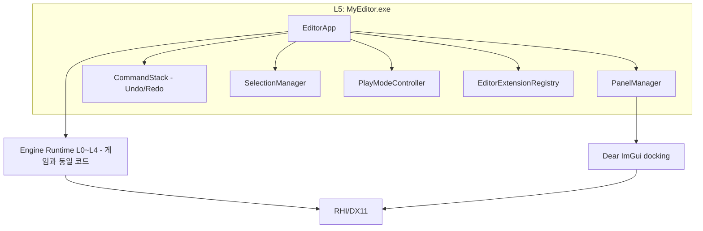

# 07. 에디터·UI 설계 (ImGui Editor)

> 소유 범위: ImGui(도킹 브랜치) 기반 통합 에디터 전반 — 에디터 아키텍처, 패널 설계, 워크플로우,
> Undo/Redo, 플레이 모드, 에디터 확장 API.
> 비소유: 인게임 UI(06 소유), 리플렉션·직렬화 프레임워크(04 소유), 좌표계·PPU 규약(02 소유).

---

## 목표와 책임

- **1인 개발자가 테일즈위버류 하이브리드 2D/3D 게임을 "엔진 코드 수정 없이" 만들 수 있는 통합 작업 환경**을 제공한다.
- 에디터는 게임 런타임과 **동일한 엔진 바이너리** 위에서 동작하는 특권(privileged) 애플리케이션이다. 에디터에서 보는 것 = 게임에서 보는 것(WYSIWYG)을 보장한다.
- 씬 편집, 타일맵 편집, 스프라이트/애니메이션 편집, 파티클 편집, 에셋 관리, 디버깅(콘솔·프로파일러·Lua REPL)을 하나의 도킹 워크스페이스에서 제공한다.
- **에디터 확장 API**를 통해 플러그인(C++ DLL)과 Lua 스크립트가 패널·메뉴·인스펙터·기즈모를 추가할 수 있게 한다. 확장성은 이 엔진의 최상위 목표이며 에디터도 예외가 아니다.
- 모든 편집 조작은 **커맨드(Command)로 표현되어 Undo/Redo 가능**해야 한다. Undo가 불가능한 편집 기능은 원칙적으로 머지하지 않는다.

책임이 아닌 것:
- 인게임 UI 위젯/HUD 렌더링 (06 소유. 에디터는 뷰포트 안에서 그 결과를 "보여주기만" 한다)
- 에셋 임포트 로직 자체 (04 소유. 에디터는 임포트를 "트리거"하고 진행률/결과 UI만 소유)
- 리플렉션 데이터 모델 (04 소유. 에디터는 사용자 입장에서 UI 힌트 어트리뷰트를 요구사항으로 제시)

---

## 설계 개요

### 1. 에디터 아키텍처 — 엔진 위의 특권 앱



- **MyEditor.exe와 MyGame.exe는 둘 다 L5의 얇은 앱**이다. 둘 다 동일한 엔진 모듈 스택(L0~L4)을 초기화하며, 에디터는 여기에 `EditorModule`을 추가로 얹는다.
- 에디터가 "특권"인 이유: 런타임이 노출하지 않는 내부에 접근한다 — 에셋 DB 쓰기, 씬 직렬화/역직렬화 직접 호출, 리플렉션을 통한 임의 프로퍼티 쓰기, RHI 디버그 정보 조회 등. 이 접근은 `MYE_EDITOR` 컴파일 플래그로 조건부 노출되는 `EditorAccess` 인터페이스 군을 통한다. 게임 출시 빌드에는 이 코드가 포함되지 않는다.
- ImGui는 **에디터·디버그 오버레이 전용**이다. 인게임 UI(06)는 뷰포트 텍스처 안에서 자체 시스템으로 렌더링되어 나타난다. 에디터 패널이 인게임 UI를 ImGui로 흉내내는 일은 없다.
- 에디터 프레임 루프(개념):
  1. OS 이벤트 → ImGui 입력 전달 (뷰포트 패널이 포커스면 씬 카메라/툴 입력으로 라우팅)
  2. `PlayModeController` 상태에 따라 게임 World tick (에디트 모드면 tick 없음, 에디터 시뮬레이션만)
  3. 씬을 **오프스크린 RenderTarget**으로 렌더 (02가 제공)
  4. ImGui 패널 빌드 (뷰포트 패널은 `ImGui::Image`로 위 RT를 표시)
  5. ImGui 드로우 데이터를 RHI 백엔드로 렌더 → Present

### 2. 실행 형태 — 프로젝트 런처 내장

- 별도의 런처 exe를 만들지 않고, **MyEditor.exe가 프로젝트 없이 실행되면 프로젝트 선택 창(런처 모드)** 을 먼저 띄운다. 1인 개발 규모에서 exe를 쪼갤 이유가 없다.
- 단, 런처 UI는 첫 사용자가 본인뿐인 동안은 불필요하므로 **P2로 미룬다**. 그 전까지는 커맨드라인 `--project` 인자(아래)로만 프로젝트를 연다.
- 런처 모드(P2): 최근 프로젝트 목록(썸네일·마지막 열람 시각), [새 프로젝트](템플릿: Empty / 2D TalesWeaver-like / HD-2D), [열기...], 엔진 버전 표시.
- 프로젝트 파일: `<ProjectName>.myeproj` (프로젝트 루트, 04의 에셋 DB 루트와 동일). 커맨드라인 `MyEditor.exe --project path/to/Game.myeproj [--scene <guid|path>]`로 즉시 열기 지원 — P0부터 이것이 유일한 진입 경로.
- 프로젝트 로드 실패(버전 불일치 등) 시 런처로 복귀. 크래시 복구 세션 감지 시 "복구하시겠습니까?" 제안.

### 3. 에디트 모드 vs 플레이 모드

상태 머신: `Edit → (Play 누름) → Playing ⇄ Paused → (Stop) → Edit`

**씬 복제 전략 — 스냅샷 방식:**
- Play 진입 시 현재 편집 중인 World를 **인메모리 바이너리 스냅샷으로 직렬화**(04의 직렬화 프레임워크 사용)하고, 그 스냅샷을 역직렬화해 **별도의 Play World 인스턴스**를 만든다. 편집 World는 그대로 보존된다.
- 장점: "저장하지 않고 플레이" 가능, Stop 시 스냅샷 복원이 아니라 단순히 Play World 파기 + 편집 World 재표시로 끝나 안전하다. 디스크 저장을 강제하지 않는다.
- 요구: 04의 직렬화가 파일뿐 아니라 **메모리 스트림 대상 직렬화**를 지원해야 한다 (경계 섹션에 명시).
- Play World에서만 스크립트(Lua) `onStart/onUpdate`, 물리, AI가 tick된다. 편집 World는 에디터 시뮬레이션(파티클 프리뷰, 애니메이션 프리뷰 등 옵트인)만 돈다.

**플레이 중 수정 정책:**
- 플레이 중 인스펙터·기즈모 수정은 **Play World에만 적용되고 Stop 시 사라진다** (Unity와 동일). 플레이 중임을 명확히 하기 위해 플레이 중에는 에디터 크롬(타이틀바·툴바 하단 라인)을 주황색 틴트로 표시한다.
- 단, "이 값 마음에 든다" 워크플로우를 위해 인스펙터 프로퍼티 우클릭 → **[Copy Play Value]**, Stop 후 **[Paste Value]** 를 제공한다. 플레이 중 수정 전체를 자동 역반영하는 기능은 위험(어떤 변경이 게임로직에 의한 것인지 구분 불가)하므로 넣지 않는다.
- 플레이 중 씬 구조 변경(엔티티 추가/삭제)은 허용하되 마찬가지로 휘발이다. 플레이 중 Undo 스택은 별도로 쌓이며 Stop 시 통째로 버려진다.
- Pause 상태에서 **Frame Step(F10)** 으로 1프레임씩 진행 가능.

**Play 뷰 형태:** 별도 "Game 패널"을 두지 않고, 씬 뷰포트 패널이 Play 시 **게임 카메라 뷰로 전환**되는 것을 기본으로 한다(툴바에서 "에디터 카메라 유지" 토글 가능). 1인 개발 + 단일 모니터에서도 화면 낭비가 없다. 멀티 모니터 사용자는 뷰포트 패널을 하나 더 열어(뷰포트는 다중 인스턴스 허용) 하나는 에디터 카메라, 하나는 게임 카메라로 쓸 수 있다.

### 4. 커맨드 기반 Undo/Redo

- 모든 편집은 `IEditorCommand`(execute/undo 쌍)로 캡슐화되어 `CommandStack`에 쌓인다. 패널이 World를 직접 만지는 것은 금지 — 반드시 커맨드를 경유한다.
- **프로퍼티 변경은 리플렉션 기반 제네릭 커맨드 하나로 처리**: `PropertyEditCommand{ targetId, propertyPath, oldValueBlob, newValueBlob }`. 값 blob은 04 직렬화로 만든다. 덕분에 컴포넌트마다 커맨드를 짤 필요가 없고, 플러그인이 추가한 컴포넌트도 자동으로 Undo가 된다.
- **구조 변경 커맨드**: CreateEntity / DestroyEntity(파괴 시 전체 서브트리 스냅샷을 blob으로 보관해 undo 시 복원) / Reparent / AddComponent / RemoveComponent / 타일맵 스트로크(아래 참조).
- **병합(coalescing)**: 드래그로 값을 문지르는 동안 발생하는 연속 PropertyEditCommand는 같은 (target, path)이고 시간 간격이 짧으면 하나로 병합. 타일맵 브러시는 마우스 다운~업을 하나의 `TilePaintCommand`(변경된 셀들의 old/new 목록)로 묶는다.
- **트랜잭션**: 멀티 선택 편집·프리팹 적용처럼 여러 커맨드가 한 번에 발생하는 경우 `CommandTransaction`으로 묶어 Undo 한 번에 되돌린다.
- 스코프: Undo 스택은 **문서(열린 씬/애셋)별**로 분리한다. 씬 편집 Undo와 애니메이션 에디터 Undo가 섞이면 혼란스럽다. Ctrl+Z는 현재 포커스된 문서의 스택에 적용. 스택 상한(기본 512개, 메모리 상한 256MB) 초과 시 오래된 것부터 파기.
- 씬 dirty 상태는 "마지막 저장 시점의 커맨드 스택 위치"와 현재 위치 비교로 판정(탭 제목에 `*` 표시).

### 5. 선택(Selection) 시스템

- `SelectionManager`가 전역 단일 진실 공급원. 선택 대상은 엔티티만이 아니라 **에셋, 타일 셀 영역, 애니메이션 키프레임** 등 이종(heterogeneous) — `SelectableRef{ kind, id }`로 추상화한다.
- 다중 선택 지원(Ctrl 토글, Shift 범위). "주 선택(primary)" 개념 유지(기즈모 피벗, 인스펙터 헤더 기준).
- 선택 변경은 이벤트 버스(01)로 브로드캐스트 → 하이어라키 하이라이트, 인스펙터 갱신, 뷰포트 아웃라인이 모두 이 이벤트를 구독한다. 패널 간 직접 참조 없음.
- 선택 이력(뒤로/앞으로, Alt+←/→)을 유지해 "아까 보던 엔티티"로 즉시 복귀 가능.
- 뷰포트 픽킹: 단계적 도입 — **P0은 CPU 렉트 픽킹**(스프라이트 바운드 + 정렬 순서 기준 히트 테스트, 같은 자리 반복 클릭 시 겹친 대상 순환). 2D 도트 씬에서는 이것으로 초기 편집에 충분하며 02에 렌더 패스를 요구하지 않는다. **P1에서 ID 버퍼 방식**(02가 제공하는 엔티티 ID 렌더 패스, 스프라이트 알파 컷아웃 반영, 마우스 좌표 1px 읽기)으로 픽셀 정확 픽킹·드래그 박스 선택(ID 버퍼 영역 읽기)을 도입한다 — 타일맵/정밀 편집과 함께.

### 6. 에디터 설정·레이아웃 저장

| 데이터 | 위치 | 비고 |
|---|---|---|
| 도킹 레이아웃, 창 크기, 열린 패널 | `<project>/.myeditor/layout.ini` | ImGui ini + 자체 패널 목록. 프로젝트별 |
| 에디터 개인 설정(테마, 단축키, 자동저장 주기) | `%APPDATA%/MyEngine/editor-settings.json` | 사용자 전역 |
| 최근 프로젝트 목록 | `%APPDATA%/MyEngine/recent.json` | 런처가 사용 |
| 프로젝트별 에디터 상태(마지막 씬, 카메라 위치, 하이어라키 펼침 상태) | `<project>/.myeditor/session.json` | VCS ignore 권장 |

- **씬 파일에 에디터 상태를 절대 저장하지 않는다**(카메라 위치·펼침 상태 등이 diff를 오염시키는 것 방지). `.myeditor/`는 `.gitignore` 대상.
- 레이아웃 프리셋: `Default / Tilemap / Animation / Debug` 4종 내장 + 사용자 프리셋 저장. `Window > Layout` 메뉴에서 전환.
- 설정 UI는 `Edit > Preferences...` 모달이 아닌 일반 도킹 패널(검색창 포함, 카테고리 트리).

### 7. 기본 도킹 레이아웃 (Default 프리셋)

```
+------------------------------------------------------------------------------------+
| File  Edit  View  Entity  Assets  Tools  Window  Help                    [Play ▶]  |  ← 메뉴바
+------------------------------------------------------------------------------------+
| [New][Save] | [↖][✥][⟳][⤢] | [2D|3D] [Grid][Snap:8px] | ▶ ❚❚ ■ |Step| [Lua ⚡]    |  ← 툴바
+---------------+---------------------------------------------------+----------------+
| Hierarchy     | Scene Viewport                        [Edit Cam]  | Inspector      |
|---------------|                                                   |----------------|
| ▸ 🔍(search)  |            +-------------------+                  | ▣ npc_elder    |
| ▾ Village     |            |                   |                  |  Tag:[NPC   ▾] |
|   ▾ Tilemap   |            |     (scene        |                  |  Layer:[Char▾] |
|     · Ground  |            |      render       |                  |----------------|
|     · Deco    |            |      target)      |                  | ▾ Transform    |
|   ▸ Props3D   |            |                   |                  |   Pos  x y z   |
|   ▾ NPCs      |            +-------------------+                  |   Rot  x y z   |
|     · elder ◂ |                                                   |   Scl  x y z   |
|   · MainCam   |    [gizmo]      [pixel grid]                      | ▾ SpriteRender |
|               |                                                   |   Sprite [🖼▾] |
|               |                                                   | ▾ LuaScript    |
|               |                                                   |   npc_elder.lua|
|               |                                                   | [+ Component]  |
+---------------+-----------------------+---------------------------+----------------+
| Asset Browser                         | Console        | Lua REPL | Profiler       |  ← 탭 그룹
|---------------------------------------|--------------------------------------------|
| ▾ assets/        | [🖼][🖼][🖼][🖼]   | [All|Info|Warn|Err] 🔍____                  |
|   ▸ characters/  | [🖼][🖼][🎵][📄]   | 12:03 [Asset] imported hero.aseprite       |
|   ▸ maps/        |  hero  tree bgm ..| 12:04 [Lua] npc_elder.lua:12 nil field 'hp'|
|   ▸ scripts/     |                   | > _                                        |
+------------------+-------------------+--------------------------------------------+
| status: Edit Mode | scene: village.myscene* | FPS 144 | draws 87 | mem 312MB       |  ← 상태바
+------------------------------------------------------------------------------------+
```

- 중앙 씬 뷰포트가 항상 최대 공간. 좌 하이어라키 / 우 인스펙터 / 하단 에셋·콘솔 탭 그룹.
- 모든 패널은 도킹 해제·재배치·탭화 가능(ImGui 도킹 브랜치 기본 기능). 타일맵/애니메이션 등 특수 에디터는 열리면 중앙 탭으로 도킹된다.

---

## 패널별 상세 설계

패널 공통 규약: 모든 패널은 `IEditorPanel` 구현체로 `PanelManager`에 등록된다(내장 패널과 플러그인 패널이 동일 경로). 각 패널은 고유 ID(문자열, 예: `"mye.hierarchy"`), 표시 이름, 다중 인스턴스 허용 여부, 직렬화 가능한 자체 상태를 가진다. `Window` 메뉴는 등록된 패널 목록에서 자동 생성된다.

### 씬 뷰포트 (Scene Viewport) — `mye.viewport`, 다중 인스턴스 허용

```
+--[ Scene: village ]---------------------------------------------------------+
| [2D|3D] [↖ Q][✥ W][⟳ E][⤢ R] |Pivot:Center|World| [Grid ▾][Snap: 8px ▾]     |
| [Gizmos ▾] [Overlay ▾: Collision·Nav·Lights] [Cam: Editor ▾] [⛶ Maximize]  |
|-----------------------------------------------------------------------------|
|            . . . . . . . . . . . . . . (8px pixel grid). . .                |
|            .   +--------+     ▲y                                            |
|            .   | sprite |     |    ← 선택 엔티티: 주황 아웃라인 + 이동 기즈모   |
|            .   |   ◈----+--→x                                               |
|            .   +--------+                                                   |
|            . . . . . . . . . . . . . . . . . . . . . . . . .                |
+-----------------------------------------------------------------------------+
```

- **2D/3D 모드 토글**: 2D 모드 = 직교 카메라(02의 하이브리드 규약을 따르는 기본 앵글) 고정, 스크롤 = 줌(정수 배율 스냅 옵션: x1/x2/x3/x4 — 픽셀아트 프리뷰 왜곡 방지), 우클릭 드래그 = 팬. 3D 모드 = 원근/직교 선택, 우클릭+WASD 플라이 카메라, Alt+드래그 오빗, F = 선택 대상 포커스. 모드 전환 시 카메라 상태를 각각 기억.
- **기즈모**: 이동(W)·회전(E)·스케일(R)·사각 트랜스폼(T, 2D 전용: 스프라이트 리사이즈/피벗). 좌표계 토글(Local/World), 피벗 토글(Pivot/Center). 구현은 1차로 ImGuizmo 채택, `IGizmo` 인터페이스 뒤에 숨겨 교체·확장 가능하게.
- **그리드·스냅**: 3D 월드 그리드(1 unit)와 **2D 픽셀 그리드**(PPU 기반, 02 규약 인용)를 별도 토글. 스냅: 이동(기본 1px 또는 타일 크기), 회전(15°), 스케일(0.25). Ctrl 홀드 = 일시 스냅 토글.
- **픽킹**: 클릭 = 픽킹(§설계 개요 5 — P0 CPU 렉트, P1부터 ID 버퍼). 같은 자리 반복 클릭 = 겹친 대상 순환(depth cycle). 우클릭 = 컨텍스트 메뉴(Focus, Rename, Delete, Create Empty Child...).
- **오버레이 토글**: 충돌 셰이프(초록), 내비메시/타일 통행성, 라이트 범위, 오디오 범위, 카메라 프러스텀, 선택 아웃라인. 각 오버레이는 02의 디버그 드로우 API로 그린다.
- **드래그드롭 수신**: 에셋 브라우저에서 스프라이트/프리팹/3D 모델을 드롭하면 마우스 위치(스냅 반영)에 엔티티 생성 커맨드 발행. 씬 파일 드롭 = 씬 열기/추가 로드 선택.
- 뷰포트는 `ImGui::Image(sceneRT)` 표시이므로, 게임 해상도와 무관하게 자유 리사이즈. Play 시 게임 카메라 뷰 + 06 인게임 UI가 RT 안에 함께 렌더된다. 해상도 시뮬레이션 드롭다운(예: 960x540 레터박스)을 Play 상태 툴바에 제공.

### 하이어라키 (Hierarchy) — `mye.hierarchy`

- 씬 트리 표시. 하이브리드 씬(03)의 2D 레이어 노드와 3D 노드가 한 트리에 나타나며, 노드 종류별 아이콘(🗺 타일맵, 🖼 스프라이트, ▲ 메시, 💡 라이트, 📷 카메라, 📁 그룹).
- 검색·필터: 이름 부분일치 + 필터 토큰 `t:<Tag>` `c:<ComponentType>` `l:<Layer>` (예: `c:LuaScript t:NPC`). 필터 중에는 매칭 노드의 조상을 흐리게 표시해 경로 유지.
- 드래그드롭: 트리 내 재부모화(Reparent 커맨드, 월드 트랜스폼 유지 옵션), 하이어라키 → 뷰포트(무시), 하이어라키 → 인스펙터의 엔티티 참조 필드(레퍼런스 할당), 에셋 브라우저 → 하이어라키(프리팹 인스턴스화).
- 행 우측 인라인 토글: 👁 가시성(에디터 전용), 🔒 픽킹 잠금(뷰포트에서 선택 불가 — 배경 타일맵 잠가두기용).
- 레이어·태그: 엔티티는 렌더/충돌용 **Layer**(03·02 규약)와 자유 문자열 **Tag**를 가진다. 편집은 인스펙터에서, 하이어라키는 필터만 담당. 레이어 정의 편집은 `Project Settings > Layers`.
- 다중 씬 편집(additive scene)은 MVP 이후 — 트리 루트에 씬별 섹션 헤더를 두는 구조로 확장 여지만 남긴다.

### 인스펙터 (Inspector) — `mye.inspector`, 다중 인스턴스 허용(🔒 잠금 지원)

- **리플렉션 기반 자동 UI**: 선택된 엔티티의 컴포넌트 목록을 04 리플렉션에서 열거하고, 프로퍼티 타입별 기본 위젯을 매핑한다.

| 리플렉션 타입 | 위젯 |
|---|---|
| float/int | DragScalar (+어트리뷰트 `Range` → Slider) |
| bool | Checkbox |
| string | InputText |
| Vec2/3/4, Color | 멀티 드래그 / ColorEdit |
| enum | Combo |
| AssetHandle<T> | 썸네일 + 이름 + [▾ 픽커] + 드래그드롭 수신 |
| EntityRef | 이름 + 하이어라키 드래그드롭 수신 + [◎ 픽킹 모드] |
| 컨테이너(array) | 접이식 리스트 + [+][-][순서 드래그] |
| struct | 접이식 하위 그룹 |

- 04 리플렉션에 요구하는 **UI 힌트 어트리뷰트**: `Range(min,max)`, `Tooltip`, `Category`, `HideInInspector`, `ReadOnly`, `Units("px"|"deg"|...)`, `Multiline`. (경계 섹션 참조)
- **커스텀 프로퍼티 드로어**: 타입 단위(`IPropertyDrawer` — 예: `Curve` 타입에 커브 편집기)와 컴포넌트 단위(`IComponentEditor` — 컴포넌트 전체 UI 교체, 예: 타일맵 컴포넌트의 "Edit Tilemap" 버튼)를 `EditorExtensionRegistry`에 등록. 내장 드로어와 플러그인 드로어가 동일 메커니즘.
- **멀티 선택 편집**: 공통 컴포넌트만 표시. 값이 서로 다른 프로퍼티는 `—`(mixed)로 표시하고, 편집 시 전원에게 적용(트랜잭션). 수치 필드는 mixed 상태에서 상대 조정(`+=10` 입력) 지원.
- Lua 스크립트 컴포넌트: 스크립트가 선언한 프로퍼티 테이블(05 규약)을 리플렉션과 동일한 UI로 노출. 스크립트 에러 시 컴포넌트 헤더에 ⚠ 배지 + 에러 패널로 점프 링크.
- 기타: 컴포넌트 접기 상태 기억, 컴포넌트 우클릭(Remove / Reset / Copy Values / Paste Values / Move Up·Down), `[+ Component]` 검색 팝업(리플렉션 등록 목록에서 — 플러그인 컴포넌트 자동 포함), 헤더의 프리팹 상태 표시(override 볼드 + 우클릭 Apply/Revert).
- **디버그 모드 토글**: 어트리뷰트 무시하고 원시 리플렉션 값 전부 표시(엔진 개발용).

### 에셋 브라우저 (Asset Browser) — `mye.assets`

```
+--[ Asset Browser ]----------------------------------------------------------+
| ◀ ▶ ↑ | assets / characters / hero        🔍 t:sprite walk    [⊞ ▾][128px] |
|--------------------+--------------------------------------------------------|
| ▾ assets/          |  +------+  +------+  +------+  +------+                |
|   ▾ characters/    |  | 🖼   |  | 🖼   |  | ⚙    |  | 📄   |                |
|     hero/          |  |      |  |      |  |      |  |      |                |
|     npc/           |  +------+  +------+  +------+  +------+                |
|   ▸ maps/          |  hero.ase  hero_walk  hero.anim hero.lua               |
|   ▸ audio/         |            (sub: 32 sprites ▸)                         |
|   ▸ scripts/       |                                                        |
+--------------------+--------------------------------------------------------+
```

- 좌: 폴더 트리(실제 디스크 구조 미러링, 04 에셋 DB 기준). 우: 썸네일 그리드(크기 슬라이더, 리스트 뷰 토글).
- 썸네일: 04 임포터가 생성·캐시(스프라이트/모델 프리뷰, 오디오 파형). 에디터는 요청·표시만.
- 검색: 이름 + 토큰 `t:<type>` `ref:<guid>`(역참조 — 이 에셋을 쓰는 곳). 복합 에셋(Aseprite 파일 등)은 서브에셋(개별 스프라이트·애니메이션 클립)을 펼침 화살표로 노출, 서브에셋 단위 드래그 가능.
- 임포트: **폴더 감시 자동 임포트가 기본**(04의 파일 워처 이벤트 구독 → 진행률 토스트). 탐색기에서 파일을 에디터 창에 드롭하면 현재 폴더로 복사 후 임포트. 우클릭 [Reimport], [Show in Explorer], [Copy GUID].
- 에셋 선택 시 인스펙터에 **임포트 설정**(04의 .meta 내용: 필터 모드, PPU, 슬라이스 규칙 등)이 표시되고 [Apply = Reimport].
- 드래그드롭 소스: 뷰포트(배치), 하이어라키(프리팹), 인스펙터 AssetHandle 필드, 타일맵 팔레트(타일셋 등록).
- 이동/이름변경은 에디터 내에서 하면 GUID 참조가 유지된다(04 에셋 DB 갱신). 탐색기에서 직접 옮긴 경우 .meta 동반 이동을 감지해 복구 시도.

### 타일맵 에디터 — `mye.tilemap` (뷰포트 위 편집 모드 + 팔레트 패널)

타일맵 편집은 별도 화면이 아니라 **씬 뷰포트 인플레이스 편집 모드**로 동작한다(맵은 항상 주변 오브젝트와 함께 보며 편집해야 하므로). 하이어라키에서 타일맵 노드 선택 → 인스펙터 [Edit Tilemap] 또는 더블클릭 → 뷰포트가 타일 편집 모드로 전환되고 **Tile Palette 패널**이 활성화된다.

```
+--[ Tile Palette ]-----------------------------+
| Tileset: [village_outdoor ▾]  [+ New from...] |
| Layer:  ▾ Ground   👁 🔒                       |
|         · Deco     👁                          |
|         · Overhang 👁          [+ Layer]      |
|-----------------------------------------------|
| Tools: [🖌 B][▭ R][🪣 F][⌫ E][💧 I][✥ M]       |
| Mode:  [Paint | Height | Slope | Collision]   |
| Brush: size 1 ▾   [Auto-tile: ✔ terrain_A]    |
|-----------------------------------------------|
|  ┌──┬──┬──┬──┬──┬──┬──┬──┐                    |
|  │▓▓│▓▓│░░│░░│▒▒│▒▒│  │  │  ← 타일셋 시트     |
|  ├──┼──┼──┼──┼──┼──┼──┼──┤     (선택: 주황 테두리)
|  │▓▓│██│██│░░│▒▒│  │  │  │                    |
|  └──┴──┴──┴──┴──┴──┴──┴──┘                    |
+-----------------------------------------------+
```

- **도구**: 브러시(B, 팔레트에서 다중 셀 선택 시 스탬프 브러시), 사각형(R), 채우기(F, 연결 영역), 지우개(E), 스포이드(I, 맵에서 타일 집기 — 브러시 중 Alt 홀드로도), 선택/이동(M, 영역 잘라내기·이동). 모든 스트로크는 마우스 업 시점에 단일 커맨드로 커밋(Undo 1회 = 스트로크 1회).
- **오토타일**: 04에서 임포트된 타일셋의 터레인 규칙(마스크 기반, 03 소유 데이터)을 사용. 오토타일 브러시로 칠하면 주변 8방 이웃에 따라 변형 자동 선택 + 인접 셀 갱신. 규칙 편집 UI(마스크 페인팅)는 타일셋 에셋 인스펙터에서.
- **높이/경사 편집(테일즈위버식 지형 핵심)**: Height 모드 — 셀 클릭/드래그로 높이 증감(+/- 휠), 셀 위에 높이 숫자·색상 그라디언트 오버레이. Slope 모드 — 경사 방향 프리셋(N/S/E/W, 계단·다리 진입부) 지정. 다리(교차 통행) 셀은 상/하층 레이어 분리로 표현 — 데이터 모델은 03 소유이며 에디터는 그 모델을 편집하는 UI만 정의한다.
- **충돌 편집**: Collision 모드 — 셀 단위 통행 불가/방향 통행(한방향 절벽)/트리거 페인팅. 뷰포트에 반투명 색 오버레이.
- **레이어 관리**: 팔레트 상단 레이어 리스트(가시성 👁, 잠금 🔒, 순서 드래그, 불투명도). 활성 레이어에만 페인팅. 레이어별 소트/높이 오프셋은 인스펙터에서.
- 편집 모드 이탈: Esc 또는 뷰포트 좌상단 [✕ Done]. 편집 모드 중 다른 엔티티 픽킹은 잠긴다(오조작 방지).

### 스프라이트·애니메이션 에디터 — `mye.sprite`, `mye.anim` (중앙 탭 도킹)

**스프라이트 에디터** (스프라이트시트 에셋 더블클릭):
- 시트 이미지 + 슬라이스 사각형 오버레이. 슬라이싱: Grid(셀 크기/개수), Auto(투명 영역 분리), Manual(사각형 드래그). **Aseprite 임포트 시 04가 프레임·태그 메타를 읽어 자동 슬라이스**하므로 이 편집기는 주로 PNG 시트용 + 피벗/보정용.
- 슬라이스별 편집: 이름, 피벗(9프리셋 + 커스텀 px), 보더(9-slice용). 픽셀 줌(최대 x32) + 체커보드 배경.

**애니메이션 에디터** (.anim 클립 또는 상태머신 에셋 더블클릭):

```
+--[ Animation: hero ]--------------------------------------------------------+
| Clip: [walk_S ▾]  [+]  FPS:[10]  Loop:[✔]      | ▶ ❚❚ ⏮ ⏭  🔁  speed x1.0 |
|-------------------------------------------------+---------------------------|
|  Preview (checker bg, x4 zoom)                  | Frames                    |
|     ┌──────────┐                                | [f0][f1][f2][f3][f4][f5]  |
|     │  hero    │   onion skin: [◀1][▶1]         |  ▲ dur:100ms  (drag순서)  |
|     │  sprite  │                                |---------------------------|
|     └──────────┘                                | Events    ◆f2:"footstep"  |
|-------------------------------------------------+---------------------------|
| Timeline  0ms    100    200    300    400    500                            |
|  frames   [ f0 ][ f1 ][ f2 ][ f3 ][ f4 ][ f5 ]      ← 경계 드래그=duration  |
|  events        ◆footstep         ◆footstep                                  |
|  hitbox   [====attack_box(f2..f3)====]                                      |
+-----------------------------------------------------------------------------+
```

- 프레임 편집: 에셋 브라우저/스프라이트 에디터에서 슬라이스 드래그로 프레임 추가, 순서 드래그, 프레임별 duration(균일 FPS 또는 프레임별 ms — Aseprite의 프레임별 duration 보존), 프레임별 오프셋 미세조정.
- 프리뷰: 체커보드/커스텀 색 배경, 정수 줌, 어니언 스킨, 재생/스크럽.
- **이벤트 트랙**: 특정 프레임에 문자열 이벤트(예: "footstep", "attack_hit") — 런타임에 Lua 콜백으로 전달(03·05 규약).
- **히트박스 트랙**: 프레임 구간별 사각형/서클 셰이프(공격판정·피격판정 타입 색 구분)를 프리뷰 위에서 직접 드래그 편집.
- **8방향 세트 도우미**: `walk_S/SW/W/NW/N/NE/E/SE` 명명 규칙 기반으로 클립 8개를 "방향 세트"로 묶어 한 화면에서 일괄 확인·FPS 일괄 변경. Aseprite 태그 명명 규칙(`walk_S` 등)을 따르면 임포트 시 세트가 자동 구성된다(04와 규약 공유).
- **상태머신 편집 UI**: 상태 = 클립 또는 방향 세트, 전이 = 조건(Lua 표현식 또는 파라미터 비교, 03 소유 데이터 모델). **1차(P1.5)는 리스트 기반 전이 편집 UI**(상태 목록 + 상태별 전이 리스트 + 조건 입력)로 시작하고, **노드 그래프 뷰는 P2에서 imgui-node-editor 도입**과 함께 추가한다(향후 셰이더 그래프와 공유). 플레이 중 현재 상태·전이가 실시간 하이라이트되는 **라이브 디버그**를 지원한다(P2).

### 이펙트(EffectAsset) 타임라인 에디터 — `mye.effect` (파티클 에디터 포함)

06의 EffectAsset은 "파티클 이미터 + 스프라이트 애니 트랙 + 사운드 트리거를 한 타임라인에 담는 컨테이너"(이펙트 하나 = 에셋 하나)이므로, 이 에디터는 이미터 편집기가 아니라 **멀티 트랙 타임라인 저작 도구**로 설계한다. 스킬 이펙트 제작은 이 엔진 콘텐츠 제작의 핵심 반복 작업이다.

- EffectAsset 더블클릭 → 중앙 탭. 좌: 이미터 스택(다중 이미터, 모듈 리스트 — Spawn/Velocity/Color over life/Size/...), 우: 실시간 프리뷰 뷰포트(재생/일시정지/루프, 배경색·그리드 설정, 2D 도트 모드 = 정수 스냅 프리뷰).
- **트랙 뷰(하단 타임라인)**: 트랙 종류 — 파티클 이미터(burst·구간 방출), 스프라이트 원샷 애니메이션, 사운드 큐 트리거. 트랙별 시작 시각/구간을 드래그로 배치하고, 스크럽·루프 프리뷰로 전체 이펙트를 한 타임라인 위에서 확인한다. **타임라인 위젯 인프라(스크럽 바·트랙 행·구간 드래그·이벤트 마커)는 애니메이션 에디터의 타임라인 위젯을 재사용**한다 — 별도 구현을 만들지 않는다.
- 모듈·트랙 파라미터는 인스펙터와 동일한 리플렉션 UI 재사용(커브·그라디언트 커스텀 드로어 포함). 데이터 모델·시뮬레이션은 06 소유, 에디터는 UI만.
- 씬 뷰포트에서 선택된 이펙트 엔티티는 에디트 모드에서도 옵트인 프리뷰 재생 가능(뷰포트 하단 미니 재생 컨트롤).

### 페이퍼돌 프리뷰·에디터 — `mye.paperdoll`

캐릭터 커스터마이즈(페이퍼돌)는 이 게임 장르의 핵심이며, "바디+헤어+장비 조합을 8방향×애니메이션 전체에서 겹쳐 보며 검증"하는 작업이 가장 반복될 검수 작업이다. 리플렉션 기본 인스펙터로는 `PaperdollLayerTable`(Facing8×Slot→zOrder) 같은 2차원 테이블을 저작할 수 없으므로 전용 패널을 둔다.

- **파츠 조합 프리뷰**: 슬롯(바디/헤어/무기/방어구/...)별로 파츠 에셋을 선택해 조합을 구성하고, **8방향 그리드 동시 재생 프리뷰**로 선택한 애니메이션(idle/walk/attack...)을 8방향 전부 겹친 상태로 일괄 재생 — 파츠 아트의 정렬·레이어 오류를 게임 실행 전에 발견한다. 애니메이션 에디터의 **8방향 세트 도우미와 통합**한다(같은 방향 세트 데이터·그리드 프리뷰 위젯 재사용).
- **LayerTable 격자 편집**: 방향(8) × 슬롯 행렬을 격자 UI로 표시하고 셀 = zOrder 값을 직접 편집. 셀 선택 시 프리뷰에서 해당 방향·슬롯을 하이라이트해 결과를 즉시 확인. 편집은 커맨드 기반(Undo 가능). 데이터 모델은 06 소유, 에디터는 격자 편집 UI만.
- **팔레트 스왑(염색) 프리뷰**: 파츠별 팔레트 스왑 결과를 프리뷰에 즉시 반영해 염색 조합 검수.

### 콘솔 (Console) — `mye.console`

- 01 로그 시스템의 싱크로 등록되어 전 엔진 로그를 수신. 채널(카테고리)·레벨(Trace/Info/Warn/Error) 필터 토글, 텍스트 검색, 정규식 옵션.
- 동일 메시지 접기(collapse, x카운트 배지), Error/Warn 카운트를 툴바 우측에 상시 배지 표시, 클릭 시 콘솔 포커스+필터.
- 로그 항목에 소스 위치(C++ 파일:라인 / Lua 스크립트:라인)가 있으면 클릭 시 외부 에디터(설정된 VSCode 등)로 점프. Clear / Clear on Play 옵션. 로그 파일 내보내기.

### Lua 콘솔(REPL)·스크립트 에러 패널 — `mye.lua-repl`, `mye.script-errors`

- **REPL**: 입력창 + 히스토리(↑/↓) + 멀티라인 모드(Shift+Enter). 실행 컨텍스트 선택: 에디터 Lua 스테이트 / Play 중 게임 Lua 스테이트(드롭다운). 결과 pretty-print(테이블 접이식 트리 출력). `mye.*` API 자동완성(05의 바인딩 메타데이터 활용, Tab 완성).
- 선택된 엔티티를 `sel` 전역 변수로 노출 — `sel:getComponent("Health").hp = 999` 식의 즉석 치트가 핵심 용도.
- **스크립트 에러 패널**: 컴파일/런타임 에러 목록(스크립트, 라인, 스택트레이스 접이식). 항목 더블클릭 → 외부 에디터 점프. 에러 난 스크립트를 쓰는 씬 엔티티 목록 역추적. 스크립트 파일 저장 감지 시 핫리로드(05) 트리거 후 성공/실패 토스트.

### 프로파일러 (Profiler) — `mye.profiler`

- 상단: 최근 N초 프레임 타임 그래프(막대, 16.6ms/33.3ms 기준선, 스파이크 클릭 = 해당 프레임 고정).
- 탭 구성: **CPU**(01 잡 시스템·프로파일 마커 기반 계층 타임라인 플레임 뷰), **GPU**(02의 RHI 타임스탬프 쿼리 — 패스별 시간), **Rendering**(드로우콜 수, 배치 통계, 스프라이트 수, RT 전환 수), **Memory**(01 할당자별 사용량·피크, 04 에셋 로드 상태·핸들 참조 수 목록), **Lua**(스크립트별 tick 시간 상위 목록, GC 통계).
- 에디터 자체 비용과 게임 비용을 분리 표시(에디터 오버헤드 제외 토글). Play 모드 중심 도구이지만 에디트 모드에서도 동작.

### 플러그인 매니저 — `mye.plugins`

- 로드된 플러그인 목록: 이름, 버전, 상태(Loaded/Failed/Disabled), 제공 기능 요약(등록한 컴포넌트 n개, 패널 n개, 임포터 n개 — `EditorExtensionRegistry`·01 모듈 레지스트리에서 집계).
- 활성/비활성 토글(프로젝트 설정에 저장, 재시작 필요 여부 표시), 실패 시 에러 로그 링크. 플러그인 검색 경로 관리. 개발 중 플러그인 DLL 핫리로드 버튼(05가 지원하는 범위 내에서 — 에디터는 트리거와 결과 표시만).

---

## 대표 워크플로우 시나리오

### 시나리오 A — 새 맵 제작: 타일 → 3D 프랍 → NPC → 플레이

1. **씬 생성**: 메뉴 `File > New Scene` → 템플릿 "2D Map (Hybrid)" 선택 → 중앙 뷰포트에 빈 씬 + 기본 카메라·라이트가 생기고 하이어라키에 표시된다. `Ctrl+S` → `assets/maps/village.myscene` 저장.
2. **타일맵 노드 추가**: 하이어라키 빈 공간 우클릭 → `Create > 2D > Tilemap` → 인스펙터에서 Tileset 필드의 [▾ 픽커] 클릭 → 에셋 픽커 팝업에서 `village_outdoor` 타일셋 선택(없다면 탐색기에서 PNG를 에셋 브라우저에 드롭 → 자동 임포트 → 에셋 인스펙터에서 셀 크기 48px 지정 후 Reimport).
3. **바닥 페인팅**: 인스펙터 [Edit Tilemap] 클릭 → 뷰포트가 타일 편집 모드로 전환, Tile Palette 패널 활성. 팔레트에서 잔디 타일 드래그로 4칸 묶어 선택 → `B` 브러시로 뷰포트에 드래그해 바닥을 넓게 칠한다. 길은 오토타일 체크 후 흙길 터레인 브러시로 드래그 — 가장자리가 자동 연결된다. 실수는 `Ctrl+Z`(스트로크 단위로 되돌아감).
4. **높이·충돌**: 팔레트 Mode를 [Height]로 → 언덕 영역을 드래그해 높이 1 올리고, 경계 셀을 [Slope] 모드에서 남향 경사로 지정. Mode [Collision] → 물가 셀을 통행불가로 페인팅(빨간 오버레이 확인). `Esc`로 편집 모드 종료.
5. **3D 프랍 배치**: 에셋 브라우저에서 `props/lamp.gltf`를 뷰포트로 드래그 → 마우스 위치에 3D 램프 엔티티 생성. 뷰포트를 [3D] 모드로 토글 → Alt+드래그로 오빗해 높이 확인 → `W` 이동 기즈모로 위치 조정(Snap 켜서 타일 격자에 정렬). 다시 [2D] 모드로 복귀.
6. **NPC 배치**: 에셋 브라우저 `characters/npc_elder.prefab`을 뷰포트로 드래그 → 인스펙터에서 LuaScript 컴포넌트의 script 필드에 에셋 브라우저의 `scripts/npc_elder.lua`를 드래그 할당 → 스크립트가 노출한 `dialogueId` 프로퍼티에 값 입력.
7. **플레이**: 툴바 `▶`(Ctrl+P) → 씬이 스냅샷 복제되어 Play World 시작, 뷰포트가 게임 카메라로 전환되고 크롬이 주황색이 된다. 캐릭터를 움직여 NPC에게 말을 걸어본다. 대사 위치가 이상하면 일시정지(`❚❚`) 후 인스펙터에서 값을 문질러 확인 → 마음에 든 값 우클릭 [Copy Play Value] → `■` Stop → 편집 World 복귀 후 [Paste Value] → `Ctrl+S`.

### 시나리오 B — Aseprite 캐릭터: 임포트 → 8방향 걷기 → 상태머신 → 씬 확인

1. **임포트**: 탐색기에서 `hero.aseprite`를 에셋 브라우저의 `characters/hero/` 폴더에 드롭 → 04 임포터가 프레임을 슬라이스하고 Aseprite 태그(`idle_S`, `walk_S`, `walk_SW`, ... 8방향 명명 규칙)를 읽어 서브에셋으로 스프라이트들과 애니메이션 클립들을 자동 생성. 완료 토스트 클릭 → 브라우저에서 `hero.ase` 펼침(▸)으로 서브에셋 확인.
2. **클립 검수**: 서브에셋 `walk_S` 더블클릭 → 애니메이션 에디터 탭 열림 → ▶ 재생으로 프레임 순서·duration(Aseprite 값 보존) 확인. 발이 끌려 보이면 타임라인에서 f2 경계를 드래그해 duration 미세 조정. 이벤트 트랙 f2에 ◆"footstep" 추가.
3. **8방향 세트**: 상단 [Direction Set] 버튼 → 명명 규칙 매칭으로 `walk_*` 8클립이 세트로 묶임 → 8방향 미리보기 그리드에서 일괄 재생 확인.
4. **상태머신**: 에셋 브라우저 우클릭 `Create > Animation > State Machine` → `hero.animsm` 더블클릭 → 그래프 뷰(P2. P1.5 시점에는 동일 작업을 리스트 기반 전이 편집 UI로 수행). 우클릭 `Add State` ×2 → 각각에 `idle` 세트, `walk` 세트 할당(에셋 브라우저에서 노드로 드래그). idle 노드 가장자리에서 walk 노드로 드래그해 전이 생성 → 전이 선택 → 인스펙터에서 조건 `speed > 0.1` 입력(파라미터 `speed:float`는 그래프 좌측 파라미터 리스트에서 [+]로 선언). 반대 전이 `speed <= 0.1`도 연결. Entry → idle 지정.
5. **씬 연결**: `village.myscene` 탭으로 전환 → 하이어라키에서 플레이어 엔티티 선택 → 인스펙터 [+ Component] → `SpriteAnimator` → stateMachine 필드에 `hero.animsm` 드래그 할당. 이동 Lua 스크립트에서 `animator:setFloat("speed", vel:length())`·`animator:setDirection(dir)` 호출을 확인(스크립트는 외부 에디터에서 편집, 저장 시 핫리로드 토스트).
6. **확인**: `Ctrl+P` 플레이 → 8방향으로 걸어보며 방향 전환 확인. 상태머신 탭을 옆에 도킹해 두면 현재 상태·전이가 실시간 하이라이트(라이브 디버그)된다. 전이가 튀면 Pause + `F10` 프레임 스텝으로 원인 프레임을 잡는다.

---

## 단축키·테마·멀티 뷰포트

### 단축키 체계

원칙: 업계 표준(Unity/Photoshop 관례) 우선, 모든 단축키는 `ShortcutRegistry`에 등록되어 Preferences에서 리바인딩 가능. 컨텍스트(전역/뷰포트/타일 편집/애니메이션) 스코프를 가진다.

| 범주 | 키 | 동작 |
|---|---|---|
| 전역 | Ctrl+N / Ctrl+S / Ctrl+Shift+S | 새 씬 / 저장 / 다른 이름으로 |
| 전역 | Ctrl+Z / Ctrl+Y(=Ctrl+Shift+Z) | Undo / Redo (포커스 문서 기준) |
| 전역 | Ctrl+P / Ctrl+Shift+P / F10 | Play·Stop 토글 / Pause / 프레임 스텝 |
| 전역 | Ctrl+D / Del / F2 | 복제 / 삭제 / 이름 변경 |
| 전역 | Ctrl+Space | 어디서나 검색(엔티티·에셋·메뉴 통합 팔레트) |
| 전역 | Alt+← / Alt+→ | 선택 이력 뒤로 / 앞으로 |
| 뷰포트 | Q/W/E/R/T | 선택 / 이동 / 회전 / 스케일 / 사각 트랜스폼 |
| 뷰포트 | F / Shift+F | 선택 포커스 / 선택 추적(follow) |
| 뷰포트 | G / Ctrl(홀드) | 그리드 토글 / 스냅 일시 반전 |
| 뷰포트 | Num 2·3 (또는 툴바) | 2D / 3D 모드 전환 |
| 뷰포트 | Ctrl+Shift+F | 에디터 카메라를 게임 카메라 위치로 |
| 타일 편집 | B/R/F/E/I/M | 브러시/사각형/채우기/지우개/스포이드/선택이동 |
| 타일 편집 | [ / ] , Alt(홀드) | 브러시 크기 감소/증가, 스포이드 |
| 애니메이션 | Space / ← → / , . | 재생 토글 / 프레임 이동 / 키프레임 점프 |
| 패널 | Ctrl+1~9 | 주요 패널 포커스(1 뷰포트, 2 하이어라키, 3 인스펙터...) |
| 패널 | Shift+Space | 호버 중인 패널 최대화 토글 |

### 테마

- **다크 테마 기본**(자체 팔레트로 ImGui 스타일 오버라이드 — 저채도 차콜 + 주황 액센트). 라이트 테마 제공, 커스텀 테마는 JSON(색·라운딩·패딩)으로 정의해 플러그인/사용자 배포 가능.
- **픽셀아트 프리뷰 배경 설정**: 뷰포트·프리뷰류(스프라이트/애니메이션/파티클)의 배경을 체커보드(크기·2색 조정) / 단색 / 프로젝트 지정색에서 선택. 도트 작업 시 색 판단을 해치지 않도록 "중립 회색 프리셋" 원클릭 제공.
- UI 폰트: 한글 지원 필수 — 기본 Pretendard(또는 Noto Sans KR) + 아이콘 폰트(Font Awesome) 병합 아틀라스. UI 스케일 100/125/150/200% (DPI 자동 감지 + 수동 오버라이드).
- 에디터 UI 언어: ✅ 확정(2026-07) — **한국어 우선**. 1차는 한국어/영어 리소스 분리 구조만 잡고 MVP는 한국어로 제공한다(영문화는 P3).

### 멀티 뷰포트(OS 다중 창)

- **지원한다.** ImGui 도킹 브랜치의 platform viewports 기능을 사용해 패널을 메인 창 밖으로 드래그해 별도 OS 창으로 분리 가능(듀얼 모니터: 좌 모니터 = 씬 뷰포트 풀스크린, 우 모니터 = 나머지 패널).
- 요구: 02의 ImGui 렌더러 백엔드가 다중 스왑체인(창별 RHI SwapChain 생성·파괴 콜백)을 지원해야 한다.
- 단, MVP 단계에서는 단일 창으로 출발하고 멀티 뷰포트는 **P2에서 켠다**(02에 다중 스왑체인 수명 관리를 요구하는 고위험 항목이므로 콘텐츠 제작 경로가 완성된 뒤로 미룬다. 스왑체인 수명·DPI 혼합 이슈 검증 필요).

---

## 핵심 타입·API 스케치

```cpp
namespace mye::editor {

// ---- 에디터 앱 ----
class EditorApp final : public mye::Application {      // 01의 앱 프레임워크 상속
public:
    ProjectContext&      project();
    PanelManager&        panels();
    SelectionManager&    selection();
    CommandStack&        commands();       // 포커스 문서의 스택으로 위임
    PlayModeController&  playMode();
    EditorExtensionRegistry& extensions();
};

// ---- 패널 ----
class IEditorPanel {
public:
    virtual ~IEditorPanel() = default;
    virtual const PanelDesc& desc() const = 0;   // id("mye.hierarchy"), title, 다중인스턴스 허용, 기본 도킹 위치
    virtual void onGui(EditorContext& ctx) = 0;  // 매 프레임 ImGui 빌드
    virtual void onEvent(const EditorEvent& ev); // 선택 변경, 플레이 상태 변경 등
    virtual void serializeState(json& out) const;    // 레이아웃 저장용 자체 상태
    virtual void deserializeState(const json& in);
};

class PanelManager {
public:
    void registerPanel(std::unique_ptr<IEditorPanelFactory> factory); // 내장·플러그인 공용
    PanelInstanceId open(std::string_view panelId);
    void buildDockspaceAndDrawAll(EditorContext& ctx);   // Window 메뉴 자동 생성 포함
};

// ---- Undo/Redo ----
class IEditorCommand {
public:
    virtual ~IEditorCommand() = default;
    virtual void execute(EditorContext&) = 0;
    virtual void undo(EditorContext&) = 0;
    virtual std::string_view label() const = 0;                 // "Move Entity", History 패널 표시용
    virtual bool tryMerge(const IEditorCommand& next);          // 드래그 병합
};

class CommandStack {                                            // 문서(씬/에셋)별 1개
public:
    void push(std::unique_ptr<IEditorCommand> cmd);             // execute 후 스택 적재
    void beginTransaction(std::string_view label);              // 멀티선택·복합 편집 묶기
    void endTransaction();
    void undo();  void redo();
    uint64_t savePoint() const;  void markSaved();              // dirty 판정
};

// 리플렉션 기반 제네릭 프로퍼티 커맨드 (04의 TypeInfo/PropertyPath/직렬화 사용)
class PropertyEditCommand final : public IEditorCommand {
public:
    PropertyEditCommand(ObjectRef target, PropertyPath path,
                        ValueBlob oldValue, ValueBlob newValue);
};

// ---- 선택 ----
struct SelectableRef { SelectableKind kind; uint64_t id; };     // Entity | Asset | TileRegion | AnimKey ...
class SelectionManager {
public:
    void select(std::span<const SelectableRef>, SelectMode mode); // Replace | Add | Toggle
    std::span<const SelectableRef> current() const;
    SelectableRef primary() const;
    void pushHistory();  void navigateBack();  void navigateForward();
    // 변경 시 01 이벤트 버스로 SelectionChangedEvent 발행
};

// ---- 플레이 모드 ----
enum class PlayState { Edit, Playing, Paused };
class PlayModeController {
public:
    void play();          // 편집 World → 메모리 스냅샷 → Play World 생성
    void pause();  void stepFrame();
    void stop();          // Play World 파기, 편집 World 재표시, Play용 Undo 스택 파기
    PlayState state() const;
    World* activeWorld() const;   // 패널들이 표시 대상 World를 얻는 유일한 경로
};

// ---- 확장 레지스트리 (플러그인·Lua 공용 진입점) ----
class EditorExtensionRegistry {
public:
    // 패널·메뉴·툴바
    void addPanel(std::unique_ptr<IEditorPanelFactory>);
    void addMenuItem(const MenuPath& path,            // "Tools/My Plugin/Do Thing"
                     MenuItemDesc desc,               // 단축키, enabled/checked 콜백
                     std::function<void(EditorContext&)> onClick);
    void addToolbarButton(ToolbarSection section, ToolbarButtonDesc, 
                          std::function<void(EditorContext&)> onClick);

    // 인스펙터 커스터마이즈
    void addPropertyDrawer(TypeId type, std::unique_ptr<IPropertyDrawer>);
    void addComponentEditor(TypeId componentType, std::unique_ptr<IComponentEditor>);

    // 뷰포트 기즈모·오버레이·툴
    void addGizmo(std::unique_ptr<IGizmoExtension>);          // 특정 컴포넌트 선택 시 커스텀 핸들
    void addViewportOverlay(std::unique_ptr<IViewportOverlay>);
    void addViewportTool(std::unique_ptr<IViewportTool>);     // 타일 브러시 같은 모드형 툴

    // 기타 훅
    void addAssetContextMenu(AssetTypeFilter, MenuItemDesc, AssetMenuCallback);
    void addEntityContextMenu(MenuItemDesc, EntityMenuCallback);
    void addSettingsPage(std::string_view category, std::unique_ptr<ISettingsPage>);
};

class IPropertyDrawer {
public:
    virtual bool onGui(PropertyDrawContext& ctx) = 0;  // true = 값 변경됨(커맨드는 프레임워크가 발행)
};

class IGizmoExtension {
public:
    virtual TypeId targetComponent() const = 0;
    virtual void onDraw(GizmoDrawContext& ctx) = 0;    // 디버그드로우 + 핸들. 변경은 ctx.setProperty()로
};

} // namespace mye::editor
```

Lua 쪽 확장 API(05가 바인딩, 형태 예시 — 상세 바인딩 규약은 05 소유):

```lua
-- editor/ 폴더의 Lua 파일은 에디터 Lua 스테이트에서만 로드된다 (게임 런타임에 미포함)
local editor = require("mye.editor")

editor.addMenuItem("Tools/Map/Count NPCs", function(ctx)
    local n = ctx.scene:query("t:NPC"):count()
    editor.notify("NPC count: " .. n)               -- 토스트
end)

editor.addPanel{
    id = "myplugin.npc-table", title = "NPC Table",
    onGui = function(ui)                            -- ui = ImGui 서브셋 바인딩
        if ui.button("Refresh") then ... end
        ui.table(...) 
    end,
}

editor.addComponentInspector("QuestGiver", function(ui, entity, comp)
    ui.propertyField(comp, "questId")               -- 기본 드로어 재사용
    if ui.button("Open Quest Editor") then ... end
end)
```

---

## 다른 모듈과의 경계

| 상대 모듈 | 에디터가 소비하는 것 | 에디터가 상대에게 요구하는 것 (요구사항) |
|---|---|---|
| 01 Core | 앱 프레임워크, 이벤트 버스, 로그 싱크, 잡 시스템, 모듈 라이프사이클 | 로그 이벤트에 채널·레벨·소스위치 메타 포함. 에디터가 프레임 루프의 tick 대상을 제어(Play/Edit)할 수 있는 훅 |
| 02 Rendering | 씬 오프스크린 렌더, 디버그 드로우, ImGui 렌더러 백엔드 | (a) 씬을 임의 크기 RenderTarget으로 렌더 + SRV로 노출, (b) **엔티티 ID 버퍼 패스**(알파 컷아웃 반영, 픽킹용 — P1), (c) 다중 스왑체인(멀티 뷰포트 — P2), (d) GPU 타임스탬프 쿼리, (e) 좌표계·PPU 규약(에디터는 인용만) |
| 03 Scene/World | World·ECS 접근, 타일맵/애니메이션 상태머신/충돌 데이터 모델 | 타일맵 셀 편집·높이/경사·오토타일 규칙의 **데이터 모델과 편집용 API**(에디터는 UI만 소유). 상태머신 라이브 디버그용 현재 상태 조회 API |
| 04 Asset | 에셋 DB(GUID)·임포터·썸네일·리플렉션·직렬화 | (a) **메모리 스트림 직렬화**(플레이 스냅샷·Undo blob), (b) 리플렉션 **UI 힌트 어트리뷰트**(Range/Tooltip/Category/HideInInspector/ReadOnly/Units/Multiline), (c) PropertyPath 단위 read/write, (d) 파일 워처 이벤트, (e) 썸네일 생성·캐시, (f) Aseprite 태그 명명 규칙(`walk_S` 등 8방향) 보존 임포트, (g) 에셋 이동/리네임 시 GUID 유지 API |
| 05 Scripting/Plugin | 플러그인 로딩, Lua 스테이트, 바인딩 메타데이터(자동완성) | (a) 플러그인 DLL이 `EditorExtensionRegistry`에 접근하는 초기화 훅(`onEditorLoad`), (b) **ImGui 컨텍스트·할당자 공유 규약**(DLL 경계에서 ImGui::SetCurrentContext/SetAllocatorFunctions), (c) 에디터 전용 Lua 스테이트(게임 스테이트와 분리)와 `editor/` 스크립트 로딩 규약, (d) Lua 스크립트가 인스펙터에 노출할 프로퍼티 선언 규약, (e) 핫리로드 트리거·결과 통지 |
| 06 Runtime | 인게임 UI·파티클/이펙트 시뮬레이션 결과(뷰포트 RT 안에 렌더됨), EffectAsset·페이퍼돌 데이터 모델 | (a) 파티클·EffectAsset 데이터 모델(타임라인 트랙 포함)의 리플렉션 등록(에디터 UI 자동 생성 + 타임라인 편집 API), (b) 페이퍼돌 데이터 모델(PaperdollLayerTable, 슬롯·파츠·팔레트 스왑)의 편집·프리뷰용 API. 인게임 UI는 06 소유 — 에디터는 뷰포트에 표시만 하며, 인게임 UI 전용 편집기는 06의 데이터 모델 확정 후 P2에서 설계 |

핵심 원칙 재확인: **좌표계·PPU는 02, 리플렉션·직렬화는 04, 이벤트 버스·라이프사이클은 01, 인게임 UI는 06이 확정**한다. 이 문서는 그것을 소비하는 UI만 정의한다.

---

## 확장 포인트

확장성은 이 엔진의 최상위 목표다. 에디터의 모든 내장 기능은 아래 확장 포인트 **위에서** 구현된다(내장 = 1급 플러그인). "내장은 되는데 플러그인은 안 되는" API를 만들지 않는다.

1. **패널**: `IEditorPanelFactory` 등록 → Window 메뉴 자동 노출, 도킹·레이아웃 저장 자동 참여. Lua는 `editor.addPanel{}`로 ImGui 서브셋 바인딩(`ui.*`)을 통해 즉석 패널 제작(리서치 툴·치트 패널에 적합). C++ 플러그인은 ImGui 전체 API 사용 가능(컨텍스트 공유 규약은 05와 합의).
2. **메뉴·툴바**: 경로 문자열(`"Tools/My Plugin/..."`) 기반 선언적 등록. enabled/checked 콜백, 단축키 지정 가능(충돌 시 Preferences에서 사용자 조정).
3. **인스펙터**: `IPropertyDrawer`(타입 단위)와 `IComponentEditor`(컴포넌트 단위). 플러그인이 새 컴포넌트를 리플렉션에 등록하기만 하면 **커스텀 드로어 없이도 기본 UI가 자동 생성**되는 것이 기본 계약이고, 드로어는 그 위의 개선 수단이다.
4. **기즈모·뷰포트**: `IGizmoExtension`(컴포넌트 선택 시 핸들 — 예: 라이트 반경 링), `IViewportOverlay`(상시/토글 오버레이 — 예: 내비게이션 디버그), `IViewportTool`(모드형 툴 — 타일 브러시와 동급의 커스텀 편집 모드. 예: 플러그인이 추가한 "덤불 산포 브러시").
5. **에셋 타입**: 04에 커스텀 임포터·에셋 타입을 등록하면 에디터에는 자동으로 (a) 브라우저 아이콘/썸네일 콜백, (b) 더블클릭 열기 핸들러(`IAssetEditor` — 중앙 탭 문서로 열림, 자체 CommandStack 부여), (c) 우클릭 컨텍스트 메뉴가 연결된다.
6. **커맨드**: 플러그인 편집 조작도 `IEditorCommand`로 감싸면 Undo/History에 자동 통합. `PropertyEditCommand`·트랜잭션은 프레임워크가 제공하므로 대부분의 플러그인은 커맨드를 직접 짤 필요가 없다.
7. **설정 페이지**: `ISettingsPage` 등록 → Preferences 패널 카테고리 트리에 자동 편입, 설정 저장 위치(사용자/프로젝트) 선택.
8. **에디터 Lua 스크립트**: `<project>/editor/` 폴더의 Lua는 에디터 스테이트에 자동 로드(게임 빌드 미포함). 프로젝트 맞춤 자동화(일괄 리네임, 맵 검증 스크립트 등)를 컴파일 없이 작성 — 1인 개발의 반복 작업 제거가 목적.
9. **테마·레이아웃**: JSON 테마, 레이아웃 프리셋을 플러그인이 동봉 배포 가능.

비확장 영역(의도적 제한): 도킹 시스템 자체의 교체, CommandStack 교체, SelectionManager 교체는 허용하지 않는다. 확장 간 일관성을 지키는 뼈대이기 때문이다.

---

## 단계별 구현 범위 (MVP → 확장)

**P0 — 부팅 가능한 최소 에디터** (목표: "씬을 눈으로 보고 저장한다")
- EditorApp + ImGui 도킹 셸, 레이아웃 저장/복원, 다크 테마, 한글 폰트
- 씬 뷰포트(2D 모드, RT 표시, 팬/줌, CPU 렉트 픽킹 — 스프라이트 바운드+정렬 순서 기준, 반복 클릭 순환, 이동 기즈모만)
- 하이어라키(트리·선택·재부모화), 인스펙터(리플렉션 자동 UI, 단일 선택), 콘솔(필터)
- CommandStack + PropertyEditCommand + 구조 커맨드, 씬 저장/로드
- 프로젝트 열기는 커맨드라인 `--project` 인자만 지원(런처 UI 없음 — P2)

**P1 — 맵 제작 가능** (목표: "시나리오 A를 실제로 수행한다" — 수직 슬라이스의 병목인 맵 제작 우선)
- 플레이 모드(스냅샷 복제, Pause/Step, Copy Play Value)
- 에셋 브라우저(썸네일·드래그드롭·임포트 설정)
- 타일맵 인플레이스 편집(브러시·사각형·채우기·지우개·스포이드, 레이어, 높이/경사/충돌 모드, 오토타일)
- ID 버퍼 픽킹(픽셀 정확·드래그 박스 — 타일맵/정밀 편집과 함께 도입)

**P1.5 — 캐릭터 제작 가능** (목표: "시나리오 B를 수행한다")
- 스프라이트 슬라이서 + 애니메이션 에디터(타임라인·이벤트·히트박스·8방향 세트)
- 상태머신: 리스트 기반 전이 편집 UI(노드 그래프는 P2)
- 페이퍼돌 프리뷰·에디터(파츠 조합 + 8방향 그리드 동시 재생 + LayerTable 격자 편집 — 팔레트 스왑 프리뷰는 P2로 이월 가능)
- 3D 뷰포트 모드(플라이 카메라·회전/스케일 기즈모·스냅), 멀티 선택 편집, 선택 이력

**P2 — 품질·심화 도구**
- EffectAsset 타임라인 에디터(트랙 뷰·스크럽·루프 프리뷰 — 애니메이션 에디터 타임라인 위젯 재사용), 프로파일러 풀 탭(CPU/GPU/Memory/Lua), 플러그인 매니저 UI
- 상태머신 노드 그래프 뷰(imgui-node-editor 도입) + 라이브 디버그
- 에디터 확장 API v1(패널·메뉴·드로어·컴포넌트 에디터 — C++), Lua 에디터 확장 API(addPanel/addMenuItem/addComponentInspector), 뷰포트 툴·기즈모 확장 API
- Lua REPL, 스크립트 에러 패널
- 멀티 뷰포트(OS 창 분리, 다중 스왑체인), 단축키 리바인딩, Ctrl+Space 통합 검색, 프로젝트 런처 UI(최근 목록)
- 페이퍼돌 팔레트 스왑(염색) 프리뷰
- 프리팹 override UI 고도화, 자동 저장·크래시 복구
- History 패널(커맨드 목록 시각화), 해상도 시뮬레이션, 테마 커스터마이즈 UI

**P3 — 장기**
- 인게임 UI 에디터(06 데이터 모델 확정 후), 다중 씬(additive) 편집, 에셋 역참조 그래프 뷰
- 에디터 UI 영문화, 협업 대비 기능(씬 텍스트 diff 뷰) — 필요해질 때

---

## 오픈 이슈

1. **씬 저장 포맷과 diff**: 04가 결정할 사안이지만 에디터 관점 의견 — VCS diff·수동 복구 가능성을 위해 씬은 텍스트(JSON) 저장을 강하게 권장. 대형 타일맵 데이터만 바이너리 블록 분리 검토.
2. **플레이 중 수정의 범위**: 본 설계는 "휘발 + Copy Play Value"로 보수적으로 잡았다. 타일맵 페인팅처럼 플레이 중 반영 유지가 유용한 편집을 화이트리스트로 허용할지?
3. **노드 그래프 라이브러리**: imgui-node-editor 채택 가정. 라이선스·유지보수 상태 검토 후 자체 경량 구현으로 갈지 결정 필요(상태머신+파티클+미래 셰이더그래프 3용도).
4. **ImGuizmo 채택 여부**: 3D 기즈모 1차 구현으로 가정했으나 2D 사각 트랜스폼·픽셀 스냅은 자체 구현이 필요 — 혼용의 UX 일관성 검증 필요.
5. **에디터 Lua ImGui 바인딩 범위**: 전체 ImGui를 바인딩하면 유지비가 크다. 큐레이션된 `ui.*` 서브셋(버튼·텍스트·테이블·트리·입력류)으로 시작하는 안 — 서브셋 목록 확정 필요(05와 공동).
6. **게임 C++ 코드 모델**: 게임 로직은 Lua가 원칙이지만, 프로젝트 자체가 C++ 게임 모듈(DLL)을 갖고 에디터가 이를 핫리로드하는 모델(Unreal식)도 지원할지? 지원 시 05의 플러그인 메커니즘 재사용 가능하나 에디터 안정성 비용이 크다.
7. **다중 인스턴스 에디터**: 같은 프로젝트를 에디터 두 개로 여는 것을 금지(락 파일)할지 허용할지. 초안은 락 파일로 금지.
8. **자동 저장 정책**: 주기 저장이 Undo 스택·파일 워처와 상호작용하는 방식(임시 파일 vs 원본 덮어쓰기), 크래시 복구 스냅샷 보관 개수.
9. **에디터 최소 사양**: DX11 기준이라 낮지만, ID 버퍼 픽킹(P1)·멀티 스왑체인(P2)이 저사양 iGPU에서 감당되는지 각 도입 시점에 프로파일링 필요.
