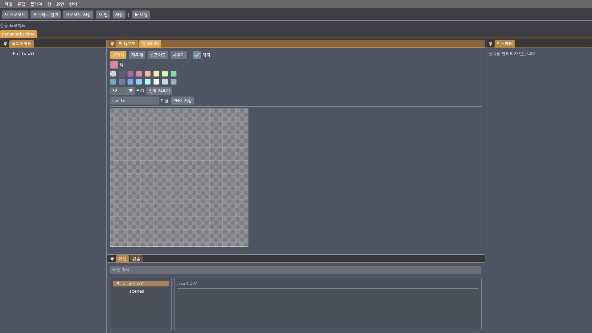

# 07. MyEditor 사용 구조와 편집 계약

MyEditor는 공용 코어·씬·렌더 위에 `mye_editor`와 ImGui를 조합한 Windows 실행 파일이다. Release 위치는 `build/dev/apps/editor/Release/MyEditor.exe`, Debug 위치는 `build/dev/apps/editor/Debug/MyEditor.exe`다. 저장소 루트에서 실행한다.

## 화면과 작업 흐름

| 기능 | 현재 역할 | 소스 |
|---|---|---|
| EditorApp·EditorModule | 도킹 셸·메뉴·단축키·수명 | [EditorApp.cpp](../engine/editor/src/EditorApp.cpp), [EditorModule.cpp](../engine/editor/src/EditorModule.cpp) |
| Hierarchy·Selection | 엔티티 목록·선택 | [Selection.h](../engine/editor/include/mye/editor/Selection.h), [BuiltinPanels.h](../engine/editor/include/mye/editor/BuiltinPanels.h) |
| Inspector | 리플렉션 기반 필드 편집 | [Inspector.cpp](../engine/editor/src/Inspector.cpp) |
| Viewport | 씬 표시·좌표 변환·조작 경계 | [Viewport.h](../engine/editor/include/mye/editor/Viewport.h) |
| Asset Browser·Console | 에셋 탐색·실행 진단 | [BuiltinPanels.h](../engine/editor/include/mye/editor/BuiltinPanels.h) |
| TileEditing·AnimEditing | 타일·높이/경사·애니 클립/이벤트 편집 | [TileEditing.h](../engine/editor/include/mye/editor/TileEditing.h), [AnimEditing.h](../engine/editor/include/mye/editor/AnimEditing.h) |



현재 셸은 어두운 바탕과 주황 강조를 사용한다. 엔티티·파일·확장 패널 이름이 중복되어도 ImGui ID 스코프가 충돌하지 않게 한다. 해상도·DPI·전체 상호작용의 검증 범위는 실제 실행 결과로 기록한다.

## 편집 명령과 문서

[CommandStack](../engine/editor/include/mye/editor/CommandStack.h)과 [Command](../engine/editor/include/mye/editor/Command.h)은 Undo/Redo·구조 변경·필드 변경을 관리한다. 드래그·브러시 같은 연속 입력은 사용자 작업 단위로 묶고, UI 프레임마다 독립 변경을 쌓지 않는다.

[ProjectContext·Document](../engine/editor/include/mye/editor/Project.h)는 프로젝트 메타데이터와 씬 문서를 소유한다. 각 문서는 독립 World·월드 EventBus·Undo 스택을 가진다. 문서 탭을 바꾸면 표시 World와 명령 컨텍스트를 함께 전환하고 이전 월드의 선택·선택 이력을 비운다. 탭 이름의 `*`는 저장하지 않은 씬을 뜻한다.

## 프로젝트 만들기·열기·저장

파일 메뉴와 툴바에서 다음 작업을 실행한다. 네이티브 Windows 파일·폴더 선택 창을 사용하며 한글 경로를 UTF-8↔파일 시스템 경계에서 변환한다.

| 작업 | 단축키 | 동작 |
|---|---|---|
| 새 프로젝트 | Ctrl+Shift+N | 이름과 최종 저장 폴더를 입력한다. 새 폴더 또는 빈 폴더만 허용하고 기본 씬을 만든 뒤 연다. |
| 프로젝트 열기 | Ctrl+Shift+O | `.myeproj`를 선택한다. 파일 메뉴의 프로젝트 폴더 열기도 사용할 수 있다. |
| 프로젝트 저장 | Ctrl+Alt+S | 이름 없는 씬의 파일 이름을 먼저 선택한 뒤 열린 씬 전체와 프로젝트 메타데이터를 저장한다. |
| 새 씬 | Ctrl+N | 현재 프로젝트 안에 독립된 빈 문서를 만든다. |
| 씬 열기 | Ctrl+O | 프로젝트 안의 `.scene`을 읽는다. 같은 파일이 이미 열려 있으면 해당 탭을 활성화한다. |
| 씬 저장 | Ctrl+S | 활성 씬을 저장한다. 이름 없는 씬은 파일 선택 창을 연다. |
| 씬 다른 이름으로 저장 | Ctrl+Shift+S | 프로젝트 안의 새 `.scene` 경로를 선택한다. 다른 열린 문서의 파일은 덮어쓰지 않는다. |

생성 구조는 다음과 같다. 프로젝트 파일의 `mainScene`은 시작 시 편집기로 여는 씬이며 게임 실행 장면 설정은 아직 아니다.

```text
<project>/
  project.myeproj
  assets/scenes/main.scene
  .myeditor/layout.ini    # 로컬 도킹 배치
  .myeditor/session.json  # 로컬 패널 표시 상태
```

```json
{"version":1,"name":"My Project","mainScene":"assets/scenes/main.scene"}
```

`mainScene`은 프로젝트 루트 기준 상대 경로다. 씬 열기·저장은 정규화된 루트 내부로 제한한다. 프로젝트 파일이 없는 기존 `assets/` 폴더도 열 수 있으며 열기만으로 파일을 추가하지 않는다. 이후 첫 씬 저장으로 시작 씬을 지정하고 프로젝트 저장으로 `project.myeproj`를 기록한다. 폴더에 프로젝트 파일이 여러 개 있으면 파일을 직접 선택해야 한다. 알 수 없는 메타데이터 키는 저장할 때 보존한다.

프로젝트·시작 씬을 후보로 모두 읽은 뒤 현재 프로젝트를 교체한다. 손상 JSON, 지원하지 않는 버전·컴포넌트, 중복 ID, 잘못된 부모·순환 계층은 오류로 표시하고 현재 문서를 유지한다. 기본 문서는 공용 씬 컴포넌트를 등록한다. 게임 전용 컴포넌트 등록·에셋 임포트는 별도 연결 항목이다.

프로젝트 전환과 창 닫기는 미저장 변경에 대해 저장·버리기·취소를 확인한다. 저장 실패나 파일 선택 취소는 작업을 중단한다. 시작 씬을 다른 이름으로 저장하면 새 경로도 미저장 프로젝트 변경으로 추적하여 재실행 시 옛 경로를 여는 일을 방지한다. 플레이 중에는 프로젝트·씬 전환과 저장을 제한한다.

씬·프로젝트 JSON은 공용 [JsonFile](../engine/core/include/mye/core/JsonFile.h)의 64 MiB 제한과 인접 임시 파일 쓰기→flush→교체를 사용한다. 실패한 씬 저장은 기존 파일·문서 경로·dirty 상태를 유지한다. 씬·프로젝트 콘텐츠 저장이 성공한 뒤 로컬 레이아웃 저장이 실패하면 콘텐츠 성공은 유지하고 콘솔에 별도 경고를 기록한다. 이미 존재하는 `.tmp`는 덮어쓰거나 자동 삭제하지 않는다. 이전 작업의 잔여 파일인지 확인한 뒤 복구·보관해야 한다. 프로젝트 저장은 파일별 순차 저장이므로 뒤 파일이 실패해도 앞서 성공한 파일은 저장되어 있을 수 있다. 전체 프로젝트를 하나의 트랜잭션으로 보장하지 않는다.

에디터는 명령줄에서도 `--project <folder-or-myeproj>`로 연다. `.myeditor`는 배치·패널 설정이며 최근 프로젝트 목록, 문서 탭 재개, 자동 저장·크래시 복구는 아직 구현하지 않았다.

## Godot에서 참고한 계약

확인일: 2026-10-01. 공식 문서의 작업 흐름을 참고하며 구현은 MyEngine의 C++20·ECS·ImGui와 공용 직렬화를 사용한다. Godot 코드를 복사하지 않았다.

| 공식 자료 | 채택한 동작 | 차이·보류 이유 |
|---|---|---|
| [Project Manager](https://docs.godotengine.org/en/stable/tutorials/editor/project_manager.html) | 프로젝트 이름·빈 폴더 생성, 파일/폴더에서 기존 프로젝트 열기 | 별도 런처·최근 목록·복구 모드는 사용 이력·복구 정책이 필요한 후속 작업이다. 렌더러 선택은 구현된 DX11 한 가지이므로 추가하지 않았다. |
| [File paths in Godot projects](https://docs.godotengine.org/en/stable/tutorials/io/data_paths.html) | 프로젝트 파일을 루트 경계로 삼고 상대 씬 경로와 로컬 편집 설정을 구분 | 기존 파일 경로·GUID/VFS 계약을 유지한다. 새로운 `res://`·`user://` 해석 계층을 중복 작성하지 않았다. |
| [Nodes and Scenes](https://docs.godotengine.org/en/stable/getting_started/step_by_step/nodes_and_scenes.html) | 씬 저장·재열기, 여러 씬 문서, 프로젝트 내부 Save As | 노드 모델 대신 독립 ECS World를 사용한다. 현재 씬/게임 시작 씬 실행 구분은 게임 플레이 시스템 연결 후 검증한다. |
| [Project organization](https://docs.godotengine.org/en/stable/tutorials/best_practices/project_organization.html) | 씬·관련 에셋을 프로젝트 내부에 둔다 | 기존 GUID/.meta/AssetManager를 연결한 뒤 이동·재임포트·깨진 참조 검사를 추가한다. |

앞으로 필요한 기능도 공식 문서·소스의 동작과 실패 조건을 확인한 뒤 MyEngine에 필요한 범위를 선택한다. 채택·차이·보류 이유와 실제 검증을 [작업 기록](16-foundation-worklog.md)에 남긴다.

## PlayWorld

[PlayMode](../engine/editor/include/mye/editor/PlayMode.h)는 편집 World의 스냅샷으로 별도 PlayWorld를 만든다. Play 종료로 임시 게임 상태가 편집 문서를 덮어쓰지 않게 한다. 월드별 이벤트·선택·참조 수명을 함께 정리한다.

현재 UI와 파일 작업 경계는 플레이 중 프로젝트·씬 전환과 저장을 제한한다. 스냅샷·복원 실패는 Expected로 반환하고 편집 상태를 유지한다. PlayWorld가 있다는 사실을 MyGame과 동일한 물리·Lua·게임플레이 조합 완료로 해석하지 않는다. 동일 플레이 시스템 연결은 별도 제품 통합 항목이다.

## 확장과 게임 UI의 경계

[ExtensionRegistry](../engine/editor/include/mye/editor/ExtensionRegistry.h)는 패널·메뉴·툴바·Inspector 확장 등록을 제공한다. 기즈모·오버레이·뷰포트 툴·설정 페이지는 실제 구현·소비 범위를 확인하고 등록 시그니처만으로 동작 완료를 선언하지 않는다.

게임 UI는 `engine/ui`의 Widget·UiSystem·텍스트 경로로 처리한다. 에디터의 ImGui 레이아웃을 게임 HUD·채팅 화면으로 그대로 쓰지 않는다. MCP 개발 도구는 [08](08-mcp.md)에 있으며 에디터 원격 명령·Lua REPL 제어는 현재 연결된 지원 기능이 아니다.

## 검증

에디터 직렬화·선택·커맨드·Undo·PlayWorld·타일/애니 편집은 기존 자체 테스트로 검사한다. 뷰포트는 MyEditor headless 캡처로 확인할 수 있으나 전체 셸·다양한 DPI·파일 대화상자·마우스 워크플로의 검증을 대신하지 않는다. 현재 앱 연결 범위는 [13](13-architecture-and-features.md), 완료 조건은 [14](14-development-priorities.md)에 있다.

2026-10-01: Debug/Release 빌드와 양쪽 CTest 13/13, 내부 검사 514/514 통과. 실제 Release MyEditor에서 한글 `.myeproj`로 시작하고 `renamed.scene`·계층·메뉴·툴바를 1920×1080, DPI 1.00으로 캡처했다. 숨긴 창에 마우스 메시지를 주입한 자동화는 파일 선택 창을 열지 못했다. 네이티브 대화상자의 실제 선택/취소, 미저장 메시지의 버튼 조작, 다양한 DPI의 마우스·키보드 작업은 검증 완료로 표시하지 않는다.
