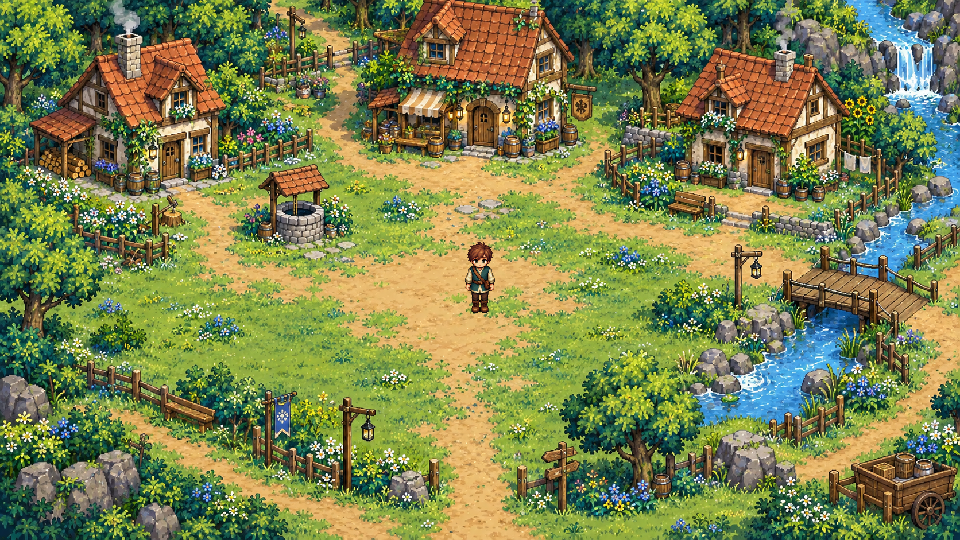

# 07. MyEditor 사용 구조와 편집 계약

MyEditor는 C++20·ECS·DX11·ImGui로 구성한 Windows 에디터다. 실행 파일은 `build/dev/apps/editor/Release/MyEditor.exe`, Debug는 같은 경로의 `Debug/MyEditor.exe`다.


## 기본 프로젝트 시작

실행 파일 옆 `templates/meadow_village/`에 기본 콘텐츠가 배포된다. 프로젝트 인자 없이 시작하면 코어 사용자 디렉터리의 `projects/MeadowVillage/`로 한 번 복사해 연다. 기존 `project.myeproj`가 있으면 그대로 열어 수정한 콘텐츠를 보존한다. 새 프로젝트에서도 **초원마을 기본 에셋 포함**을 선택할 수 있다. 원본 템플릿을 작업 폴더로 쓰지 않는다.

기본 씬은 255개 지형·건물·소품·포털·모험가 엔티티로 구성하며 별도 집 내부 맵은 57개 엔티티다. 캐릭터의 `Progression`은 실제 `level=1`, `xp=0`이며 Inspector에서 확인하고 수정한다. 시작 위치 `(0, -0.9, 0)`, 배율 `0.15`, 애니메이션은 `novice_idle.anim`이다. 콘텐츠 목록·원본 크기·프레임 시간은 [기본 프로젝트 안내](../game/starter/meadow_village/README.md)를 따른다.



건물·타일을 개별 선택해 편집한다. Play는 기존 2D 물리·조작·상호작용·오브젝트 Lua·이벤트 연결·왕복 맵 이동·애니메이션을 실행한다. [오브젝트 제작 안내](17-object-workflow.md)에 컴포넌트·포털·Lua·2D/3D 전환의 사용법과 한계를 기록한다. 기존 사용자 프로젝트는 새 템플릿으로 덮어쓰지 않는다.

## 화면과 문서

상단 왼쪽은 메뉴, 중앙은 **2D · 3D · 씬 · 도트메이커 · Lua**, 오른쪽은 **▶ 실행 · ⏸ 일시정지 · ■ 중지**다. 테두리 없는 작업대 텍스트를 누르면 선택 색·밑줄이 강조되고 중앙 내용이 바뀐다. ▶는 실행 중 비활성화하고 일시정지 상태에서는 계속 진행한다. 좁은 창에서는 작업대·재생 제어가 바로 아래 줄로 이동한다.

| 영역 | 기본 탭 | 추가 탭 |
|---|---|---|
| 왼쪽 위 | Hierarchy | 등록된 도구의 도킹 가능 |
| 왼쪽 아래 | Asset Browser | 창 → 타일 팔레트 |
| 중앙 아래 | Console | 등록된 도구의 도킹 가능 |
| 오른쪽 위 | Inspector | 등록된 도구의 도킹 가능 |
| 오른쪽 아래 | Animation | 창 → 타일맵 편집 |

주변 패널은 탭과 분할 경계를 드래그해 조절한다. 중앙은 상단 텍스트를 작업대 탭으로 쓰고 중복 제목 탭은 숨긴다. 씬 문서 탭은 뷰포트 안에 있다. 새 도킹 루트는 기존 레이아웃 파일을 삭제하지 않고 이번 배치를 처음 적용한다. 이후 분할·패널 상태와 선택한 작업대는 `.myeditor`에 저장한다. 열린 콘텐츠 문서 전체의 재개는 별도 기능이다.

| 화면 | 현재 동작 |
|---|---|
| Hierarchy | ObjectName 표시·선택·생성·삭제·재부모화. Terrain 그룹과 독립 Player |
| Inspector | 기본 이동 구성 버튼·등록 컴포넌트·콜라이더·포털·이벤트→동작·Lua·GUID 드롭 편집 |
| Viewport | 2D/3D 전환·PNG 렌더·팬/줌/회전·선택·충돌 영역. 2D 이동 기즈모, 3D 수치는 Inspector |
| Asset Browser | 프로젝트 에셋 탐색, PNG 드래그, .scene/.anim/.dot 더블 클릭, 에셋 새로 고침. .meta는 숨김 |
| Animation | 독립 애니메이션 문서·Undo, 실제 시트 미리보기·프레임·타임라인·이벤트·저장·씬 지정 |
| Dot Editor | .dot 문서·Undo·PNG 참조·줌/팬·그리기·파츠 뼈·포즈 키·프레임/모션·PNG/.anim/.meta 내보내기·씬 모션 연결 |
| Tile Editing | 창 메뉴의 별도 도구. 기본 배경을 자동으로 지형 타일로 변환하지 않음 |
| Console | 파싱·임포트·저장·실행 오류 |
| 씬 작업대 | 씬 만들기·불러오기·요소 추가, 열린 씬 목록 |
| Lua 작업대 | 선택 오브젝트의 ObjectBehavior.luaSource 편집·기본 코드 생성. 씬 저장·Undo 재사용 |

[ProjectContext·Document](../engine/editor/include/mye/editor/Project.h)는 씬·애니메이션·도트 문서를 소유한다. 씬마다 독립 World·EventBus·Undo가 있고, 애니메이션마다 독립 데이터·Undo가 있다. 씬 탭과 애니메이션 문서 선택은 별개다. 문서 이름의 `*`는 미저장 상태다. 애니메이션 또는 도트 패널에 포커스가 있으면 Undo/Redo·Ctrl+S는 그 문서를 대상으로 한다.

[CommandStack](../engine/editor/include/mye/editor/CommandStack.h)을 통해 구조·필드·애니메이션을 수정한다. 스프라이트에 클립을 지정하는 작업은 씬 Undo로 기록한다. 기존 컴포넌트 값을 복원하고 새로 추가한 Animator는 Undo 시 제거한다. 기즈모와 Inspector의 Transform 수정·Undo는 월드 행렬을 다시 갱신한다.

## 프로젝트 만들기·열기·저장

네이티브 Windows 파일·폴더 선택과 UTF-8 파일 시스템 경계를 사용한다.

| 작업 | 단축키 | 동작 |
|---|---|---|
| 새 프로젝트 | Ctrl+Shift+N | 이름·빈 최종 폴더·기본 에셋 포함 여부 선택 |
| 프로젝트 열기 | Ctrl+Shift+O | .myeproj 선택. 파일 메뉴에서 폴더 열기도 가능 |
| 프로젝트 저장 | Ctrl+Alt+S | 열린 씬·애니메이션과 프로젝트 메타데이터 저장. 이름 없는 문서는 먼저 경로 지정 |
| 새 씬 / 씬 열기 | Ctrl+N / Ctrl+O | 2D·3D 보기 선택 후 독립 빈 씬 생성 / 프로젝트 내부 .scene 열기 |
| 저장 | Ctrl+S | 선택한 도트 작업대·포커스가 있는 애니메이션·활성 씬 저장 |
| 씬 다른 이름으로 저장 | Ctrl+Shift+S | 프로젝트 내부 .scene 지정. 애니메이션 포커스에서는 패널 저장 경로 사용 안내 |

```text
<project>/
  project.myeproj
  assets/scenes/*.scene
  assets/environment/*.png + .meta
  assets/characters/*.png + .meta
  assets/animations/*.anim + .meta
  .myeditor/layout.ini
  .myeditor/session.json
```

프로젝트 형식은 `{"version":1,"name":"My Project","mainScene":"assets/scenes/main.scene"}`이다. `mainScene`은 루트 기준 상대 경로로 시작 시 편집하는 씬을 지정한다. 씬 열기·저장은 정규화된 프로젝트 내부, 애니메이션은 `assets/` 내부로 제한한다. 같은 파일의 중복 문서를 열지 않고 다른 열린 문서의 파일을 덮어쓰지 않는다. 애니메이션의 다른 이름 저장은 기존 파일 덮어쓰기를 확인한다.

프로젝트 파일 없는 기존 `assets/` 폴더도 열 수 있다. ProjectContext의 읽기는 메타데이터를 만들지 않지만 에디터의 에셋 스캔은 필요한 PNG/.anim의 누락 .meta를 생성한다. 첫 씬 저장으로 시작 씬을 지정하고 프로젝트 저장으로 project.myeproj를 기록한다. 여러 프로젝트 파일이 있으면 직접 파일을 선택한다. 알 수 없는 프로젝트 메타데이터 키는 보존한다.

후보 프로젝트와 시작 씬의 파싱·컴포넌트·계층 검증 후 현재 프로젝트를 교체한다. 전환·종료 시 미저장 문서에 대해 저장·버리기·취소를 확인한다. 파싱 실패·저장 실패·선택 취소는 기존 작업을 보존한다. 플레이 중 프로젝트·씬 전환과 씬 저장·클립 지정은 제한한다.

JSON은 공용 [JsonFile](../engine/core/include/mye/core/JsonFile.h)의 64 MiB 제한과 임시 파일 쓰기→flush→교체를 사용한다. 실패한 저장은 원본·경로·dirty를 유지한다. 기존 .tmp를 자동 삭제하거나 덮어쓰지 않는다. 전체 프로젝트는 파일별 순차 저장이므로 앞 파일 성공 뒤 다른 파일이 실패할 수 있다. 로컬 레이아웃 저장 실패는 콘텐츠 저장과 별도로 기록한다.

## 씬 만들기와 요소 추가

**상단 씬 → 씬 만들기** 또는 Hierarchy의 **씬 만들기**에서 2D/3D를 선택한다. 같은 ECS 씬 형식을 사용하며 평면/원근 카메라로 시작하는 차이다. 3D 메시·물리 제작을 추가하는 선택은 아니다.

**+ 요소 추가** 또는 Hierarchy의 **+ 추가**를 누르면 검색·설명·목록을 가진 창이 열린다. 오브젝트, 스프라이트, 캐릭터, 충돌 영역, 트리거, 상호작용, 도착 지점, Lua 오브젝트 중 선택해 **추가**·Enter·더블 클릭으로 확정한다. Escape는 취소한다. 선택한 부모 아래에 만들며 캐릭터는 최상위에 만든다. PNG와 이벤트 행동·목적지 연결은 Inspector에서 지정한다. 캐릭터는 기존 기본 이동 구성을 재사용하며 활성 조작 캐릭터가 이미 있으면 거부한다.

생성·이름·필수 컴포넌트는 한 Undo 트랜잭션이다. 새 직렬화나 미지원 요소의 임시 항목을 추가하지 않는다. Lua 작업대의 소스는 씬에 저장되고 Play 재시작 시 적용된다. 외부 .lua 파일 에디터·구문 강조·디버거는 미지원이다.

## 애니메이션 수정·제작

1. 에셋 창의 `animations/`에서 `novice_idle.anim` 또는 `novice_walk.anim`을 더블 클릭한다.
2. 타임라인에서 프레임별 초 단위 시간을 입력하고 Enter로 확정한다. 보기·순서 이동·삭제와 반복·정방향/역방향/왕복을 수정한다.
3. 시트 프레임을 펼쳐 영역 x/y/w/h와 픽셀 피벗을 편집한다. 시트 프레임 이미지를 누르면 타임라인에 추가한다.
4. 이벤트의 타임라인 위치·이름·문자열/수치 인자를 지정한다. 기존 이벤트는 삭제 후 다시 추가해 수정한다. 기본 footstep 이벤트는 사운드를 자동 연결하지 않는다.
5. 재생·정지·처음으로·속도로 실제 PNG 프레임을 미리 보고 패널의 저장 경로로 저장한다.
6. Hierarchy/Viewport에서 캐릭터를 선택하고 **선택한 스프라이트에 지정**을 누른 뒤 씬을 저장한다. Play에서 해당 클립을 재생한다.

새 클립은 **새 애니메이션** → PNG를 **PNG 시트 놓기**로 드래그 → 셀 크기 입력 → **그리드에서 프레임 만들기** 순서다. 기존 SpriteSheetImporter의 그리드 분할을 사용한다. 제공된 novice 시트는 균등 그리드가 아니므로 저장된 프레임별 영역을 사용한다. 원본 픽셀을 그리거나 지우는 기능은 Dot Editor의 책임이며 Animation 패널은 이미지 영역·시간·이벤트를 편집한다.

`.anim`은 기존 SpriteSheet·AnimationClipData를 담는 version 1 JSON이다. GUID, 실제 이미지 크기, 영역/피벗, 타임라인/시간, 방향, 이벤트를 검증하며 PNG 크기가 다르면 재생에 연결하지 않는다. 상세 계약은 [에셋 파이프라인](04-asset-pipeline.md)을 따른다.

## 에셋과 PlayWorld

EditorModule은 `assets://` VFS·AssetManager·AssetDatabase와 retained TextureHandle을 소유한다. .meta GUID로 PNG를 해석하고 `.anim`의 작업 데이터 또는 파일 데이터를 SpriteAnimator의 비소유 런타임 참조에 연결한다. 런타임 포인터는 씬에 저장하지 않는다. 외부 파일 변경은 Stop 후 **에셋 새로 고침**으로 반영한다. watcher 자동 시작과 .meta 임포트 설정 적용은 남아 있다.

[PlayMode](../engine/editor/include/mye/editor/PlayMode.h)는 편집 World의 스냅샷으로 별도 PlayWorld를 만든다. 고정 FixedUpdate에서 ObjectSystem의 Lua·조작·물리·트리거·상호작용을 처리한 뒤 애니메이션·Transform을 갱신한다. E는 프레임에서 포착해 고정 틱에서 한 번 소비한다. Pause/Step도 같은 경로다. SceneTransitionManager는 검증한 목적지 PlayWorld로 교체한다. Stop은 VM 참조부터 해제한 뒤 PlayWorld를 폐기하고 편집 문서를 유지한다. MyGame·MMO의 동일 콘텐츠 통합, 대화 위젯·NPC·퀘스트 연결은 별도 요구다.

## 명령줄

```powershell
.\build\dev\apps\editor\Release\MyEditor.exe --project <folder-or-myeproj>
# 기본 프로젝트의 애니메이션 패널도 열기
.\build\dev\apps\editor\Release\MyEditor.exe --project <folder-or-myeproj> --animation assets/animations/novice_idle.anim
# 창 없는 DX11 씬·Play 캡처
.\build\dev\apps\editor\Release\MyEditor.exe --project <folder-or-myeproj> --play --headless --frames 3200 --dump build/play.bmp
```

3D 보기·오브젝트 선택 캡처는 다음 옵션을 사용한다. 실제 네이티브 키 입력을 주입하는 옵션은 아니다.

```powershell
.\build\dev\apps\editor\Release\MyEditor.exe --project <project> --view3d
.\build\dev\apps\editor\Release\MyEditor.exe --project <project> --select "Village Sign"
.\build\dev\apps\editor\Release\MyEditor.exe --project <project> --workspace scenes
.\build\dev\apps\editor\Release\MyEditor.exe --project <project> --dot assets/sprites/novice.dot --workspace dot
```

`--workspace`는 `2d`, `3d`, `scenes`, `dot`, `lua`를 받는다. 지정하지 않으면 저장된 작업대를 사용한다. 캡처 시 시작 화면을 고르는 기능이며 사용자 입력을 주입하지 않는다.

## Godot에서 참고한 계약

확인일: 2026-10-01. 이전 프로젝트 파일 작업에서 확인한 공식 자료와 채택 범위다. Godot 코드를 복사하지 않았으며 MyEngine의 ECS·GUID/VFS·공용 직렬화를 유지한다.

| 공식 자료 | 채택한 동작 | 차이·보류 이유 |
|---|---|---|
| [Project Manager](https://docs.godotengine.org/en/stable/tutorials/editor/project_manager.html) | 이름·빈 폴더 생성, 파일/폴더 열기 | 최근 목록·별도 런처·복구 정책은 후속 작업 |
| [File paths in Godot projects](https://docs.godotengine.org/en/stable/tutorials/io/data_paths.html) | 프로젝트 내부 경로와 로컬 편집 설정 구분 | 기존 assets://·GUID 재사용, 새 res:// 계층 미도입 |
| [Nodes and Scenes](https://docs.godotengine.org/en/stable/getting_started/step_by_step/nodes_and_scenes.html) | 여러 씬 문서와 저장/재열기 | 노드 대신 독립 ECS World |
| [First look at the editor](https://docs.godotengine.org/en/stable/getting_started/introduction/first_look_at_the_editor.html) | 왼쪽 메뉴·중앙 작업대·오른쪽 실행, 주변 도크·하단 패널 | 사용자 지정 5개 작업대·5개 주변 영역, 기존 PlayWorld 사용 |
| [Nodes and Scenes](https://docs.godotengine.org/en/stable/getting_started/step_by_step/nodes_and_scenes.html), [CreateDialog source (4.5)](https://github.com/godotengine/godot/blob/4.5/editor/gui/create_dialog.cpp), [EditorNode source (4.5)](https://github.com/godotengine/godot/blob/4.5/editor/editor_node.cpp) | 2D/3D 시작 선택, 요소 검색·설명·선택·확정, 명시적 작업대 전환 | 지원하는 ECS 조합만 표시. 노드 상속·즐겨찾기·전체 노드 카탈로그는 미도입 |
| [Project organization](https://docs.godotengine.org/en/stable/tutorials/best_practices/project_organization.html) | 관련 콘텐츠를 프로젝트에 포함 | PNG/.anim GUID 연결 완료, 이동·재임포트 실패 검사는 후속 |

이번 스프라이트 애니메이션 공식 문서의 브라우저 접근은 권한 거부로 실패했다. 해당 내용을 읽거나 새 기능을 공식 동작과 비교 완료했다고 기록하지 않는다. 기존 ClipPlayback·SpriteSheetImporter·편집 명령의 검증된 계약으로 구현했다. 재확인은 접근이 허용되는 환경에서 진행한다.

## 검증과 한계

2026-10-01 최종 작업대 변경: Debug/Release 전체 빌드·각 CTest 13/13, 내부 검사 각 532/532 통과. 기본 프로젝트 수정 보존, 저장 실패 보존, 애니메이션/씬 Undo 분리, 레벨 1 왕복, GUID 유지, 잘못된 프레임·이벤트·경로, Transform 파생 데이터와 렌더 영역을 검사했다. 실제 ImGui 경로로 도킹·작업대·씬 생성·검색/Enter·Lua 기본 코드/Undo·실행/일시정지/중지·640×480 프레임을 확인했다. Release 다섯 작업대의 MCP 캡처는 모두 exit 0이다.

기존 MyEngine MCP 서버를 공식 SDK stdio Client로 호출해 실제 Release MyEditor의 1920×1080 셸과 960×540 headless 씬·Play를 캡처했다. 셸 이미지는 MCP가 960×540으로 축소한다. Play 캡처의 픽셀 변화는 캐릭터 영역으로 한정되어 실제 프레임 진행을 확인했다. 원본 PNG를 재가공한 그림을 앱 캡처로 표시하지 않는다.

Computer Use의 네이티브 sky RPC가 설정되어 있지 않아 마우스·키보드로 편집/파일 선택을 실행하지 못했다. 네이티브 대화상자·미저장 버튼·여러 DPI 전체 조작은 미검증이다. 렌더는 point 샘플링하지만 ImGui 미리보기의 필터는 별도이며, 선택은 AABB여서 투명 픽셀·정확한 가림 선택은 후속이다. 최근 목록·자동 저장·복구·문서 탭 재개도 미구현이다.

게임 UI는 engine/ui의 Widget·텍스트 경로로 처리한다. 에디터 ImGui를 게임 HUD로 재사용하지 않는다. MCP는 실행·캡처 도구이며 에디터 내부 원격 편집 명령은 아직 없다. 변경 이유·실행 근거·제한은 [작업 기록](16-foundation-worklog.md), 우선순위는 [14](14-development-priorities.md)에 기록한다.

오브젝트·맵 연결 후속 작업에서도 새 공식 페이지 접근은 기존 보안 정책 거부로 확인하지 못했다. 이를 우회 조회하거나 추가 벤치마킹 완료로 표시하지 않았다. 현재 동작은 저장소의 ECS·PhysicsWorld2D·ScriptSystem·SceneTransitionManager 계약을 근거로 구현했다.

## 도트·모션·테마 제작

하단 상태 영역과 중립 회색 테마, 직접 그린 벡터 아이콘·텍스트 버튼으로 메뉴·상태·선택을 구분한다. 기본 이동은 필요한 컴포넌트를 한 트랜잭션으로 추가한다. 도트 원본/리깅/모션 내보내기와 공식 Godot/PixelOver 근거, 한계·검증 범위는 [18](18-editor-authoring.md), 제작 순서는 [웹 가이드](guide/index.html)에 있다. 새 기본 프로젝트에 편집 가능한 novice.dot을 제공한다.
