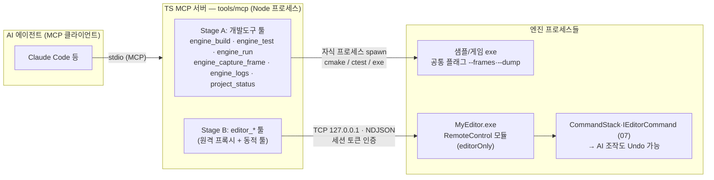
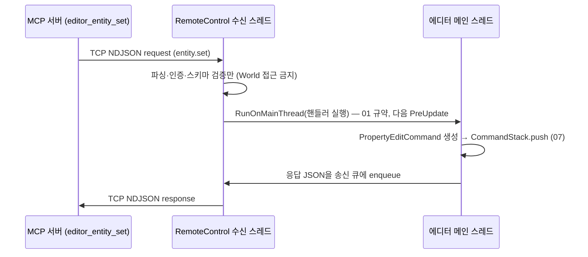

# 08. MCP 시스템 (AI Agent Integration)

> 소유 범위: 엔진 전용 MCP(Model Context Protocol) 서버(`tools/mcp`), 샘플·에디터가 원격 도구에 노출하는
> CLI/프로토콜 계약, 에디터 `RemoteControl` 모듈과 `RemoteCommandRegistry`.
> **"AI 에이전트를 엔진의 1급 사용자로"** — 확장성 극대화 원칙(00 §1)을 사람 바깥의 사용자에게까지 확장하는 모듈이다.

---

## 목표와 책임

### 목표

- **개발 루프의 완결.** AI 에이전트가 사람 개입 없이 "코드 수정 → 빌드 → 테스트 → 실행 → **렌더 결과를 이미지로 관찰**"
  루프를 닫는다. 특히 렌더링 엔진 개발에서 "화면 좀 봐줘"를 대체하는 **AI의 눈**(프레임 캡처 → MCP 이미지 반환)이 핵심이다.
- **콘텐츠 루프의 개방.** AI가 에디터를 원격 조작해 씬 배치·프로퍼티 수정·타일 페인팅·Lua 실행·뷰포트 확인을 수행한다.
  AI는 특권 사용자가 아니라 **또 하나의 에디터 사용자**다 — 사람과 동일한 커맨드 시스템(07 `IEditorCommand`)을 경유하므로
  AI의 모든 조작이 History에 남고 `Ctrl+Z`로 되돌릴 수 있다.
- **토큰 경제.** 도구 출력은 AI의 컨텍스트를 소비한다. 빌드 로그 수천 줄이 아니라 **에러·경고 중심 요약**을 반환하고,
  원문은 로그 파일로 우회한다. "요약 반환 + 전체는 로그 조회로"가 전 도구 공통 원칙이다.
- **확장 루프에의 편입.** "리플렉션 한 번 등록 = 직렬화(04) + 인스펙터(07) + Lua(05)"라는 엔진 핵심 루프(00 §1)에
  **"+ 원격 API"** 를 추가한다. 플러그인·Lua가 등록한 원격 커맨드는 MCP 툴로 자동 노출된다.

### 책임

| 책임 | 내용 |
|---|---|
| MCP 서버 (`tools/mcp`) | TypeScript + 공식 MCP SDK, stdio 트랜스포트. Stage A 개발도구 툴 + Stage B 에디터 프록시 툴 |
| 빌드·테스트·실행 래핑 | cmake/ctest/샘플 exe를 자식 프로세스로 실행하고 출력을 파싱·요약 |
| 프레임 캡처 파이프라인 | 샘플 `--dump` BMP → PNG 변환 → MCP 이미지 콘텐츠 반환 |
| 원격 제어 프로토콜 | NDJSON over TCP(localhost) 프레이밍·인증·에러 규약 정의 (Stage B) |
| `RemoteControl` 모듈 | 에디터 쪽 TCP 수신·메인 스레드 마샬링·내장 원격 커맨드 (Stage B, 구현은 M4) |
| `RemoteCommandRegistry` | 플러그인·Lua의 원격 커맨드 등록 관문과 MCP 동적 툴 노출 (Stage B) |

### 비책임 (다른 모듈 소유)

- 에디터 커맨드·선택·플레이 모드의 정의와 구현 → **07 소유**. 본 모듈은 그것을 호출하는 원격 표면만 정의한다.
- 리플렉션·직렬화(엔티티의 JSON 표현) → **04 소유**. 본 모듈은 소비자다.
- Lua protected 실행·에디터 Lua 스테이트 규약 → **05·07 소유**. `lua.eval`은 기존 경로를 재사용한다.
- 메인 루프·`RunOnMainThread`·이벤트 버스 → **01 소유**.
- MCP 프로토콜 자체 → 공식 SDK(`@modelcontextprotocol/sdk`) 소유. 프레이밍·핸드셰이크를 재발명하지 않는다.
- CI/CD 파이프라인 — 미래에 같은 파서를 공유할 수는 있으나(오픈 이슈 #8) 본 모듈의 범위가 아니다.

---

## 설계 개요

### 전체 그림



- **MCP 서버는 엔진 코드를 링크하지 않는다.** Stage A는 오직 CLI(cmake·ctest·exe 실행)와 파일(BMP·로그)로만,
  Stage B는 TCP 소켓으로만 엔진과 상호작용한다. 엔진이 크래시해도 서버는 살아서 크래시를 **보고**할 수 있고,
  엔진 빌드가 깨져도 서버는 뜬다 — 이 프로세스 분리가 "AI가 엔진을 고치는 도구"의 전제다.
- **TypeScript 채택 근거**: 공식 MCP SDK의 1차 언어(성숙도 최고), 이미지 처리(BMP→PNG)가 순수 JS 라이브러리로 해결,
  Node.js 24 확인됨. 엔진(C++)과 언어가 달라도 무방하다 — 위 원칙대로 링크 경계가 없기 때문이다.
- **stdio 트랜스포트**: MCP 표준이자 Claude Code 기본. 서버 stdout은 프로토콜 전용이므로
  서버 자체 로그는 **stderr와 파일로만** 낸다(stdout 오염 = 프로토콜 파손).

### 2단계 로드맵 — Stage A / Stage B

| | Stage A — 개발도구 | Stage B — 에디터 원격 제어 |
|---|---|---|
| 구현 시점 | **지금(M0과 병행)** | 설계만 지금, **구현은 로드맵 M4**(에디터 P0~P1)와 함께 |
| 대상 | cmake·ctest·샘플 exe (에디터 불필요) | 실행 중인 MyEditor.exe |
| 통신 | 자식 프로세스 spawn + 파일 | TCP 127.0.0.1 + NDJSON + 세션 토큰 |
| AI의 눈 | `engine_capture_frame` (exe `--dump` BMP) | `editor_screenshot` (뷰포트 RT readback) |
| 안전 모델 | 리포지토리 루트 밖 접근 없음, 임의 셸 실행 툴 없음 | 모든 변경 `IEditorCommand` 경유 → Undo 통합 |

Stage A가 먼저인 이유: 소비자(에디터)가 없는 인프라를 만들지 않는다는 보조 원칙(00 §1) 그대로다.
M0~M3 구간의 소비자는 "엔진을 빌드·실행·관찰하는 AI"이고, 에디터가 존재하는 M4부터 Stage B의 소비자가 생긴다.

### Stage A — 개발도구 MCP 서버 (`tools/mcp`)

**디렉터리·빌드·등록**

```
tools/mcp/
  package.json           // deps: @modelcontextprotocol/sdk, zod, bmp-js, pngjs
  tsconfig.json          // ES2022, module NodeNext, outDir dist/
  src/
    index.ts             // 서버 엔트리: McpServer + StdioServerTransport, 툴 일괄 등록
    root.ts              // 리포 루트 해석(../../ 기준, MYE_ROOT 환경변수로 오버라이드)
    proc.ts              // 자식 프로세스 spawn 공통(셸 미사용·타임아웃·프로세스 트리 kill)
    summarize.ts         // MSVC/CMake/ctest 출력 파서(에러·경고 요약)
    state.ts             // .state/ 로그·캡처·상태 파일 관리
    tools/               // 파일 1개 = 툴 1개 컨벤션 (확장 포인트 §3)
      build.ts  test.ts  run.ts  capture.ts  logs.ts  status.ts
  .state/                // (gitignore) logs/ · captures/ · status.json
  .gitignore             // node_modules/ dist/ .state/
```

- 빌드: `npm install && npm run build`(tsc → `dist/`). 실행: `node dist/index.js`.
- 리포 루트의 `.mcp.json`에 등록해 Claude Code가 프로젝트 진입 시 자동 연결:

```json
{
  "mcpServers": {
    "myengine": { "command": "node", "args": ["tools/mcp/dist/index.js"] }
  }
}
```

**전 툴 공통 규약**

1. **작업 디렉터리 = 리포 루트.** 모든 경로 파라미터는 루트 상대 경로만 허용하고 루트 밖 탈출(`..`)을 거부한다.
2. **셸 미사용 spawn.** 인자 배열로만 자식 프로세스를 만든다(인젝션 원천 차단). 임의 명령 실행 툴은 **만들지 않는다**.
3. **타임아웃 + 프로세스 트리 kill.** 모든 자식 프로세스에 타임아웃(툴별 기본값, 파라미터로 조정)을 걸고
   초과 시 `taskkill /PID <pid> /T /F`로 자식까지 정리한다. 좀비 exe가 다음 빌드의 파일 락을 잡는 사고 방지.
4. **직렬화 뮤텍스.** 빌드·테스트·실행·캡처는 서버 전역 뮤텍스 1개로 직렬화한다. 진행 중이면 대기하지 않고
   즉시 "다른 작업 진행 중(무엇이, 언제부터)" 에러를 반환한다 — AI가 상황을 알고 재시도하게 한다.
5. **출력 상한.** 어떤 툴도 대략 8KB를 넘는 텍스트를 반환하지 않는다. 원문 전체는 `.state/logs/`에 저장하고
   반환문 끝에 로그 파일 경로와 "전체는 engine_logs로"를 안내한다.
6. **실패의 우아함.** 실패는 MCP `isError` + 원인 + **다음 행동 제안**(예: "빌드 산출물이 없습니다 — engine_build를 먼저 실행하세요")으로
   반환한다. 스택 트레이스를 그대로 던지지 않는다.
7. **상태 기록.** 각 툴은 성공·실패를 `.state/status.json`에 남긴다(마지막 빌드 구성·결과·시각 등) — `project_status`의 데이터원.

**빌드 요약 원칙(토큰 절약의 핵심)**

- MSVC 진단 정규식: `^\s*(파일)\((줄)(,열)?\)\s*: (fatal )?(error|warning) (C\d+|LNK\d+|MSB\d+): (메시지)`
  + `CMake Error at ...` 블록. 파일·줄·코드·메시지로 구조화하고 **동일 (파일,줄,코드) 중복은 제거**한다
  (헤더 에러가 TU마다 반복되는 문제).
- 반환은 에러 최대 30건·경고 최대 10건 + 총계. 성공 시엔 한 줄 요약("BUILD OK …")과 경고 총계만.

**샘플 CLI 계약 (01·02와의 교차 계약 — 경계 섹션 참조)**

모든 L5 샘플/게임 exe는 공통 플래그 두 개를 지원한다. M0의 `hello_triangle`부터 적용된다.

| 플래그 | 의미 |
|---|---|
| `--frames <N>` | N 프레임 렌더 후 exit code 0으로 자동 종료. 무인 실행의 전제 |
| `--dump <path.bmp>` | 마지막 프레임(=N번째)의 백버퍼를 BMP(24/32bpp, sRGB)로 저장 후 종료. 스왑체인 소유자인 02가 구현 |

BMP를 쓰는 이유: 엔진 쪽에 인코더 의존성이 0(메모리 레이아웃 그대로 쓰기)이고, PNG 변환은 서버(Node)가 담당한다.

### Stage B — 에디터 원격 제어 (구현은 M4)

**연결·발견·인증**

- 에디터의 `RemoteControl` 모듈이 **127.0.0.1 전용**으로 TCP 리슨(기본 포트 46464, 에디터 설정으로 변경).
- 에디터는 시작 시 128비트 난수 **세션 토큰**을 생성하고 `<project>/.myeditor/remote.json`에
  `{ "port": 46464, "token": "...", "pid": 1234 }`를 기록한다(`.myeditor/`는 이미 gitignore — 07 §6).
  MCP 서버는 이 파일을 읽어 접속한다 — 포트 스캔도, 하드코딩 토큰도 없다.
- 접속 후 **첫 요청은 반드시 `session.hello`**(토큰·클라이언트 이름·프로토콜 버전). 토큰 불일치 또는
  3초 내 hello 미도착 시 즉시 소켓 종료. hello 응답에는 에디터 버전·프로토콜 버전·등록된 원격 커맨드 목록이 담긴다.

**NDJSON 프레이밍과 메시지 구조**

한 줄 = 완전한 JSON 객체 하나(UTF-8, `\n` 종결). 길이 프리픽스 프레이밍보다 디버깅이 쉽고(telnet으로 육안 확인),
Lua/파이썬 등 다른 클라이언트 작성도 쉽다.

```jsonc
// → 요청 (클라이언트 → 에디터). id는 클라이언트가 부여, 응답 매칭용
{ "type": "request",  "id": 42, "method": "entity.set", "params": { /* ... */ } }
// ← 성공 응답
{ "type": "response", "id": 42, "ok": true,  "result": { /* ... */ } }
// ← 실패 응답
{ "type": "response", "id": 42, "ok": false, "error": { "code": "E_NOT_FOUND", "message": "entity 7f3 없음" } }
// ← 이벤트 (session.subscribe 후 에디터가 push, id 없음)
{ "type": "event", "name": "play.stateChanged", "payload": { "state": "Playing" } }
```

표준 에러 코드: `E_AUTH`(토큰), `E_BAD_PARAMS`, `E_NOT_FOUND`, `E_PLAY_STATE`(모드 불일치 — 예: Edit 중 game 스테이트 eval),
`E_LUA`(트레이스백 동봉), `E_BUSY`, `E_INTERNAL`. 원격 에러가 에디터를 죽이는 일은 없어야 한다(05 에러 격리 철학과 동일).

**스레딩 모델 — 수신 스레드 + 메인 스레드 마샬링**



- 수신 스레드는 소켓 I/O·파싱·인증까지만 담당한다. **World·에디터 상태 접근은 전부 메인 스레드**에서 —
  01의 `RunOnMainThread` 큐(다음 PreUpdate 실행)로 마샬링한다. 01의 "구독자 호출은 항상 메인 스레드" 계약과 정합.
- 한 연결의 요청은 도착 순서대로 처리한다(파이프라이닝 허용, 순서 보장). 요청당 1프레임 안팎의 지연은 설계상 수용한다 —
  이 채널은 대화형 조작용이지 실시간 스트리밍용이 아니다.
- 이벤트 브릿지는 역방향: 메인 스레드에서 발생한 에디터 이벤트(01 이벤트 버스·에디터 이벤트)를 JSON으로 직렬화해
  송신 큐에 넣고, 수신 스레드가 소켓에 쓴다.

**모든 변경은 `IEditorCommand` 경유 (Undo 통합 — 이 설계의 심장)**

- 원격 핸들러는 World를 직접 만지지 않는다. 07의 "패널이 World 직접 조작 금지" 규약이 원격에도 동일 적용된다.
  프로퍼티 변경은 리플렉션 제네릭 `PropertyEditCommand`, 구조 변경은 Create/Destroy/Reparent 커맨드,
  타일 페인팅은 `TilePaintCommand` — **전부 07의 기존 커맨드를 재사용**하고 새 커맨드를 만들지 않는다.
- AI 조작 커맨드는 라벨에 `[AI]` 접두를 붙인다 → History 패널에서 사람이 AI의 작업 내역을 감사하고,
  마음에 안 들면 `Ctrl+Z`로 회수한다. 연속 조작은 `CommandTransaction`으로 묶어 Undo 한 번에 되돌리게 한다.
- 읽기(조회·스크린샷·상태)는 커맨드를 만들지 않는다. `RemoteCommandDesc.mutates` 플래그가 이 구분을 계약으로 명시한다.

**보안·안전 원칙 (Stage A·B 공통)**

1. **localhost 전용.** TCP는 127.0.0.1 바인딩만. 원격 네트워크 노출은 설계상 존재하지 않는다.
2. **세션 토큰.** 같은 머신의 다른 프로세스가 임의 접속하는 것을 차단. 토큰은 에디터 재시작마다 갱신.
3. **파괴적 조작 미노출.** 파일 삭제·임의 셸 실행·프로젝트 루트 밖 경로 접근·에셋 원본 수정은 어떤 툴로도 노출하지 않는다.
   씬 저장(`scene.save`)만 예외적 디스크 쓰기이며 열린 씬 파일에 한정된다. 되돌릴 수 없는 조작을 원격 표면에 두지 않는 것이 원칙.
4. **우아한 실패.** 에디터가 떠 있지 않으면(`remote.json` 부재·접속 거부) `editor_*` 툴은 짧은 타임아웃(1초) 후
   `isError`로 "에디터가 실행 중이 아닙니다. MyEditor.exe --project <path>로 실행 후 재시도하세요"를 반환한다.
   행(hang)·예외·재시도 루프 금지. `remote.json`의 `pid` 생존 검사로 죽은 세션 파일도 감지한다.
5. **Lua eval 가드.** `lua.eval`은 05의 `protected_function` + `lua_sethook` 명령 수 상한으로 무한 루프를 방어한다.

---

## 핵심 타입·API 스케치

### Stage A 툴 카탈로그 (확정 — 이번에 구현)

| 툴 | 파라미터 (기본값) | 반환 |
|---|---|---|
| `engine_build` | `config`: `"Debug"\|"Release"` (Debug) · `target`: string? (전체) · `clean`: bool (false) · `timeoutSec`: int (600) | 텍스트: 성공/실패 한 줄 요약 + 구조화된 에러(≤30)·경고(≤10) 목록 `파일(줄): 코드: 메시지` + 로그 파일 경로 |
| `engine_test` | `config` (Debug) · `filter`: string? (ctest `-R` 정규식) · `timeoutSec`: int (120) | 텍스트: `passed/failed/total` + 실패 테스트별 이름·출력 꼬리(≤50줄) + 로그 경로 |
| `engine_run` | `sample`: string (필수) · `config` (Debug) · `frames`: int (120) · `args`: string[]? · `timeoutSec`: int (30) | 텍스트: exit 코드(크래시 코드 해석 포함)·소요 시간·timedOut 여부 + stdout/stderr 꼬리(≤80줄, 에러 라인 우선) |
| `engine_capture_frame` | `sample`: string ("hello_triangle") · `config` (Debug) · `frame`: int (60) · `args`: string[]? · `timeoutSec`: int (30) | **MCP 이미지 콘텐츠(PNG)** + 텍스트 메타(해상도·프레임·저장 경로·exit 코드) — AI의 눈 |
| `engine_logs` | `source`: `"run"\|"build"\|"test"\|"capture"` ("run") · `lines`: int (100) · `filter`: string? (정규식) · `level`: `"all"\|"warn"\|"error"` ("all") | 텍스트: 최신 해당 세션 로그의 tail·필터 결과 + 원본 경로·총 라인 수 |
| `project_status` | (없음) | 텍스트: configure 상태(제너레이터)·마지막 빌드/테스트/실행 요약·샘플 목록·최근 캡처·서버 버전 |

각 툴의 동작 상세:

**`engine_build`**
- `build/CMakeCache.txt`가 없으면 자동 configure: `cmake -S . -B build -G "Visual Studio 18 2026" -A x64`.
  configure 수행 여부를 반환문에 명시한다.
- 빌드: `cmake --build build --config <config> [--target <target>] [--clean-first] -- /m`.
- 요약 파서는 위 "빌드 요약 원칙"을 따른다. `ok=false`면 `isError` 플래그.

**`engine_test`**
- `ctest --test-dir build -C <config> --output-on-failure [-R <filter>]`. 자동 빌드는 하지 않는다 —
  테스트 실행 파일 부재 시 "engine_build를 먼저" 안내 에러. 요약은 ctest 총계 라인 + 실패 테스트 출력 파싱.

**`engine_run`**
- exe 탐색: `build/samples/<sample>/<config>/<sample>.exe` 우선, 없으면 `build/**/<config>/<sample>.exe` 글롭 폴백.
- `--frames <frames>` + `args`를 붙여 spawn(cwd=리포 루트 — 에셋 상대 경로 가정). 표준 출력·에러를 세션 로그로 저장.
- 비정상 종료 코드는 알려진 NTSTATUS(예: `0xC0000005` Access Violation, `0xC0000409` Stack Buffer Overrun)를 해석해 병기한다.

**`engine_capture_frame`**
- `--frames <frame> --dump <임시.bmp>`로 실행 → 종료 대기 → BMP 검증·디코드(`bmp-js`) → PNG 인코드(`pngjs`) →
  `.state/captures/<sample>-<ts>.png` 저장 → `content: [{type:"image", data: base64, mimeType:"image/png"}, {type:"text", ...}]` 반환.
- 덤프 파일 미생성·디코드 실패 시 `isError` + 프로세스 출력 꼬리 동봉(원인 추적).

**서버 등록 형태 (TypeScript, 공식 SDK)**

```ts
// src/tools/capture.ts — 파일 1개 = 툴 1개 컨벤션
import { z } from "zod";
export function registerCaptureTool(server: McpServer, ctx: ServerContext) {
  server.registerTool("engine_capture_frame", {
    description: "샘플을 N프레임 실행해 마지막 프레임을 PNG 이미지로 캡처한다 (AI의 눈)",
    inputSchema: {
      sample: z.string().default("hello_triangle"),
      config: z.enum(["Debug", "Release"]).default("Debug"),
      frame: z.number().int().min(1).default(60),
      args: z.array(z.string()).optional(),
      timeoutSec: z.number().int().default(30),
    },
  }, async (p) => ctx.serial(async () => { /* run → BMP → PNG → image content */ }));
}
```

### Stage B — 원격 프로토콜과 에디터 쪽 타입 (구현은 M4)

**내장 원격 메서드 이름공간** (전부 `RemoteCommandRegistry`에 등록된다 — "내장 = 1급 플러그인" 원칙의 원격판)

| 이름공간 | 메서드 | mutates | 요약 |
|---|---|---|---|
| session | `hello` / `ping` / `subscribe` / `listCommands` | X | 인증·생존 확인·이벤트 구독·커맨드 목록(스키마 포함) |
| scene | `info` / `query` / `save` / `open` | save·open만 | 열린 씬 메타, 검색 문법(07 하이어라키 `t:NPC` 등) 질의 → 엔티티 id·이름 목록 |
| entity | `get` / `set` / `create` / `destroy` / `reparent` / `addComponent` / `removeComponent` | get 외 전부 | 리플렉션(04) 기반 제네릭 — `get`은 전 컴포넌트를 JSON으로, `set`은 `{ id, component, path, value }` → `PropertyEditCommand` |
| edit | `undo` / `redo` / `history` / `beginTransaction` / `endTransaction` | undo·redo | 07 CommandStack 직결. history는 라벨 목록(AI 접두 포함) |
| selection | `get` / `set` | set | 07 SelectionManager — AI와 사람이 같은 선택을 공유 |
| play | `start` / `pause` / `step` / `stop` / `state` | state 외 | 07 PlayModeController 직결 |
| lua | `eval` | O(부수효과) | `{ code, context: "editor"\|"game", timeoutMs }` — 05 protected 실행, 결과 repr + print 출력 + 에러 시 트레이스백 |
| viewport | `capture` | X | `{ camera: "editor"\|"game", width?, height? }` → 씬 오프스크린 RT readback(02) → raw RGBA8 base64 (PNG 인코딩은 MCP 서버가 수행) |
| tilemap | `read` / `paint` | paint | `paint`: `{ tilemap, layer, cells: [{x,y,tile}] }` → `TilePaintCommand`(스트로크 단위 Undo와 동일 규약) |
| assets | `search` / `get` | X | 04 AssetDatabase 조회(GUID·타입·경로) — 읽기 전용 |

**에디터 쪽 C++ 스케치**

```cpp
namespace mye::editor {

// editorOnly 모듈. M4 시점엔 05의 "정적 링크 내장 모듈" 패턴으로 구현하되(DLL 로더는 백로그),
// EngineContext·EditorExtensionRegistry 등 관문 API만 사용해 훗날 진짜 플러그인 DLL로 분리 가능해야 한다.
class RemoteControlModule final : public IModule {
    // 전용 스레드: listen(127.0.0.1:port) → accept → NDJSON 라인 수신
    // 수신 스레드는 파싱·인증·스키마 검증까지. 핸들러 실행은 RunOnMainThread(01)로 마샬링
    // 시작 시 <project>/.myeditor/remote.json 기록, 종료 시 삭제
};

struct RemoteError { std::string code; std::string message; };
using RemoteHandler = std::function<Expected<Json, RemoteError>(EditorContext&, const Json& params)>;

struct RemoteCommandDesc {
    std::string name;              // "tilemap.paint", "myplugin.spawn_wave"
    std::string description;       // MCP 툴 description으로 그대로 노출
    std::string paramsSchema;      // JSON Schema — MCP inputSchema로 변환됨
    bool        mutates = false;   // true인 핸들러는 반드시 IEditorCommand 경유 (계약)
};

// ServiceId "mye.RemoteCommandRegistry" — 에디터 빌드에서만 존재 (getService가 런타임에선 nullptr)
class RemoteCommandRegistry {
public:
    static constexpr ServiceId kServiceId = serviceId("mye.RemoteCommandRegistry");
    virtual bool registerCommand(RemoteCommandDesc desc, RemoteHandler fn) = 0;
    virtual void unregisterCommand(std::string_view name) = 0;  // 플러그인 언로드 대칭 (00 §1 레지스트리 원칙)
    virtual std::vector<RemoteCommandDesc> list() const = 0;    // session.listCommands의 데이터원
    // 등록/해제 시 접속 중인 클라이언트에 "session.commandsChanged" 이벤트 발행
};

} // namespace mye::editor
```

**Lua 쪽 등록** (에디터 Lua 스테이트, `editor/` 폴더 — 07 확장 포인트 §8의 자동화 스크립트가 곧 AI 툴이 된다):

```lua
editor.remote.add_command("village.count_npcs", {
    description = "현재 씬의 NPC 수를 센다",
    params = {},                       -- 파라미터 스키마 (mye.prop 문법 재사용)
}, function(ctx, params)
    return { count = ctx.scene:query("t:NPC"):count() }
end)
```

**Stage B MCP 툴 카탈로그 초안** (MCP 서버 쪽 — 원격 메서드의 프록시)

| MCP 툴 | 위임 대상 | 비고 |
|---|---|---|
| `editor_status` | session.ping + scene.info + play.state | 연결 여부·열린 씬·플레이 상태·선택을 한 번에 |
| `editor_screenshot` | viewport.capture | raw RGBA → PNG 인코드 → **MCP 이미지 콘텐츠** (Stage B의 눈) |
| `editor_scene_query` | scene.query | 검색 문법으로 엔티티 목록 |
| `editor_entity_get` / `editor_entity_set` | entity.get / entity.set | 리플렉션 제네릭 조회·수정 (Undo 가능) |
| `editor_entity_create` / `editor_entity_destroy` | entity.create / destroy | 구조 커맨드 |
| `editor_undo` / `editor_redo` | edit.undo / redo | AI가 자기 실수를 되돌리는 데도 사용 |
| `editor_play` | play.* | `action: "start"\|"pause"\|"step"\|"stop"\|"state"` 단일 툴 |
| `editor_lua` | lua.eval | REPL — 관찰·실험의 만능 도구 |
| `editor_tilemap_paint` / `editor_tilemap_read` | tilemap.* | M5(타일맵 도구)와 함께 |
| `editor_asset_search` | assets.search | 읽기 전용 |
| `editor_invoke` | (임의 등록 커맨드) | `{ name, params }` — 확장 커맨드의 범용 진입점 |
| (동적 툴) | RemoteCommandRegistry 등록분 | hello·commandsChanged 시 MCP `tools/list_changed` 통지로 개별 툴 자동 생성 (오픈 이슈 #4) |

---

## 다른 모듈과의 경계

| 상대 | 본 모듈이 소비하는 것 | 본 모듈이 상대에게 요구하는 것 (요구사항) |
|---|---|---|
| 01 Core | `RunOnMainThread`(수신 스레드→메인 마샬링, 다음 PreUpdate 실행 규약), 이벤트 버스(에디터 이벤트→원격 이벤트 브릿지), `ILogSink`(원격 로그 스트리밍) | (a) L5 공통 CLI 인자 규약에 `--frames`·`--dump` 편입(소유 문서 확정은 오픈 이슈 #1), (b) 로그 이벤트에 채널·레벨 메타(07과 동일 요구) |
| 02 Rendering | — (Stage A는 링크 없음) | (a) `--dump`: 스왑체인 백버퍼의 BMP 저장(스왑체인 소유자), (b) Stage B: 씬 오프스크린 RT의 CPU readback(스테이징 복사, 1~2프레임 지연 허용 — 07 뷰포트가 이미 쓰는 RT 재사용) |
| 04 Asset | 리플렉션·직렬화(entity.get/set의 JSON 표현·`PropertyPath`·값 blob — `PropertyEditCommand` 경로 그대로), AssetDatabase 조회 | JSON 직렬화의 안정적 키 이름(원격 클라이언트가 파싱하는 공개 표면이 된다) |
| 05 Scripting | `lua.eval`은 protected 실행·무한 루프 훅·에러 트레이스백 경로 재사용. Lua `editor.remote.add_command` 바인딩은 05의 에디터 스테이트 규약 위 | `RemoteControl`은 editorOnly 모듈로 **관문 API만 사용해** 구현(M4엔 정적 링크 내장 — 05 로컬 M3 패턴, 훗날 DLL 분리 가능해야) |
| 07 Editor | `IEditorCommand`·`CommandStack`(모든 변경의 유일 통로)·`CommandTransaction`, `SelectionManager`, `PlayModeController`, 하이어라키 검색 문법, `EditorExtensionRegistry`(원격 상태 표시·연결 허용 토글 UI) | (a) 커맨드 라벨 접두(`[AI]`) 표시 정책 수용, (b) 07의 검색 문법을 scene.query의 공개 계약으로 안정화 |
| 03/06 | 직접 경계 없음 — World·UI 접근은 전부 07·04의 표면을 경유한다 | — |

**격리 원칙 재확인**: Stage A의 MCP 서버는 엔진 소스·헤더에 의존하지 않는다(CLI·파일 경계만).
엔진 쪽에서 08을 아는 코드는 Stage B의 `RemoteControl` 모듈뿐이고, 그마저 07·05·01의 기존 표면 위에서만 구현된다 —
08이 사라져도 엔진은 아무 변화가 없어야 한다.

---

## 확장 포인트

1. **`RemoteCommandRegistry` — 이 모듈의 존재 이유.** C++ 플러그인이 `onInit`에서, Lua가 `editor.remote.add_command`로
   원격 커맨드를 등록하면 **MCP 툴로 자동 노출**된다(등록 시 `session.commandsChanged` → MCP `tools/list_changed`).
   엔진의 핵심 확장 루프가 이렇게 완성된다:
   **"리플렉션 한 번 등록 = 직렬화(04) + 인스펙터(07) + Lua(05) + 원격 API(08)"** —
   리플렉션에 등록된 컴포넌트는 코드 0줄로 `entity.get/set`의 원격 조회·수정 대상이 되고,
   등록된 이벤트 struct는 원격 이벤트 페이로드로 자동 JSON화된다(05의 Lua 이벤트 변환과 동일 경로).
2. **에디터 자동화 스크립트 = AI 툴.** `<project>/editor/`의 Lua 자동화(07 확장 포인트 §8)에
   `remote.add_command` 한 줄을 더하면 그 프로젝트 전용 AI 툴이 된다. 1인 개발의 반복 작업을 사람과 AI가 같은 통로로 나눈다.
3. **Stage A 서버 툴 추가.** `tools/mcp/src/tools/` 파일 1개 = 툴 1개 컨벤션. 새 개발도구(예: 골든 이미지 비교)는
   파일 추가 + `index.ts` 등록 한 줄이다.
4. **이벤트 구독 확장.** `session.subscribe`는 리플렉션 등록된 임의 이벤트 타입을 이름으로 구독할 수 있다 —
   플러그인이 발행하는 커스텀 이벤트도 AI가 관찰 가능.
5. **비확장 지점(의도적 봉인)**: NDJSON 프레이밍·인증 절차·"모든 변경은 IEditorCommand 경유" 계약은 교체 불가.
   stdio MCP 트랜스포트는 SDK 소유. — 확장 커맨드가 Undo 계약을 우회하는 순간 이 설계 전체가 무너지기 때문이다.

---

## 단계별 구현 범위 (MVP → 확장)

### Stage A — 개발도구 서버 (지금, M0과 병행)
- `tools/mcp` 골격(TS + 공식 SDK + stdio), `.mcp.json` 등록, 리포 루트 해석·spawn 공통·전역 뮤텍스
- 툴 6종: `engine_build`(자동 configure + MSVC 요약 파서) · `engine_test`(ctest 파싱) · `engine_run`(`--frames` 자동 종료·크래시 코드 해석) ·
  `engine_capture_frame`(BMP→PNG→이미지 콘텐츠) · `engine_logs` · `project_status`
- **완료 기준(데모)**: AI 에이전트가 사람 개입 없이 "빌드 → 테스트 → hello_triangle 캡처 → 삼각형이 그려진 PNG를
  자기 눈으로 확인"까지 도구 호출만으로 수행하고, 빌드를 고의로 깨뜨렸을 때 에러 요약이 파일·줄 단위로 돌아온다.

### Stage A+ — 필요 시 (M1~M3 사이)
- 골든 이미지 비교 툴(`engine_compare_frame` — 픽셀 diff·허용 오차, 렌더 회귀 검증. 결정성은 오픈 이슈 #2)
- CMake File API 기반 타깃 열거(`project_status` 고도화), 엔진 로그 파일(01) 세션 로그 합류, 크래시 미니덤프 요약

### Stage B v1 — 에디터 원격 제어 (M4 — 에디터 P0~P1과 함께)
- `RemoteControl` 모듈(수신 스레드·토큰 인증·`remote.json`·RunOnMainThread 마샬링·NDJSON v1)
- 내장 커맨드: session.* / scene.info·query / entity.get·set·create·destroy / edit.undo·redo·history /
  selection.* / play.* / lua.eval / viewport.capture
- MCP 서버 `editor_*` 프록시 툴 + 우아한 실패 처리
- **완료 기준(데모)**: AI가 에디터의 씬에 엔티티를 놓고 값을 수정 → `editor_screenshot`으로 결과 확인 →
  사용자가 History 패널에서 `[AI]` 커맨드를 보고 `Ctrl+Z`로 전부 되돌린다.

### Stage B v2 — 확장 개통 (M5 — 타일맵 도구와 함께)
- tilemap.read·paint(스트로크 Undo), assets.search, `session.subscribe` 이벤트 브릿지
- `RemoteCommandRegistry` 공개(C++·Lua 등록) + MCP 동적 툴 노출(`tools/list_changed`)

### 장기 (백로그)
- 프로파일러 원격 조회(07 P2 프로파일러와 함께), 조작 시퀀스 record/replay, 헤드리스 에디터 모드(CI 씬 검증),
  MyGame.exe(비에디터) 대상 경량 원격 진단 채널

---

## 오픈 이슈

1. **`--frames`·`--dump` 플래그의 소유 문서.** 본 문서는 L5 공통 CLI 규약으로 01(Application 인자 파서)·02(백버퍼 덤프)에
   나눠 요구했다. M0 구현과 함께 01 문서에 공통 인자 규약으로 편입할지 확정 필요.
2. **프레임 캡처의 결정성.** 고정 스텝(60Hz)이라 시뮬레이션은 결정적이지만, 시간 기반 셰이더·랜덤 시드가 끼면
   같은 `--frames N`이라도 픽셀이 달라질 수 있다. 골든 이미지 회귀(Stage A+)로 가려면 `--deterministic`(시드·타이머 고정)
   옵션이 필요하다 — 01 Clock과 협의.
3. **토큰 전달 방식과 다중 인스턴스.** `.myeditor/remote.json` 파일 방식은 07 오픈 이슈 #7(에디터 다중 인스턴스 락)과
   상호작용한다 — 인스턴스가 여럿이면 포트·토큰 파일 충돌. 락 파일 정책 확정 시 함께 결정.
4. **동적 툴 노출 vs `editor_invoke` 단일화.** 등록 커맨드마다 개별 MCP 툴을 만들면 발견성이 좋지만
   `tools/list_changed`를 지원하지 않는 클라이언트가 있고 툴 수가 폭증할 수 있다. 기본은 개별 노출 + 상한 초과 시
   `editor_invoke`로 폴백하는 안 — Stage B v2 착수 전 결정.
5. **스크린샷 페이로드 크기.** 960×540 PNG base64는 수백 KB로 MCP 이미지로는 수용 가능하나, NDJSON 한 줄로는 크다.
   다운스케일·JPEG 옵션, 또는 대용량 응답만 사이드 파일(경로 전달) 방식으로 우회할지.
6. **Play 중 game 스테이트 `lua.eval`의 허용 범위.** 게임 상태를 오염시키는 eval은 치트·디버그로서 유용하지만
   재현성 문제를 만든다. 허용하되 History와 별도로 eval 로그를 남기는 선에서 시작하는 안.
7. **빌드 동시성.** 사람(IDE)과 AI가 같은 `build/`에 동시에 빌드를 걸면 MSBuild 파일 락 충돌이 난다. 서버 내부 뮤텍스로는
   서버 경유 호출만 직렬화된다 — 외부 빌드 감지(msbuild 프로세스 검사) 후 대기/거부할지.
8. **CI와의 파서 공유.** `summarize.ts`(MSVC·ctest 파서)는 미래 CI 스크립트와 동일 요구를 가진다.
   공용 패키지로 분리할지, CI 도입 시점에 결정.

---

*문서 버전: 2026-07-20. Stage A 툴 카탈로그 확정, Stage B 프로토콜 v1 설계(구현은 M4). 00 §5 모듈 인덱스·§7 로드맵 반영.*
