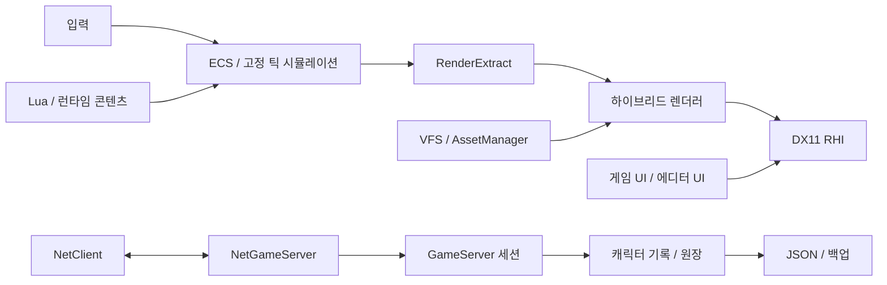

# 13. 현재 구조와 기능

분석 기준: **2026-10-01**, Windows/MSVC 작업 트리. 초기 설계가 아니라 소스, CMake 타깃, 실행 경로를 기준으로 정리했다. 개선 항목은 [14](14-development-priorities.md), 도구 구성은 [15](15-skills-and-agents.md)를 참조한다.

## 1. 제품과 저장소의 경계

MyEngine은 C++20·DirectX 11 기반의 2.5D 픽셀아트 엔진이다. 2D 캐릭터·타일과 3D 배경 물체를 하나의 깊이 버퍼에서 처리한다. Windows 런타임, ImGui 에디터, Lua 콘텐츠 시스템, UDP 게임 서버, JSON 영속 계층을 같은 저장소에 둔다.

| 영역 | 현재 구성 | 경계 |
|---|---|---|
| `engine/` | 정적 라이브러리 19개 | 여러 게임이 공유할 엔진·서버 기반 |
| `game/` | `social`, `mmo` 라이브러리 2개 | 소셜·경제 서비스와 직업·사냥 콘텐츠 |
| `apps/` | `MyEditor`, `MyGame`, `MyServer`, `paktool` | 서비스를 조합하는 실행 진입점 |
| `samples/` | CMake 실행 샘플 6개 | 개별 기능과 통합 시나리오 검증 |
| `tests/` | 자체 프레임워크 `mye_tests` | 등록된 테스트 511개 |
| `tools/mcp/` | TypeScript 개발 도구 서버 | 빌드·테스트·실행·프레임 캡처 등 |
| `third_party/` | vendored 라이브러리 | 별도 라이선스와 플랫폼 의존성 |

샘플 실행 타깃은 `hello_triangle`, `asset_smoke`, `sprite_demo`, `bridge_demo`, `character_demo`, `village_demo`다. `game_sample`, `mmo_demo`는 게임 프로젝트·에셋 디렉터리이며 별도 실행 타깃이 아니다. `MyGame`의 기본 프로젝트는 `samples/mmo_demo`다.

파일 규모 대신 호출 경로·소유권·실패 경계를 정리한다. 변경과 검증 근거는 [16](16-foundation-worklog.md)에 기록한다.

## 2. 모듈 책임과 의존성

아래 의존성은 각 모듈의 `CMakeLists.txt`에 있는 주요 PUBLIC 링크를 기준으로 한다. 외부 라이브러리와 PRIVATE 링크는 필요한 경우만 표시했다.

| 모듈 | 주 책임 | 주요 엔진 의존성 | 확인 위치 |
|---|---|---|---|
| `core` | 수학, 로그, JSON, 설정, 이벤트, 잡, Win32, 입력, 앱·모듈 루프 | 없음 | [CMake](../engine/core/CMakeLists.txt) |
| `rhi` | GPU 핸들·리소스·파이프라인·커맨드, DX11 구현 | core | [CMake](../engine/rhi/CMakeLists.txt) |
| `reflect` | 타입·필드 메타데이터, JSON 아카이브 | core | [CMake](../engine/reflect/CMakeLists.txt) |
| `ddc` | 런타임 스키마, 동적 컴포넌트·스토어 | core | [CMake](../engine/ddc/CMakeLists.txt) |
| `asset` | VFS, pak, DB, 비동기 로딩, 임포터, 재임포트 | core, rhi, reflect | [CMake](../engine/asset/CMakeLists.txt) |
| `render` | 스프라이트 배치, 카메라, 픽셀 타깃, 하이브리드 깊이 | core, rhi, asset | [CMake](../engine/render/CMakeLists.txt) |
| `scene` | ECS, 트랜스폼, 스케줄러, 타일맵, 물리, 애니메이션, 경로 탐색·렌더 추출 | core, asset, render; reflect PRIVATE | [CMake](../engine/scene/CMakeLists.txt) |
| `audio` | 믹서, 버스, 큐, 크로스페이드, miniaudio 출력 | core, asset | [CMake](../engine/audio/CMakeLists.txt) |
| `imgui` | ImGui Win32·DX11 연결, 디버그 표시 | core; rhi PRIVATE | [CMake](../engine/imgui/CMakeLists.txt) |
| `script` | sol2/Lua VM, 엔티티 스크립트, 바인딩, 오류 격리·핫 리로드 | core, scene, asset, audio, reflect, ddc | [CMake](../engine/script/CMakeLists.txt) |
| `ui` | retained 위젯, 레이아웃·입력, FreeType 글꼴·한글 텍스트 | core, render, rhi, reflect | [CMake](../engine/ui/CMakeLists.txt) |
| `runtime` | 대화, 컷신, NPC, 세이브, 로컬라이즈, 씬 전환 | core, ui, scene, audio, asset, reflect; script PRIVATE | [CMake](../engine/runtime/CMakeLists.txt) |
| `editor` | 프로젝트·문서, 패널, Inspector, Undo, 플레이 월드 | core, reflect, scene, asset, render; imgui PRIVATE | [CMake](../engine/editor/CMakeLists.txt) |
| `plugin` | 정적·DLL 플러그인 등록과 수명 | core, reflect | [CMake](../engine/plugin/CMakeLists.txt) |
| `gameplay` | 스탯, 전투, 인벤토리, 성장, 상태, 퀘스트·제작 | core, scene | [CMake](../engine/gameplay/CMakeLists.txt) |
| `net` | Winsock UDP, 비트 패킹·양자화, 예측·재조정·보간 | core | [CMake](../engine/net/CMakeLists.txt) |
| `persist` | 계정, 캐릭터 기록, 아이템·골드 원장, JSON 저장·백업 | core; Windows bcrypt PRIVATE | [CMake](../engine/persist/CMakeLists.txt) |
| `liveops` | 서버 설정, 기능 플래그, 운영 메트릭 등 | core | [CMake](../engine/liveops/CMakeLists.txt) |
| `gameserver` | 네트워크·게임플레이 세션·영속 계층 연결 | core, gameplay, persist, net | [CMake](../engine/gameserver/CMakeLists.txt) |
| `game/social` | 친구·채팅·파티·길드·우편·거래·경매·매칭 | core, persist | [CMake](../game/social/CMakeLists.txt) |
| `game/mmo` | 직업, 몬스터·사냥터·파티 사냥 콘텐츠 | core, gameplay | [CMake](../game/mmo/CMakeLists.txt) |

핵심 흐름은 다음과 같다. 화살표는 데이터 흐름이며 모든 CMake 의존성을 표현하지 않는다.



### 계층에서 주의할 실제 결합

`render`는 `scene`의 공개 헤더를 PRIVATE include 경로로 읽는다. [HybridRenderer.cpp](../engine/render/src/HybridRenderer.cpp)는 `RenderProxyList`와 `TilemapWorld::Layer` 등 씬 타입·심볼을 사용하고, 최종 실행 파일이 두 정적 라이브러리를 함께 링크한다. CMake 링크 그래프에 역방향 간선이 없다는 사실만으로 소스 의존성이 제거되었다고 볼 수 없다. 렌더 입력 계약을 정리할 대상이다.

게임 규칙은 가능한 한 `game/`에 두고, 재사용되는 기반만 엔진 모듈에 둔다. 엔진에서 `game/`이나 `apps/`를 역참조하는 구조는 피한다.

## 3. 부팅과 프레임 수명

[GuardedMain](../engine/core/src/App.cpp)은 크래시 필터·로그·설정·잡·입력·창을 준비하고, 등록된 모듈을 의존 순서로 초기화한 뒤 루프를 실행한다. 종료는 모듈 역순이다. 설정의 EventBus 연결과 minidump 생성에는 아직 배선·구현 잔여가 있다.

```text
프레임 시간 제한 → 입력/Win32 메시지 → 메인 스레드 잡 완료 처리
→ PreUpdate → 누산된 시간만큼 FixedUpdate(기본 60Hz)
→ Update → PostUpdate → PreRender → PostRender
```

[SceneModule](../engine/scene/src/scene/SceneModule.cpp)은 별도 World, 월드 EventBus, SystemScheduler를 소유한다. Input·FixedUpdate·Update·PostUpdate·RenderExtract를 코어 단계에 연결하며 기본 등록 시스템은 트랜스폼 갱신이다. 물리·애니메이션·스크립트가 모두 자동으로 활성화되는 구조는 아니다. 앱이나 샘플이 필요한 시스템을 등록해야 한다.

현재 `MyGame`의 로컬 이동은 코어의 고정 `FixedUpdate`에서 트랜스폼을 바꾼다. 기존 물리·층 판정 연결은 아직 남아 있다. 네트워크 입력 전송은 별도 60Hz 누산기, 서버 기본 틱은 20Hz다. 동일한 고정 틱·이동 규칙으로 통합된 게임 시뮬레이션이라고 설명하면 부정확하다.

`--headless`는 창 없이 실행하기 위한 옵션이다. DX11 렌더 테스트에는 GPU·드라이버가 필요하며, 모든 실행 파일이 GPU 없이 동작한다는 뜻은 아니다. `MyServer`는 별도 콘솔 루프를 사용한다.

## 4. 2.5D 렌더링 계약

좌표계는 왼손 좌표계, +Y 위쪽, 기본 PPU 48이다. [PixelPerfectTarget](../engine/render/src/PixelPerfectTarget.cpp)은 기본 960×540 내부 타깃을 정수 배율로 확대하고 여백을 처리한다. 카메라 스냅과 픽셀 표현 규칙은 [렌더링 설계](02-rendering.md)에 정의되어 있다.

[DepthEncoder](../engine/render/src/DepthEncoder.cpp)와 [HybridRenderer](../engine/render/src/HybridRenderer.cpp)는 높이·Y 정렬·레이어를 깊이로 표현한다. 불투명 픽셀만 남기는 alpha cutout과 depth write, 3D 물체의 anchor 기반 깊이 보정을 사용한다. 그래서 다리 위·아래 캐릭터와 3D 물체 뒤 캐릭터를 같은 깊이 버퍼로 가린다.

DX11 백엔드·셰이더 컴파일은 구현되어 있다. GPU 타임스탬프의 WriteTimestamp/ResolveTimestamps는 인터페이스만 있고 DX11 구현은 stub이다. 일반 비동기 readback의 CopyTextureToBuffer/EnqueueReadback/TryGetReadback은 아직 stub이다. 프레임 검증은 구현된 CaptureBackbuffer를 쓴다. UI는 +Y 아래와 R8 글리프 마스크를 SpriteBatch에서 명시하며 월드의 +Y 위·깊이 계약을 유지한다. 다른 그래픽 API는 인터페이스 확장 가능성과 실제 백엔드 구현을 구분한다. 조명·파티클 관련 데이터·계산이 있다는 사실도 완성된 GPU 표현과 같지 않다.

## 5. 에셋과 콘텐츠의 흐름

```text
VFS(느슨한 파일 / pak) → 임포터 → CPU 파싱
→ AssetManager 메인 스레드 finalize → AssetHandle → 렌더·오디오 소비자
```

[AssetManager](../engine/asset/src/AssetManager.cpp), AssetDatabase, 파일 감시, `.meta`·GUID, PNG/glTF/Aseprite/WAV/OGG 임포터가 존재한다. 샘플·테스트에서 개별 경로를 검증하지만 `MyGame`은 자체 VFS와 경로 기반 GUID를 구성하고 PNG를 시작 시 미리 읽는다. 앱의 watcher 시작 호출과 메타 임포트 설정 연결은 보완 대상이다. 동작 없이 선언만 있던 Pin/Unpin은 호출자가 없어 제거했다. AssetHandle의 참조 카운트·RAII 수명은 유지한다.

Lua·DDC·리플렉션·플러그인 기능도 라이브러리와 테스트가 있다. 네이티브 DLL 호스트의 현재 기능을 초기 설계에 있는 모든 서비스 접근·ABI 계약이 구현된 것으로 확대해석하지 않는다. 앱에서 로딩·언로딩·프로젝트 설정까지 연결하는 단계가 남아 있다.

## 6. 실제 앱 조합

| 실행 파일 | 직접 링크한 주요 모듈 | 현재 경로 | 중요한 미연결 부분 |
|---|---|---|---|
| [MyEditor](../apps/editor/CMakeLists.txt) | core, scene, editor | ImGui 패널, 선택·Inspector·Undo, 플레이 월드 | 프로젝트 파일 해석·실제 OpenScene 로딩, 게임과 동일한 플레이 시스템 |
| [MyGame](../apps/game/CMakeLists.txt) | core, rhi, asset, render, audio, scene, net, ui | 타이틀·설정·캐릭터 선택, 씬 로딩, 로컬 이동, 서버 접속·예측·보간 | script/runtime/gameplay/social/mmo 통합, 고정 틱 물리·층 판정 |
| [MyServer](../apps/server/CMakeLists.txt) | core, net, persist, liveops, gameserver, gameplay | 계정 인증, 세션, 권위 이동, 자동 저장, 운영 명령·메트릭, 봇 | social/mmo 연결, 암호화 전송·신뢰성 있는 게임 메시지 |
| [paktool](../apps/paktool/CMakeLists.txt) | core, asset | pak 패키징 CLI | 프로젝트 배포 흐름에 통합·검증 |

`village_demo`는 대화·컷신·NPC·Lua·물리·한글 UI·오디오를 조합하는 현재의 참고 실행 경로다. 지도·스폰은 C++로 구성하며 로컬라이즈 JSON·Lua는 시작 시 로드한다. 파일 감시·JSON 지도 자동 반영은 연결되지 않았다. 기능을 게임 앱에 연결할 때 이 경로와 기존 모듈을 먼저 재사용한다.

## 7. 기능 상태표

상태 의미: **실행 검증**은 앱·샘플 시나리오가 있고 실행 확인을 했다는 뜻이다. **기반 검증**은 라이브러리·자동 테스트가 있으나 제품 경로가 제한적이라는 뜻이다. **통합 필요**는 기존 기능의 배선·사용자 워크플로가 남았다는 뜻이다.

| 기능 | 현재 상태 | 근거와 한계 |
|---|---|---|
| DX11·스프라이트·하이브리드 깊이 | 실행 검증 | sprite/bridge/character/village CTest 시나리오; 모든 화면의 픽셀 판정까지 자동화된 것은 아님 |
| ECS·타일맵·다층 충돌·경로 탐색 | 기반·샘플 검증 | 자체 sparse-set ECS; MyGame 이동은 현재 물리 경로 우회 |
| 8방향 애니메이션·이벤트 | 실행 검증 | character_demo 방향·발소리 시나리오, 라이브러리 테스트 |
| 에셋 비동기 로딩·재임포트 | 기반·샘플 검증 | 앱의 감시·GUID·설정 적용 통합 필요 |
| 오디오 믹싱·큐·BGM | 기반·샘플 검증 | MyGame이 AudioModule을 사용. 기본 실행의 장치 초기화 확인, headless는 무음. 청취·볼륨 UX는 추가 확인 필요 |
| Lua·코루틴·핫 리로드 | 기반·샘플 검증 | character_demo 오류 격리·핫 리로드, village_demo 콘텐츠; MyGame 미연결 |
| UI·한글 텍스트 | 기반·샘플 검증 | FreeType·레이아웃·입력·R8 출력 회귀 테스트, 타이틀/설정 프레임 확인; UiDocument의 위젯 속성 적용·컨트롤러 연결 잔여 |
| 대화·컷신·NPC·세이브·로컬라이즈 | 기반·샘플 검증 | runtime 테스트와 village_demo; MyGame 미연결 |
| 에디터 문서·Undo·직렬화 기반 | 기반 검증 / 통합 필요 | serializer와 workflow 테스트는 존재; ProjectContext 실제 파일 열기 경로에 TODO |
| 리플렉션·DDC·DLL 플러그인 | 기반 검증 | 전용 테스트·DLL fixture; 사용자 프로젝트에서의 조합·배포 흐름 별도 |
| RPG 전투·인벤토리·퀘스트·제작 | 기반 검증 | gameplay 테스트; MyGame 플레이와 네트워크 명령 미연결 |
| UDP 접속·권위 이동·예측·보간 | 기반·앱 연결 | 루프백 테스트와 앱 경로; v1·길이/순서/대각 이동 검증·64명 상한; 전송 보안·타임아웃·틱 협상 필요 |
| 계정·캐릭터·원장·파일 저장 | 기반·앱 검증 | 단일 state.json·활성 저장·실패 보존·백업 복원·정수 정확도·PBKDF2/난수/만료 검증; DB/WAL·운영 내구성은 미완성 |
| 친구·채팅·길드·우편·거래·경매 | 기반 검증 | social 테스트; MyGame/MyServer 직접 링크·메시지·UI 미연결 |
| 직업·몬스터·파티 사냥 콘텐츠 | 기반 검증 | mmo 테스트; 실제 온라인 플레이 미연결 |
| MCP 개발 자동화 | 실행 검증 | 8개 도구 smoke 통과; 현재 대화의 도구 연결 상태와는 별개 |

## 8. 서버 데이터 수명

현재 경로는 [Protocol](../engine/net/include/mye/net/Protocol.h)의 Connect → 계정 로그인 → [NetGameServer](../engine/gameserver/src/NetGameServer.cpp)의 캐릭터 Join → 네트워크 이동 → 런타임 세션 좌표 동기화 → 스냅샷 전송이다.

[GameServer](../engine/gameserver/src/GameServer.cpp)는 Join에서 기록을 읽고, Leave/FlushSessions에서 상태를 기록에 반영한다. 자동 저장은 `GameServer::Save`, 종료는 `NetGameServer::Stop`의 세션 반영 후 저장이다. 실패를 Expected로 전달하고 서버 앱은 로드·종료 저장 오류를 성공으로 처리하지 않는다.

[PersistenceService](../engine/persist/src/PersistenceService.cpp)는 version=1인 `state.json`에 계정·캐릭터·원장을 함께 쓴다. 임시 파일 flush → 파일 교체가 성공한 뒤 이전 백업을 정리한다. 로드는 후보 전체를 검증한 뒤 교체하고 실패하면 현재 메모리를 보존한다. 구형 세 파일은 모두 있을 때만 읽고 다음 저장에서 변환한다. 비어 있는 백업은 복원하지 않는다. 한 작성자·64 MiB 상한이며 DB 트랜잭션·WAL의 대체물은 아니다.

[AccountStore](../engine/persist/src/AccountStore.cpp)는 Windows CNG PBKDF2-SHA256(600,000회), 16바이트 난수 salt, 32바이트 digest, 난수 토큰·24시간 만료를 사용한다. 구형 FNV 값은 기존 계정 로그인 이관용으로만 읽는다. UDP Connect는 여전히 평문이므로 서버는 루프백에만 바인드한다. 로그인 제한·세션 패킷 인증·전송 암호화는 P0이다.

## 9. 개발 도구와 확인 결과

[MCP 서버](../tools/mcp/src/index.ts)의 도구는 `build`, `test`, `run`, `capture_frame`, `logs`, `project_status`, `dot_write_sprite`, `dot_from_photo` 8개다. stdio 프로토콜, 실행 직렬화, 자식 프로세스 시간 제한·종료, 프로젝트 경로 검사가 있다. 에디터 내부 원격 조작은 이후 설계 범위다.

2026-10-01 검증: 전체 Debug/Release 빌드와 양쪽 CTest 13/13 통과, 내부 테스트 511/511 통과. MCP build/smoke에서 8개 도구 확인. 서버 앱의 등록·활성 봇 자동/종료 저장·재시작·손상 저장 거부는 `tools/verify-foundation.ps1`로 확인했다. 게임 타이틀·설정·플레이와 에디터 오프스크린 프레임을 캡처했다. 일반 실행에서는 오디오 장치 초기화 로그와 BGM import를 확인했으며 실제 청취 판정은 수행하지 않았다.

검증 환경·성능 수치·남은 경고·시각/보안 한계는 [작업 기록](16-foundation-worklog.md)을 참조한다. 테스트 통과는 제품 전체 UI·콘텐츠 통합이나 온라인 서비스 완성을 뜻하지 않는다.
