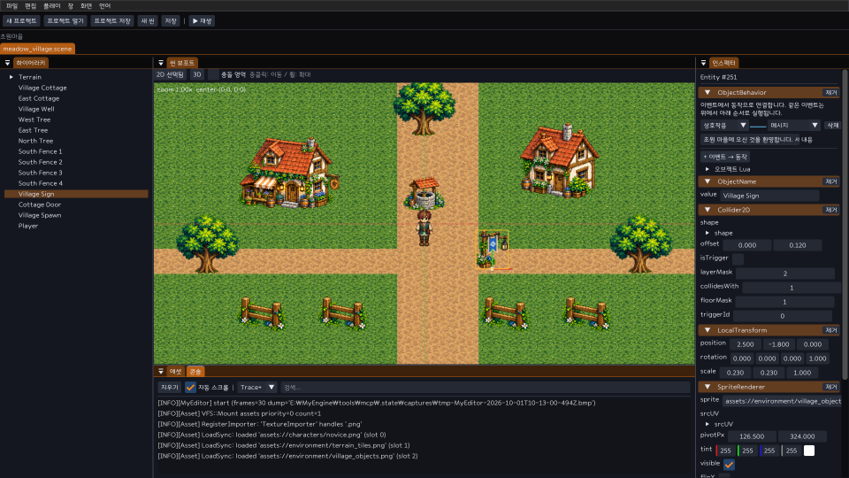
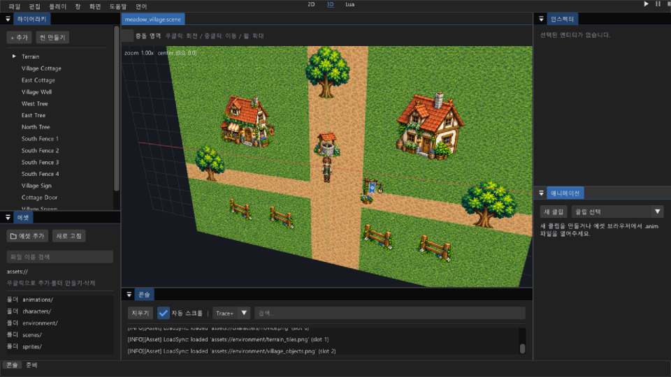
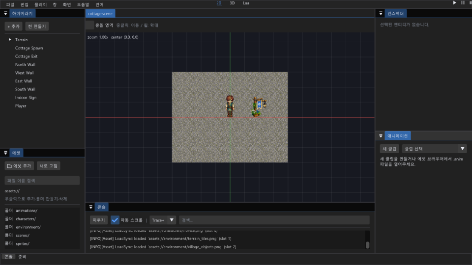

# 오브젝트·동작 제작

MyEditor의 기본 마을은 개별 지형·건물·수목·소품·플레이어로 편집한다. 실행 파일은 `build/dev/apps/editor/Release/MyEditor.exe`다. 기존 사용자 프로젝트를 갱신된 기본 콘텐츠로 덮어쓰지 않으므로 새 프로젝트에서 **초원마을 기본 에셋 포함**을 선택한다.

## 오브젝트와 컴포넌트

| 컴포넌트 | 역할·입력 |
|---|---|
| `ObjectName` | Hierarchy 이름, 동작 대상·포털 도착 지점. 씬 안에서 빈 이름을 제외하고 유일해야 함 |
| `LocalTransform` / `SpriteRenderer` | 위치·XYZ 회전/배율·PNG GUID·영역 UV·픽셀 피벗 |
| `Collider2D` | Box/Circle, 세계 단위 half/offset, 트리거·충돌/층 마스크 |
| `KinematicBody2D` | 고정 틱 move-and-slide. skin·반복 상한은 저장; velocity/lastMove/hitWall은 실행 상태 |
| `CharacterController2D` | enabled·초당 speed, idle/walk 애니메이션 GUID. 루트 Transform·body·collider 필요; 한 씬에서 활성 로컬 컨트롤러 1개 |
| `InteractionTarget` | enabled·거리 radius·화면 prompt. 가장 가까운 같은 층의 대상을 E로 실행 |
| `ScenePortal` | 프로젝트 상대 `.scene` 경로·도착 ObjectName. E 방식은 InteractionTarget, 자동 진입은 트리거 Collider2D 필요 |
| `ObjectBehavior` | 이벤트→동작 연결 목록과 오브젝트 Lua 소스. 씬 저장·Undo 대상 |

Hierarchy에서 이름으로 선택해 Inspector를 편집한다. **+ 컴포넌트 추가**는 World에 등록된 컴포넌트만 표시한다. PNG/.anim을 에셋 참조 버튼에 놓아 GUID를 연결하거나 **비우기**로 해제한다. 콜라이더 치수는 렌더 배율과 독립적인 세계 단위다. 컨트롤러는 부모 없는 루트 엔티티로 제한하며(부모 회전/배율과 world XY 물리의 불일치 방지), 물리 평면은 XY, +Y 위다.

지형 `Tile (x,y)`도 개별 엔티티다. 4종 지형 아틀라스의 UV는 풀 `(0,0,.5,.5)`, 흙 `(.5,0,.5,.5)`, 물 `(0,.5,.5,.5)`, 돌 `(.5,.5,.5,.5)`다. 원본 셀은 627픽셀이며 배율 `48/627`로 세계 1단위를 만든다. 그룹 이동·타일 선택·삭제·저장에는 기존 씬/Undo 경로를 쓴다.



## 이벤트에서 동작 연결

ObjectBehavior를 추가하고 **+ 이벤트 → 동작**을 누른다. 왼쪽 이벤트 카드와 오른쪽 동작 카드를 선으로 표시하며 같은 이벤트는 위에서 아래로 실행한다. 자유 배치 그래프·범용 노드 VM·변수/조건 편집기를 추가하지 않고, 현재 필요한 연결을 직접 저장한다.

| 이벤트 | 실행 시점 |
|---|---|
| Start | 해당 Play 맵의 첫 고정 틱에서 한 번 |
| Interact | 뷰포트가 입력을 소유하고 E를 눌렀을 때 근처 대상 |
| TriggerEnter / TriggerExit | 플레이어와 트리거의 겹침 상태 변화 |

| 동작 | 매개변수 |
|---|---|
| Message | 화면·로그에 표시할 내용 |
| SetVisible | 대상 이름(빈 값은 자기 자신)·표시 여부. 충돌 상태는 변경하지 않음 |
| MoveTo | 대상 이름·X/Y 위치. 즉시 위치 변경이며 경로 이동은 아님 |
| ChangeMap | 씬 경로와 도착 오브젝트 이름 |
| LuaCallback | 대상 이름·함수 이름. 기존 보호 호출·오류 격리를 사용 |

예: `Village Sign`의 `Interact → Message` 내용을 바꾼 뒤 Ctrl+S로 씬을 저장한다. Play에서 안내판 근처의 E 입력으로 결과를 확인한다. 조건·지연·퀘스트 판정 등은 Lua로 구현한다. 연결은 64개, Lua는 오브젝트당 64 KiB 상한이다.

## 오브젝트 Lua

ObjectBehavior의 **오브젝트 Lua**를 펼쳐 직접 편집한다. 소스는 `.scene`의 `luaSource`로 보존하며 기존 ScriptComponent/ScriptSystem이 Play 전용 VM에서 실행한다. 편집 결과는 Undo·씬 저장 대상이며 Play를 다시 시작해 반영한다. 파일 `.lua` 에셋을 사용하는 기존 런타임 경로도 유지한다.

```lua
return {
    on_interact = function(self)
        local entity = mye.world.entity_from_packed(self.entity)
        local position = entity:get_position()
        entity:set_position(mye.Vec2(position.x, position.y + 0.25))
    end,
}
```

`on_init`, `on_start`, `on_update(self,dt)`, `on_late_update`, `on_trigger_enter/exit(self,other)`, `on_destroy`가 기존 콜백이다. InteractionTarget의 E 입력은 `on_interact`도 자동 호출하므로 같은 함수를 이벤트 카드에서 다시 연결할 필요가 없다. 카드의 LuaCallback은 별도 사용자 함수를 연결할 때 쓴다. 문법/실행 오류는 해당 스크립트를 격리하고 화면·로그에 표시한다. 기본 VM의 io/os/package/debug 비노출 정책을 유지한다. 상태·인스턴스는 저장하지 않으며 World보다 먼저 정리해 VM 수명을 지킨다.

## 맵 연결

출입구에 ScenePortal과 InteractionTarget을 추가한다. `scenePath=assets/scenes/cottage.scene`, `spawnName=Cottage Spawn`, `onInteract=true`로 설정한다. 자동 이동을 원하면 트리거 Collider2D와 `onInteract=false`를 사용한다. 목적지에 ObjectName이 같은 Transform 오브젝트와 플레이어 컨트롤러를 둔다. 복귀 포털도 목적지 씬에 저장한다.

기존 SceneTransitionManager의 fade-out→load→activate→fade-in을 사용한다. 목적지 파일은 정규화된 프로젝트 assets 내부로 제한한다. 씬·컴포넌트·유일 이름·도착 위치·플레이어를 검증한 후보가 준비되면 PlayWorld만 교체한다. 실패는 현재 맵을 유지하고 오류를 전달한다. 레벨·경험치는 유지하며 인벤토리·퀘스트·온라인 존 이전까지 동기화한 기능은 아니다. 맵 파일은 현재 동기로 읽는다. 로드 지연이 측정되면 기존 비동기 에셋 경로에 연결한다.

## Play와 뷰포트

Play를 누르면 열리는 게임 창을 클릭한다. WASD/방향키로 이동하며 대각선 속도를 정규화한다. E 입력은 프레임에서 한 번 포착해 다음 고정 틱에서 한 번 소비한다. 텍스트 편집이나 다른 패널 포커스는 이동을 받지 않는다. Pause/Step은 동일한 물리·Lua·이벤트·애니메이션 경로를 사용한다.

상단 중앙의 **2D / 3D**로 전환한다. 2D는 기존 픽셀 스냅·Y/층 깊이 계약, 3D는 LH 원근 카메라·world XYZ·clip Z/W를 사용한다. 우클릭은 3D 회전, 중클릭은 이동, 휠은 확대다. 3D에서 스프라이트 평면은 XY 그대로이며 물리가 3D로 전환되지는 않는다. XYZ 수치는 Inspector에서 편집한다. 이동 기즈모는 2D에 제공한다. 3D 선택·외곽선은 변환된 스프라이트 꼭짓점을 투영한다.

**충돌 영역**을 켜면 주황색 solid·파란색 trigger를 확인한다. 3D의 겹치는 스프라이트 평면에는 기존 깊이 순서에서 유도한 최대 `1e-5` NDC 바이어스만 더해 coplanar 가림 오류를 줄인다. 원근 XY/W·Transform·2D 셰이더 계약은 유지한다.





## 저장과 검증 경계

잘못된 이벤트 이름·일반 리플렉션 필드 타입/범위·새 컴포넌트 버전은 World 생성 전에 공용 SceneSerializer에서 거부한다. 사용자 프로젝트 열기·저장·Play·맵 후보는 공용 ObjectComponents 검증을 사용한다. 실패한 저장은 기존 파일과 dirty를 유지한다. 기본 콘텐츠·에디터 Play의 연결은 MyGame이나 온라인 서버의 동일 기능 통합을 대신하지 않는다. 실제 확인 결과와 남은 한계는 [작업 기록](16-foundation-worklog.md)에 기록한다.

자유 노드 그래프·3D 메시 제작/기즈모·Tilemap 청크 브러시·온라인 통합은 후속 항목이다. 현재 동작 연결은 대상 이름을 저장하며 Lua 함수 존재 여부를 편집 중 정적으로 검사하지 않는다. 일반 필드 검증은 커스텀 직렬화의 평탄화 키까지 자동 확장되지 않는다. 기존 커스텀 훅과 오브젝트 값 검증을 사용한다.

XYZ 캐릭터는 Collider3D·KinematicBody3D·CharacterController3D를 함께 사용한다. 로컬 포털은 목적지의 XYZ 스폰과 Progression을 유지한다. 목적지 검증 실패 시 기존 World를 보존한다. [XYZ 플레이](21-3d-play-and-online.md)의 공간 계약을 따른다. 온라인 포털은 아직 연결하지 않았다.
