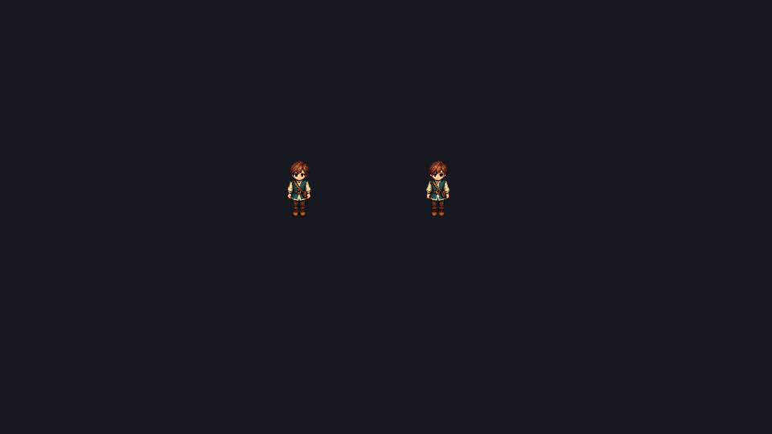
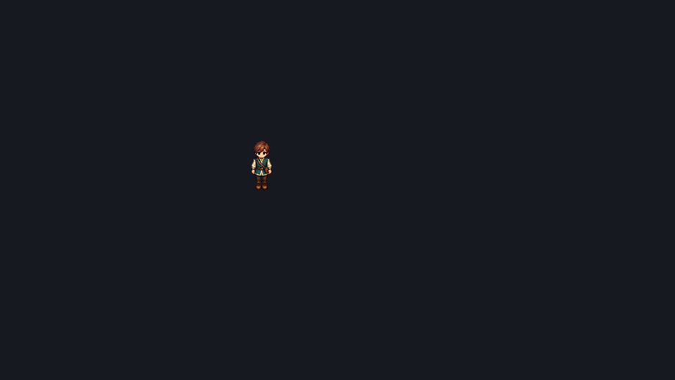

# 23. 온라인 2D 플레이

개발 main의 [Camera2D](24-2d-camera.md)는 저장 설정으로 로컬/인증 MyGame과 Play의 시야를 연결한다. 인증 클라이언트는 예측/보정된 로컬 캐릭터의 이름을 추종하며 Lua를 실행하지 않는다. `--input`의 선택 `cameraZoomSteps`는 한 고정 틱의 유한한 -16~16 휠 단계다. 인증 후 재생 순서가 진행한 틱에서만 소비하고 여러 ticks에 지정하면 매 틱 적용된다. 서버 이동 입력/장면 파일을 변경하지 않는다. `tools/verify-online2d.ps1 -SavedCamera`는 실제 두 사용자별 2배 초기 추종·첫 줌 1회 소비와 원격 픽셀을 확인한다.

현재 **main 소스 빌드**는 작성한 2D 장면으로 두 계정의 이동·충돌·상대 표시·저장·재접속을 실행한다. 기존 0.3.0 다운로드에는 이 기능과 입력 재생 옵션이 없다. 전송은 인증된 loopback UDP이며 공개 서비스, 온라인 맵 전환·전투·UI는 후속 작업이다.

## 장면 준비

활성 `CharacterController2D` 하나에 root `LocalTransform`, `Collider2D`, `KinematicBody2D`를 둔다. `SpriteRenderer`와 선택적인 `SpriteAnimator`로 캐릭터 외형·idle/walk `.anim`을 연결한다. 캐릭터 원점과 Collider2D.offset을 구분하고 스폰이 정적 벽 안에 들어가지 않게 배치한다. speed는 월드 단위/초, floor는 0..7이다. 저장한 `.scene`을 `.myeproj`의 mainScene으로 지정한다.

`LoadOnlineScene`이 활성 캐릭터로 2D·3D를 선택한다. 잘못된 2D 장면을 3D로 다시 읽어 오류를 숨기지 않는다. 서버는 SceneSerializer와 `GatherCollisionBodies2D`로 정적 형상/층/레이어를 추출하고 시각 에셋을 읽지 않는다. 양쪽에 같은 프로젝트를 제공하며 실행 중 장면을 변경하면 재시작한다. 추가 kinematic mover·3D 물리·겹친 스폰은 거부한다. [형상·입력·저장 계약](03-scene-world.md#온라인-2d-장면-계약-준비)에 근거와 범위가 있다.

## 두 계정 접속

합성 로컬 계정을 만들고 각각의 자격 증명 파일을 준비한다. 아래 비밀번호는 검증 예시다. 실제 자격 증명과 데이터는 Git·에셋·배포 파일에 넣지 않는다.

```powershell
MyServer.exe --data build/local-server --register tester local-test-only
MyServer.exe --data build/local-server --make-char tester Hero
MyServer.exe --data build/local-server --project game/project.myeproj --port 27015
MyGame.exe --project game/project.myeproj --connect 127.0.0.1:27015 --credentials private/login.json
```

`login.json`은 `{"username":"tester","password":"local-test-only"}`다. `--character ID`를 생략하면 계정의 첫 캐릭터를 선택한다. 두 번째 계정/캐릭터/자격 증명을 만들고 다른 MyGame을 실행한다. WASD·방향키·왼쪽 스틱으로 이동한다. 대각선은 정규화하며 2D에서 점프는 적용하지 않는다. 각 카메라는 자신의 캐릭터를 데드존으로 추종한다. 키보드·패드의 직접 조작은 별도 장치 검수 대상이다.

서버에 위치를 전송하지 않고 XY 방향·순서만 보낸다. `StepMotion2D`/`MoveAndSlide2D`를 서버·예측·미확인 입력 재실행에서 공유하며 실제 처리한 입력만 ack를 받는다. 원격 캐릭터는 서버 스냅샷의 ID에 따라 장면의 SpriteRenderer·BillboardRenderer·MeshRenderer·SpriteAnimator·FloorLevel과 root 시각 변환만 복제하고, 퇴장하면 제거한다. 다른 플레이어의 조작·충돌·Lua를 추가하지 않는다.

클라이언트는 온라인 장면의 ObjectSystem을 생성하지 않으므로 on_init·로컬 물리·이벤트/포털을 실행하지 않는다. 온라인 Lua/게임 규칙은 서버 구현이 필요하다. 신규 캐릭터는 작성 스폰을 사용하고 기존 캐릭터는 저장된 XY·floor·방향을 사용한다. 소유권·중복 세션·다른 장면/층·world3D·비영 Z·벽 속 저장 위치는 입장 전에 거부한다.



실제 Release 검증 프레임이다. 빈 검증 장면에서 왼쪽은 다른 계정, 오른쪽은 벽 앞에 정지한 로컬 캐릭터다. 벽은 Collider2D만 있어 그림으로 보이지 않는다. 두 캐릭터는 같은 외형 원형을 사용한다.



먼저 종료한 계정의 원격 비주얼이 다음 스냅샷에서 제거된 화면이다. 새 픽셀 에셋을 만들지 않고 기존 starter PNG/.anim을 사용했다.

## 입력 재생으로 확인

`MyGame --input file.json`은 실제 고정 틱 입력 경로를 재생한다. 버전 1, 1..256개 step, 총 1..36,000틱과 유한한 [-1,1] 축을 요구한다. `jump`는 선택 bool이며 3D에서만 적용한다. 입력 재생은 키보드/패드 입력을 대체하며 온라인 스폰이 확인된 뒤 첫 step을 시작한다.

```json
{"version":1,"steps":[{"ticks":60,"x":1,"y":0},{"ticks":30,"x":0,"y":0}]}
```

```powershell
MyGame.exe --project game/project.myeproj --connect 127.0.0.1:27015 --credentials private/login.json --input private/move.json --headless --dump final.bmp
```

온라인에서는 마지막 입력의 ack까지 기다린 뒤 종료하고 최종 960×540 프레임을 저장한다. NetClient.Receive는 마지막 입력 뒤에도 계속 호출해야 하며, 미확인 입력은 100ms마다 새 순서/예측 없이 재전송한다. 확인된 큐는 재전송하지 않는다. 로컬 재생도 마지막 틱의 프레임을 저장한다. `--ticks`/`--frames`를 함께 지정하면 먼저 도달한 한도가 종료시키며, 입장/재생 확인 전에 끝나면 exit 1이다. 재생 성공은 직접 키보드·패드·창 포커스 검증을 대신하지 않는다.

저장소에서 `powershell -File tools/verify-online2d.ps1 -Configuration Debug` 또는 Release를 실행하면 새 build 하위 프로젝트/합성 데이터만 사용한다. 두 MyGame의 원·offset·층·0.01 폭 벽 접촉/ack, 실제 스프라이트 픽셀·퇴장 제거, 클라이언트 Lua 격리와 MyServer 재시작/저장 좌표 재접속을 검사한다. [작업 기록](16-foundation-worklog.md)에 실행 근거가 있다. MCP `engine_reference(topic="online2d")`로 이 계약을 조회한다. MCP `engine_run`은 단일 앱 실행이며 두 앱의 수명 관리/상호 검증을 자동 제공하지 않는다.

## 남은 범위

동일 정적 장면·고정 층·동일 외형 원형만 지원한다. 캐릭터 간 solid 충돌, 원격 보간/개별 외형, 타일 편집과 권위 충돌 연결, 서버 NPC/포털/전투·채팅/게임 UI, 암호화·운영 복구·게임 내보내기는 [작업 목록](22-2d-mmorpg-roadmap.md)에 남아 있다. 장치 입력·다른 GPU/PC와 새 배포본은 아직 검증하지 않았다. 기존 [XYZ 플레이](21-3d-play-and-online.md)와 저장 데이터는 보존한다.
