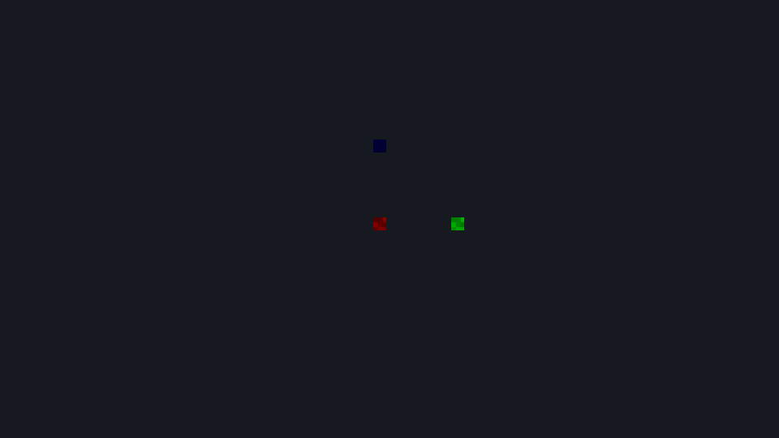
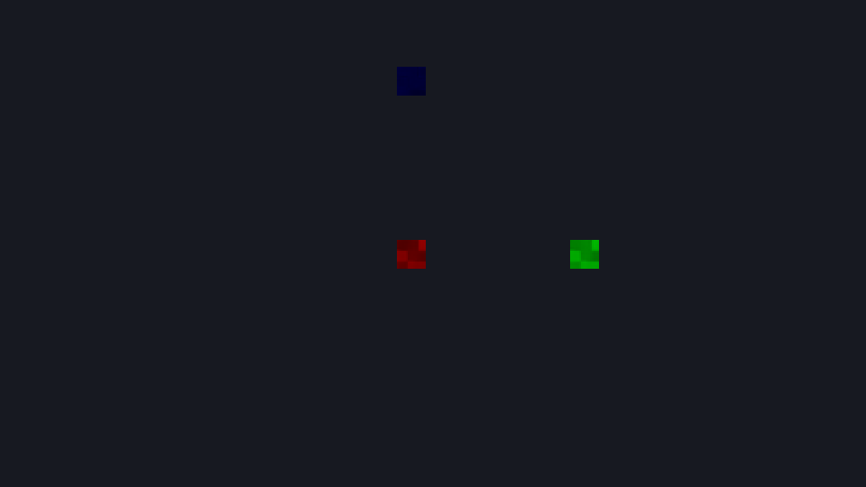

# 2D 게임 카메라

**하이어라키의 + 추가 → 게임 카메라 2D**를 선택하고 추종 대상·시야를 저장한다. Play 창과 MyGame의 로컬/인증 2D 실행이 같은 카메라를 사용한다. 개발 main 소스의 기능이며 기존 0.3.0 배포본에는 없다. 새 초원마을 프로젝트의 `Game Camera`는 캐릭터의 자식으로 배치되어 있다.

## 바로 설정하기

1. 카메라의 `current`를 켠다. 씬의 Camera2D/Camera3D를 합쳐 하나만 켤 수 있다. 두 번째 추가한 카메라는 자동으로 꺼진다.
2. `followTarget`에 캐릭터의 고유 **ObjectName**을 적는다. 이름을 비우면 카메라 자신의 월드 XY를 사용하므로 캐릭터의 자식으로 붙여도 된다. 이름을 지정하면 카메라 오브젝트 위치 대신 그 대상 위치를 사용한다.
3. `deadzoneHalf`를 `(2.5,1.5)`로 두면 중앙 영역 안에서는 시야가 고정된다. `(0,0)`은 즉시 추종이다. `offset=(0,1)`이면 시야 중심을 대상보다 48px 위로 옮긴다.
4. `zoom=1`로 시작한다. 확대하려면 2로 설정하거나 실행 창의 마우스 휠을 위로 굴린다. 범위는 0.25~8, 한 휠 단계는 1.1배다. 픽셀 아트는 정수 배율부터 확인한다.
5. `boundsEnabled`를 켜고 `bounds`에 맵 최소 XY와 양수 폭·높이를 적는다. 저장하고 재로드한 뒤 Play/MyGame에서 확인한다. 실행 중 변경은 원본 씬에 저장되지 않는다.

2D 카메라는 회전·스케일·Z를 시야 방향에 적용하지 않는다. 좌표는 +Y 위, 월드 단위이며 기본 48px=1 unit이다. 추종과 흔들림 시간은 고정 틱에서만 진행하고 Pause 중에는 멈춘다. 렌더링·좌표 조회는 시간을 진행시키지 않는다.

| 설정 | 의미·검증 |
|---|---|
| current | 활성 게임 카메라. 여러 개면 Play/장면 검증 오류 |
| followTarget / offset | 고유 이름의 월드 XY + 오프셋. 빈 이름은 자신의 월드 XY + 오프셋. 없는 이름·중복 대상·비유한 좌표는 오류 |
| deadzoneHalf | 월드 단위의 가로·세로 절반 크기. 유한한 0 이상의 값 |
| zoom | 0.25~8 배. 확대·축소 뒤에도 경계 제한을 다시 적용 |
| pixelSnap | 렌더 중심을 내부 픽셀 격자로 스냅. 선택한 카메라의 잔차를 Play/MyGame 확대 패스에 전달 |
| boundsEnabled / bounds | x,y는 최소 좌표, w,h는 양수 크기. 시야가 경계보다 큰 축은 경계 중앙에 고정하므로 맵 밖이 보일 수 있음 |

카메라가 없는 이전 씬은 기본 카메라를 유지한다. 활성 2D 캐릭터 위치에서 시작해 `(2.5,1.5)` 데드존으로 Play/MyGame이 함께 추종한다. 에디터 작업대의 팬·줌은 별도 편집 시야이며 게임 카메라 설정을 바꾸지 않는다.

## 같은 월드의 확대 결과

아래는 실제 MyGame의 DX11 프레임이다. 동일한 저장 장면을 에디터 headless Play에서도 실행했고 두 앱의 BMP 바이트가 같았다. 색 표식은 기존 타일 PNG/GUID의 일부를 사용한 좌표 검증용이며 완성 게임 아트 예제가 아니다.





## Lua에서 줌·흔들림·좌표 변환

카메라 오브젝트의 Lua 작업대에 다음 코드를 넣는다. 이 Entity 메서드는 ObjectSystem을 사용하는 **로컬 MyGame과 Play**에 등록된다. 인증 온라인 MyGame은 Lua를 실행하지 않으며 저장 설정과 휠 입력으로 시야를 갱신한다. 서버 게임 이벤트와 시각 효과 연결은 후속 게임 규칙 작업이다.

```lua
return {
    on_init = function(self)
        local camera = mye.world.entity_from_packed(self.entity)
        camera:set_camera_zoom(2)
        camera:shake_camera(0.1, 0.3)
        local pixel = camera:world_to_screen(mye.Vec2(0, 0))
        local world = camera:screen_to_world(pixel)
        mye.log("화면", pixel.x, pixel.y, "월드", world.x, world.y)
    end
}
```

`world_to_screen`/`screen_to_world`는 960×540 내부 픽셀, 좌상단 원점/+Y 아래를 사용한다. 논리 시야 중심을 기준으로 왕복하며 흔들림·픽셀 스냅을 제외한다. 네이티브 창 픽셀을 넣기 전 레터박스와 배율을 제거해야 한다. 같은 콜백에서 위치를 변경하면 그 변경의 WorldTransform은 후속 고정 틱 경계에서 반영된다.

흔들림 진폭은 0~10 unit, 시간은 0~60초다. 0은 무동작이다. 감쇠 사인으로 렌더 중심만 옮기며 경계를 잠시 넘을 수 있다. 흔들림 중 재호출은 현재 진폭 이상일 때 다시 시작한다. 추종 위치·물리·좌표 변환에는 영향을 주지 않는다. 인수 오류·삭제된 Entity·누락된 Camera2D는 Lua 오류다.

## 검증과 현재 한계

프로젝트 루트에서 빌드 후 실행한다.

```powershell
powershell -NoProfile -ExecutionPolicy Bypass -File tools/verify-camera2d.ps1 -Configuration Release
powershell -NoProfile -ExecutionPolicy Bypass -File tools/verify-online2d.ps1 -Configuration Release -SavedCamera
```

첫 검사는 새 build 데이터에서 Play/MyGame의 1·2배 프레임 일치, 실제 표식 좌표·작은 경계·재생 입력 줌·4개 고정 틱의 Lua 흔들림과 잘못된 설정 거부를 확인한다. 두 번째는 인증된 두 사용자의 개별 이름 추종·2배 초기 시야·첫 줌 입력의 인증 후 1회 소비(2.2배)·원격 픽셀/퇴장·이동 ack·저장/재접속을 확인한다. 라이브러리 회귀는 저장/초기화 상태·틱별 행렬/잔차·좌표 왕복·오류를 별도로 검사한다.

직접 휠 조작·포커스 전환·패드 검수는 D07에 남아 있다. 회전·시네마틱 보간·복수 뷰포트·카메라 영역 미리보기는 미지원이다. 현재 데드존·경계·줌·흔들림 계약으로 제작을 시작하고 실제 제작 요구에 따라 확장한다. 게임 HUD 클릭 좌표와 UI 소비는 D22의 통합 완료 조건이다.
