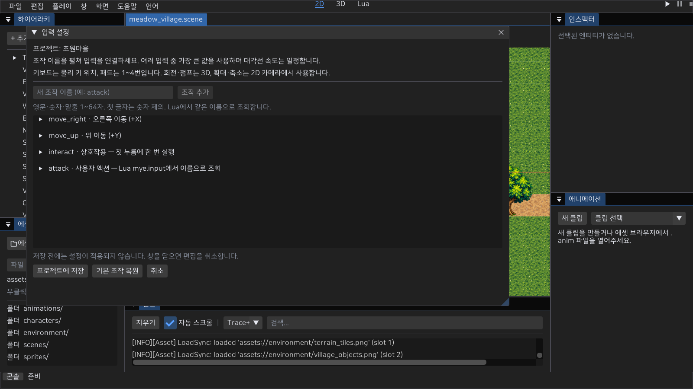
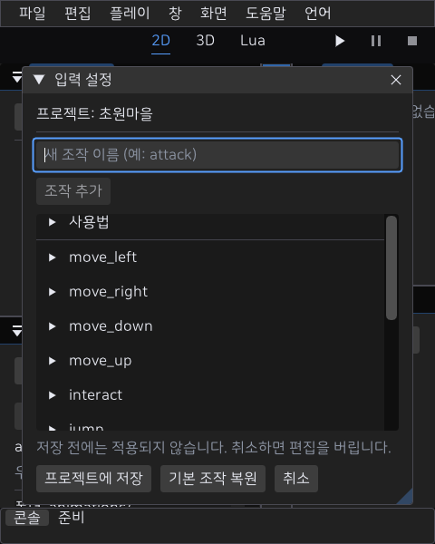

# 프로젝트 입력 설정

배포 기준: **0.4.0**에 이 문서의 연결된 기능을 포함한다. 아래의 기존 0.3.0 관련 문구는 이전 버전과의 차이다. 실제 장치·새 PC·공개 온라인 운영의 미완료 조건은 유지한다.

**파일 → 입력 설정…**에서 조작을 만들거나 펼쳐 키보드·마우스·패드 입력을 연결하고 **프로젝트에 저장**을 누른다. Play와 MyGame의 로컬/인증 플레이가 같은 설정을 읽는다. 사용자 액션은 로컬 Lua에서 이름으로 조회한다. 현재 main 소스의 기능이며 기존 0.3.0 배포본에는 없다.

## 바로 변경하기

1. Play를 중지하고 입력 설정을 연다.
2. `move_right`를 펼쳐 기존 입력을 제거하고 **입력 추가 → 키보드 → L**을 선택한다. 다른 방향도 원하는 키로 지정한다.
3. 필요하면 마우스 버튼·패드 버튼/축을 추가한다. 같은 조작에 여러 입력을 연결할 수 있지만 같은 바인딩을 두 번 저장할 수 없다.
4. **프로젝트에 저장**을 누르고 다시 Play를 시작한다. 다음 실행부터 저장한 설정을 사용한다. 창 닫기·취소는 저장 전 편집을 버린다. 입력 설정에 포커스가 있을 때 Escape로 취소한다. 입력 칸/팝업이 먼저 Escape를 소비하면 편집/팝업을 종료한 뒤 다시 누른다. 다른 작업대의 Escape는 초안을 버리지 않는다.

화면 크기가 바뀌면 설정 창을 다시 중앙에 배치한다. 설정 창은 사용 가능한 화면 크기 안에서 크기를 변경하며 이름 칸·추가 버튼과 하단 버튼은 폭에 맞춰 줄을 바꾼다. 사용법과 조작 목록은 스크롤 영역이고 저장·복원·취소는 하단에 둔다. 장치·입력·패드 번호·방향은 두 열로 배치한다. 조작의 역할은 펼쳤을 때 표시하고 접힌 이름에는 툴팁으로 제공한다. **기본 조작 복원**은 편집 중인 설정만 기본값으로 바꾸며 저장해야 적용된다. 씬과 다른 프로젝트 파일은 이 버튼으로 저장하지 않는다.

창을 열면 이름 칸에 포커스가 간다. 사용자 조작은 `attack`처럼 영문·숫자·밑줄 1~64자를 쓰고 **Enter 또는 조작 추가**를 누른다. 숫자로 시작하는 이름·중복 이름은 거부하며 최대 64개다. 추가한 조작을 펼쳐 바인딩을 연결한다. **조작 제거**는 해당 이름과 모든 바인딩을 편집 초안에서 지운다. 기본 이동 조작도 제거하면 작동하지 않으므로 필요할 때 기본값을 복원한다. 이름 변경은 제거 후 새 이름으로 추가한다. 저장 전 취소는 추가·제거도 버린다.





## 기본 조작

| 조작 이름 | 기본 입력 | 역할 |
|---|---|---|
| move_left / move_right | A / D, ← / →, 패드 D-pad·왼쪽 X축 | XY 수평 이동 |
| move_down / move_up | S / W, ↓ / ↑, 패드 D-pad·왼쪽 Y축 | XY 수직 이동. +Y 위 |
| interact | E, 패드 X | 로컬의 가까운 대상과 상호작용. 첫 누름에 한 번 |
| jump | Space, 패드 A | 기존 3D 캐릭터의 점프 |
| camera_left / camera_right | Q / R, 패드 오른쪽 X축 | 기존 3D 카메라 회전 |
| camera_drag | 마우스 오른쪽 버튼 | 기존 3D 카메라 드래그 |
| zoom_in / zoom_out | 휠 위 / 아래 | 저장 2D 카메라의 확대·축소. 키/버튼이면 첫 누름에 한 단계 |
| exit_game | Escape | MyGame 종료, Play 중지 후 편집으로 복귀 |

입력이 없는 조작은 작동하지 않는다. 키보드는 문자가 아닌 물리 키 위치를 사용한다. 패드 번호는 UI에서 1~4이며 기본값은 1이다. 스틱 X의 양수는 오른쪽, Y의 양수는 위다. 에디터의 Ctrl+S·Ctrl+P 등 단축키와 작업대 팬·줌은 게임 조작 설정과 별개다.

패드는 현재 Windows XInput 지원 장치를 대상으로 한다. 다른 패드·키보드 레이아웃의 직접 검수는 남아 있다. 현재 인증 2D는 이동과 로컬 카메라 입력을 소비하며 서버 상호작용·맵 전환은 후속 게임 규칙 작업이다. 기존 인증 XYZ는 점프도 사용한다.

## 입력 계산과 저장 계약

여러 바인딩의 세기는 가장 큰 값으로 결정한다. 반대 방향은 상쇄되고 대각선 길이는 1 이하로 제한한다. 이동에는 네 방향의 평균 데드존을 원형으로 적용한다. 각 액션의 데드존은 유한한 `[0,1)` 값이며 UI의 편집 범위는 0~0.95다. 프로젝트 액션은 원시 패드 축을 사용해 저장한 데드존을 한 번 적용한다. 플랫폼의 고정 스틱/트리거 필터를 먼저 겹쳐 적용하지 않는다.

작은 입력을 쓰려면 해당 조작의 데드존을 낮춘다. 예를 들어 스틱 원시값 5000/32767과 데드존 0.1은 수평 이동 세기 약 0.0584가 된다. 기존 플랫폼 필터에서는 이 샘플이 0이었다. 트리거도 원시 0~255 값을 사용하므로 데드존 0.05에서 20/255를 읽을 수 있다. 데드존 0은 장치의 미세한 흔들림도 읽으므로 실제 장치에 맞춰 설정한다. 직접 패드 조작·드리프트/포커스 검수는 아직 남아 있다.

스틱 각 축은 음수 끝 -32768→-1, 양수 끝 32767→1로 정규화하고 +Y는 위다. 두 축의 대각선은 이동 계산에서 길이를 제한한다. 미연결·연결 종료·잘못된 슬롯/축은 0이며 슬롯은 서로 독립이다. 코어의 GamepadSample/UpdateGamepad는 슬롯별 프레임 샘플 경계이고 XInput 폴링이 사용한다. 폴링 사이에 눌렀다 뗀 패드 버튼까지 보존하는 이벤트 스트림은 아니다. 기존 저수준 LeftStick/RightStick·트리거 조회 및 선택 Lua 모듈은 이전 고정 필터를 유지한다; 이름 기반 액션은 이 경로를 사용하지 않는다.

입력 프레임마다 메시지를 받은 뒤 한 번 캡처하고, 고정 틱마다 한 번 소비한다. 키/마우스의 짧은 누름·해제도 두 이벤트를 보존한다. 고정 틱이 없는 프레임은 첫 누름·휠/드래그 델타를 보관하며, 여러 고정 틱의 첫 틱만 이를 소비한다. held 이동은 다음 틱에도 유지한다. Pause·포커스 비활성·UI 캡처 진입은 보관된 입력을 버린다. 재개 시 새 press 이벤트 없이 계속 눌려 있는 키는 상호작용을 다시 발생시키지 않는다.

`.myeproj`의 선택 필드 `inputMap`에 버전 1과 `actions`를 저장한다. 필드가 없는 이전 프로젝트는 기본 조작을 사용한다. 명시된 필드가 잘못되면 기본값으로 숨기지 않고 프로젝트를 거부한다. 최대 64개 액션·액션당 16개 바인딩을 검증하고, 이름 중복·잘못된 장치/코드/방향/패드·데드존을 거부한다. 저장 실패는 메모리 설정·기존 manifest를 유지한다. 설정 저장은 씬 Undo 스택을 사용하지 않으며 저장 전 취소로 편집을 되돌린다.

```json
{
  "version": 1,
  "actions": [{
    "name": "move_right", "deadzone": 0.2,
    "bindings": [{"device": "key", "code": 15, "direction": 1, "pad": 0}]
  }]
}
```

위 객체는 프로젝트의 `inputMap` 값이다. code 15는 물리 L이다. device는 `key`, `mouse`, `pad_button`, `pad_axis`, `wheel`; 키 코드는 Input.h의 USB HID, 마우스/패드 버튼은 해당 enum 값이다. 패드 축은 0=왼쪽 X, 1=왼쪽 Y, 2=오른쪽 X, 3=오른쪽 Y, 4/5=좌/우 트리거다. wheel의 code는 0, 축·휠 direction은 ±1, 디지털은 +1이다. JSON pad는 0~3이며 키/마우스/휠에서는 0이다. 게임 HUD의 조작 설정 UI와 서버 게임 요청 연결은 후속 작업이다.

## Lua에서 사용자 조작 읽기

`attack` 조작을 만들고 F를 연결한 뒤 오브젝트 Lua의 `on_update`에서 조회한다. 다음 예제는 로컬 첫 누름을 기록한다. 온라인 공격·피해 권한을 부여하는 API는 아니다.

```lua
return {
    on_update = function(self, dt)
        if mye.input.is_action_just_pressed("attack") then
            mye.log("공격 조작을 눌렀습니다")
        end
        local direction = mye.input.get_vector("move_left", "move_right", "move_down", "move_up")
    end
}
```

| Lua 함수 | 결과 |
|---|---|
| `mye.input.is_action_pressed(name)` | 데드존 적용 세기가 0보다 큰지 bool |
| `mye.input.is_action_just_pressed(name)` | 현재 고정 틱의 첫 누름 bool |
| `mye.input.is_action_just_released(name)` | 현재 고정 틱의 해제 bool |
| `mye.input.get_action_strength(name)` | 데드존 적용 세기 0~1 |
| `mye.input.get_action_raw_strength(name)` | 데드존 적용 전 세기 0~1 |
| `mye.input.get_vector(left, right, down, up)` | 공통 원형 데드존·길이 제한을 적용한 Vec2 |

한 틱의 모든 스크립트/반복 조회는 같은 상태를 읽는다. 조회 자체는 이벤트를 소비하지 않는다. 다음 틱은 첫 누름/해제를 다시 읽지 않는다. 같은 프레임에서 누르고 뗀 짧은 탭은 두 엣지가 true이고 held/세기는 0이다. 없는 이름은 false/0이며 빈 이름·65바이트 이상·문자열이 아닌 인자는 Lua 오류다.

ObjectSystem의 Tick 동안만 소비된 상태를 빌려 쓰고 모든 반환 경로에서 해제한다. 초기 프로젝트 인스턴스의 `on_init`, 틱 밖의 콜백과 월드 종료의 `on_destroy`는 중립 상태를 읽는다. 틱 안에서 새 인스턴스·이벤트 콜백·삭제 감지의 `on_destroy`가 실행되면 그 틱을 읽는다. 입력 버퍼를 VM보다 먼저 파괴해도 종료 콜백에 이전 상태가 남지 않는다. 인증 MyGame은 클라이언트 Lua를 실행하지 않는다. 기존 원시 키/패드 함수는 별도 앱이 InputState를 등록한 경우의 입력 프레임 API다; 공식 ObjectSystem에는 원시 장치를 연결하지 않아 중립 값을 반환한다.

## 검증과 다음 단위

`InputActions → runtime::GameInputBuffer → PlayModeController/ObjectSystem 또는 MyGame::TickOnline`이 실제 소비 경로다. 온라인 패킷·예측/권위 이동 계약은 그대로 사용하며 시각 카메라/종료 입력을 서버 이동 권위로 보내지 않는다. MyServer는 조작 키를 해석하지 않는다.

회귀 검사는 짧은 탭·반복·고정 틱 소비·대각선/반대 방향·캡처 취소·저장/재로드/실패 보존과 동일 입력의 Play/로컬 ObjectSystem 위치 일치를 확인한다. Play 창의 Win32 메시지에 X1 탭·휠·키·포커스를 보내는 검사는 **합성 메시지**이며 직접 장치 입력 검수와 구분한다. `tools/verify-input-actions.ps1`은 두 앱의 설정 로딩/오류 종료·실제 설정 창 캡처·이전 프로젝트 호환·씬 보존을 검사한다. 이동 키를 직접 누르는 검사를 대신하지 않는다.

사용자 액션 작성·저장·재로드와 Lua 틱/종료 수명은 Play/별도 로컬 ObjectSystem에서 검증한다. 원시 패드 회귀는 작은 스틱/트리거·양끝·네 슬롯·연결 종료/포커스 중립·복귀 시 held 버튼 재실행 방지·대각선을 같은 샘플 경계에서 검사한다. 복귀한 이동은 유지하며 새 버튼 누름은 다시 실행된다. 저장한 4번 패드 트리거 조작이 Play/로컬 Lua에 전달되는 것도 확인한다. 합성 샘플은 실제 장치를 대신하지 않는다. ImGui 키 이벤트/활성화 회귀는 Enter 추가·포커스별 Escape·펼친 기본 조작 바인딩·좁은 창과 글꼴 1.5배의 가로 넘침/하단 버튼 가시성을 검사한다. native 캡처는 1600×900·480×600·360×600을 확인했다. 사람의 전체 키보드 탐색·직접 키보드/휠/패드·OS 반복·실제 모니터 DPI 전환 검수는 남았다. 다음은 이 장치 검수와 방향별 모션이다. D07 전체와 MMORPG 제작/출시는 아직 완료되지 않았다. [카메라](24-2d-camera.md), [2D 온라인](23-2d-online-play.md), [남은 작업](22-2d-mmorpg-roadmap.md)을 함께 확인한다.
