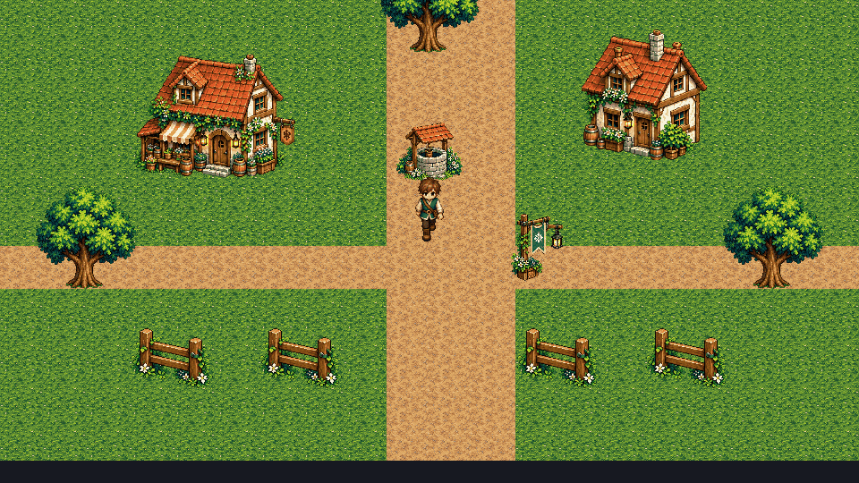
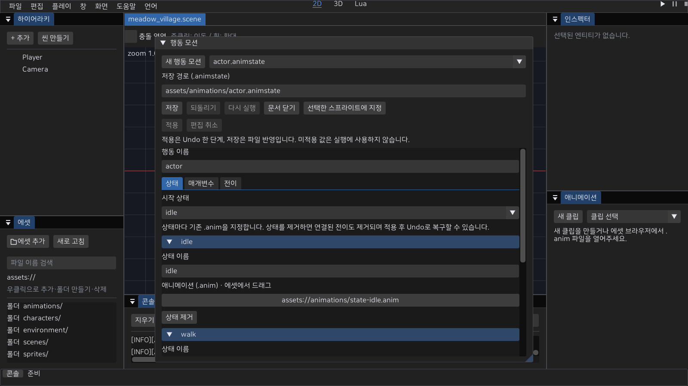

# 2D 캐릭터 모션

배포 기준: **0.4.0**에 이 문서의 연결된 기능을 포함한다. 아래의 기존 0.3.0 관련 문구는 이전 버전과의 차이다. 실제 장치·새 PC·공개 온라인 운영의 미완료 조건은 유지한다.

**한 `.anim`에 기본 클립과 8방향 클립을 작성하고, 대기·걷기 모션에 연결한다.** main 소스의 에디터 Play·MyGame·인증 온라인 MyGame이 같은 방향 해석을 사용한다. 기존 단일 클립 파일은 그대로 읽는다. 아래 방향별 저장 기능은 배포된 0.3.0의 지원 범위가 아니다.

## 연결 방법

1. 외부 도구에서 만든 PNG를 가져오고 애니메이션 패널의 **시트** 탭에서 프레임 영역·발 피벗을 지정한다. 그림 제작·리깅은 외부에서 수행한다.
2. **편집 방향**에서 기본 또는 방향을 선택한다. **클립 추가**는 기본 타임라인을 복사하고, **클립 제거**는 해당 방향을 비운다. 방향을 선택하는 것만으로 에셋은 변경되지 않는다.
3. 선택한 클립의 **미리보기**에서 프레임 순서·표시 시간, **클립**에서 이름·반복·재생 방향, **이벤트**에서 마커를 편집한다. 미지정 방향은 대체 결과를 미리 보여주며 직접 편집은 클립 추가 후 가능하다.
4. `.anim`을 저장하고 `SpriteAnimator.animation`과 `CharacterController2D.idleAnimation`·`walkAnimation`에 연결한다. 기존 `.meta` GUID와 문서 Undo·Redo를 사용한다.
5. 씬을 저장하고 Play한다. 정지하면 대기, 실제 이동량이 한 틱에 0.000001 월드 단위보다 크면 걷기를 요청한다. 속도가 낮아도 같은 기준을 사용한다.
6. 비반복 클립의 후속 모션은 완료 뒤 다음 고정 틱에서 재생한다. 같은 이동 상태는 매 틱 시작 클립을 다시 요청하지 않는다. 대기·걷기에 서로 다른 에셋을 연결하면 걷기→정지→걷기는 새로운 요청이므로 처음부터 시작한다.

**시트와 프레임 영역은 모든 방향이 공유한다.** 시트 교체·그리드 재생성은 프레임 인덱스가 바뀌므로 타임라인·이벤트·방향 클립과 반전 설정을 초기화한다. 패널에서 이유를 안내하며 Undo로 되돌릴 수 있다. 피벗 수정은 같은 시트 프레임을 사용하는 모든 클립에 적용된다. 그림을 자동 생성하거나 사용자 원본을 변경하지 않는다.

## 외부 리깅 모션을 가져오는 방법

**현재 공식 2D 제작 경로는 본 모션을 PNG 프레임으로 베이크한 뒤 `.anim`으로 재생한다.** SpriteAnimator는 프레임 영역·발 피벗·시간·방향·이벤트를 소비한다. 본 계층·가중치·IK·신체 레이어를 그대로 임포트해 런타임에서 변형하는 경로는 제공하지 않는다. 외부 리그 파일이 있다는 이유만으로 엔진 리깅 완료로 표시하지 않는다.

1. 외부 제작 도구에서 본/레이어 원본과 모션을 보관한다. 대기·걷기·공격 등 필요한 모션과 방향을 PNG 시트로 베이크한다. 엔진은 원본 리그를 수정하지 않는다.
2. 프레임마다 같은 캐릭터 배율과 지면 기준점을 사용한다. 프레임을 잘라 여백이 달라지면 **프레임 내부 픽셀 기준 발 피벗**도 다시 지정한다. 투명 영역은 충돌 형상이 아니므로 Collider2D의 크기/offset을 별도로 확인한다.
3. PNG를 공식 임포트하고 시트 탭에서 실제 이미지 크기·프레임 영역·피벗을 지정한다. 클립 시간·반복·이벤트를 작성하고 `.anim`/씬을 저장·재열기한다. main의 방향별 클립은 위 연결 방법을 따른다. 배포된 0.3.0은 단일 클립 경계를 먼저 확인한다.
4. 실제 게임 창에서 이동/정지·대각선·벽 접촉·방향 전환을 검사한다. 미리보기는 그림/시간 검사이며 캐릭터 이동·발 접지의 통과가 아니다. 자동 시작/속도 API 검사를 실제 WASD 조작 성공으로 계산하지 않는다.

기본 PPU 48·오브젝트 배율 1에서 평지 직선 이동의 한 주기 이동량은 `속도(unit/s) × 48 × 주기(s)` 픽셀이다. 예를 들어 속도 2·0.5초 주기는 48px다. 발이 지면에 붙어 있는 구간의 그림 변화가 이 이동과 맞는지 비교한다. 현재 엔진은 보폭에 맞춰 재생 속도를 자동 조절하거나 IK로 접지를 보정하지 않는다. 다른 배율·충돌 후 실제 이동·방향별 원근 표현은 해당 장면에서 다시 검수한다.



이 GIF는 기존 프레임 재생 예시다. 본 리그 임포트·새 캐릭터 아트 승인·자연스러운 실제 키 조작의 증거는 아니다. 원본 PNG/리그/GUID를 보존하며 마감 수정은 새 에셋 버전에서 수행한다. 월드 소품/캐릭터의 cutout 가림은 [바이너리 알파 계약](04-asset-pipeline.md)을 함께 확인한다.

## 방향 선택과 대체 규칙

**직접 지정한 방향 클립 → 선택적으로 좌측 클립 반전 → 기본 클립** 순서다. **우측 반전**을 켜도 명시적인 우측 클립이 우선한다. 반전 대상인 좌측 클립도 비어 있으면 기본 클립을 반전 없이 사용한다. 기본 클립은 항상 필요하다.

| 인덱스 | 저장 키 | 우측 반전 시 대체 |
|---|---|---|
| 0 | down | 기본 대체만 |
| 1 | down_left | 기본 대체만 |
| 2 | left | 기본 대체만 |
| 3 | up_left | 기본 대체만 |
| 4 | up | 기본 대체만 |
| 5 | up_right | up_left |
| 6 | right | left |
| 7 | down_right | down_left |

이동 입력은 방향을, 실제 충돌 후 이동량은 대기·걷기를 결정한다. 벽에 막혀도 벽 쪽을 바라볼 수 있고 입력을 놓으면 마지막 방향을 유지한다. 인증 온라인은 서버/예측의 `facingRadians`를 같은 8방향으로 변환한다. 로컬은 검증된 이동 입력을 사용한다. +Y up·발 피벗·48 PPU 계약은 유지한다.

로컬 Lua의 `entity:facing_index()`·`facing_vector()`는 현재 방향을 읽는다. `face_move(Vec2)`는 직접 방향을 지정한다. 활성 캐릭터 조작은 비영 이동 입력이 있는 틱의 후반에 방향을 갱신하므로 `on_update`는 이전 완료 틱의 결과를 읽는다.

## 파일과 오류

**버전 1은 기본 클립만, 버전 2는 기본 클립과 선택적 방향 클립을 저장한다.** 방향 클립이나 우측 반전이 없으면 저장 결과는 버전 1이다. 버전 2에는 `directions` 객체와 `mirrorRight` 불리언이 필요하다. 방향은 위 표의 키로만 지정하며 누락은 대체 규칙을 뜻한다. `null`이나 임의 방향 이름을 넣지 않는다. 루트의 기존 `texture`, `width`, `height`, `frames`, 기본 클립 필드와 선택적 `nextAnimation`은 유지한다.

각 방향 값은 아래처럼 같은 시트의 프레임 인덱스를 사용한다. 별도 텍스처·중첩 방향 객체·방향마다 후속 에셋을 지정하지 않는다. `direction`은 바라보는 방향 키와 별개인 재생 순서(0 정방향, 1 역방향, 2 왕복)다.

```json
"directions": {
  "left": {
    "name": "walk_left", "loop": true, "direction": 0,
    "timeline": [{"frame": 2, "seconds": 0.15}], "events": []
  }
},
"mirrorRight": true
```

시트·각 타임라인은 1~4096 프레임, 이벤트는 최대 4096개다. 표시 시간은 유한한 0.001~60초, 인덱스와 마커 위치는 각 범위 안이어야 한다. 잘못된 버전·방향·타입·참조·시간은 저장/로드에서 거부한다. 편집 중의 미완성 데이터는 저장할 수 없으며 씬에 지정하면 오류를 설명한다. 에디터의 바인딩 실패는 하단 오류로 전달하고 Play를 중단한다. 자동 실행은 MyGame과 마찬가지로 실패 종료한다. 저장 실패는 기존 파일과 `.meta`를 보존한다.

공통 JSON 파서의 중복 키는 마지막 값을 사용한다. 이 형식 검증이 원본 JSON의 중복 키를 거부한다고 주장하지 않는다.

## 진행률과 발 피벗

**방향을 바꿔도 전체 재생 시간의 진행률과 일시정지를 유지한다.** 프레임 번호 대신 논리 재생 주기의 경과 시간 비율을 사용한다. 1초 클립의 40% 위치에서 0.5초 클립으로 바꾸면 0.2초 위치를 표시한다. 역재생과 왕복은 실제 논리 순서·각 프레임 시간으로 계산한다. 같은 좌측 클립을 우측 반전으로 표시할 때는 재생 위치를 그대로 사용한다.

비반복 모션이 완료된 뒤 방향만 바꾸면 대상 클립의 논리 마지막 프레임에 머문다. 대상이 반복 클립이어도 완료 상태는 유지한다. 별도 에셋 요청·후속 모션은 새 재생이며 기존 첫 이벤트 규칙을 따른다. 메모리 상태 머신의 keepPhase는 같은 시간 비율을 사용하되 완료 후 새 상태에 진입하면 처음부터 시작한다. 공격·피격·사망 상태를 에디터에서 작성하는 기능은 아직 연결되지 않았다.

애니메이션 패널의 편집 방향 선택도 재생 위치·일시정지를 유지한다. 처음부터 보려면 **처음으로**를 누른다. 타임라인 수정·Undo·시트 교체처럼 클립 데이터가 바뀌면 미리보기 커서를 초기화한다. 화면 샘플은 새 방향의 보정 위치만 보여주고 고정 틱 커서·이벤트 이력을 변경하지 않는다.

반전된 이미지도 원본 프레임의 발 피벗이 같은 월드 위치에 오도록 사각형을 보정한다. x 반전은 너비−pivotX, y 반전은 높이−pivotY를 사용하며 렌더·에디터 선택 경계가 같은 계산을 사용한다. PPU·월드 앵커·깊이 계약은 유지한다.

## 고정 틱과 이벤트

첫 프레임과 이후 진입 프레임의 마커는 고정 틱에서 `on_event("animation", payload)`로 전달한다. 에셋 바인딩·정지/일시정지 화면의 표시는 커서·상태 전이·트리거·첫 이벤트를 소비하지 않는다. 반복 렌더로 이벤트가 사라지거나 재발행되면 결함이다. 인증 온라인 클라이언트에는 로컬 Lua가 실행되지 않으며 표현 이벤트를 권위 피해·보상으로 사용하지 않는다.

방향 보정은 이벤트 없이 위치만 옮긴다. 새 방향의 처음부터 보정 위치까지 마커를 재생하거나 현재 마커를 재발행하지 않는다. 이후 고정 틱에서 실제로 경계를 넘은 마커만 발행한다. 방향 선택과 행동 상태 진입은 다른 동작이다.

## 연속 프레임 진단

**MyGame의 입력 재생 중 지정한 위치를 실제 BMP와 읽기 전용 JSON으로 저장한다.** main 소스의 진단 기능이며 현재 게임 카메라는 2D여야 한다. 출력 폴더는 미리 만든다.

```powershell
MyGame.exe --project project.myeproj --headless --input movement.json --capture-at 1,9,13,17,22,27,32 --dump build/check/run.bmp
```

`--capture-at`는 소비한 입력 재생 스텝 번호다. 온라인 재생은 접속 이후 시작한다. 1~36000 안의 증가하는 정수 최대 32개를 쉼표로 지정한다. 중복·역순·잘못된 수·입력 재생 길이 초과를 거부한다. `--input`·`--dump`가 필요하다. `run.step-N.bmp`·`run.step-N.json`을 저장하고 기존 마지막 `run.bmp`도 유지한다. 캡처 사이에 같은 프로세스·월드·연결이 계속 진행한다.

JSON은 replayStep·fixedTick과 actors의 netId/local(온라인 본인 여부), facing·animationState(현재 상태 이름, 단일 클립은 빈 문자열)·frame·cursorStep·cursorSeconds·playing·finished·flipX, worldX/worldY(월드 단위), screenX/screenY(내부 픽셀)를 기록한다. 오프라인의 netId는 0이며 local은 온라인에서만 사용한다. 고정 틱에는 접속 대기 틱도 포함되므로 입력 스텝과 숫자가 다를 수 있다. 캡처는 해당 고정 틱의 표시 결과이며 서버 ack나 네트워크 전역 재생 시계를 뜻하지 않는다. 경로/BMP/원자적 JSON 쓰기 실패는 설명과 실패 종료로 전달한다. 두 파일 전체는 원자적으로 저장되지 않으며 JSON 실패 뒤 BMP가 남아도 검증 성공으로 보지 않는다.

입력 재생의 각 steps 항목에 선택적 불리언 `animationPlaying`을 넣어 그 틱의 모든 SpriteAnimator 표현을 일시정지/재개한다. 누락은 현재 상태를 유지하며 문자열·null은 거부한다. 커서를 초기화하지 않고 조작·물리·서버 입력은 계속 진행한다. 이 필드는 진단 CLI용이며 Lua 함수나 서버 상태 변경 명령이 아니다. 기존 버전 1 입력 파일은 그대로 실행된다. 읽기 지연으로 고정 틱 따라잡기가 같은 스텝을 덮어쓰지 않도록 캡처를 다음 렌더에서 먼저 처리한다. 동기식 GPU 읽기/디스크 쓰기는 성능 측정용이 아니다.

## 행동 상태 파일

**main 소스는 `.animstate`를 에디터에서 작성·Undo·저장하고 Play/MyGame에서 같은 상태·조건으로 재생한다.** 일반 `.anim` 버전 1/2와 이미지 제작 흐름은 유지한다. 상태는 기존 `.anim`을 참조하므로 8방향 그림을 다시 저장하지 않는다.

```json
{
  "version": 1, "name": "player", "initialState": "idle",
  "parameters": [{"name": "attack", "type": "trigger", "default": false}],
  "states": [
    {"name": "idle", "animation": "기존 idle.anim.meta의 GUID"},
    {"name": "attack", "animation": "기존 attack.anim.meta의 GUID"}
  ],
  "transitions": [
    {"from": "idle", "to": "attack", "onClipFinished": false, "keepPhase": false,
     "conditions": [{"param": "attack", "op": "is_true"}], "consumeTriggers": []},
    {"from": "attack", "to": "idle", "onClipFinished": true, "keepPhase": false,
     "conditions": [], "consumeTriggers": []}
  ]
}
```

GUID 설명 문자열은 실제 `.meta`의 UUID로 바꾼다. `initialState`와 `from`/`to`는 상태 이름을 사용하므로 상태 순서를 바꿔도 같은 대상을 가리킨다. `from`의 `*`는 모든 상태이며 같은 상태로의 전이는 실행하지 않는다. 전이는 저장 순서대로 평가하고 한 고정 틱에 하나만 수행한다. 조건은 모두 참이어야 하며 조건이 빈 전이는 항상 준비된다. `onClipFinished`는 비반복 모션의 완료를 추가로 요구하며 반복 모션의 한 주기 종료를 뜻하지 않는다.

| 설정 | 계약 |
|---|---|
| bool / trigger | default는 불리언. trigger는 false로 시작. is_true / is_false 조건 사용 |
| float | default와 비교 value는 유한한 float. greater / less / greater_equal / less_equal / equal / not_equal 사용 |
| keepPhase | true는 전체 시간 비율을 유지, false는 대상 처음부터 시작. 완료 뒤 진입은 항상 처음부터 |
| trigger 소모 | 선택된 전이의 trigger 조건과 consumeTriggers 목록을 지움. 명시 목록은 선언된 trigger만 허용 |
| 이름·개수 | 이름은 1~64 UTF-8 바이트, 제어문자/예약 이름 * 제외. 상태/파라미터 각 최대 64, 전이 256, 전이의 조건·명시 소모 각 16 |
| 오류 | 중복 상태/파라미터, 미선언 조건, 잘못된 타입/연산자/초기 상태/끝점/필드/버전·비어 있는 GUID를 거부 |

`AnimationStateAsset::FromJson`/`ToJson`은 포인터 없는 값 데이터만 다루며 저장 전에도 검증한다. `Load`는 기존 AssetDatabase/VFS에서 행동 파일과 각 `.anim` GUID·파일 형식을 확인한다. 앱 바인딩은 모든 상태의 PNG 디코드와 저장 시트 크기를 검사한 뒤 초기 상태를 준비한다. 행동 파일에서는 전이가 완료를 소유하므로 참조 클립의 `nextAnimation`을 따라가지 않는다. 단일 클립의 기존 후속 재생은 유지한다. 스캔은 `.meta`를 만들고 기존 GUID를 보존하며, 삭제 검사는 열지 않은 행동 파일의 클립 참조도 보호한다. 공통 JSON 파서의 마지막 중복 키 우선 정책은 유지하므로 원문 중복 키를 거부한다고 주장하지 않는다. 이 파일만으로 공격/피격/사망 입력이나 서버 전투가 실행되지는 않는다.

## 행동 문서 작성

**에셋 영역 우클릭의 `새 행동 모션`, 또는 창 메뉴의 `행동 모션`에서 상태·매개변수·전이를 작성한다.** `.animstate` 에셋의 더블 클릭/우클릭 열기도 같은 패널을 사용한다. 픽셀 그림·리깅을 제작하는 패널이 아니다.



main 소스의 실제 1600×900 에디터 프레임이다. 기존 `.anim`을 참조하는 상태·작성/저장 위치를 보여 준다. 그림 제작·권위 전투·실제 OS 드래그/장치 검수의 증거는 아니다.

1. **상태** 탭에서 대기·걷기·공격 등 상태를 추가하고 에셋 브라우저의 기존 `.anim`을 해당 상태에 드래그한다. 시작 상태를 선택한다. 상태 제거는 연결된 전이도 제거하고 나머지 끝점/시작 상태를 재지정한다. 적용 후 Undo로 함께 복구할 수 있다.
2. **매개변수** 탭에서 bool·float·trigger와 기본값을 작성한다. 이름 변경은 조건/소모 참조에도 반영한다. 다른 매개변수와 같은 이름은 입력 중에 거부해 각 참조를 보존한다. 참조 중인 매개변수는 먼저 조건/소모를 지워야 제거할 수 있다. 타입 변경은 기본값을 초기화하므로 조건 연산도 확인한다.
3. **전이** 탭에서 출발/도착·모든 상태·완료 대기·진행률 유지·조건/비교값·추가 trigger 소모를 지정한다. 우선순위를 올리거나 내린다. 자기 상태 전환·조건 타입 불일치·중복 이름은 적용 단계에서 거부한다. 공격/피격 진입처럼 처음부터 재생할 전이는 진행률 유지를 끈다.
4. **적용**은 문서 Undo 한 단계다. 미적용 값은 문서에 보존하지만 재생에는 사용하지 않는다. **편집 취소/Escape**로 버릴 수 있다. 미적용 상태에서는 Undo/Redo와 일반 저장 단축키를 사용하지 않는다. 패널의 **저장**은 적용을 먼저 시도한다.
5. `assets/` 안의 `.animstate` 경로에 저장한다. 다른 기존 파일/메타를 덮어쓰는 새 문서 저장은 거부한다. 기존 파일을 열어 수정하면 GUID를 유지한다. 저장 실패는 문서·기존 파일을 보존하고, 닫기 창은 저장/버리기/취소를 제공한다. 에셋 인덱스 갱신 실패는 파일 저장 완료와 별도로 표시한다.
6. 저장한 문서의 **선택한 스프라이트에 지정**, 또는 Inspector의 `stateMachine`에 드래그로 연결한다. 지정은 씬 Undo에 기록하므로 씬도 저장한다. Play/MyGame에서 실제 상태·마커·완료를 검사한다. 저장 시 이름/조건/GUID 형식 검증과 실행 시 클립/PNG 로드 검증은 별개다.

문서 선택/새 작성은 미적용 값이 있을 때 잠그며 다른 에셋에서 문서를 열어도 이전 초안은 보존한다. Play 중에는 작성·저장·지정을 잠근다. 좁은 패널에서는 작업 버튼을 줄바꿈하고 탭 본문을 스크롤한다. Ctrl+Z/Y/S는 포커스 문서에 적용한다. 작성 CLI는 `MyEditor.exe --project project.myeproj --animation-state assets/animations/character.animstate`다.

## 행동 재생 연결

**SpriteAnimator의 `stateMachine`에 `.animstate` GUID를 지정하고 씬을 저장한다.** 파일은 프로젝트 `assets/` 아래 둔다. 행동 모션 패널의 지정 버튼과 기존 인스펙터의 AssetRef 필드를 사용한다. 상태가 지정되면 `animation`·CharacterController2D의 대기/걷기 클립보다 우선한다. 각 상태는 자신의 시트·이미지 크기·방향별 `.anim`을 사용한다. 잘못된 행동/클립 GUID, 손상 클립·누락 PNG·시트 크기 불일치는 비활성 상태에서도 Lua 초기화 전에 거부한다.

각 캐릭터는 매개변수·현재 상태·커서를 독립적으로 소유한다. 파일의 기본값은 로컬 `on_init` 전에 준비하며 보통의 바인딩/렌더는 값을 초기화하거나 trigger/전이/첫 이벤트를 소비하지 않는다. 새 상태의 첫 마커와 완료 전환은 고정 틱에서만 실행된다. 같은 정의를 공유하는 원격 캐릭터도 별도 값을 갖는다. 명시적으로 선언한 bool `moving`은 실제 2D 이동량으로 갱신하며 그 외 이름을 자동으로 만들지 않는다. float `speed` 등은 게임 Lua가 정의한 단위를 따른다.

```lua
-- 행동 파일에 trigger attack을 선언한 로컬 캐릭터
local entity = mye.world.entity_from_packed(self.entity)
entity:set_trigger("attack")
```

기존 `set_bool`/`set_float`/`set_trigger`와 조회 함수를 재사용한다. 행동 파일이 지정되면 미선언 이름·다른 타입은 Lua 오류이며 `get_bool`로 bool/trigger를 읽을 수 있다. 이름은 1~64 UTF-8 바이트, 제어문자/NUL·비문자열은 거부한다. float는 유한한 float 범위다. 행동이 없는 기존 애니메이터는 매개변수 자동 생성과 없는 값의 중립 조회를 유지한다. 인증 온라인 클라이언트는 계속 Lua를 실행하지 않는다. 로컬 행동 입력·중단은 아래 공개 경로를 사용하며 서버 전투 판정은 별도다.

에디터는 열린 `.anim`과 적용한 `.animstate`의 수정·Undo/Redo를 참조하고 변경 시 행동 재생을 초기 상태로 다시 준비하며 동일 이름/타입의 기존 매개변수 값은 유지한다. Lua on_init을 다시 호출하지 않는 에셋 교체가 게임 값을 지우지 않게 한다. Undo 위치가 같아도 변경 이력 revision으로 구분한다. 문서를 닫으면 저장/버린 결과를 디스크에서 읽으며 임포트/새로 고침의 새 자원 세대도 구분한다. 외부 파일 변경은 수동 새로 고침이 필요하다. 문서 재열기·적용/초안·Undo·닫기 후 디스크 복귀·새로 고침·Play 첫 틱의 재바인딩을 검사했다. 실제 OS 드래그/전체 키보드 탐색은 후속 검수로 남긴다.

**맵을 다시 불러오면 행동 인스턴스도 새로 시작한다.** 같은 `.animstate` GUID라도 새 캐릭터의 매개변수·커서·첫 이벤트는 새 인스턴스다. 기본값을 도착 Lua `on_init` 전에 준비하며, 떠난 인스턴스의 trigger나 콜백을 도착 인스턴스로 옮기지 않는다. 에셋 수정 시 기존 매개변수를 유지하는 위 규칙과 구분한다. 프로젝트 Lua의 HP·가방·퀘스트 전역값은 맵 간 보존하지 않으며 별도 상태 전달/저장 경로가 필요하다.

`tools/verify-animation2d.ps1 -StateMaps -Configuration Debug` 또는 `Release`는 `-States` 검사와 함께 두 공식 앱의 로컬 A→B→A 트리거 포털을 검사한다. 실제 이름 기반 도착 `(4,2)`·복귀 `(-4,1)`, 새 Lua/매개변수, 첫 대기/공격 이벤트와 돌아온 대기의 픽셀을 확인한다. 손상된 도착 모션은 비활성 클립까지 Lua 초기화 전에 거부하고 오류에 도착 씬 경로를 표시한다. 기존 에디터 모듈 회귀는 거부 시 이전 Play 월드/매개변수가 유지되는지도 확인한다. 앱은 오류를 보고하고 자동 실행은 exit 1, 대화형 에디터는 Play를 중지한다. 자동 위치 변경을 사용하는 검사이며 실제 E/이동 입력·온라인 맵·게임 상태 저장의 검증은 아니다.

`tools/verify-animation2d.ps1 -States -Configuration Debug` 또는 `Release`는 7개 로컬 입력 경계의 상태 이름/BMP, Lua 기본값·첫 이벤트·trigger/완료, 실제 Play와 열린 클립, 두 인증 클라이언트의 대기/걷기·로컬/원격 픽셀·ack/Lua 격리를 검사한다. 비활성 상태의 손상도 두 앱에서 실패 종료해야 한다. 온라인 동작은 클라이언트의 이동 표현이며 권위 공격/피해·복제된 행동 상태의 완료 증거가 아니다.

## 현재 검증과 다음 작업

기존 테스트에 버전 1/2 왕복·잘못된 방향/타입/시간/프레임/이벤트, 값 복사와 대체/반전, 기존 GUID·저장 실패 보존·Undo·Redo, 실제 ImGui 방향 선택/추가/제거/저장을 남겼다. `tools/verify-animation2d.ps1 -Configuration Debug` 또는 `Release`는 `build/` 아래 새 프로젝트와 진단 시트를 만든다. 실제 MyGame의 8방향·정지·직접/반전/기본 대체 픽셀, 에디터 패널·Play, 손상 파일 거부, 두 인증 클라이언트의 로컬/원격 방향 픽셀과 Lua 격리를 검사한다. 단색 시트는 해석을 확인하기 위한 자료이며 고화질 게임 아트 승인이나 장치 입력의 증거가 아니다.

`-Phase`를 추가하면 길이가 다른 정방향·역방향·왕복의 로컬 재생 입력 접두사, 무음 보정/실제 마커, 크기·피벗이 다른 프레임의 발 픽셀, 완료된 Play·인증 온라인 전환 결과를 검사한다. 각 온라인 접두사는 새 접속에서 실행하며 완료 상태의 끝 프레임을 확인한다. `-Temporal`은 Phase 검사를 포함하며 로컬·두 온라인 클라이언트의 32개 연속 입력 경계에서 완료 전 모션의 시간 비율·정방향/역방향/왕복·반전/발 픽셀·일시정지/재개를 검사한다. 온라인의 본인과 원격이 같은 표현 계산을 사용하며 일시정지 중 이동/서버 스냅샷도 갱신되는지 확인한다. 잘못된 진단 입력과 BMP/JSON 쓰기 실패도 거부한다. 합성 입력·읽기 지연이 있는 루프백 검사이며 실제 장치·지연/손실·다른 PC 검수는 별도다. 클라이언트 모션은 로컬 표현 시간이며 서버가 복제하는 공통 애니메이션 시계가 아니다.

행동 저장/검증(D08d1)과 앱 재생 바인딩(D08d2a)을 연결했다. 전용 행동 문서 작성/Undo·저장/재로드와 적용/초안·닫기/재열기 수명을 main 소스에 연결했다(D08d2b 진행 중). 로컬 맵 왕복의 모션 수명/실패 거부를 검증했다. D08d3의 현재 상태 조회·트리거 취소·조작 잠금과 라이브러리의 액션 첫 누름/유지·피격/사망 중단을 연결했다. 두 앱의 스크립트로 선택한 행동과 실제 마커·완료 복귀·잠금도 검증했다. 실제 OS 드래그/전체 탐색과 공격 키·포커스 조작은 미완료다. 권위 전투·피해는 D16에서 연결한다. 실제 장치·전체 키보드 탐색·모니터 DPI, 게임 규칙·맵·HUD·운영 보호·완성 게임 배포는 별도 조건이다. [작업 목록](22-2d-mmorpg-roadmap.md), [Lua API](19-lua-api.md), [컴포넌트](20-components.md), [근거 기록](16-foundation-worklog.md)을 함께 확인한다.

## 행동 입력과 중단

**프로젝트 액션의 첫 누름으로 공격을 요청하고, 피격/사망은 공격보다 높은 우선순위의 전이로 중단한다.** main 소스의 로컬 Play/MyGame 경로다. 설치된 0.3.0의 새 기능으로 계산하지 않는다. HP·쿨다운·피해·소지품은 프로젝트 Lua가 소유한다.

프로젝트 설정의 입력 액션에서 `attack`과 키(예: F)를 추가하고 저장한다. 기본 이동·상호작용 액션도 유지한다. [입력 가이드](25-input-actions.md)의 포커스/모달 차단을 사용하며 `is_action_just_pressed`를 고정 틱 `on_update`에서 읽는다. 단일 `is_action_pressed`로 매 틱 공격을 다시 요청하지 않는다.

행동 문서에 idle/walk/attack/hurt/dead 상태와 기존 `.anim`을 지정한다. bool moving/dead, trigger attack/hurt를 false로 선언한다. attack/hurt/dead 클립은 비반복이며 공격의 frame2에 `attack_hit`, frame0에 `attack_entry` 마커를 둔다. 아래 순서로 전이를 만들고 진행률 유지를 끈다. 파일의 frame 번호는 0부터 시작한다.

| 우선순위 | 출발 → 도착 | 조건 | 완료 대기·추가 소모 |
|---|---|---|---|
| 1 | 모든 상태 → dead | dead is_true | 완료 대기 끔. dead의 나가는 전이 없음 |
| 2 | 모든 상태 → hurt | hurt is_true AND dead is_false | 완료 대기 끔, attack 추가 소모 |
| 3 | idle → attack, walk → attack | attack is_true AND dead is_false | 완료 대기 끔. 두 전이 작성 |
| 4 | attack → idle, hurt → idle | 없음 | 완료 대기 켬. 두 전이 작성 |
| 5 | idle → walk, walk → idle | moving is_true / is_false | 완료 대기 끔. 각각 조건 지정 |

`get_animation_state()`는 마지막으로 준비/완료한 고정 틱의 상태 이름을 읽는다. 바인딩/상태가 없으면 nil이다. 조회만으로 전이를 실행하지 않는다. `reset_trigger(name)`는 아직 소모하지 않은 요청을 지우며 현재 재생을 직접 교체하지 않는다. 중단에는 hurt/dead 전이가 함께 필요하다. 조작이 꺼지면 moving=false와 방향 유지가 함께 적용되어 피격/사망이 걷기로 덮이지 않는다.

아래는 입력·모션 연결 예제다. 실제 피해 계산은 `attack_hit` 위치에 프로젝트 함수를 연결하고, 프로젝트가 피격/HP0을 판단했을 때 `interrupt("hurt")`/`interrupt("dead")`를 호출한다. `interrupt`는 예제의 Lua 메서드이며 엔진의 자동 피격 콜백이 아니다.

```lua
local Actor = {}

function Actor:on_init()
    self.state.hitApplied = true
end

function Actor:interrupt(kind)
    assert(kind == "hurt" or kind == "dead")
    local e = mye.world.entity_from_packed(self.entity)
    if e:get_bool("dead") then return end
    e:reset_trigger("attack")
    e:reset_trigger("hurt")
    self.state.hitApplied = true
    if kind == "dead" then e:set_bool("dead", true)
    else e:set_trigger("hurt") end
    mye.controller2d.set_enabled(self.entity, false)
end

function Actor:on_update(dt)
    local e = mye.world.entity_from_packed(self.entity)
    if e:get_bool("dead") then
        mye.controller2d.set_enabled(self.entity, false)
        return
    end
    local state = e:get_animation_state()
    local ready = state == "idle" or state == "walk"
    local request = ready and mye.input.is_action_just_pressed("attack")
    if request then e:set_trigger("attack") end
    mye.controller2d.set_enabled(self.entity, ready and not request)
end

function Actor:on_event(name, payload)
    if name ~= "animation" then return end
    local e = mye.world.entity_from_packed(self.entity)
    if payload.name == "attack_entry" then self.state.hitApplied = false end
    if payload.name == "attack_hit" and e:get_animation_state() == "attack"
        and not e:get_bool("dead") and not self.state.hitApplied then
        self.state.hitApplied = true
        mye.log("attack_hit", self.entity) -- 프로젝트의 범위/방향/피해 함수를 연결한다.
    end
end

return Actor
```

고정 틱은 Lua 갱신→이동/충돌→모션 전이/진행→마커 순서다. 타격 프레임에 들어가기 전 Lua에서 중단을 요청하면 같은 틱에 이전 커서를 폐기하고 이전 공격의 미래 마커를 발생시키지 않는다. 모션 콜백 안에서 설정한 전이는 다음 모션 틱에서 평가한다. 이미 발생한 마커/피해를 되돌리지는 않는다. 한 틱에 여러 마커가 있을 때도 게임의 사망/중단·행동당 적용 가드를 검사한다. 이 가드는 다른 액터의 이벤트 처리 순서에 의존하는 중복 피해를 막으며 서버 권위 검증을 대체하지 않는다.

`tools/verify-animation2d.ps1 -Actions -Configuration Debug`/`Release`는 `-States`에 정상 공격·타격 전 피격/사망을 추가한다. 실제 두 앱에서 스크립트 선택→frame2 타격1/중단0→복귀 또는 terminal dead·현재 상태 조회·트리거 취소·조작 잠금과 저장 파일 보존을 검사한다. 기존 C++ 회귀는 실제 InputState→GameInputBuffer→Lua 첫 누름/유지와 이동 잠금·복귀를 Play/독립 ObjectSystem에 연결한다. 자동 입력/스크립트는 실제 키보드 공격·게임 아트·온라인 전투의 증거가 아니다.
