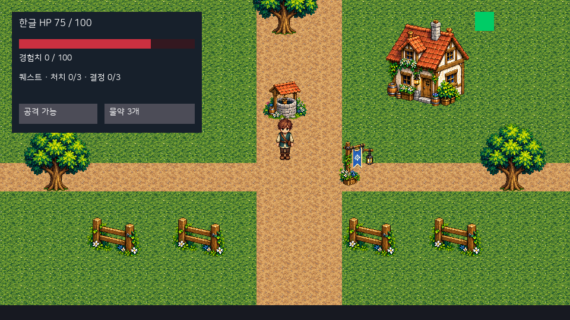
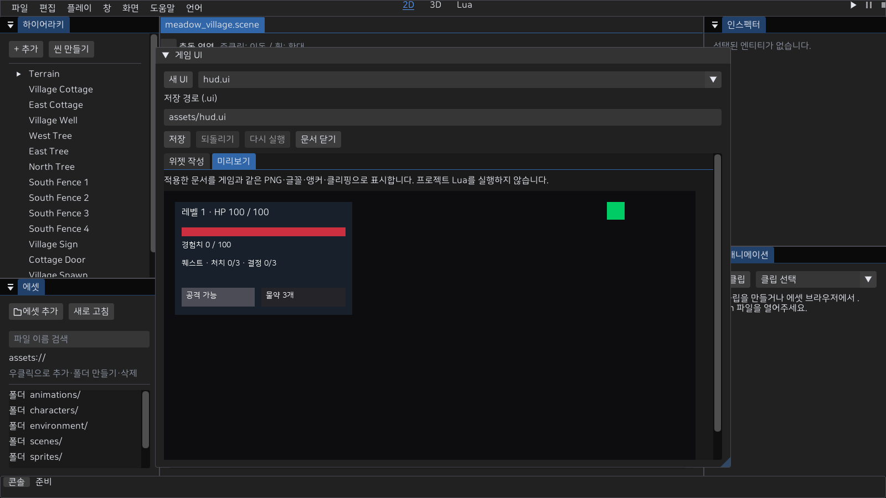
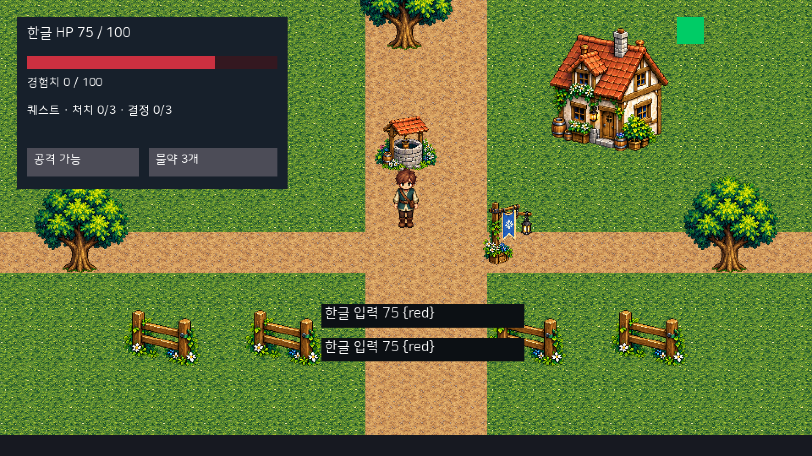

# 27. 저장한 게임 UI와 Lua 상태 표시

배포 기준: **0.4.0**에 이 문서의 연결된 기능을 포함한다. 아래의 기존 0.3.0 관련 문구는 이전 버전과의 차이다. 실제 장치·새 PC·공개 온라인 운영의 미완료 조건은 유지한다.

**main 소스는 `.ui` 문서를 씬의 GameUi에 지정하고 프로젝트 Lua의 표시값을 로컬 Play/MyGame에 출력한다.** 기존 설치 0.3.0에는 이 연결이 없다. UI 문서 작성·Undo/Redo·저장/재열기와 게임 렌더 미리보기를 연결했다. 버튼 클릭·Tab/Shift+Tab·Enter/Space·모달 포커스와 게임 입력 차단을 로컬 Play/MyGame에 연결했다. 저장 TextInput·한글 문자/조합 처리와 고정 틱 제출도 연결했다. 실제 IME 확정/후보창·물리 장치/DPI·패드 UI·온라인 HUD와 새 소비자 배포는 별도 검수다.



## 만들기와 불러오기

1. **창 → 게임 UI → 새 UI**로 문서를 만들거나, 임포트한 `.ui`를 에셋에서 더블 클릭/우클릭으로 연다. [HUD 예제](examples/hud.ui)의 임포트와 외부 텍스트 편집도 지원한다. PNG 제작은 외부 도구를 사용한다.
2. 에셋 브라우저의 에셋 추가 또는 `MyEditor --project <project.myeproj> --import-asset <hud.ui> --asset-destination hud.ui --headless --frames 1`로 임포트한다. 대상과 `.meta`는 덮어쓰지 않는다. 새 GUID를 만들고 기존 스캔 경로에서 재사용한다.
3. 인스펙터의 컴포넌트 추가에서 **GameUi**를 붙이고 `document`에 `.ui` 에셋을 드래그한 뒤 씬을 저장한다. 한 로컬 월드에서 enabled인 GameUi는 하나다. 여러 패널/창은 같은 문서의 자식으로 둔다.
4. 프로젝트의 ObjectBehavior Lua에서 아래 API를 호출한다. 문서와 PNG는 `on_init` 전에 준비된다. 문서/PNG 변경은 Stop/재실행으로 반영한다. 변경 파일의 자동 반영은 미연결이다. Stop/재시작은 저장한 문서로 새 트리를 만들고 UI의 런타임 값은 씬이나 `.ui`에 저장하지 않는다.

`.ui`의 top-level은 `__version: 1`, `version: 1`, `controllerScript: ""`, `root`다. 노드의 `__version: 1`, `typeName`, `name`, `styleClass: ""`, `anchors`, `properties`, `children`은 예제와 같은 기존 UiDocument/JsonArchive 형식을 사용한다. `controllerScript` 자동 로딩과 UiSkin 연결은 현재 앱에서 지원하지 않아 지정하면 실패한다. ObjectBehavior를 사용한다. 저장 문자열을 생성하는 C++ API는 `SaveDocumentJson`이며 기존 `WriteJsonFile` 경계로 파일에 저장할 수 있다. 에디터 UI 문서 작성은 아래 작업 흐름을 따른다.

## UI 문서 작성 · main 소스

**위젯 작성 탭에서 트리·이름·앵커·속성을 편집하고 적용한 뒤 저장한다.** 미리보기 탭은 동일한 InstantiateGameUi·GameOverlay 렌더 경로로 한글·PNG 영역·게이지·클리핑을 표시하며 프로젝트 Lua를 실행하지 않는다. 이 패널은 창 메뉴 또는 `MyEditor --project <project.myeproj> --ui assets/ui/hud.ui`로 연다.



- 새 문서는 화면을 채우는 Panel이다. 선택한 부모 아래에 Panel/Label/ProgressBar/Button/TextInput/Image/Window/StackLayout/GridLayout을 추가한다. 루트는 유지하고 자식 서브트리는 제거·Undo로 복구한다. 위젯 이름은 Lua 조회 키다. 버튼 캡션은 자식 Label로 작성한다.
- 앵커 프리셋으로 모서리/중앙/채우기를 선택하고 위치·크기·여백을 조절한다. 속성 키/값은 아래 표를 따른다. texture 값에는 에셋 브라우저의 PNG를 드래그할 수 있다. 실제 PNG 크기/영역 오류는 미리보기와 Play에서 보고한다.
- 입력 중인 속성은 문서에 임시 보관한다. **적용**은 전체 문서 검증 후 Undo 1회로 확정한다. **취소**는 적용 전 값을 버린다. 잘못된 이름/앵커/중복/속성은 오류를 표시하고 원래 문서와 편집값을 보존한다. 임시 값이 있으면 다른 위젯/문서 선택·구조 변경·Undo를 잠그며, 먼저 적용/취소한다.
- 적용 전 편집도 프로젝트의 미저장 변경이다. 패널을 다시 만들더라도 임시 값이 남고, 프로젝트 교체는 기존 미저장 확인을 따른다. Ctrl+S는 파일 이름을 정한 포커스 문서를 저장한다. 적용 전 속성이 있으면 저장을 거부하고 패널에서 적용/취소하도록 안내한다. 되돌리기/다시 실행과 Ctrl+Z/Y는 UI 문서에 분리하며 씬 데이터·선택을 교체하지 않는다.
- 저장 경로는 프로젝트 assets 안의 `.ui`다. 처음 저장하거나 다른 이름으로 저장할 때 기존 파일/메타를 덮어쓰지 않는다. 기존 문서는 그 파일을 열어서 수정한다. 저장은 기존 원자적 WriteJsonFile 경로를 사용하고 성공 후에만 경로·saved 지점을 변경한다. 실패하면 파일/GUID·dirty·임시 편집을 보존한다. 성공 후 에셋 갱신이 실패하면 파일 저장 완료와 인덱스 실패를 구분해 표시한다.
- 문서 닫기는 저장 후 닫기/버리기/취소를 제공한다. 적용한 값과 임시 UI의 PNG 참조 모두 에셋 삭제를 보호한다. Play 중 작성·저장을 잠그며 **Stop → UI 저장 → 재실행**으로 반영한다. 미저장 UI를 Play 스냅샷에 자동 포함하거나 파일 감시로 반영하지 않는다.

미리보기는 960×540 게임 UI 렌더 결과를 편집기 패널 폭에 맞춰 보여준다. 좁은 패널의 축소는 제작 미리보기이며 게임 창의 정수 확대·여백 계약과 구분한다. 캔버스 드래그/재부모화·전용 타입별 속성 위젯·UiSkin/controllerScript·IME/패드 탐색·온라인은 이 작성 단위의 지원 범위가 아니다.

## 좌표와 속성

UI는 좌상단 원점·+Y 아래인 논리 픽셀 좌표다. 월드 카메라 회전·줌·스냅 잔차를 적용하지 않는다. 기본 960×540을 월드와 같은 정수 확대/여백으로 표시한다. 계산된 사각형은 정수로 반올림한다. MyGame·에디터·별도 Play의 출력은 UNORM 색을 사용한다.

점 앵커는 min=max이며 offsetMin은 앵커에서 pivot까지의 위치, sizeDelta는 크기다. 스트레치 앵커는 min/max가 다르고 offsetMin/Max는 시작/끝 여백이다. `anchors`는 `anchorMinX/Y`, `anchorMaxX/Y`, `pivotX/Y`, `offMinX/Y`, `offMaxX/Y`, `sizeX/Y`를 저장한다. 모서리는 0/1, 중앙은 0.5다. 앵커·피벗은 [0,1], 크기는 음수가 아니며 오프셋/크기는 유한한 ±32768 범위다.

`properties`는 `{ "__version":1, "key":"text", "value":"문구" }` 배열이다. 중복 키·모르는 속성·잘못된 타입은 거부한다.

| 위젯/범위 | 저장할 속성 | 값/제약 |
|---|---|---|
| 공통 | visible, interactive, clip | 문자열 true/false. clip은 자식 출력을 부모 사각형으로 자른다 |
| Panel/Window | modal, background, tint, texture, source | modal/배경 true/false, #RRGGBB 또는 #RRGGBBAA, PNG GUID, x,y,w,h |
| Window | title | 저장한 제목. 제목을 자동 표시하는 게임 창 스킨은 미연결 |
| Image | texture, source, tint | PNG GUID, 원본 픽셀 영역, 색 |
| Label | text, fontSize, colour | UTF-8 리치 텍스트, 정수 8~96px, 색. 라벨 사각형 밖은 자른다 |
| TextInput | text, fontSize, colour, tint | 한 줄 일반 UTF-8, 최대4096 bytes; ASCII 제어문자/DEL·잘못된 UTF-8 거부. 글자8~96px·글자/배경색 |
| ProgressBar | value, maximum, fill, track | 0≤value≤maximum≤32768, maximum>0. 왼쪽부터 채우는 정수 폭 |
| Button | enabled, texture, source | true/false, 기본 PNG/영역. 캡션은 자식 Label; 비활성은 클릭/포커스를 받지 않고 어둡게 표시 |
| StackLayout/GridLayout | spacing | 유한한 0~32768. 방향/패딩·열/셀 크기의 문서 속성 편집은 미연결 |

source는 각 정수 [0,8192], w/h>0이고 PNG 실제 크기 안이어야 한다. 생략하면 전체 PNG다. 파일·GUID 누락, 잘못된 에셋 타입/PNG/영역은 Play/MyGame 실행 실패로 보고한다. `.ui`는 최대 4 MiB, 트리는 512노드/24단계, 노드별 속성은 32개, 이름은 64 bytes이며 비어 있지 않은 이름은 문서에서 고유하다. 속성 값/텍스트는 4096 bytes다. UI PNG가 다른 앱별 식별자를 사용하지 않도록 AssetDatabase/VFS/AssetManager를 재사용한다. `.ui`의 PNG 참조와 씬의 GameUi 참조는 기존 삭제 검사로 보호한다.

## 게임 상태 연결

```lua
function Core:update_hud()
    local h = self:hud_snapshot() -- 게임 프로젝트의 읽기 전용 값. 엔진 API가 아니다.
    assert(mye.ui.set_progress("hp", h.hp, h.max_hp))
    assert(mye.ui.set_text("stats", "레벨 " .. h.level .. " · HP " .. h.hp .. " / " .. h.max_hp))
    assert(mye.ui.set_text("experience", "경험치 " .. h.xp .. " / " .. h.xp_to_next))
    assert(mye.ui.set_text("potion_caption", "물약 " .. h.potion_count .. "개"))
    assert(mye.ui.set_enabled("potion", h.can_use_potion))
    assert(mye.ui.set_enabled("attack", h.can_attack))
end
```

초기화와 게임 규칙이 상태를 성공적으로 변경한 뒤 호출한다. 엔진이 HP·물약·보상 규칙을 계산하거나 매 프레임 프로젝트 상태를 폴링하지 않는다. `Core:hud_snapshot()`은 게임 제작자가 작성한 메서드이므로 예제 HUD API와 구분한다.

| API | 성공 | 실패/보존 |
|---|---|---|
| mye.ui.set_text(name, text) | Label 또는 TextInput 문자열 갱신 | 일반 텍스트의 `{`는 리치 태그로 해석하지 않는다. 4096 bytes/NUL/정확한 string 타입 검사 |
| mye.ui.set_progress(name, value, maximum) | ProgressBar 값/최댓값 갱신 | 정확한 number, 유한 범위 검사; 실패 시 기존 두 값 유지 |
| mye.ui.set_enabled(name, enabled) | Button의 표시/interactive 상태 | 정확한 boolean; 비활성 버튼의 클릭/포커스·대기 콜백을 차단 |
| mye.ui.set_visible(name, visible) | 위젯 표시/숨김 | Hidden은 레이아웃 공간을 유지한다 |

모두 정확한 인수 수와 1~64 bytes/NUL 없는 이름을 요구하며 성공은 true, 실패는 `nil, error`다. 없는 문서/이름·다른 위젯 타입은 실패다. 여러 setter를 묶은 트랜잭션은 제공하지 않으므로 필요한 이름/타입을 문서에 일치시킨다. 값이 잘못되었을 때 조용히 성공으로 진행하지 않는다. 오류를 처리하거나 assert로 Lua 오류 위치를 남긴다. 인증 온라인 클라이언트는 ObjectSystem/Lua를 만들지 않아 이 로컬 API를 실행하지 않는다.

## 확인한 범위와 다음 조건

`python tools/verify-game-ui.py --config Release`는 공식 임포트→GUID→저장한 씬→로컬 Play/MyGame의 HP100/75/0·버튼 활성/비활성·PNG 영역의 실제 픽셀과 누락/손상/범위 오류를 검사한다. 별도 Debug 실행도 가능하다. 문서 패널의 네이티브 캡처는 프로젝트 Lua를 실행하지 않고 동일 PNG 영역/게이지 픽셀을 검사한다. 네이티브 MyEditor Play의 CLI dump는 Play 렌더 타깃이며 별도 Play 창의 화면 캡처와 구분한다. 실제 장치 클릭·해상도 변경·포커스·IME·온라인 검증으로 계산하지 않는다.

[실제 앱 출력](guide/media/game-ui.png)은 격리한 샘플의 저장 UI와 Lua 표시값이다. UI 전체를 한 배경 PNG로 그리지 않는다. 한글 표시와 IME 입력은 다른 기능이다. UI 문서 작업대/Undo/저장 실패 보존을 연결했다. 기본 버튼/포커스·모달 차단·공통 입력 좌표 변환을 연결했다. 한글 문자/조합과 제출 경로도 연결했다. 다음 완료 조건은 창 크기 변경/DPI/물리 장치·전체 탐색·패드 UI·실제 IME 확정/후보창, 배포 패키지와 서버 상태 연결이다. 현재 설치본/릴리즈를 수정하거나 완성 MMORPG를 선언하지 않는다.


## 버튼과 모달 입력 · main 소스

**on_click으로 게임 프로젝트의 함수를 연결하고, modal Panel/Window로 게임 입력을 막는다.** 버튼은 누름/해제가 같은 대상일 때 한 번 클릭한다. 드래그/다른 위치 해제·숨김/비활성은 클릭하지 않는다. 장식 Label/Image/ProgressBar/레이아웃/Panel은 기본적으로 입력을 통과하며 interactive=true로 명시하면 포인터를 차단한다. Button/TextInput/Window는 기본 interactive=true다. 자식 캡션이 버튼을 가로채지 않으며 clip 영역 밖의 포인터를 거부한다.

```lua
function Core:connect_hud()
    assert(mye.ui.on_click("potion", function()
        local ok = self:use_potion() -- 프로젝트 규칙
        if ok then self:update_hud() end
    end))
    assert(mye.ui.on_click("inventory_open", function()
        assert(mye.ui.set_visible("inventory", true))
        assert(mye.ui.focus("inventory_close"))
    end))
    assert(mye.ui.on_click("inventory_close", function()
        assert(mye.ui.set_visible("inventory", false))
    end))
end
```

inventory Panel/Window에 modal=true·visible=false 속성을 저장하고 초기화에서 connect_hud를 호출한다. 위의 이름/프로젝트 메서드를 실제 문서/게임 코드와 일치시킨다. modal이 보이면 최상단 모달 서브트리만 클릭/포커스를 받고 이동·게임 액션·카메라/패드를 모두 차단한다. 같은 틱의 클릭으로 모달을 열어도 그 틱의 게임 입력을 차단한다. 닫기/게임 규칙은 프로젝트 콜백이 정한다. 모달에 버튼이 없으면 입력은 계속 차단되므로 닫는 동작을 반드시 작성한다.

| 함수/입력 | 동작과 실패 계약 |
|---|---|
| mye.ui.on_click(name,function 또는 nil) | Button 하나의 핸들러 등록/교체/해제. 정확한 두 인수·이름/타입 검사, true 또는 nil/error |
| mye.ui.focus(name 또는 nil) | 보이는 활성 Button 또는 TextInput의 포커스/해제. 모달 밖·숨김·비활성·다른 타입 거부; true 또는 nil/error |
| Tab / Shift+Tab | 문서 순서의 활성 Button/TextInput을 순환. 모달이면 그 안에 제한 |
| Enter / Space | 포커스 버튼의 누름/해제에서 한 번 실행. 포커스 표시선 제공 |
| Escape / 바깥 클릭 | 비모달 포커스 해제. 포커스 해제 Escape는 게임 종료 액션으로 새지 않음. 모달 닫기는 작성한 버튼을 사용 |

프레임의 InputState 복사본에서 UI를 먼저 처리한 뒤 GameInputBuffer에 전달한다. UI 포인터 선점은 마우스 액션/휠/카메라 드래그를 차단하며 HUD 위에서도 키보드 이동은 유지한다. 키보드 포커스는 키 액션을 차단하고 모달은 모든 장치를 차단한다. 원시 장치 상태를 수정하지 않는다. 두 게임 창은 PixelPerfectTarget의 같은 정수 destRect/배율로 클라이언트 좌표를 960×540에 변환한다. 여백·오른쪽/아래 끝은 대상이 아니며 월드 카메라 residual을 더하지 않는다. 작은 창은 기존 최소1배/crop 계약을 유지한다.

Lua 핸들러는 프레임에서 큐에 보관한 뒤 ObjectSystem의 고정 틱에 실행한다. 소비 시 숨김·비활성·interactive=false인 버튼의 대기 콜백은 취소한다. 버튼 클릭과 텍스트 제출을 합해 최대64개 대기 동작을 넘으면 오류로 중단한다. 콜백 오류도 Expected로 전파하며 자동 앱 실행을 실패시킨다. 이미 실행한 게임 효과를 자동 롤백하지 않는다. 등록 교체/해제는 이후 클릭에 적용하며 이미 수락한 큐는 등록 당시 함수 참조를 가진다. 콜백의 게임 입력 조회는 중립이며 그 다음 on_update가 해당 틱의 게임 입력을 읽는다. 오브젝트 수명이 끝나면 on_destroy에서 on_click(name,nil)로 소유 핸들러를 해제한다.

창 포커스 이탈/Play Pause는 누름·포커스와 미실행 큐를 취소한다. 재개 때 이전 눌림으로 클릭하지 않는다. Stop/맵 교체는 이전 UI/콜백을 VM·에셋보다 먼저 해제한다. 실패한 맵 후보는 기존 UI를 유지한다. UI 편집 미리보기는 여전히 프로젝트 Lua/게임 입력을 실행하지 않는다.

`python tools/verify-game-ui-input.py --config Release`는 자기 PID/전면 창·포인터 대상 창을 확인한 합성 Win32 입력으로 두 앱의 클릭→Lua·모달→Enter·콜백 실패를 검사한다. 현재 Release의 두 앱×클릭/오류/텍스트 6건은 통과했다. 이전 foreground 획득 실패는 작업 기록에 보존한다. 자기 창 foreground를 확인할 수 없으면 다른 프로세스에 입력하지 않도록 중단한다. 실패해도 report.json에 완료된 케이스와 실패 원인을 남긴다. --app/--case로 검사 범위를 지정할 수 있으나 부분 통과를 전체 통과로 계산하지 않는다. 물리 장치/IME·모니터 DPI·온라인/게임 출시 승인과 구분한다. C++ 회귀는 실제 UiSystem의 좌표/빠른 탭/포커스/모달·취소와 Play의 고정 틱·입력/오류/수명을 검사한다.


## 한 줄 텍스트 입력과 제출 · main 소스

**TextInput을 추가하고 on_submit으로 제출할 프로젝트 함수를 연결한다.** 입력칸의 text는 시작값이며 이름으로 조회한다. text/fontSize/colour/tint와 앵커를 편집 → 적용 → 저장 → GameUi 지정 → 재실행한다. 미리보기는 글자와 배경을 표시하며 입력·프로젝트 Lua를 실행하지 않는다.



```lua
function Core:connect_input()
    assert(mye.ui.on_submit("entry", function(value)
        assert(mye.ui.set_text("last_entry", value)) -- Label
        assert(mye.ui.set_text("entry", ""))
    end))
    assert(mye.ui.focus("entry"))
end
```

예제는 로컬 입력/표시다. 채팅 전송·빈도 제한·계정/권한·서버 승인 기능은 연결하지 않는다. 프로젝트는 실제 문서 이름을 맞추고 초기화에서 연결하며 파괴 시 on_submit("entry",nil)로 소유 핸들러를 해제한다.

| API/입력 | 계약 |
|---|---|
| mye.ui.get_text(name) | TextInput의 확정 문자열. 정확한 한 인수; 실패 nil/error. 조합 중 문자는 포함하지 않음 |
| mye.ui.set_text(name,text) | Label 또는 TextInput. TextInput은 올바른 UTF-8 한 줄·4096 bytes·ASCII 제어문자/DEL 거부; 실패 시 값 유지. 성공 시 커서는 끝, 조합은 비우고 포커스 소유 세대를 바꿔 이전 네이티브 조합 취소 |
| mye.ui.on_submit(name,function 또는 nil) | TextInput 하나의 등록/교체/해제. 정확한 두 인수; 성공 true, 실패 nil/error. 제출 순간 확정 문자열의 복사본 한 인수로 고정 틱 실행 |
| 왼쪽/오른쪽·Home/End | UTF-8 코드포인트 단위 또는 처음/끝으로 이동 |
| Backspace/Delete | 앞/뒤 코드포인트 삭제; 멀티바이트를 분리하지 않음 |
| Enter | 조합 중 제출하지 않음. 확정 상태의 첫 누름에서 한 번 제출; 키 유지 반복은 제출하지 않음 |

Win32의 WM_CHAR UTF-16 변환과 WM_IME_COMPOSITION의 GCS_COMPSTR/GCS_RESULTSTR를 MyGame·별도 Play가 같은 도우미로 처리한다. 조합 문자열은 확정 값과 별도로 밑줄/커서로 표시하며 확정값을 두 번 넣지 않는다. 키/문자 편집은 프레임 순서를 보존하고 포인터/Tab 포커스 변경 전에 기존 입력칸에 적용한다. 필드·맵 수명별 포커스 ID가 달라 이전 필드의 문자가 새 필드로 새지 않는다. native 후보창 위치는 동일 정수 destRect/배율로 변환한 실제 커서 사각형을 사용한다. Windows SDK imm32를 PRIVATE 링크하며 새 외부 패키지는 사용하지 않는다.

한 프레임은 최대256편집/16384텍스트 bytes, 확정값과 조합의 합은4096 bytes다. 범위·변환·IME 읽기/취소/위치 실패는 Expected로 앱에 전달한다. 이미 적용한 편집이나 실행한 콜백을 자동 롤백하지 않는다. 숨김/interactive=false는 소비 시 제출을 취소하며 Pause·창 포커스 이탈은 미실행 큐/필드 포커스를 초기화한다. Stop/맵 교체는 UI/콜백을 VM보다 먼저 해제한다.

선택·클립보드·Undo·단어 이동·결합문자 전체 단위 편집·여러 줄은 아직 지원하지 않는다. 현재 코드포인트 삭제는 결합 문자/이모지 묶음을 한 글자로 처리하지 않는다. 코드에 후보창 배치가 있다고 실제 IME 후보 선택을 통과했다고 판정하지 않는다.

`verify-game-ui.py`는 TextInput/Label의 한글·일반 중괄호 픽셀 일치와 잘못된 여러 줄 문서의 앱 거부를 검사한다. `verify-game-ui-input.py --case text`는 자기 전면 창에 합성 WM_CHAR·조합 시작/끝을 보내고 조합 중 Enter의 미제출→확정 텍스트→고정 틱 제출을 검사한다. Release 전체6건도 통과했다. 실제 GCS_RESULTSTR/조합 업데이트·한국어 IME 후보 선택/취소·물리 키보드·모니터 DPI·패드 UI·온라인 채팅은 별도 완료 조건이다.


## 설치된 한국어 IME 검사

**`python -B tools/verify-game-ui-input.py --config Release --case ime`로 실제 설치된 한국어 입력기를 거친 조합/확정을 검사한다.** Debug와 --app MyGame/MyEditor도 선택할 수 있다. 기본 all6건은 언어 패키지 설치 여부와 독립적인 합성 입력 검사이며 ime는 명시적으로 선택한다. 검사 도구가 언어 패키지를 설치하지 않는다.

검사 앱의 보이는 MyEngineWindowClass·PID·전면 창을 확인한다. 필요할 때 해당 앱 스레드만 설치된 한국어 레이아웃으로 전환한다. gksrmf 키 입력으로 '한글'을 조합하고 get_text가 조합 중 '한'만 반환하는지, 첫 Enter 확정→두 번째 Enter 제출1회인지 검사한다. Latin 모드이면 시험 문자를 지우고 Hangul을 한 번 전환하며 정상 종료 전에 모드/레이아웃을 되돌린다. 다른 앱이 전면에 있으면 입력하지 않고 실패한다. 실패 원인과 복원 오류는 각각 report.json의 failure/cleanupErrors에 남기며 자기 subprocess만 종료한다.

현재 MyGame의 별도 검사에서 설치된 한국어 IME의 조합·확정/제출을 관찰했다. 두 앱 전체 gate는 다른 앱 창의 foreground 선점으로 미통과다. 이 부분 관찰을 두 앱 전체 통과로 올리지 않는다. 후보창 선택/취소·필드/창 전환·실제 모니터 DPI·물리 키보드/패드·온라인은 별도 미완료다. 전면 창을 안정적으로 확보한 환경에서 두 앱의 ime gate를 다시 수행한다.
