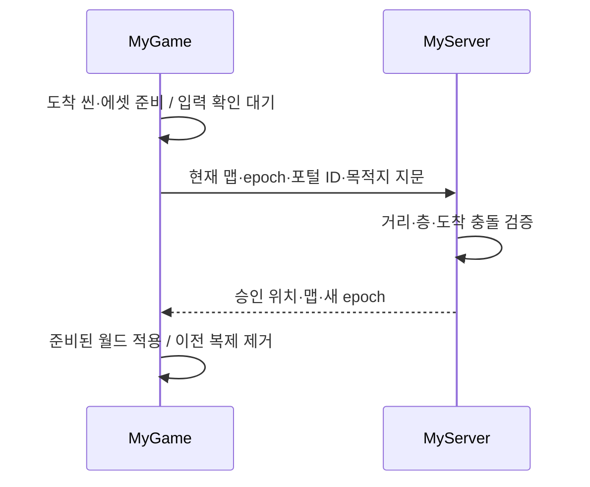

# 28. 온라인 전투와 맵 연결

MyServer/MyGame은 인증된 2D 플레이어 사이의 기본 공격과 상호작용 포털을 지원한다. 서버가 거리·벽·HP·재사용 시간과 도착점을 판정한다. 이 문서의 기능은 0.5.0부터 제공하며, NPC 전투·스킬·보상·온라인 HUD·공개 인터넷 운영은 별도 작업이다.

## 실행하기

1. 각 씬에 활성 `CharacterController2D` 한 개와 기존 Collider2D/KinematicBody2D를 둔다. 이는 플레이어 복제 원형이다. 물리·입력·계정 준비는 [23](23-2d-online-play.md)을 따른다.
2. 문에 `ScenePortal`과 활성 `InteractionTarget`을 붙인다. `onInteract=true`, 목적지 `scenePath`, 도착 오브젝트의 고유 `ObjectName`을 `spawnName`으로 지정한다. 도착 오브젝트에 목적지 플레이어와 같은 `FloorLevel`을 지정한다.
3. 프로젝트의 `onlineCombat`에 서버 공격 설정을 넣는다. 필드가 없으면 공격은 비활성이다.

```json
"onlineCombat": { "range": 1.5, "power": 1.0, "cooldownTicks": 30 }
```

`range`는 월드 unit로 `(0,20]`, `power`는 `(0,10]`, `cooldownTicks`는 60Hz 틱의 정수 `1..3600`이다. 개별 게임의 피해 공식은 기존 gameplay 계산을 사용한다. 기본 입력에는 공격 키가 없다. File → Input Settings에서 사용자 액션 `attack`을 추가하면 첫 누름에 같은 맵의 가장 가까운 상대에게 공격을 요청한다. 피해 값·HP·재사용 시간을 클라이언트가 정하지 않는다.

```powershell
MyServer.exe --data private-data --project game.myeproj --port 7777
MyGame.exe --project game.myeproj --connect 127.0.0.1:7777 --credentials private-login.json
```

문 가까이에서 상호작용 키(기본 E)를 누르면 도착 씬과 지정된 텍스처·메시·모션을 먼저 준비한다. 미확인 이동과 공격이 끝나면 포털 요청을 보낸다. 서버는 원래 맵의 문 ID·범위·층, 목적지 지문과 named spawn의 충돌을 다시 확인한 뒤 위치를 바꾼다. 실패하면 전환을 승인하지 않는다. 자동 trigger 포털은 온라인에서 지원하지 않는다.



## 상태와 실패의 계약

맵 전환은 같은 서버의 플레이어 세션을 유지한다. HP·성장·가방은 기존 세션 값으로 남으며 맵·XY·층·방향은 기존 저장 경로에 반영한다. 온라인 클라이언트는 ObjectSystem/Lua를 실행하지 않는다. 로컬 Lua 변수·퀘스트 테이블·클릭 콜백을 서버 상태로 전달하는 기능은 없다. 공격 성공은 모션 마커와 연결되지 않으며 표현용 발 접촉/VFX도 아직 별도 계약이 없다.

현재 재접속은 저장된 맵을 명시해서 연다. 서버가 로그인 직후 마지막 맵을 자동으로 찾아 보내는 기능은 다음 작업이다.

```powershell
MyGame.exe --project game.myeproj --scene assets/scenes/other.scene --connect 127.0.0.1:7777 --credentials private-login.json
```

캐릭터 저장의 내부 형식은 `version:2, records:[...]`이다. 구형 `characters:[...]` 파일은 읽어 새 저장 시 변환한다. 새 형식의 `dead:true, hp:0`은 재접속으로 부활하지 않는다. 구버전 서버는 새 형식을 거부한다. 업그레이드 전에 데이터를 백업하고, 새 형식에 저장한 데이터를 구버전 실행 파일로 재사용하지 않는다. 3D와 legacy XY의 기존 HP 초기화 동작은 보존한다. 부활·게임별 죽음 처리 UI는 아직 제공하지 않는다.

공격/포털 요청은 하나씩 확인하며 100ms 뒤 재전송하고 5초 미확인 시 연결을 실패 처리한다. 같은 요청의 재전송은 저장한 결과를 반환해 피해나 이동을 반복하지 않는다. 이동·공격·스냅샷·HP는 맵 지문과 세션별 epoch로 묶인다. A→B→A의 이전 A 패킷도 새 A 인스턴스에 적용되지 않는다. 지문은 콘텐츠 호환 확인이며 인증 수단은 아니다.

서버는 시작 맵에서 도달하는 최대 64개 씬을 기존 SceneSerializer와 공통 물리 데이터로 읽는다. 모든 도착 named spawn은 시작 시 검증한다. 복제와 HP는 같은 맵에 있는 플레이어에만 보낸다. 전체 서버의 현재 한도는 40명·1400바이트 스냅샷이며 AOI·shard·공개 인터넷 암호화가 없다. 같은 맵 안의 플레이어 간 몸체 충돌과 lag compensation도 없다.

## 반복 검증

MyGame `--input`의 각 step에는 선택적으로 `interact:true` 또는 `attackTarget:네트워크ID`를 넣을 수 있다. 둘 다 step 첫 고정 틱에서 한 번 발생한다. 공격 대상 ID는 인증 온라인 2D에서만 의미가 있다. 재생 완료는 이동·공격·포털 결과를 모두 기다린다. 이는 물리 장치 입력이나 공개 운영 검증이 아니다.

```powershell
./tools/verify-online-world.ps1 -Configuration Release
```

이 검사는 새 build 하위 프로젝트/계정으로 두 실제 앱의 피해·HP 복제, 포털 왕복, 도착 맵 저장과 서버 재시작 후 명시적 재접속을 확인한다. 패킷 위조·손실 재전송·이전 epoch·벽/거리/쿨다운·사망은 별도 CTest에서 검증한다. 도착 준비 실패는 자동 MyGame에서 오류 종료하며 네이티브 창의 복구 UI는 아직 없다. 저장은 기존 자동/종료 저장이며 맵 이동마다 원장 트랜잭션을 기록하지 않는다.
