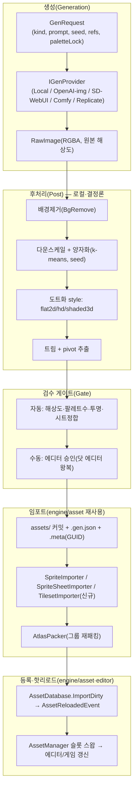

# 05. 픽셀 에셋 파이프라인 & AI 에셋 생성 (Pixel Asset Pipeline & AI Asset Generation)

> 소유 주제: **도트(픽셀아트) 생성·검수·임포트 파이프라인** · **AI 이미지/스프라이트 생성 연동** · **8방향 애니·페이퍼돌·오토타일·아틀라스** · **배치 생성(도감·아이템 세트)** · **에셋 메타·시드·버전관리·저작권**
> 레이어: L2(engine/asset) 위 확장 + 에디터(engine/editor) + 개발도구(tools/mcp) + (신규) 생성 서비스(tools/genserver)
> 네임스페이스: `mye::asset`(확장), `mye::gen`(신규 생성 파이프라인 코어), MCP 툴은 TypeScript
> 전제: **픽셀 2.5D MMORPG** — 수백~수천 동접, 수천 개 몬스터/아이템/타일 에셋, 라이브 운영(콘텐츠 지속 추가), 클라이언트 패치·CDN 스트리밍, 안정 GUID 참조가 콘텐츠 파이프라인의 절대 전제.

이 문서는 "그림 한 장"을 게임에 등록 가능한 에셋으로 만드는 **전 과정**을 다룬다: (텍스트/사진/수동) → 생성 → 검수(gate) → 후처리(도트화·양자화·트림) → 임포트(.meta/GUID) → 아틀라스 팩 → 핫리로드 → 에디터/게임 등록. 또한 이 과정을 **수천 에셋 규모로 자동화**(몬스터 도감·아이템 세트 배치 생성)하고, **캐릭터/스타일 일관성**·**시드 고정**·**저작권 추적**을 라이브 운영 수준으로 보장하는 방법을 정의한다.

---

## 1) 목표·범위

### 1.1 목표

1. **단일 생성 파이프라인**: 도트 대상(캐릭터·몬스터·NPC·아이템·타일·맵조각·포트레이트·이펙트)을 2D도트/3D도트(shaded)/고화질도트(HD)로 만드는 경로를 하나의 `GenRequest → GenResult → ImportSpec`으로 통일한다. AI 생성(텍스트→스프라이트, 사진→도트)과 수동(닷 에디터) 산출물이 **같은 폴더·같은 .meta·같은 임포터**로 흐른다.
2. **결정론·재현성**: 모든 생성은 `(provider, model, prompt, seed, params, paletteLock, refImages)` 튜플로 재현 가능해야 한다. 시드/프롬프트/참조가 `.gen.json`에 영속되어 라이브 운영 중 "이 몬스터 다시 뽑아줘"가 비트 단위 재현(로컬 후처리) + 근사 재현(원격 provider)으로 가능하다.
3. **캐릭터/스타일 일관성**: 캐릭터 시트(character sheet)·스타일 앵커(style anchor)·팔레트 고정(palette lock)으로 수천 에셋에서 톤이 흔들리지 않게 한다. MMORPG는 몬스터 도감/장비 세트가 시각적으로 한 세계에 속해야 한다.
4. **배치 스케일**: 몬스터 도감 200종, 아이템 세트 500개를 프롬프트 템플릿 + 파라미터 스윕으로 대량 생성하고, 실패/저품질을 자동 걸러 재시도하는 배치 잡을 제공한다.
5. **8방향·페이퍼돌·오토타일**: MMORPG 필수인 8방향 애니메이션, 장비 오버레이(페이퍼돌 레이어 합성), 비트마스크 오토타일(4/8/47-blob), 타일셋 트림·아틀라스를 데이터로 다룬다.
6. **검수 게이트(gate)**: 생성물은 자동(해상도·팔레트 수·투명 배경·시트 정합) + 수동(에디터 승인) 게이트를 통과해야 `assets/`에 커밋된다. 라이브 운영에서 저품질·저작권 위반 에셋의 유입을 막는다.
7. **저작권·라이선스 추적**: 각 에셋의 출처(AI provider·모델·시드·참조 이미지 출처·라이선스)를 `.gen.json`에 기록해 상업 배포 리스크를 감사(audit) 가능하게 한다.
8. **기존 엔진 재사용**: `engine/asset`의 VFS·.meta/GUID·임포터·AtlasPacker·AssetDatabase 핫리로드·SpriteSheet/AnimationClipData 스키마, `tools/mcp`의 dot 툴, `engine/editor`의 DotEditorPanel을 **확장**하되 재발명하지 않는다.

### 1.2 범위(In / Out)

| 범위 | 포함 | 제외(타 도메인) |
|---|---|---|
| 생성 | 텍스트→스프라이트, 사진→도트, 배경제거·업스케일·도트화 후처리, 컬러 양자화, 배치 생성 | 사운드/음악 생성(→ 오디오 도메인), 대화/퀘스트 텍스트 생성 |
| 에셋 종류 | 캐릭터·몬스터·NPC·아이템·타일·맵조각·포트레이트·이펙트 스프라이트, 8방향 애니, 페이퍼돌, 타일셋/오토타일, 아틀라스 | 3D 메시(glTF)·본격 스켈레탈(선택적 언급만) |
| 파이프라인 | 생성→검수→임포트→아틀라스→핫리로드→등록, 시드/버전/저작권 메타 | 런타임 렌더(→ 02 렌더), 넷코드 복제(→ 넷코드 도메인), 패치 배포 트랜스포트(→ 넷코드/에셋 스트리밍) |
| 도구 | MCP dot 툴 확장, 배치 CLI, 닷 에디터 AI 왕복, 멀티 provider 추상화 | 게임플레이 데이터(스탯/인벤) 스키마(→ 게임플레이 도메인) |

관련 문서: 원본 에셋 파이프라인 규약은 [`../04-asset-pipeline.md`](../04-asset-pipeline.md), MCP 도구 규약은 [`../08-mcp.md`](../08-mcp.md), 렌더 소비 규약은 [`../02-rendering.md`](../02-rendering.md), 에디터 확장은 [`../07-editor-ui.md`](../07-editor-ui.md)를 따른다. MMORPG 도메인 상호참조는 §8.

---

## 2) 핵심 개념·아키텍처

### 2.1 파이프라인 전체 흐름



핵심 설계 원칙: **원격(비결정)과 로컬(결정)의 분리**. AI provider 호출은 네트워크·유료·비결정이므로 파이프라인 **가장 앞단 1회**로 고립하고, 그 뒤 후처리·양자화·트림·아틀라스는 전부 로컬·순수·시드 기반이라 재현 가능. 원격 결과(RawImage)는 `cache/gen/`에 캐시되어 후처리만 반복해도 provider를 다시 부르지 않는다.

### 2.2 provider 추상화(멀티 AI 제공자)

```
IGenProvider (tools/genserver, TS)
├─ LocalProvider        : dot_write_sprite(=AI가 직접 픽셀 찍기), 순수 알고리즘(사진→도트)
├─ OpenAIImageProvider  : gpt-image류 텍스트→이미지 (HTTP)
├─ StableDiffusionProvider : SD WebUI(automatic1111) / ComfyUI 로컬 or 원격 (HTTP + workflow json)
├─ ReplicateProvider    : 임의 모델 호스팅(HTTP, 폴링)
└─ MockProvider         : 테스트/오프라인(고정 이미지·시드 결정론)
```

- provider는 **capability 플래그**를 노출: `txt2img`, `img2img`, `inpaint`(배경제거·수정), `controlnet`(포즈/8방향 참조), `upscale`, `characterRef`(캐릭터 일관성 IP-Adapter/reference). 파이프라인은 요청 kind가 요구하는 capability를 provider가 가졌는지 검사하고, 없으면 로컬 폴백 또는 명확한 실패.
- 모든 provider 응답은 `RawImage + providerMeta{model, seedUsed, cost, latencyMs, revisedPrompt}`로 정규화. provider별 차이는 어댑터가 흡수(엔진/에디터는 provider를 모른다).
- **키/시크릿**은 `user://gen_secrets.json`(VCS 제외) 또는 환경변수로만. 리포에 절대 커밋 금지(§5 저작권/보안).

### 2.3 좌표·픽셀 규약(엔진 규약 준수)

- 텍스처 좌표: **좌상단 원점**(engine/asset `SpriteFrame.rect` 규약). pivot은 프레임 로컬 픽셀 또는 정규화(0..1), 월드 배치 시 소비자가 좌수·+Y업으로 변환(02 규약).
- PPU 48, 내부 RT 960×540. 스프라이트 픽셀 크기는 PPU 기준으로 산정: 32×32 캐릭터 = 화면 상 큰 캐릭터, 16×16 타일이 기본 그리드. 생성기의 `targetSize`는 이 규약을 프리셋으로 노출.
- premultiplied alpha(02·04 통일 규약)는 임포트 단계에서 적용. 생성 산출물은 **straight alpha PNG**로 저장하고 `TextureImportSettings.premultiplyAlpha=true`가 굽는다(이중 프리멀티플 방지).

---

## 3) 기능 목록

우선순위: **P0**=MMORPG 콘텐츠 파이프라인 없이는 착수 불가 / **P1**=초기 콘텐츠 대량 제작에 필수 / **P2**=운영 효율·품질 / **P3**=고급 자동화 / **P4**=선택적·미래.
상태: **있음**=현재 구현 존재 / **부분**=계약·골격만 또는 일부 / **신규**=미존재.

| 기능 | 우선순위 | 상태 | 엔진 매핑(재사용/확장/신규) |
|---|---|---|---|
| **안정 GUID 영속**(.meta CreateFor/Parse 실배선) — 모든 파이프라인의 전제 | P0 | 부분 | `engine/asset` `AssetMeta`(구현됨) + `AssetManager` LoadSync/LoadAsync가 GUID를 `.meta`에서 읽고 없으면 생성·기록하도록 **배선**(현재 매 로드 `Generate()`) |
| **엔진 레벨 AssetModule**(VFS 마운트·임포터 등록·수명 소유) | P0 | 신규 | `engine/asset`에 `AssetModule` 신규(현재 각 main.cpp 하드코딩). 생성 파이프라인·게임 런타임 공통 진입점 |
| **핫리로드 실구동**(FileWatcher+AssetDatabase 배선) | P0 | 부분 | `AssetDatabase`·`Win32DirectoryWatcher`(구현됨) 를 에디터/툴에서 **생성·StartWatching·ImportDirty** 호출 |
| **GenRequest/GenResult/GenSpec 데이터 모델** | P0 | 신규 | `mye::gen` 코어 스키마(C++ 소비측) + `tools/genserver`(생성측). `.gen.json` 사이드카(.meta와 짝) |
| **멀티 AI provider 추상화**(IGenProvider) | P0 | 신규 | `tools/genserver`(TS). MCP 툴이 이 서비스를 호출. Local/OpenAI/SD/Comfy/Replicate/Mock |
| **텍스트→스프라이트**(txt2img → 후처리 → 도트) | P1 | 신규 | 신규 MCP 툴 `gen_sprite`. 후처리는 dot.ts의 downscale/quantize/applyPalette **재사용** |
| **사진→도트**(이미 있음, 확장) | P1 | 있음 | `tools/mcp/src/tools/dot.ts` `dot_from_photo`(flat2d/hd/shaded3d) — 트림·pivot·시트출력 확장 |
| **AI가 직접 픽셀 찍기**(있음) | P2 | 있음 | `dot_write_sprite`(팔레트+그리드) — 대형 캔버스·레이어·8방향 확장 |
| **배경제거(BgRemove)** | P1 | 신규 | 후처리 단계. 로컬(edge/flood-fill from corners, chroma) + provider inpaint. `mye::gen`/dot.ts |
| **업스케일/다운스케일 + 컬러 양자화** | P1 | 있음 | dot.ts `downscale`+`quantize`(k-means, seed) **재사용**. 업스케일은 provider 또는 nearest |
| **팔레트 고정(palette lock)** | P1 | 부분 | dot.ts `applyPalette` 존재. 프로젝트 마스터 팔레트 에셋(`.palette.json`) + lock 모드 **신규** |
| **트림 + pivot 자동 추출** | P1 | 신규 | 후처리(불투명 바운딩박스 트림 → `SpriteFrame.rect`/pivot). `SpriteSheet` 스키마 소비 |
| **스프라이트시트·아틀라스팩·트림** | P1 | 있음 | `AtlasPacker`(MaxRects, extrude 구현됨) **재사용** + 그룹 재패킹 자동화 배선 |
| **8방향 애니메이션 생성/조립** | P1 | 부분 | `SpriteSheet`/`AnimationClipData`(Dir8·클립 스키마 구현됨). 생성·조립·검증 **신규**(genserver) |
| **페이퍼돌(장비 오버레이 레이어)** | P1 | 신규 | 레이어 합성 규약 + 런타임 다중 SpriteRenderer 레이어. `mye::gen` 합성 + 03 애니 공유 프레임 |
| **타일셋·오토타일(비트마스크 4/8/47-blob)** | P1 | 부분 | `Tilemap`(청크·bridge 구현됨) + 신규 `TilesetImporter`·오토타일 룰 에셋. 타일 아틀라스 UV 배선(현 플레이스홀더) |
| **캐릭터 일관성/캐릭터 시트** | P2 | 신규 | provider characterRef(IP-Adapter/reference) + 스타일 앵커 이미지 세트. `.gen.json` refImages·charId |
| **스타일 일관성·시드 고정** | P2 | 신규 | `GenRequest.seed`·`styleAnchorGuid`·negative prompt·`.gen.json` 영속(재현) |
| **배치 생성(도감·세트)** | P2 | 신규 | `apps/gentool`(CLI) 또는 MCP `gen_batch`. 프롬프트 템플릿×파라미터 스윕→N잡→게이트→재시도 |
| **검수 게이트(자동+수동)** | P1 | 신규 | 자동 검증기(`mye::gen::Validate`) + 에디터 승인 큐 패널. `.gen.json.status=pending/approved/rejected` |
| **닷 에디터 ↔ AI 왕복** | P2 | 부분 | `DotEditorPanel`(구현됨) 에 "AI로 채우기/변형" 액션 → genserver 호출 → 편집 → 저장 |
| **프롬프트 템플릿·에셋 메타·버전관리** | P2 | 신규 | `assets/gen/templates/*.prompt.json` + `.gen.json` 히스토리(version 배열). git 친화 텍스트 |
| **저작권·라이선스 추적/감사** | P1 | 신규 | `.gen.json.license`(provider TOS·모델·refImage 출처) + `gentool audit` 리포트 |
| **콘텐츠 임포트 캐시(굽기)** | P2 | 부분 | 04 캐시 키(hash⊕version⊕settings⊕format) 설계 존재, 실배선 없음 → **신규 배선** |
| **원격 에셋 스트리밍/패치(CDN·델타)** | P3 | 신규 | VFS `IFileSystem` 확장점 존재. 버전드 pak·서명·델타패치 **신규**(넷코드/에셋 스트리밍 도메인과 공유) |
| **MCP 툴 확장**(gen_sprite/gen_sheet/gen_tileset/gen_batch/gen_audit) | P2 | 부분 | `tools/mcp`(dot.ts 패턴 재사용, 파일 1개=툴그룹 규약) |
| **품질/스케일 텔레메트리**(생성 비용·실패율·중복 탐지) | P3 | 신규 | `gentool` 리포트 + perceptual hash 중복 탐지 |

---

## 4) 데이터 모델·스키마

### 4.1 `.gen.json` — 생성 사이드카(재현·감사의 정본)

`.meta`(GUID·임포터)와 **짝**을 이루는 별도 사이드카. `.meta`는 "어떻게 임포트하나", `.gen.json`은 "어떻게 만들어졌나"를 기록한다. 두 파일 모두 소스와 함께 VCS 커밋(텍스트, git diff 친화).

```jsonc
// assets/monsters/slime_green.png.gen.json
{
  "schema": 1,
  "kind": "monster",                 // character|monster|npc|item|tile|tileset|map|portrait|effect
  "status": "approved",              // pending|approved|rejected (검수 게이트)
  "generator": {
    "provider": "stable-diffusion",  // local|openai-image|stable-diffusion|comfy|replicate|mock
    "model": "sd-xl-1.0 + pixelart-lora-v3",
    "endpoint": "http://127.0.0.1:7860",
    "seed": 428173,                  // 재현 시드(provider가 지원 시)
    "params": { "steps": 28, "cfg": 6.5, "sampler": "dpmpp_2m" },
    "prompt": "top-down rpg green slime, {{style}}, {{palette_hint}}",
    "negativePrompt": "text, watermark, blurry, 3d render",
    "styleAnchorGuid": "3f1c...-anchor",   // 스타일 일관성 앵커 에셋
    "characterId": null,                    // 캐릭터 일관성 그룹(같으면 동일 캐릭터로 재현)
    "refImages": [ { "guid": "9a2b...", "role": "controlnet_pose" } ]
  },
  "post": {                          // 로컬 후처리(결정론) — seed 있으면 비트 재현
    "bgRemove": "corner-floodfill",
    "targetSize": [32, 32],
    "style": "shaded3d",             // flat2d|hd|shaded3d
    "paletteLock": { "mode": "master", "guid": "pal-...-world" },
    "quantizeK": 24, "dither": false,
    "trim": true, "pivot": "bottom-center"
  },
  "sheet": {                         // 8방향/애니면 채워짐(단일 스프라이트면 null)
    "dirs": 8, "clips": ["idle","walk","attack","hurt","die"],
    "frameSize": [32, 32], "layout": "dir-rows"
  },
  "license": {
    "aiGenerated": true,
    "providerTos": "https://.../terms",
    "commercialUse": "allowed",      // allowed|restricted|unknown
    "refImageSources": [ { "guid": "9a2b...", "origin": "internal-owned" } ],
    "reviewedBy": "charary", "reviewedAt": "2026-07-27T04:00:00Z"
  },
  "history": [                       // 버전관리: 재생성 이력(git과 별개 논리 버전)
    { "at": "2026-07-26T...", "seed": 428173, "note": "initial" }
  ],
  "cost": { "provider": 0.012, "currency": "USD" }
}
```

### 4.2 C++ 소비측 스키마(`engine/asset` 확장 / `mye::gen`)

```cpp
// mye/asset/GenSidecar.h — .gen.json 파서(에디터/게임 검수·감사에서 소비)
namespace mye::asset {
enum class GenKind : uint8_t { Character, Monster, Npc, Item, Tile, Tileset, Map, Portrait, Effect };
enum class GenStatus : uint8_t { Pending, Approved, Rejected };

struct GenLicense {
    bool        aiGenerated = false;
    std::string providerTos;
    std::string commercialUse = "unknown";   // allowed|restricted|unknown
    std::string reviewedBy;
    std::string reviewedAt;                   // ISO8601
};

struct GenSidecar {
    uint32_t    schema = 1;
    GenKind     kind = GenKind::Item;
    GenStatus   status = GenStatus::Pending;
    std::string provider, model, prompt, negativePrompt;
    uint64_t    seed = 0;
    AssetGuid   styleAnchor;                   // 스타일 일관성 앵커
    std::string characterId;                   // 캐릭터 일관성 그룹(빈 문자열=없음)
    Vec2i       targetSize{32, 32};
    GenLicense  license;

    static Expected<GenSidecar, Error> Parse(std::string_view utf8Json);
    std::string Stringify() const;
};
std::string GenSidecarPathFor(std::string_view sourcePath);   // "<source>.gen.json"
} // namespace mye::asset
```

### 4.3 오토타일 룰 에셋(`.autotile.json`)

```jsonc
// 비트마스크 오토타일: 이웃 8칸(또는 4칸) 채움 상태 → 타일 인덱스
{
  "schema": 1,
  "mode": "blob47",          // corner4 | edge8 | blob47(Wang/blob)
  "texture": "guid-tileset",
  "tileSize": [16, 16],
  "mapping": {               // 비트마스크(0..255 정규화된 47키) → 아틀라스 프레임 인덱스
    "0": 12, "1": 3, "5": 8, "…": 0
  },
  "fallback": 0
}
```

### 4.4 페이퍼돌 레이어 규약

```jsonc
// character 에셋: 바디 + 장비 오버레이 레이어(같은 프레임 타이밍·같은 8방향)
{
  "kind": "character",
  "layers": [
    { "slot": "body",   "guid": "guid-body",   "z": 0 },
    { "slot": "cloth",  "guid": "guid-cloth",  "z": 10 },
    { "slot": "weapon", "guid": "guid-weapon", "z": 20, "behind_on_dirs": ["up","up_left","up_right"] }
  ],
  "sharedClip": true         // 모든 레이어가 body의 clip/frame index를 공유(정합 필수)
}
```

- 런타임: 캐릭터 엔티티는 슬롯당 `SpriteRenderer` 자식 또는 다중 서브메시로 레이어를 합성. 애니메이션 시스템(03)이 body clip을 샘플하면 모든 레이어가 동일 frameIndex를 참조(bodyTemplate 검증으로 프레임 수·태그·duration 정합 강제 — `AsepriteImportSettings.bodyTemplate` 재사용).
- 방향별 무기 앞/뒤(위 방향은 무기가 몸 뒤) z-order 스왑은 `behind_on_dirs`로 표기.

---

## 5) 경우의 수·엣지케이스(exhaustive)

### 5.1 생성(provider) 실패·비결정

| 상황 | 영향 | 대응 |
|---|---|---|
| provider 네트워크 타임아웃/5xx | 잡 실패 | 지수 백오프 재시도(max N), 실패 시 `status=rejected` + 에러 기록, 배치는 계속 |
| provider가 seed 무시(비결정 모델) | 재현 불가 | `.gen.json`에 `seedRespected:false` 기록. 원격 근사 재현만 보장, 로컬 후처리는 결정론 유지 |
| 유료 provider 비용 폭주(배치 수천) | 과금 사고 | `gentool` 예산 상한(budgetUSD)·건당 dry-run 견적·건수 확인 프롬프트 |
| provider TOS 상 상업 사용 불가 모델 | 법적 리스크 | `license.commercialUse=restricted` 강제 기록 + 게이트에서 커밋 차단(정책 옵션) |
| API 키 누락/만료 | 전체 실패 | 부팅 시 provider health check, 키 없으면 LocalProvider 폴백 + 경고 |
| 프롬프트 인젝션/부적절 출력(NSFW) | 콘텐츠 사고 | provider safety + 로컬 후검사(옵션), 게이트 수동 승인 필수 |
| 응답 이미지 손상/0바이트 | 파이프라인 크래시 위험 | 디코드 검증(폭·높이·채널), 실패 시 재시도 후 reject |
| revisedPrompt로 provider가 프롬프트 변조 | 일관성 저하 | `providerMeta.revisedPrompt` 기록, 배치 스타일 편차 탐지 |

### 5.2 후처리·도트화

| 상황 | 대응 |
|---|---|
| 원본이 이미 저해상도(다운스케일 불필요) | `min(targetWidth, src.width)`로 캡(dot.ts 기존 로직), 업스케일 금지(도트 뭉개짐) |
| 배경이 흰색/체크무늬(투명 아님) | BgRemove: 코너 flood-fill + chroma; 실패 시 provider inpaint 폴백; 여전히 실패면 게이트 경고 |
| 안티에일리어싱 잔여(반투명 가장자리) | 알파 임계(<128 제거) + 1px 정리, premultiply 전에 수행 |
| 팔레트 락 색이 원본과 거리 큼 | nearest 매핑 시 ΔE 경고(색 왜곡), lock=soft면 근사·lock=hard면 강제 |
| k-means 색상 수 > 실제 유니크 색 | `min(k, uniquePts)`로 캡(dot.ts 기존), 빈 클러스터 처리 |
| 전 픽셀 투명(빈 결과) | 검증 실패 → reject("empty sprite") |
| shaded3d 에지 셰이딩이 얇은 라인 파괴 | 라인아트류는 flat2d 권장, kind별 기본 style 프리셋 |
| 트림 후 pivot이 프레임 밖 | pivot을 트림 rect로 클램프 + 경고 |

### 5.3 8방향·시트·애니 정합

| 상황 | 대응 |
|---|---|
| 방향 수 4 vs 8 불일치(일부 몹은 4방향) | `sheet.dirs`로 명시, 4방향은 좌우 flipX 미러(SpriteFrame flipX 공유 규약, 03) |
| 클립 프레임 수가 방향마다 다름 | bodyTemplate 검증 실패 → 경고/reject. 페이퍼돌은 프레임 정합이 절대 필수 |
| duration 0 또는 음수 | 최소 1틱으로 클램프 + 경고 |
| 이벤트 마커(footstep 등) 프레임 초과 | 클립 프레임 범위로 클램프(03 lossless 이벤트 규약 준수) |
| 시트 그리드 셀 수 ≠ 프레임 수(잘림) | `SliceGrid` 결과와 태그 프레임 수 대조, 불일치 경고 |
| 대각선 방향 애니 부재(4→8 승격) | 인접 방향 보간 불가(도트) → 명시적 생성 요구 또는 4방향 유지 |

### 5.4 아틀라스·스케일

| 상황 | 대응 |
|---|---|
| 스프라이트가 maxPageSize 초과 | `AtlasPackResult.overflowed=true` → 새 페이지 or 개별 텍스처, 게이트 경고 |
| 아틀라스 페이지 수 폭증(수천 에셋) | 그룹별 분할(monsters/items/tiles 별 그룹), POT 옵션·페이지 상한 |
| extrude/padding 부족 → 블리딩 | 픽셀아트 extrude=1 기본(구현됨), 확대 렌더 시 2px 권장 옵션 |
| 부분 재패킹 시 UV 무효화 | 재패킹 후 `AssetReloadedEvent` → SpriteSheet UV 갱신(역의존 전파, 구현됨) |
| 타일 아틀라스 UV 플레이스홀더(현 미배선) | `TilesetImporter`가 tile id→서브렉트 UV 실제 매핑(HybridRenderer BuildTileChunkQuads 배선) |

### 5.5 임포트·GUID·핫리로드

| 상황 | 대응 |
|---|---|
| GUID 매 로드 재생성(현 버그) | `.meta` CreateFor/Parse 실배선 — GUID 안정화가 P0 전제(§3) |
| 파일명 변경/이동 | `.meta`·`.gen.json` 동반 이동 규약, DB 스캔이 GUID로 재매핑 |
| 두 에셋이 같은 GUID(복붙 사고) | DB 스캔 시 중복 GUID 탐지 → 경고·재생성 |
| 핫리로드 중 아틀라스 재패킹과 렌더 경합 | kMaxFramesInFlight 지연 파괴(RHI 구현됨) + 메인스레드 스왑 |
| .gen.json만 있고 PNG 없음(반쪽 커밋) | 게이트 검증 실패, 임포트 스킵 |
| 대량 파일 변경 폭주(배치 커밋 직후) | FileWatcher 디바운스 + 배치 ImportDirty(구현됨) |
| 임포터 버전 상승 시 전량 리임포트 | `IAssetImporter::Version` 캐시 키(04 설계) — 캐시 배선 필요 |

### 5.6 배치·스케일·중복

| 상황 | 대응 |
|---|---|
| 도감 200종 동시 생성 → API rate limit | 동시성 상한(pLimit) + 큐잉, provider별 QPS 준수 |
| 부분 실패(190 성공/10 실패) | 실패분만 재시도 리스트 저장(`gen_batch --retry-failed`) |
| 중복/유사 에셋 대량 생성 | perceptual hash(aHash/dHash)로 유사도 탐지 → 중복 경고 |
| 배치 중 크래시/중단 | 잡 매니페스트에 진행 체크포인트(완료된 seed 스킵, 재개 가능) |
| 스타일 드리프트(배치 후반 톤 변화) | styleAnchor 고정 + 배치 후 톤 히스토그램 편차 리포트 |
| 디스크 폭주(수천 원본 캐시) | `cache/gen/` LRU 정리, 승인분만 `assets/` 승격 |

### 5.7 라이브 운영·치트·네트워크(MMORPG 스케일)

| 상황 | 대응 |
|---|---|
| 신규 몬스터 에셋을 라이브 클라이언트에 배포 | 버전드 pak + 델타 패치(넷코드/에셋 스트리밍 도메인). 서버는 콘텐츠 버전 게이팅 |
| 클라이언트 에셋 변조(치트: 투명 벽·거대 히트박스) | 히트박스는 **서버 권위** 데이터로만(에셋의 @hitbox는 표현용). pak 무결성 서명 검증 |
| 패치 도중 구/신 에셋 혼재 | 콘텐츠 버전 = 서버 최소 요구, 불일치 클라 강제 업데이트 |
| CDN 지연/부분 다운로드 | 조각 무결성 해시 검증, 실패 재시도, 미도착 에셋 플레이스홀더(핑크/무음) |
| 저작권 클레임(특정 모델 산출물) | `gentool audit`로 해당 provider/model 에셋 전수 조회 → 교체 배치 |
| 개인정보(사진→도트에 실제 인물 얼굴) | 포트레이트 생성 시 참조 이미지 출처 검증 정책, 게이트 수동 확인 |
| 팔레트/스타일 통일 붕괴(외주 혼입) | master palette lock 강제 + CI 검증(비승인 색 사용 스프라이트 리포트) |

---

## 6) 신규 모듈·파일 제안(구체 경로)

### 6.1 엔진(engine/) — 소비·임포트측

```
engine/asset/include/mye/asset/
  GenSidecar.h            # .gen.json 파서/직렬화(에디터·게임 검수·감사)
  TilesetImporter.h       # 타일셋+오토타일 룰 임포트(신규 임포터)
  Autotile.h              # 비트마스크(corner4/edge8/blob47) → 프레임 인덱스 룰
  PaperDoll.h             # 페이퍼돌 레이어 합성 규약(런타임 소비 스키마)
  AssetModule.h           # (P0) VFS 마운트·임포터 등록·수명 소유 엔진 모듈
engine/asset/src/
  GenSidecar.cpp  TilesetImporter.cpp  Autotile.cpp  PaperDoll.cpp  AssetModule.cpp
engine/asset/tests/
  GenSidecarTests.cpp  AutotileTests.cpp  PaperDollTests.cpp  TilesetImportTests.cpp
```

- `AtlasPacker`·`SpriteSheet`·`SpriteImporter`·`AssetMeta`·`AssetDatabase`는 **재사용/배선**(신규 파일 없음, 실배선만).
- 렌더 소비: 타일 아틀라스 UV 배선은 [`../02-rendering.md`](../02-rendering.md) `HybridRenderer.BuildTileChunkQuads`(현 플레이스홀더) 수정 — 본 문서는 데이터 스키마만 소유.

### 6.2 에디터(engine/editor) — 검수·왕복측

```
engine/editor/src/
  GenReviewPanel.cpp      # 검수 큐(pending 목록·승인/반려·미리보기·재생성)
  DotEditorPanel.cpp      # (확장) "AI로 채우기/변형" 액션 → genserver 왕복
  PaperDollPreviewPanel.cpp  # 레이어 합성·8방향 미리보기
```

### 6.3 생성 서비스(tools/) — provider·후처리·배치측

```
tools/genserver/          # 멀티 provider 생성 서비스(TS, MCP와 dot.ts 후처리 공유)
  src/providers/          # IGenProvider 구현: local, openai, sd, comfy, replicate, mock
  src/post/               # bgRemove, downscale, quantize, palette, trim, shade (dot.ts에서 승격)
  src/pipeline.ts         # GenRequest → RawImage → post → GenResult
  src/palette.ts          # master palette load/lock
tools/mcp/src/tools/
  dot.ts                  # (확장) 후처리 공유, gen 툴 추가
  gen.ts                  # (신규) gen_sprite / gen_sheet / gen_tileset / gen_batch / gen_audit
apps/gentool/             # (선택) 배치 생성 CLI(도감·세트 대량, 예산·재개·감사)
  src/main.cpp 또는 gentool.ts
assets/gen/
  templates/*.prompt.json # 프롬프트 템플릿(kind별)
  palettes/*.palette.json # master palette
```

- `tools/mcp`는 "파일 1개 = 툴 그룹"([`../08-mcp.md`](../08-mcp.md)) 규약 유지. 결과 PNG는 기존 규약대로 `assets/sprites/`(또는 kind별 하위)로 저장 + base64 반환.
- provider 시크릿: `user://gen_secrets.json` / 환경변수(리포 커밋 금지).

---

## 7) 마일스톤 단계(작게·검증 가능)

| 단계 | 산출물 | 검증(테스트/데모) |
|---|---|---|
| **A0. GUID·핫리로드 배선(P0 전제)** | `.meta` GUID 영속(CreateFor/Parse 실배선) + `AssetModule` + AssetDatabase StartWatching/ImportDirty 에디터 구동 | 같은 PNG 두 번 로드 시 GUID 동일; 파일 저장 시 에디터 자동 리로드(단위+수동) |
| **A1. GenSidecar 스키마** | `GenSidecar.h/.cpp` 파서 + `.gen.json` 라운드트립 | `GenSidecarTests` 왕복·필드 보존·에러 케이스 |
| **A2. provider 추상화 + Mock** | `tools/genserver` IGenProvider + MockProvider + pipeline | Mock으로 GenRequest→GenResult 결정론(시드 고정) 통과 |
| **A3. 후처리 승격·공유** | dot.ts의 downscale/quantize/palette/trim/shade를 `post/`로 승격, dot.ts는 재사용 | 기존 `dot_from_photo` 회귀 없음 + 트림·pivot 추가 |
| **B1. 텍스트→스프라이트** | `gen_sprite`(txt2img→post→도트→저장→.gen.json) + 실 provider 1종(SD/Comfy 로컬) | 프롬프트로 아이템 스프라이트 생성→검수→임포트 end-to-end |
| **B2. 배경제거·팔레트락** | BgRemove(local) + master palette lock | 흰 배경 사진→투명 도트; 락 팔레트 강제 후 색 검증 |
| **B3. 검수 게이트** | `mye::gen::Validate` + `GenReviewPanel`(승인/반려) | 저품질(빈/저해상도) 자동 reject; 수동 승인→커밋 |
| **C1. 8방향·시트 조립** | 시트 조립+bodyTemplate 검증 → SpriteSheet/AnimationClipData | 8방향 walk 클립 생성·정합 검증·재생 데모 |
| **C2. 페이퍼돌** | `PaperDoll.h` 합성 + `PaperDollPreviewPanel` | 바디+장비 레이어 8방향 합성·방향별 z스왑 |
| **C3. 타일셋·오토타일** | `TilesetImporter`+`Autotile`(blob47) + 타일 아틀라스 UV 배선 | 비트마스크→프레임 매핑 단위 테스트 + 맵에 오토타일 배치 |
| **D1. 배치 생성** | `gen_batch`/`gentool`(템플릿×스윕, 예산, 재개, 재시도) | 도감 20종 배치→부분 실패 재시도·중복 탐지 |
| **D2. 캐릭터/스타일 일관성** | styleAnchor·characterRef(provider controlnet/ip-adapter) | 같은 characterId로 여러 포즈 일관 생성 |
| **D3. 저작권 감사** | `.gen.json.license` + `gen_audit`/`gentool audit` | provider/model별 에셋 전수 리포트 |
| **E1. 임포트 캐시·닷 왕복** | 04 캐시 키 배선 + 닷 에디터 AI 왕복 | 소스 무변경 시 리임포트 스킵; AI채우기→수정→저장 |
| **E2. 스트리밍·패치(도메인 공유)** | 버전드 pak·서명·델타(넷코드/에셋 스트리밍과 공유) | 신규 에셋 델타 패치 후 클라 무결성 검증 |

---

## 8) 의존성·타 도메인 문서 참조

- **원본 규약(필수 기반)**: [`../04-asset-pipeline.md`](../04-asset-pipeline.md) — VFS·.meta/GUID·임포터·AtlasPacker·AssetDatabase·비동기 로딩. 본 문서는 이 위에 생성·검수·AI 층을 얹는다.
- **MCP 도구 규약**: [`../08-mcp.md`](../08-mcp.md) — dot 툴 확장·파일 1개=툴 그룹·`assets/sprites/` 저장·base64 반환.
- **렌더 소비**: [`../02-rendering.md`](../02-rendering.md) — 픽셀퍼펙트·PPU·premultiplied alpha·SpriteBatch·HybridRenderer 타일 아틀라스 UV(배선 대상).
- **애니·타일맵 소비**: [`../03-scene-world.md`](../03-scene-world.md) — Dir8·AnimationClipData·Tilemap 청크·bridge/height. 8방향/오토타일 데이터를 소비.
- **에디터 확장**: [`../07-editor-ui.md`](../07-editor-ui.md) — DotEditorPanel·검수 패널·확장 레지스트리.
- **MMORPG 도메인 상호참조**(형제 문서):
  - 게임 런타임 부트스트랩·데이터드리븐 씬 로딩 → `01-runtime-bootstrap.md`(에셋 로드 진입점 AssetModule 공유)
  - 넷코드·복제·서버 권위 → `02-netcode.md` 등(에셋 무결성·히트박스 서버 권위·콘텐츠 버전 게이팅)
  - 에셋 스트리밍·패치·CDN → 넷코드/배포 도메인 문서(버전드 pak·델타·서명은 본 문서 D2/E2와 공유)
  - 게임플레이(스탯/인벤/장비) → 페이퍼돌 슬롯·아이템 아이콘 에셋 참조 규약 공유
  - > 형제 문서 번호는 mmorpg 시리즈 인덱스 확정 시 정합. 최상위 개요는 [`../00-overview.md`](../00-overview.md).

---

### 이 도메인 요약 3줄

1. MyEngine은 후처리·아틀라스·시트·핫리로드 **파이프라인 뼈대(engine/asset)**와 도트 MCP 툴(dot_write_sprite/dot_from_photo)·닷 에디터가 이미 견고하나, **안정 GUID 영속·핫리로드 실구동·AssetModule**이 미배선이고 **AI 생성 층(멀티 provider·생성→검수→임포트 자동화)**이 전무하다 — 이 둘이 MMORPG 콘텐츠 파이프라인의 P0 공백이다.
2. 설계 핵심은 **원격(비결정 AI)과 로컬(결정 후처리)의 분리**로 재현성을 확보하고, `.gen.json`(시드·프롬프트·라이선스) 사이드카로 라이브 운영급 재현·감사·저작권 추적을 보장하며, 8방향·페이퍼돌·오토타일·배치 생성을 기존 SpriteSheet/AtlasPacker/AnimationClipData 스키마 위에 얹는 것이다.
3. 마일스톤은 GUID·핫리로드 배선(P0) → GenSidecar·provider 추상화·후처리 승격 → 텍스트→스프라이트·검수 게이트 → 8방향·페이퍼돌·오토타일 → 배치·일관성·감사 순으로, 각 단계가 작은 단위 테스트·데모로 검증 가능하게 쪼개진다.
