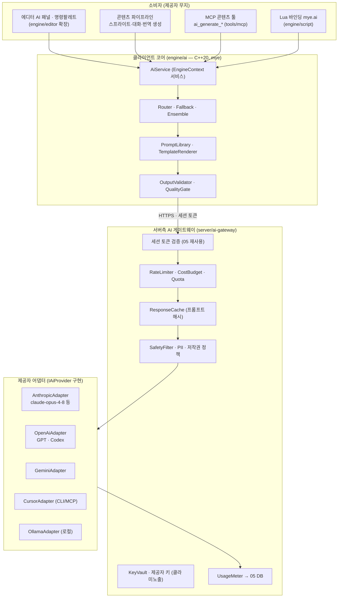

# 07. 멀티 AI 제공자 오케스트레이션 (Multi-AI Provider Orchestration)

> 소유 범위: 제공자 무관 추상화 레이어(`IAiProvider`)와 각 어댑터(Anthropic Claude / OpenAI GPT·Codex / Google Gemini / Cursor / 로컬 Ollama),
> 라우팅·폴백·앙상블·모델선택, 키/인증/레이트리밋/비용/캐시/재시도, 프롬프트 템플릿·버전·평가(품질게이트·스키마검증),
> 안전/검열/저작권/PII, 에디터 AI 패널·명령팔레트·컨텍스트 주입, 에이전트 오케스트레이션(생성→검증→반영 파이프라인).
> **"AI를 엔진의 1급 사용자로"**(→ [08-mcp](../08-mcp.md))의 원칙을 사람과 코드 양쪽으로 확장한다 — AI는 *개발 어시스트*이자 *콘텐츠 생산 파이프라인*이다.
> MCP를 표준 통합 표면으로 삼고(이미 존재하는 `tools/mcp`를 확장), 라이브 운영 MMORPG(수백~수천 동접)의 비용·치트·저작권·PII 리스크를 전제로 설계한다.

이 문서는 두 용도를 하나의 제공자 추상화로 묶는다:
**(a) 코드/엔진 개발 어시스트** — 에디터 내 리팩터·버그픽스·Lua/셰이더 생성·코드리뷰(MyEngine MCP 재사용).
**(b) 콘텐츠 생성** — 이미지(스프라이트/타일셋)·오디오·대화/퀘스트·밸런싱·번역.

---

## 1. 목표·범위

### 목표

- **제공자 교체 가능성.** Claude / GPT / Gemini / Cursor / Codex / Ollama를 단일 `IAiProvider` 뒤로 숨겨, 호출부(에디터 AI 패널, 콘텐츠 파이프라인, MCP 툴)는 제공자를 몰라도 된다. 새 제공자 추가 = 어댑터 1개 + 레지스트리 등록 한 줄(엔진의 "리플렉션 1회 등록" 루프와 동형).
- **작업별 최적 라우팅.** 코드 리팩터는 고지능 모델(`claude-opus-4-8`), 대량 번역/분류는 저비용 모델(`claude-haiku-4-5`), 오프라인/민감 데이터는 로컬(Ollama). 라우팅 규칙은 데이터(JSON)로 정의, 코드 재빌드 없이 교체.
- **라이브 운영 안전.** 키는 서버에만, 클라이언트는 절대 원문 키를 보지 않는다. 레이트리밋·비용상한·PII 필터·저작권 정책·프롬프트 인젝션 방어를 게이트웨이 1곳에 집중.
- **결정론적 품질 게이트.** LLM 출력은 비결정적 — 스키마 검증(structured outputs)·자동 평가·재시도·폴백으로 "생성→검증→반영" 파이프라인을 닫는다. 검증 실패 산출물이 콘텐츠 DB나 씬에 새지 않게 한다.
- **토큰 경제.** 프롬프트 캐싱·요약 반환·모델 다운시프트로 비용을 관리. ([08-mcp](../08-mcp.md)의 "요약 반환" 원칙을 AI 호출 전반으로 확장.)

### 범위(In)

- 제공자 추상화·어댑터, 라우터/폴백/앙상블, 프롬프트 관리·평가, 키/레이트리밋/비용/캐시, 안전/PII/저작권, 에디터 AI UI, 에이전트 파이프라인.
- 서버측 AI 게이트웨이(`server/ai-gateway`) — 키 중앙화, 사용량·비용 추적, 정책 집행.
- MCP 확장 — 콘텐츠 생성 툴군(`ai_generate_*`)을 `tools/mcp`에 추가.

### 범위 밖(Out — 다른 문서 소유)

- 넷코드·서버 권위·복제 → [04-netcode-server](./04-netcode-server.md) 소유. 본 문서의 게이트웨이는 그 서버 인프라 위에 얹힌다.
- 계정/세션/DB 영속화 → [05-account-persistence](./05-account-persistence.md) 소유. AI 비용·감사 로그는 그 DB에 기록.
- 에셋 임포트·핫리로드·GUID → [../04-asset-pipeline](../04-asset-pipeline.md) 소유. 본 문서는 생성 산출물을 **임포트 큐에 넣는** 생산자다.
- 렌더·스프라이트 배칭 → [../02-rendering](../02-rendering.md). 본 문서는 스프라이트 PNG를 **만들 뿐** 렌더하지 않는다.
- MCP 프로토콜·개발도구 6툴 → [08-mcp](../08-mcp.md) 소유. 본 문서는 그 서버에 콘텐츠 툴을 얹는 소비자/확장자.
- 게임플레이 데이터 모델(스탯/퀘스트/인벤) → [06-gameplay-framework](./06-gameplay-framework.md). AI는 그 스키마에 맞는 데이터를 생성.

---

## 2. 핵심 개념·아키텍처

### 2.1 3계층 구조



**핵심 규칙: 클라이언트는 제공자 API를 직접 호출하지 않는다.** 모든 요청은 `server/ai-gateway`를 경유한다. 이유:

1. **키 보안** — 제공자 키가 클라 바이너리/메모리에 존재하면 리버싱으로 유출된다. MMO 클라는 신뢰 불가 환경(→ [09-anti-cheat](./09-anti-cheat.md)).
2. **비용·레이트리밋 집행** — 한 유저가 수천 요청을 쏘는 것을 서버가 막는다.
3. **정책 일원화** — PII·저작권·검열을 한 곳에서.

> **예외 — 개발 편의 로컬 모드.** 에디터(신뢰된 개발자 머신)는 `--ai-direct` 플래그로 게이트웨이 없이 직접 호출을 허용한다(개인 API 키를 로컬 Config에서 읽음, Ollama 로컬 등). 배포 클라이언트에서는 이 경로가 컴파일 자체에서 배제된다(`MYE_AI_DIRECT` 빌드 게이트).

### 2.2 `IAiProvider` — 제공자 무관 추상화

용도가 두 갈래(채팅/완성형, 이미지, 오디오)이므로 **역량 태그(capability)**로 능력을 노출하고, 요청은 통합 타입으로 받는다. 예외 불사용 규약([../01-core-platform](../01-core-platform.md))에 맞춰 모든 반환은 `Expected<T, Error>`.

```cpp
namespace mye::ai {

enum class Modality { Text, Image, Audio, Embedding };

enum class Capability : uint32_t {
    None          = 0,
    Chat          = 1 << 0,  // 멀티턴 대화/완성
    Streaming     = 1 << 1,  // 토큰 스트리밍
    ToolUse       = 1 << 2,  // 함수 호출/툴
    StructuredOut = 1 << 3,  // JSON 스키마 강제
    Thinking      = 1 << 4,  // 확장/적응형 추론
    Vision        = 1 << 5,  // 이미지 입력
    ImageGen      = 1 << 6,  // 이미지 출력
    AudioGen      = 1 << 7,  // 오디오 출력
    Embedding     = 1 << 8,
    PromptCache   = 1 << 9,  // 프롬프트 캐싱
    Offline       = 1 << 10, // 로컬(네트워크 불요)
};

struct ModelInfo {
    std::string  id;            // "claude-opus-4-8", "gpt-...", "gemini-...", "llama3.1:70b"
    std::string  providerId;    // "anthropic" | "openai" | "google" | "cursor" | "ollama"
    uint32_t     capabilities;  // Capability 비트마스크
    uint32_t     contextTokens; // 컨텍스트 창(예: 1_000_000)
    uint32_t     maxOutput;     // 최대 출력 토큰
    double       inUsdPerMTok;  // 입력 단가(USD / 1M tok) — 비용추적/라우팅
    double       outUsdPerMTok;
};

struct AiRequest {
    Modality                 modality  = Modality::Text;
    std::string              modelHint;      // "" 면 라우터가 선택
    std::string              system;         // 시스템 프롬프트(캐시 대상)
    std::vector<ChatMessage> messages;       // role: user/assistant/(system-mid)
    std::vector<ToolDef>     tools;          // 툴 정의(선택)
    std::optional<JsonSchema> outputSchema;  // structured output 강제(선택)
    Effort                   effort  = Effort::Default; // Low..Max
    ThinkingMode             thinking = ThinkingMode::Adaptive;
    uint32_t                 maxTokens = 0;  // 0 = 모델 기본
    bool                     stream   = false;
    RequestTags              tags;           // {task, locale, projectId, userId} — 라우팅·비용귀속
    CachePolicy              cache   = CachePolicy::Auto; // 프롬프트 프리픽스 캐시
};

struct Usage { uint32_t inTokens, outTokens, cacheReadTokens, cacheWriteTokens; double usd; };

struct AiResponse {
    std::string              text;          // 최종 텍스트(또는 요약 사고)
    std::vector<ToolCall>    toolCalls;     // 툴 호출(있으면)
    std::optional<JsonValue> structured;    // outputSchema 지정 시 파싱 결과
    StopReason               stop;          // EndTurn/MaxTokens/ToolUse/Refusal/Error
    std::optional<Refusal>   refusal;       // stop==Refusal 일 때 사유·카테고리
    Usage                    usage;
    std::string              servedModel;   // 실제 응답 모델(폴백 후 확정)
    std::string              requestId;     // 게이트웨이 추적 ID
};

class IAiProvider {
public:
    virtual ~IAiProvider() = default;
    virtual std::string_view Id() const = 0;                       // "anthropic" 등
    virtual std::span<const ModelInfo> Models() const = 0;
    virtual bool Supports(std::string_view modelId, Capability c) const = 0;

    // 동기(잡 시스템 워커에서 호출) — 게이트웨이로 프록시.
    virtual Expected<AiResponse, Error> Complete(const AiRequest&) = 0;
    // 스트리밍 — 델타 콜백. Streaming 미지원 어댑터는 Complete 로 폴백.
    virtual Expected<Unit, Error>
        Stream(const AiRequest&, std::function<void(const StreamDelta&)>) = 0;

    // 이미지/오디오는 modality 로 분기. 미지원이면 Error(NotSupported).
    virtual Expected<ImageResult, Error> GenerateImage(const AiRequest&) { return Error::NotSupported(); }
    virtual Expected<AudioResult, Error> GenerateAudio(const AiRequest&) { return Error::NotSupported(); }
};

} // namespace mye::ai
```

### 2.3 Anthropic 어댑터 — 정확한 API 규약 (기준 구현)

Claude는 1차 지원 제공자다. 현행 규약(2026-07 기준)을 어댑터가 정확히 지켜야 한다. 어댑터는 게이트웨이가 발급한 세션 토큰으로 `POST /v1/messages`(또는 게이트웨이 프록시 엔드포인트)를 호출한다.

| 항목 | 규약 | 근거 |
|---|---|---|
| 기본 모델 | `claude-opus-4-8` (코드/에이전트), `claude-haiku-4-5` (대량·저비용), `claude-fable-5`(최난도만, 고비용) | 작업별 라우팅 |
| 추론 | `thinking: {type:"adaptive"}` — `budget_tokens`는 **금지**(4.7/4.8/Fable5는 400) | 적응형 추론 |
| 노력도 | `output_config: {effort: "low"|"medium"|"high"|"xhigh"|"max"}` — 코딩/에이전트는 `xhigh`, 최소 `high` | 비용·지능 조절 |
| 사고 표시 | `thinking.display: "summarized"`(UI에 사고 노출 시) — 기본은 `"omitted"`(빈 문자열) | UI 프로그레스 |
| 구조화 출력 | `output_config: {format: {type:"json_schema", schema:...}}` (prefill 금지 — 4.6+는 400) | 스키마 검증 |
| 스트리밍 | `max_tokens`가 클 때(>~16K) 필수 — SDK HTTP 타임아웃 회피. 128K 출력은 반드시 스트리밍 | 응답 안정성 |
| 프롬프트 캐싱 | `cache_control:{type:"ephemeral"}` — 시스템 프롬프트/툴 정의 프리픽스에 배치, 프리픽스 불변 유지 | 토큰 경제 |
| 거부 처리 | `stop_reason=="refusal"` 우선 확인 후 `content` 읽기. 카테고리는 `stop_details` | 안전·안정 |
| 폴백(Fable5) | `betas:["server-side-fallback-2026-06-01"]` + `fallbacks:[{model:"claude-opus-4-8"}]` | 거부 시 자동 대체 |
| 툴 결과 | 병렬 툴 결과는 **한 user 메시지**에 모아 반환(분할 금지) | 병렬 툴 |

> ⚠️ **모델 ID는 접미사를 붙이지 않는다** — `claude-opus-4-8`을 그대로 사용(날짜 접미사 X). 라우터가 별칭을 실제 ID로 해석.

### 2.4 라우팅 정책 (데이터 드리븐)

라우터는 `RequestTags.task`와 모델 역량/비용/가용성으로 모델을 고른다. 규칙은 `config/ai/routing.json`(→ `RuntimeOverlay` 스코프로 서버 푸시 가능, [../01-core-platform](../01-core-platform.md) Config).

```json
{
  "policies": [
    { "task": "code.refactor",   "prefer": ["anthropic:claude-opus-4-8"], "effort": "xhigh",
      "fallback": ["openai:gpt-codex"], "structured": false },
    { "task": "code.review",     "prefer": ["anthropic:claude-opus-4-8"], "effort": "high",
      "ensemble": ["openai:gpt-5"], "merge": "union-findings" },
    { "task": "content.dialogue","prefer": ["anthropic:claude-opus-4-8"], "effort": "medium",
      "schema": "dialogue_tree.schema.json", "fallback": ["google:gemini-pro"] },
    { "task": "content.translate","prefer": ["anthropic:claude-haiku-4-5"], "effort": "low",
      "batch": true, "schema": "loc_table.schema.json" },
    { "task": "content.balance", "prefer": ["anthropic:claude-opus-4-8"], "effort": "high",
      "schema": "stat_table.schema.json" },
    { "task": "content.sprite",  "prefer": ["mcp:dot_write_sprite"], "fallback": ["ollama:sd-local"] },
    { "task": "sensitive.pii",   "prefer": ["ollama:llama3.1:70b"], "requireOffline": true }
  ],
  "defaults": { "effort": "high", "maxRetries": 2, "cache": "auto", "timeoutMs": 120000 }
}
```

- **prefer/fallback** — 순서대로 시도. 429/5xx/타임아웃/refusal(정책상 재시도 가능 시)이면 다음으로.
- **ensemble/merge** — 여러 모델에 동시 요청 후 병합(코드리뷰: 발견사항 합집합, 번역: 다수결/최고품질).
- **schema** — structured output 강제 + 검증 실패 시 재프롬프트.
- **requireOffline** — PII 등 민감 작업은 로컬 모델만(네트워크 차단).

---

## 3. 기능 목록

우선순위: **P0**=수직 슬라이스 필수, **P1**=콘텐츠 도구 개통, **P2**=운영 강화, **P3**=고급/앙상블, **P4**=장기.
상태: **있음**=현 엔진에 실동작, **부분**=일부만/스텁, **신규**=새로 만듦.

| # | 기능 | P | 상태 | 엔진 매핑 (추가/재사용) |
|---|---|---|---|---|
| 1 | `IAiProvider` 추상화 + `ModelInfo`/역량 태그 | P0 | 신규 | `engine/ai/include/mye/ai/Provider.h` 신규. `Expected<T,Error>`·서비스 게이트웨이 규약 재사용([../01-core-platform](../01-core-platform.md)) |
| 2 | `AiService` (EngineContext 서비스) + 잡 시스템 비동기 | P0 | 신규 | `engine/ai` 신규 모듈. `ServiceId`·`JobSystem`(IO 큐)·`RunOnMainThread` 재사용(01) |
| 3 | AnthropicAdapter (claude-opus-4-8, adaptive thinking, effort, structured) | P0 | 신규 | `engine/ai/src/adapters/AnthropicAdapter.cpp`. HTTP는 게이트웨이 프록시 |
| 4 | 서버측 AI 게이트웨이 (키·레이트리밋·비용·캐시·안전) | P0 | 신규 | `server/ai-gateway` 신규. 세션 토큰은 [05](./05-account-persistence.md), 전송은 [04](./04-netcode-server.md) 재사용 |
| 5 | 키/인증 관리 (KeyVault, 클라 미노출) | P0 | 신규 | `server/ai-gateway/KeyVault`. 클라 Config엔 절대 원문 키 없음(01 Config) |
| 6 | 라우터 (데이터 드리븐 policies.json) | P0 | 신규 | `engine/ai/src/Router.cpp` + `config/ai/routing.json`. `Config` RuntimeOverlay 재사용(01) |
| 7 | 폴백 체인 (429/5xx/timeout/refusal → 다음 모델) | P0 | 신규 | `Router` 내. `AiResponse.servedModel`로 확정 |
| 8 | 프롬프트 라이브러리·템플릿·버전 | P1 | 신규 | `assets/ai/prompts/*.md` + `PromptLibrary`. 핫리로드는 파일워처 재사용([../04-asset-pipeline](../04-asset-pipeline.md)) |
| 9 | 구조화 출력 검증 (JSON Schema 게이트) | P1 | 부분 | `JsonArchive`/리플렉션([../04-asset-pipeline](../04-asset-pipeline.md)·05-scripting) 재사용 + `OutputValidator` 신규 |
| 10 | 비용 추적·쿼터·예산상한 | P1 | 신규 | `server/ai-gateway/UsageMeter` → [05](./05-account-persistence.md) DB. `Usage` 집계 |
| 11 | 응답 캐시 (프롬프트 해시) | P1 | 부분 | 게이트웨이 `ResponseCache`. FNV 해시(01) 재사용, 프롬프트 캐싱은 제공자 기능 |
| 12 | 재시도·백오프 (지수+지터) | P1 | 신규 | 게이트웨이 + 어댑터. `JobSystem` 워커에서 |
| 13 | 콘텐츠: 스프라이트/타일셋 생성 (dot 파이프라인 확장) | P1 | **있음/부분** | `tools/mcp` `dot_write_sprite`/`dot_from_photo` **있음** → `ai_generate_sprite`로 승격·애니시트/타일셋 확장 |
| 14 | 콘텐츠: 대화/퀘스트 데이터 생성 (스키마 준수) | P1 | 신규 | `content.dialogue` task → [06](./06-gameplay-framework.md) 스키마. 생성물은 [../04](../04-asset-pipeline.md) 임포트 큐로 |
| 15 | 콘텐츠: 번역/로컬라이즈 (배치·다국어) | P1 | 부분 | `content.translate`. `LocalizationSystem`(있음, ko/en) 테이블을 ko/en/ja/zh로 확장([../06-runtime-systems](../06-runtime-systems.md)) |
| 16 | 콘텐츠: 밸런싱 표 생성/검증 | P2 | 신규 | `content.balance` → [06](./06-gameplay-framework.md) 스탯 스키마 |
| 17 | 콘텐츠: 오디오(효과음/BGM) 생성 | P2 | 신규 | `AudioGen` 역량 어댑터. WAV/OGG 임포터(있음)로 임포트([../04-asset-pipeline](../04-asset-pipeline.md)) |
| 18 | 에디터 AI 패널·명령팔레트·컨텍스트 주입 | P1 | 부분 | `engine/editor` ExtensionRegistry(패널/메뉴 등록 골격 **있음**)에 `AiPanel` 추가([../07-editor-ui](../07-editor-ui.md)) |
| 19 | 에디터 코드 어시스트 (리팩터/버그픽스/Lua·셰이더 생성) | P1 | 신규 | `AiPanel` + MCP 개발도구 6툴 재사용(빌드/테스트/실행/캡처 — 08). AI가 코드→빌드→검증 루프 |
| 20 | 에이전트 오케스트레이션 (생성→검증→반영 파이프라인) | P2 | 신규 | `engine/ai/src/Agent.cpp`. 검증 통과 산출물만 커밋. 에디터 변경은 `IEditorCommand`(Undo, 07) |
| 21 | 안전/검열/PII 필터 | P1 | 신규 | 게이트웨이 `SafetyFilter`. refusal 처리 + 정규식/분류기 PII 마스킹 |
| 22 | 저작권/출처 정책 (생성물 라이선스 태깅) | P2 | 신규 | 게이트웨이 정책 + `.meta` provenance 필드([../04-asset-pipeline](../04-asset-pipeline.md)) |
| 23 | 앙상블·품질게이트 (다모델 병합·평가) | P3 | 신규 | `Router.ensemble` + `QualityGate`. 코드리뷰 합집합, 콘텐츠 다수결 |
| 24 | 오프라인/로컬 모델 (Ollama) | P2 | 신규 | `OllamaAdapter`(로컬 HTTP). `Offline` 역량, 민감 데이터·비용0 경로 |
| 25 | OpenAI/Gemini/Cursor 어댑터 | P2 | 신규 | `engine/ai/src/adapters/*`. Codex는 코드 특화 라우팅 |
| 26 | Lua 바인딩 `mye.ai` (콘텐츠 스크립트에서 호출) | P3 | 신규 | `engine/script` 바인딩모듈 추가(mye.input/audio 패턴, 05). 개발·툴 스크립트만 |
| 27 | MCP 콘텐츠 툴군 `ai_generate_*` | P1 | 부분 | `tools/mcp/src/tools/aigen.ts` 신규(dot.ts 있음 확장). 파일1개=툴 컨벤션(08) |
| 28 | 프롬프트 인젝션 방어 (mid-session system, 신뢰경계) | P2 | 신규 | 게이트웨이. Claude Opus 4.8 `role:"system"` mid-session 활용 |
| 29 | 사용량 대시보드·감사 로그 | P3 | 신규 | 게이트웨이 → [05](./05-account-persistence.md) DB. `requestId` 추적 |
| 30 | 결정론 캐시(콘텐츠 재현) + 시드 고정 | P3 | 신규 | 게이트웨이 `ResponseCache` 영속 + 프롬프트/시드 해시키 |

---

## 4. 데이터 모델·스키마

### 4.1 게이트웨이 요청/응답 (클라 ↔ server/ai-gateway, JSON over HTTPS)

클라는 제공자 무관 요청만 보낸다. **키·모델 세부는 게이트웨이가 채운다.**

```jsonc
// POST /ai/v1/complete   (Authorization: Bearer <session-token from 05>)
{
  "task": "content.dialogue",         // 라우팅 키 (routing.json)
  "modelHint": "",                     // "" = 라우터 선택
  "system": "You are a quest writer for a pixel MMORPG...",
  "messages": [{ "role": "user", "content": "마을 촌장 NPC의 첫 만남 대사 3분기" }],
  "outputSchemaRef": "dialogue_tree.schema.json",
  "effort": "medium",
  "thinking": "adaptive",
  "stream": false,
  "cache": "auto",
  "tags": { "projectId": "myproj", "userId": "u_123", "locale": "ko" }
}
```

```jsonc
// 200 OK
{
  "requestId": "aigw_01H...",
  "servedModel": "anthropic:claude-opus-4-8",
  "stop": "end_turn",                  // end_turn | max_tokens | tool_use | refusal | error
  "structured": { /* dialogue_tree.schema.json 준수 */ },
  "text": "",
  "usage": { "inTokens": 1820, "outTokens": 640,
             "cacheReadTokens": 1500, "cacheWriteTokens": 0, "usd": 0.0192 },
  "validation": { "schemaOk": true, "gate": "passed" }
}
```

거부/에러 응답:

```jsonc
{ "requestId": "aigw_01H...", "servedModel": "anthropic:claude-fable-5",
  "stop": "refusal",
  "refusal": { "category": "bio", "explanation": "..." },
  "fallbackTried": ["anthropic:claude-opus-4-8"],   // 서버측 fallbacks 로 대체 시도
  "usage": { "inTokens": 0, "outTokens": 0, "usd": 0.0 } }  // 출력 전 거부는 미과금
```

### 4.2 프롬프트 템플릿(버전드)

```yaml
# assets/ai/prompts/dialogue_writer.yaml  (핫리로드; GUID/.meta 로 안정 참조)
id: dialogue_writer
version: 3                     # 버전 올릴 때마다 평가 재실행
model_task: content.dialogue
system: |
  You write branching NPC dialogue for a 2.5D pixel MMORPG set in {{world_theme}}.
  Return ONLY data matching the provided JSON schema. Locale: {{locale}}.
  Never include real-world PII, brand names, or copyrighted lyrics.
variables: [world_theme, locale, npc_role, tone]
output_schema: dialogue_tree.schema.json
eval:                          # 품질게이트(§5.3)
  - schema_valid                # 스키마 통과 필수
  - max_nodes: 24               # 폭주 방지
  - no_pii                      # PII 검출 시 실패
  - locale_match: "{{locale}}"  # 언어 일치
```

### 4.3 라우팅·모델 카탈로그 (§2.4 확장)

```jsonc
// config/ai/models.json — 어댑터가 부팅 시 로드, ModelInfo 채움
{
  "anthropic": {
    "claude-opus-4-8":  { "ctx": 1000000, "out": 128000, "in$": 5.0,  "out$": 25.0,
                          "caps": ["chat","stream","tool","structured","thinking","vision","cache"] },
    "claude-haiku-4-5": { "ctx": 200000,  "out": 64000,  "in$": 1.0,  "out$": 5.0,
                          "caps": ["chat","stream","tool","structured","cache"] },
    "claude-fable-5":   { "ctx": 1000000, "out": 128000, "in$": 10.0, "out$": 50.0,
                          "caps": ["chat","stream","tool","structured","thinking","vision","cache"],
                          "requires": ["retention>=30d","fallbacks"] }
  },
  "ollama": {
    "llama3.1:70b": { "ctx": 128000, "out": 8000, "in$": 0.0, "out$": 0.0,
                      "caps": ["chat","offline","structured"] }
  }
}
```

### 4.4 사용량·비용 레코드 (→ 05 DB)

```cpp
struct AiUsageRecord {
    std::string requestId;
    std::string userId;         // 비용 귀속
    std::string projectId;
    std::string task;           // "code.review" 등
    std::string servedModel;
    Usage       usage;          // 토큰·USD
    StopReason  stop;
    int64_t     atUnixMs;
    bool        cacheHit;       // ResponseCache 적중 여부
    bool        fromFallback;   // 폴백 경유 여부
};
```

---

## 5. 경우의 수·엣지케이스 (exhaustive)

라이브 MMORPG 스케일(수백~수천 동접·지연·복제·치트·라이브 운영)을 전제로, 실패/악용/스케일/동시성/네트워크 지연 전반을 나열한다.

### 5.1 제공자·네트워크 실패

| 상황 | 처리 |
|---|---|
| 429 레이트리밋(제공자) | `retry-after` 준수 지수백오프 → 소진 시 라우터 폴백 모델. 클라엔 "잠시 후 재시도" |
| 5xx/529 과부하 | 재시도 후 폴백. Haiku가 덜 붐빈다면 다운시프트 |
| 타임아웃(스트리밍 아님, 대용량) | `maxTokens`>~16K는 스트리밍 강제. 비스트리밍 타임아웃은 SDK 가드로 조기 실패 |
| 네트워크 단절(클라↔게이트웨이) | 잡 취소·부분결과 폐기. 오프라인 폴백(Ollama) 가능 태스크는 로컬로 |
| 게이트웨이 다운 | 클라는 큐잉 후 재시도. 에디터는 `--ai-direct`(개발용)로 우회 가능 |
| 제공자 API 변경/deprecation | 어댑터가 `models.json` 카탈로그로 격리. 모델 ID 별칭 해석으로 흡수 |
| 부분 스트림 후 연결 끊김 | 부분 텍스트 폐기(불완전) 또는 이어받기 프롬프트. 구조화 출력은 스키마 검증 실패 → 재시도 |

### 5.2 LLM 출력 품질·비결정성

| 상황 | 처리 |
|---|---|
| 스키마 불일치 JSON | `OutputValidator` 실패 → 오류 첨부 재프롬프트(최대 N회) → 폴백 모델 → 그래도 실패면 사람 검수 큐 |
| `stop_reason==max_tokens` 절단 | `maxTokens` 상향 재시도 또는 continue 프롬프트. 구조화면 불완전 폐기 |
| `stop_reason==refusal` (Claude) | `content` 읽기 전 확인. 정책상 정당 태스크면 서버측 `fallbacks`(Fable5)로 대체. 출력 전 거부는 미과금 |
| 환각(존재하지 않는 아이템/맵 참조) | 품질게이트에서 게임 DB([06](./06-gameplay-framework.md)) 참조 무결성 검증. 미존재 ID면 실패 |
| 폭주(과대 산출: 노드 999개) | 프롬프트 `max_nodes`/스키마 상한 + 게이트 거부 |
| 앙상블 모델 불일치 | `merge` 규칙(코드리뷰=합집합, 번역=다수결/최고품질, 대화=1개 채택+검증) |
| 비결정 재현 필요(회귀) | `ResponseCache` 영속 + 프롬프트/시드 해시키. 동일 입력 → 동일 산출 |
| 언어 혼입(ko 요청에 en 응답) | `locale_match` 게이트 → 재프롬프트 |

### 5.3 안전·저작권·PII

| 상황 | 처리 |
|---|---|
| 유저 입력에 PII(전화/주민번호) | 게이트웨이 `SafetyFilter` 마스킹 후 전송, 로그엔 마스킹본. 민감 태스크는 `requireOffline`(로컬) |
| 저작권 침해 산출(실제 가사·브랜드) | 프롬프트 금칙 + 사후 필터. 생성물 `.meta`에 provenance·라이선스 태깅([../04-asset-pipeline](../04-asset-pipeline.md)) |
| 프롬프트 인젝션(유저가 시스템 지시 탈취 시도) | 유저 입력은 **user 롤**로만. 운영 지시는 Claude Opus 4.8 mid-session `role:"system"`(비스푸핑 채널). 유저 텍스트를 시스템에 넣지 않음 |
| 검열 우회 시도 | refusal 그대로 전달. 재시도 루프가 우회 수단이 되지 않도록 refusal은 폴백 대상에서 정책 분기 |
| 유해/독성 콘텐츠(채팅용 AI 응답) | 게이트웨이 분류기 + 게임 내 신고([06](./06-gameplay-framework.md))와 연동 |
| 생성 산출물 데이터 유출 | 게이트웨이만 키 보유. 산출물 감사 로그(05 DB), requestId 추적 |

### 5.4 스케일·동시성·비용

| 상황 | 처리 |
|---|---|
| 수천 유저 동시 AI 요청 | 게이트웨이 `RateLimiter`(유저·프로젝트·전역 3층) + 큐. 초과는 429+백오프 |
| 한 유저의 비용 폭주 | `CostBudget` 유저별 상한. 초과 시 차단·저비용 모델 강등 |
| 대량 배치(전 대사 번역) | `batch:true` — 제공자 배치 API(50% 할인) 또는 청크 잡. 결과 `custom_id`로 매칭(순서무관) |
| 동일 프롬프트 폭주(중복) | `ResponseCache` 프롬프트 해시 적중 → 재호출 0. 프롬프트 캐싱으로 프리픽스 비용↓ |
| 콘텐츠 생성 잡이 메인스레드 블록 | 전부 `JobSystem` IO 큐. 결과는 `RunOnMainThread`로 마샬링(01). 에디터 UI 논블록 |
| 캐시 무효화(프롬프트 프리픽스 변동) | 시스템 프롬프트·툴 정의 프리픽스 불변 유지. 타임스탬프/UUID를 프리픽스에 넣지 않음 |
| 예산 소진(월 한도) | 게이트웨이가 신규 요청 거부·알림. 로컬(Ollama) 폴백으로 개발 지속 |

### 5.5 개발/에디터 어시스트

| 상황 | 처리 |
|---|---|
| AI 생성 코드가 빌드 깨짐 | 에이전트 파이프라인: 생성→`engine_build`(MCP)→에러 파싱→자동 수정 루프(최대 N회)→실패 시 사람 |
| AI 생성 Lua가 런타임 에러 | 스크립트 에러 격리(있음, 05) — 해당 엔티티만 정지 + `ScriptErrorEvent`. AI가 로그 보고 수정 |
| AI 셰이더가 컴파일 실패 | FXC 에러 블롭(있음, 02) 파싱 → 재프롬프트 |
| AI 에디터 조작이 씬 파손 | 모든 변경 `IEditorCommand` 경유(있음, 07) → `Ctrl+Z` 복구. AI도 일반 사용자 |
| AI가 렌더 결과 못 봄 | `engine_capture_frame`(MCP, 있음) — BMP→PNG 이미지 반환("AI의 눈", 08). Vision 역량 모델이 판독 |
| 컨텍스트 초과(대형 코드베이스) | 관련 파일만 주입 + 프롬프트 캐싱. 1M 컨텍스트 모델(opus-4-8) 활용, 초과 시 요약/청킹 |

---

## 6. 신규 모듈·파일 제안

```
engine/ai/                                   # ★ 신규 클라이언트 코어 모듈 (C++20, namespace mye::ai)
  include/mye/ai/
    Provider.h            # IAiProvider, ModelInfo, AiRequest/Response, Capability, Usage
    AiService.h           # EngineContext 서비스 파사드(비동기·잡 시스템)
    Router.h              # 라우팅·폴백·앙상블 정책
    PromptLibrary.h       # 템플릿 로드·렌더·버전
    OutputValidator.h     # JSON Schema 검증·품질게이트
  src/
    AiModule.cpp          # 라이프사이클(서비스 등록·Config 섹션·페이즈 틱) — AudioModule 패턴(01/asset)
    AiService.cpp
    Router.cpp
    PromptLibrary.cpp
    OutputValidator.cpp
    Agent.cpp             # 생성→검증→반영 오케스트레이션
    adapters/
      AnthropicAdapter.cpp   # claude-opus-4-8 등 (기준 구현)
      OpenAiAdapter.cpp      # GPT · Codex
      GeminiAdapter.cpp
      CursorAdapter.cpp      # CLI/MCP 브릿지
      OllamaAdapter.cpp      # 로컬(offline)
      GatewayTransport.cpp   # 게이트웨이 HTTPS 프록시(기본 경로)
  tests/
    RouterTests.cpp          # 폴백·앙상블·정책 순수함수 테스트
    ValidatorTests.cpp       # 스키마·게이트
    AdapterMockTests.cpp     # 목 어댑터로 결정론 검증(네트워크 없이)

server/ai-gateway/                           # ★ 신규 서버측 게이트웨이 (04/05 인프라 위)
  KeyVault.*              # 제공자 키(클라 미노출)
  RateLimiter.*          # 유저·프로젝트·전역 3층
  CostBudget.* UsageMeter.*  # 비용·쿼터 → 05 DB
  ResponseCache.*        # 프롬프트 해시 캐시(+영속)
  SafetyFilter.*         # PII·저작권·검열·인젝션 방어
  ProviderProxy.*        # 실제 제공자 API 호출(재시도·백오프)
  routes/complete.* stream.* image.* audio.*

engine/script/                               # 기존 — Lua 바인딩 추가
  src/bindings/AiBindings.cpp   # mye.ai (개발/툴 스크립트 전용)

engine/editor/                               # 기존 ExtensionRegistry 확장 (07)
  src/panels/AiPanel.cpp        # AI 패널·명령팔레트·컨텍스트 주입

tools/mcp/src/tools/                          # 기존 MCP 확장 (08, dot.ts 있음)
  aigen.ts               # ai_generate_sprite / _tileset / _dialogue / _translate / _audio

config/ai/                                    # ★ 데이터 드리븐 정책
  routing.json  models.json
assets/ai/prompts/                            # 버전드 프롬프트(핫리로드·GUID)
  *.yaml
assets/ai/schemas/                            # 출력 스키마
  dialogue_tree.schema.json  loc_table.schema.json  stat_table.schema.json
```

---

## 7. 마일스톤 단계 (작은 검증가능 단위)

전역 로드맵([../00-overview](../00-overview.md) M0~M6)과 정합. 인프라는 소비자 등장 직전에 만든다.

| 단계 | 산출물 (눈으로 확인 가능한 게이트) | 의존 |
|---|---|---|
| **A0 — 추상화 스켈레톤** | `IAiProvider`+`AiService`+목 어댑터. `RouterTests`/`ValidatorTests` 통과(네트워크 0). "요청→목응답→스키마검증" 루프 데모 | 01(서비스·잡·Config) |
| **A1 — Anthropic 실연결** | AnthropicAdapter+`GatewayTransport`. 최소 게이트웨이(키·프록시). 에디터에서 "이 함수 리팩터" → `claude-opus-4-8` 응답을 콘솔에 표시 | 04/05(토큰·전송) |
| **A2 — 라우터·폴백·캐시** | `routing.json` 데이터 드리븐. 429 강제 → 폴백 모델 전환 확인. `ResponseCache` 적중 시 재호출 0 로그 | A1 |
| **A3 — 콘텐츠 생성(스프라이트)** | 기존 `dot_write_sprite`(있음)를 `ai_generate_sprite`로 승격. 프롬프트→스프라이트 PNG→[../04](../04-asset-pipeline.md) 임포트→씬에 표시 | 08(MCP)·04(에셋) |
| **A4 — 콘텐츠 생성(대화·번역)** | `content.dialogue`/`content.translate` 스키마 준수 생성. 대화 트리 JSON→[06](./06-gameplay-framework.md) 로드→NPC 대사 재생. ko→ja/zh 번역표 | 06·runtime loc |
| **A5 — 에디터 AI 패널** | `AiPanel`(07 ExtensionRegistry). 명령팔레트·컨텍스트 주입. 코드 어시스트가 `engine_build`(MCP)로 자체 검증 루프 | 07·08 |
| **A6 — 안전·비용 운영** | `SafetyFilter`(PII/저작권/인젝션)+`RateLimiter`+`CostBudget`+`UsageMeter`. 유저별 예산 상한·감사 로그(05 DB) | 05·04 |
| **A7 — 멀티 제공자·앙상블·로컬** | OpenAI/Gemini/Cursor/Ollama 어댑터. 코드리뷰 앙상블(합집합), PII는 Ollama 오프라인 경로 | A2·A6 |

---

## 8. 의존성·타 도메인 문서 참조

- [../00-overview.md](../00-overview.md) — 전역 아키텍처·마일스톤·모듈 인덱스. 본 문서의 A0~A7은 M단계와 정합.
- [../01-core-platform.md](../01-core-platform.md) — `Expected<T,Error>`·`EngineContext` 서비스·`JobSystem`(IO 큐)·`Config`(RuntimeOverlay 서버푸시)·`EventBus`·`Log`. **핵심 재사용 기반.**
- [../04-asset-pipeline.md](../04-asset-pipeline.md) — 생성 산출물(PNG/WAV/OGG)을 임포트 큐로 넣는 소비처. `.meta`/GUID provenance 태깅, 파일워처 핫리로드.
- [../02-rendering.md](../02-rendering.md) — 생성 스프라이트를 렌더(본 문서는 생성만).
- [../06-runtime-systems.md](../06-runtime-systems.md) — `LocalizationSystem`(번역 대상)·대화/컷신 런타임(대화 데이터 소비).
- [../07-editor-ui.md](../07-editor-ui.md) — ExtensionRegistry(AI 패널 등록)·`IEditorCommand`(AI 조작 Undo)·인스펙터.
- [../08-mcp.md](../08-mcp.md) — MCP 서버(콘텐츠 툴 `ai_generate_*` 확장)·개발도구 6툴(에이전트 자체검증)·`dot` 파이프라인(있음).
- (mmorpg 도메인) [./04-netcode-server.md](./04-netcode-server.md) — 게이트웨이 전송 인프라. [./05-account-persistence.md](./05-account-persistence.md) — 세션 토큰·비용/감사 DB. [./06-gameplay-framework.md](./06-gameplay-framework.md) — 대화/퀘/스탯 스키마(생성 대상·무결성 검증). [./09-anti-cheat.md](./09-anti-cheat.md) — 클라 신뢰경계(키 서버 보관 근거).

---

## 이 도메인 요약 3줄

1. 모든 AI 제공자를 단일 `IAiProvider`(engine/ai) 뒤로 숨기고, **키·비용·안전은 서버 `ai-gateway`에 집중**해 라이브 MMO의 유출·치트·폭주 리스크를 차단한다 — 클라는 제공자를 모르고 게이트웨이만 부른다.
2. Claude(`claude-opus-4-8`, adaptive thinking·`effort`·structured output·프롬프트 캐싱·refusal/fallbacks)를 기준 구현으로 삼아 **작업별 데이터 드리븐 라우팅·폴백·앙상블**로 코드 어시스트와 콘텐츠 생성(스프라이트·대화·번역·밸런싱·오디오)을 모두 커버한다.
3. **이미 있는 MCP·dot 파이프라인·에셋 임포트·에디터 Undo·잡 시스템을 재사용**하고, LLM 비결정성은 스키마 검증·품질게이트·"생성→검증→반영" 에이전트 파이프라인으로 닫아 검증 통과 산출물만 게임에 반영한다.
