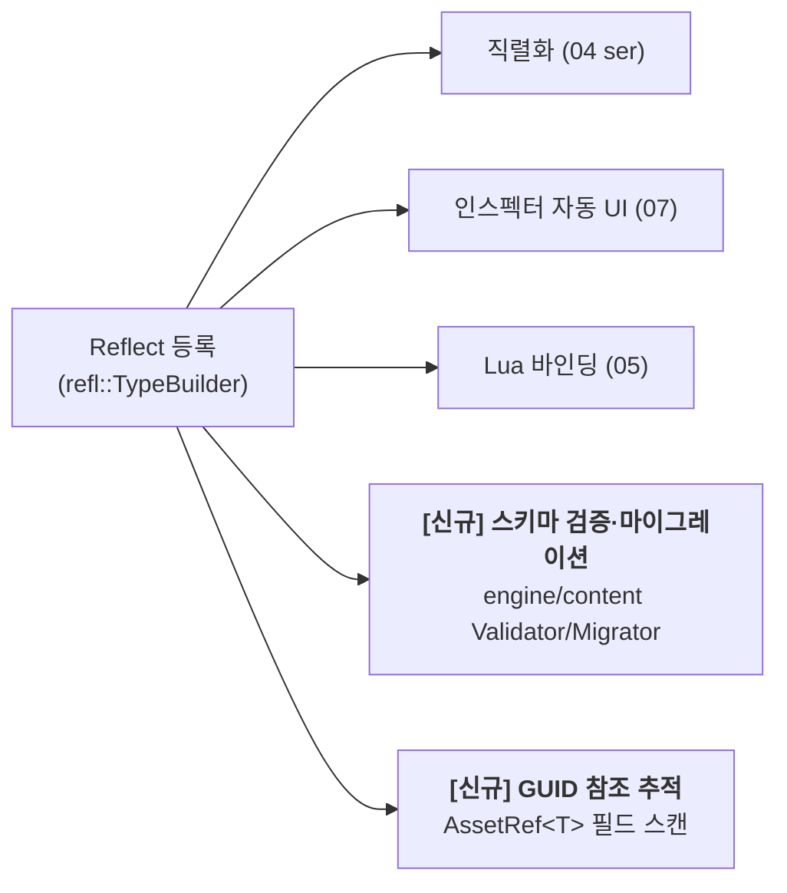
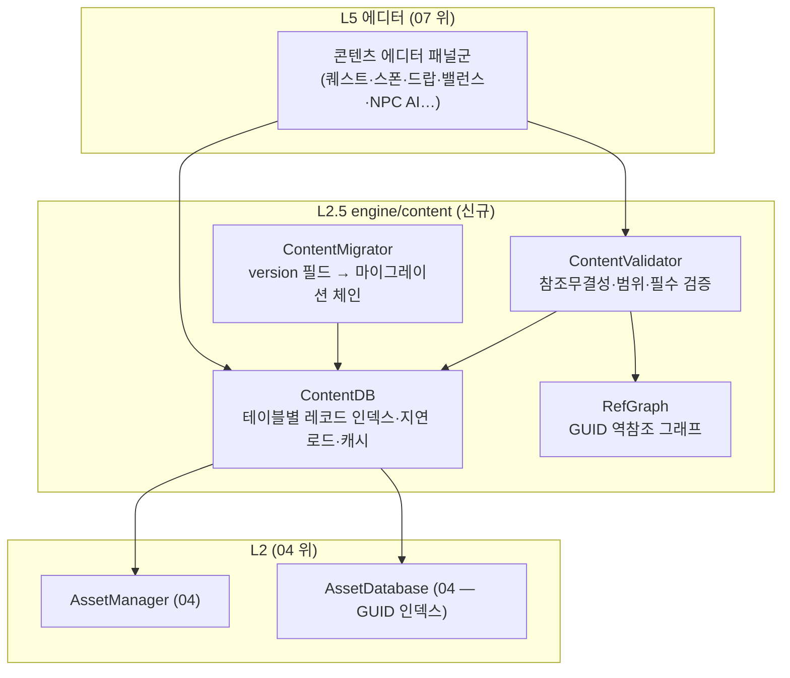
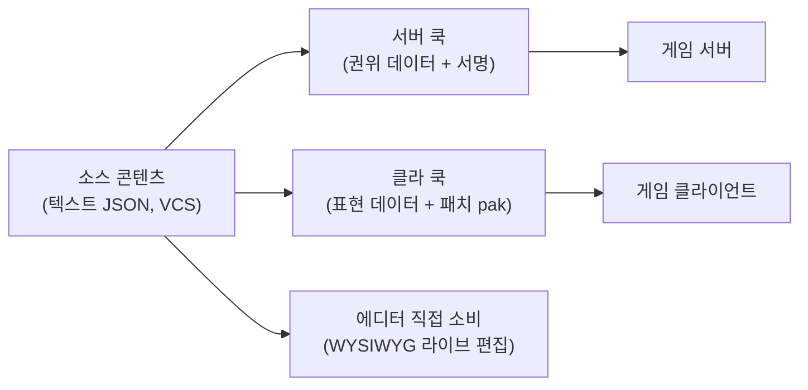

# 08. 콘텐츠 제작 도구 & 에디터 확장 (Content Tooling)

> 소유 범위: 픽셀 2.5D MMORPG의 **데이터 드리븐 콘텐츠 저작 파이프라인** — 맵/스폰/퀘스트/대화/루트·드랍/상점·제작·강화/스킬·스탯·밸런스/NPC·AI 행동/프리팹·프리셋을 에디터에서 만들고, **스키마·검증·GUID 참조무결성·마이그레이션·로컬라이즈·라이브옵스·협업(VCS)** 을 보장하며, 이를 위한 **에디터 확장 API(패널/기즈모/드로어/AI 어시스트)** 를 제공한다.
> 비소유: 인게임 UI 렌더링([mmorpg/06]), 넷코드·복제·서버 권위([mmorpg/03]·[mmorpg/04]), 게임플레이 런타임 시스템(전투·인벤 틱 로직 — [mmorpg/05]), 리플렉션/직렬화 프레임워크 정본([../04-asset-pipeline.md]), 좌표계·PPU([../02-rendering.md]), 에디터 셸·Undo·플레이모드 골격([../07-editor-ui.md]).
> 이 문서는 [07-editor-ui.md](../07-editor-ui.md)가 확립한 **에디터 골격(도킹·CommandStack·Selection·PlayMode·확장 레지스트리) 위에** MMORPG 콘텐츠 물량을 얹는 "위층 문서"다. 07이 *어떻게 편집하는가(에디터 인프라)* 를 소유하면, 08은 *무엇을 편집하는가(MMORPG 콘텐츠 데이터·툴)* 를 소유한다.

---

## 1. 목표·범위

### 1.1 목표

- **1인(+소수 협력자) 개발자가 엔진 재빌드 없이 MMORPG 한 편 분량의 콘텐츠를 데이터로 저작**할 수 있게 한다. 맵 수백 개, 몬스터/NPC 수천 종, 스킬·아이템·퀘스트 수천 개 규모를 텍스트 직렬화 + GUID 참조로 관리한다.
- **모든 콘텐츠는 에셋(GUID)이고 텍스트(JSON)로 직렬화**되어 Git으로 diff·머지·리뷰된다. 바이너리 편집기에 갇힌 데이터는 없다. 대형 타일맵만 청크 바이너리 블록을 분리한다.
- **"리플렉션 원-스톱 루프"를 MMORPG 데이터 타입으로 확장**한다: `Reflect<T>` 등록 한 번 → 직렬화(04)·인스펙터 자동 UI(07)·Lua 바인딩(05)·**스키마 검증·마이그레이션·GUID 참조 추적**까지 자동으로 따라오게 한다.
- **콘텐츠 무결성을 CI에서 강제**한다. 깨진 GUID 참조, 순환 참조, 밸런스 이상치, 로컬라이즈 누락, 스폰 불가 좌표를 **빌드 게이트(validate)** 로 잡는다 — 라이브 서비스에서 "존재하지 않는 아이템 드랍"·"도달 불가 퀘스트"가 나가면 안 된다.
- **라이브옵스 콘텐츠**(시즌·이벤트·핫픽스 데이터)를 클라이언트 재배포 없이 서버 푸시로 갱신할 수 있는 저작·검증·롤아웃 워크플로우를 정의한다.
- **AI 어시스트를 콘텐츠 저작의 1급 협력자**로 만든다(MCP 08 확장): 스프라이트·타일셋 생성을 넘어 스폰테이블·드랍테이블·대화 트리·밸런스 시트 초안을 AI가 채우고, 모든 변경은 `IEditorCommand`를 경유해 Undo·검증된다.

### 1.2 범위 (담당 도메인 전체)

| 하위 도메인 | 이 문서가 다루는 것 |
|---|---|
| 맵/타일맵 에디터 | 오토타일·레이어·충돌·높이·다리 (07이 소유한 인플레이스 편집을 **인용**) + **조명 배치·리전/존 그래프·심리스 경계·서버 콜리전 익스포트** (08 신규) |
| 스폰·배치 | 스폰테이블 에셋, 몬스터/NPC 배치, 순찰 경로, 리스폰 규칙, 채널/인스턴스 스코프 |
| 퀘스트·대화 | 노드그래프 에디터(조건·분기·상태), 대화 트리, 퀘스트 목표·보상·선행조건 그래프 |
| 루트·경제 | 드랍테이블, 상점, 제작(recipe), 강화(enchant) 곡선, 화폐·시세 |
| 스킬·스탯·밸런스 | 스킬 정의, 스탯 커브, 밸런스 시트(스프레드시트 임포트/익스포트·diff) |
| NPC·AI 행동 | Behavior Tree / FSM 그래프 에디터, 어그로·패턴·페이즈 |
| 프리팹·프리셋 | 엔티티 서브트리 프리팹(07 인용) + **데이터 프리셋·블루프린트·변형(variant)** |
| 데이터 스키마 | 리플렉션 스키마·JSON·검증·마이그레이션·GUID 참조무결성 |
| 로컬라이즈 | i18n 에디터, 키 추출, 번역 워크플로우, 누락/과잉 검출 |
| 라이브옵스 | 이벤트·시즌·핫픽스 콘텐츠 번들·롤아웃·롤백 |
| 에디터 확장 | 패널/기즈모/드로어 플러그인 API, AI 어시스트 통합 |
| 협업·VCS | 텍스트 직렬화·안정 diff·머지·락·리뷰 |

### 1.3 MMORPG 스케일 전제 (설계 전반의 제약)

- **콘텐츠 볼륨**: 아이템 ~10K, 스킬 ~2K, 몬스터 ~3K, 맵 ~300, 퀘스트 ~5K, 대화 라인 ~100K, 로컬라이즈 키 ~200K × 다국어. → 인메모리 전량 로드가 아니라 **인덱스 + 지연 로드 + 캐시**가 필요.
- **서버·클라이언트 이원 소비**: 같은 콘텐츠 에셋을 **클라이언트(표현)와 서버(권위 로직)가 함께 소비**한다. 좌표·콜리전·스폰·드랍 확률은 서버가 정본. 콘텐츠 툴은 **양쪽이 읽는 단일 소스**를 만들고, 클라/서버용으로 각각 **쿡(cook)** 한다.
- **치트·악용**: 클라이언트가 콘텐츠 파일을 조작해도 서버 밸런스가 흔들리면 안 된다. 확률·수치의 정본은 서버 번들이며 서명·버전 검증된다.
- **라이브 무중단**: 콘텐츠 핫픽스가 서버 재시작 없이 반영되어야 하고, 잘못된 데이터가 나가면 **롤백**할 수 있어야 한다.
- **협업 동시성**: 여러 사람이 같은 맵·같은 밸런스 시트를 만질 때 diff/머지 충돌을 최소화(안정 정렬·키 기반 병합)해야 한다.

---

## 2. 핵심 개념·아키텍처

### 2.1 콘텐츠 = 에셋 = 텍스트, 그리고 리플렉션 원-스톱 루프의 확장

MyEngine의 확장성 핵심 루프는 "타입을 `Reflect<T>`에 한 번 등록하면 직렬화·인스펙터·Lua가 자동으로 따라온다"이다([00-overview.md] §1). 이 도메인은 그 루프를 **MMORPG 콘텐츠 데이터 타입**(`ItemDef`, `SkillDef`, `SpawnTable`, `QuestDef`, `DropTable`, `Recipe` …)으로 확장하고, 루프에 **두 개의 톱니(cog)를 추가**한다:



- **콘텐츠 에셋**은 기존 씬 직렬화기(`SceneSerializer`)와 동일한 04 `JsonArchive`/`SerializeDynamic` 경로를 쓴다. 씬이 "엔티티+컴포넌트"라면 콘텐츠 데이터는 "레코드(struct) 컬렉션"이다 — 둘 다 리플렉션 메타로 왕복한다.
- **참조는 GUID로**. 에셋 간 참조(`SkillDef`가 `EffectAsset`을, `DropTable`이 `ItemDef`를 가리킴)는 런타임 포인터가 아니라 `AssetRef<T> { AssetGuid guid; }` — 04의 128비트 GUID를 필드로 보유한다. 씬의 `EntityRef`가 로컬 ID로 안정화되듯, 콘텐츠 참조는 GUID로 안정화된다.
- **데이터 레코드의 로컬 참조**(같은 테이블 내 다른 행, 예: 스킬 트리 선행 스킬)는 문자열 **stableId**로 참조한다(배열 인덱스 금지 — 재정렬 시 diff·참조가 깨짐).

### 2.2 콘텐츠 데이터베이스 (ContentDB) — 신규 서비스

씬은 World로 로드하지만, 콘텐츠 데이터(아이템·스킬·스폰…)는 World 엔티티가 아니라 **레코드 테이블**이다. 이를 소유하는 `ContentDB` 서비스를 신설한다.



- `ContentDB`는 **테이블 = 에셋 타입** 단위로 레코드를 인덱싱한다(`Table<ItemDef>`, `Table<SkillDef>` …). 각 레코드는 `AssetGuid`(에셋 파일 1개 = 레코드 1개) 또는 **묶음 에셋 내 stableId**(하나의 `.itemdb` 파일에 수천 아이템)로 주소화된다.
- **묶음 vs 낱개**: 낱개(에셋 1개=레코드 1개)는 diff·GUID 참조에 유리하나 수천 파일은 무겁다. 묶음(한 파일에 다수)은 로드·관리에 유리하나 머지 충돌·참조 세분화가 어렵다. → **정책: 참조 대상이 되는 정의(Item/Skill/NPC)는 "샤딩된 묶음"**(예: `items/weapons.itemdb`, `items/armor.itemdb` — 카테고리별 파일, 파일 내 stableId 정렬 보장), **씬·맵·퀘스트그래프는 낱개 에셋**.
- ContentDB는 서버 빌드에서도 동작한다(에디터 없이). 서버 런타임([mmorpg/05])이 ContentDB의 소비자다 — 콘텐츠 툴과 런타임이 **동일한 레코드 로더**를 공유한다.

### 2.3 세 가지 소비자, 하나의 소스, 두 개의 쿡(cook)



- **소스**: 사람이 편집하는 텍스트 JSON. VCS 정본.
- **서버 쿡**: 확률·수치·스폰·콜리전 등 **권위 필드만** 추출 + 버전·서명. 서버가 로드.
- **클라 쿡**: 표현 필드(아이콘·이름·설명·이펙트) + 힌트. 드랍 확률 같은 권위 수치는 **뺀다**(치트 방지 — 클라는 확률을 몰라도 됨). 04 pak·델타패치로 배포.
- **에디터**: 소스를 직접 로드해 라이브 편집(쿡 생략). 플레이모드는 로컬 쿡을 시뮬레이션.

### 2.4 CommandStack 통일 — 모든 콘텐츠 편집은 Undo 가능

07의 원칙 "Undo 불가능한 편집은 머지하지 않는다"를 콘텐츠 툴에 그대로 적용한다. 콘텐츠 에디터는 World가 아니라 ContentDB 레코드를 만지므로, 07의 `PropertyEditCommand`(엔티티 대상)를 일반화한 **`RecordEditCommand`**(레코드 대상 · `PropertyPath` 기반)를 도입한다 — 리플렉션 제네릭이라 새 콘텐츠 타입마다 커맨드를 짤 필요가 없다.

---

## 3. 기능 목록

우선순위: **P0=수직슬라이스/첫 콘텐츠 루프 필수, P1=알파(다수 콘텐츠 제작), P2=베타(라이브옵스·협업), P3=운영 편의, P4=대규모·후순위**. 상태: 있음=엔진에 실동작 존재 / 부분=계약·일부만 / 신규=이 문서가 처음 정의.

### 3.1 데이터 스키마·무결성 (모든 콘텐츠 툴의 토대)

| 기능 | 우선순위 | 상태 | 엔진 매핑 |
|---|---|---|---|
| 리플렉션 기반 콘텐츠 레코드 직렬화(JSON 왕복) | P0 | 있음 | 재사용: 04 `ser::SerializeDynamic`/`JsonArchive`, `refl::TypeInfo`. `SceneSerializer` 패턴을 레코드 컬렉션에 복제 |
| `AssetRef<T>`(GUID 참조 필드 타입) + 리플렉션 인지 | P0 | 신규 | 신규: `engine/content/AssetRef.h`. 04 `AssetGuid` 래핑, `refl`에 struct로 등록해 인스펙터가 픽커로 그림 |
| stableId(테이블 내 안정 참조) 규약 | P0 | 신규 | 신규: 배열 인덱스 금지, 문자열 id. `ContentDB` 로드시 중복 검출 |
| ContentDB(테이블 인덱스·지연 로드·캐시) | P0 | 신규 | 신규: `engine/content/ContentDB`. 04 `AssetManager`/`AssetDatabase` 위 |
| 스키마 검증기(필수·범위·enum·참조존재) | P0 | 신규 | 신규: `engine/content/ContentValidator`. `refl` Attribute(Range 등) 소비 |
| GUID 참조무결성 검사(끊긴 참조·순환) | P0 | 부분 | 확장: 04 AssetDatabase 의존성 그래프 → `RefGraph` 역참조. 참조 스캔은 `refl` 필드 순회 |
| 마이그레이션 체인(version→최신) | P1 | 부분 | 확장: 04 리플렉션 `__version` 필드·03 세이브 마이그레이션 패턴 → `ContentMigrator` |
| 콘텐츠 검증 CI 게이트(validate 명령) | P1 | 신규 | 신규: `apps/content_tool` CLI + 08 MCP `content_validate` 툴 |
| 미지 필드 보존(라운드트립·모드 호환) | P2 | 부분 | 확장: JsonArchive에 unknown-field 보존 옵션(00 오픈이슈 C9) |
| 스키마 문서 자동 생성(리플렉션→md/json-schema) | P3 | 신규 | 신규: `content_tool schema-export` — `refl::TypeRegistry` 순회 |

### 3.2 맵·타일맵·조명·리전 (07 인용 + 08 확장)

| 기능 | 우선순위 | 상태 | 엔진 매핑 |
|---|---|---|---|
| 타일맵 인플레이스 편집(브러시·오토타일·높이·다리·충돌) | P0 | 있음 | 인용: 07 `mye.tilemap`/`TilemapEditorPanel`·`TilePaintCommand`, 03 타일맵 |
| 조명 배치 에디터(포인트·앰비언트·낮밤 프리셋) | P1 | 신규 | 신규 패널 `mye.lighting` + 02 2D 라이팅([mmorpg/07]). 기즈모=범위 |
| 리전/존 그래프(맵 노드·포탈·심리스 경계) | P1 | 신규 | 신규 패널 `mye.zonegraph` + [mmorpg/02] 존 스트리밍 소비 |
| 서버 콜리전·워크메시 익스포트 | P0 | 신규 | 신규: 타일 충돌 → 서버 쿡. 03 `ITileCollision`(현재 미구현)와 짝 |
| 맵 메타(리스폰포인트·세이프존·PvP존·채널규칙) | P1 | 신규 | 신규 맵 에셋 필드 + 뷰포트 오버레이(07 `IViewportOverlay`) |
| 미니맵·월드맵 데이터 생성 | P2 | 신규 | 신규: 타일맵 렌더 → 축소 이미지 쿡 |

### 3.3 스폰·배치·NPC AI

| 기능 | 우선순위 | 상태 | 엔진 매핑 |
|---|---|---|---|
| 스폰테이블 에셋(몬스터·확률·수·리스폰·조건) | P0 | 신규 | 신규 `SpawnTable` 레코드 + `ContentDB`. 서버 권위 |
| 맵 위 스폰 배치(뷰포트 마커·영역·순찰경로) | P0 | 부분 | 확장: 07 씬 뷰포트 드래그드롭·기즈모 + 03 NPC 순찰 waypoint |
| 순찰/이동 경로 편집(A* 프리뷰) | P1 | 부분 | 확장: 03 NavSystem/A*(있음)를 에디터 프리뷰로 배선 |
| NPC 행동 에디터(BT/FSM 노드그래프) | P1 | 부분 | 신규 패널 `mye.behavior` + 03 애니 상태머신 패턴 재사용. 노드그래프 인프라는 퀘스트와 공유 |
| 채널/인스턴스 스폰 스코프(필드·던전) | P2 | 신규 | 신규 스폰 스코프 필드 + [mmorpg/03] 존/인스턴스 |
| 보스 페이즈·패턴 타임라인 | P2 | 신규 | 신규: 07 애니/이펙트 타임라인 위젯 재사용 |

### 3.4 퀘스트·대화

| 기능 | 우선순위 | 상태 | 엔진 매핑 |
|---|---|---|---|
| 대화 트리 데이터(라인·화자·선택지·분기·조건) | P0 | 있음 | 재사용: `runtime::DialogueScript`/`DialogueLine`/`DialogueChoice`(JSON 왕복 구현됨) |
| 대화 노드그래프 에디터(시각 분기 편집) | P1 | 부분 | 신규 패널 `mye.dialogue` + imgui-node-editor(00 채택검토 C2). 데이터는 위 재사용 |
| 퀘스트 정의(목표·보상·선행·상태 머신) | P0 | 신규 | 신규 `QuestDef` 레코드. 목표=조건식, 보상=`AssetRef<ItemDef>` |
| 퀘스트 노드그래프(단계·분기·후속퀘) | P1 | 신규 | 신규 패널 `mye.quest`. 노드그래프 인프라 공유(NPC AI·대화와) |
| 조건식 에디터(플래그·레벨·아이템소지·시간) | P1 | 부분 | 확장: `DialogueChoice.conditionKey`(문자열 훅 있음) → 구조화 조건 트리 |
| 대화·퀘스트 로컬라이즈 키 자동 추출 | P1 | 부분 | 확장: `LocalizedText.key` 스캔 → StringTable 키 생성 |

### 3.5 루트·경제·제작

| 기능 | 우선순위 | 상태 | 엔진 매핑 |
|---|---|---|---|
| 아이템 정의(ItemDef: 스탯·등급·스택·아이콘) | P0 | 신규 | 신규 `ItemDef` 레코드 + 인스펙터 자동 UI |
| 드랍테이블(가중치·확률·조건·중복규칙) | P0 | 신규 | 신규 `DropTable`. 확률=서버 권위(클라 쿡서 제거) |
| 드랍 시뮬레이터(몬테카를로 기대값 프리뷰) | P1 | 신규 | 신규 패널 툴: N회 롤 → 히스토그램. 밸런스 검수 |
| 상점 데이터(재고·가격·통화·리셋) | P1 | 신규 | 신규 `ShopDef` 레코드 |
| 제작 레시피(재료·산출·성공률·툴) | P1 | 신규 | 신규 `Recipe` 레코드. 재료=`AssetRef<ItemDef>`+수량 |
| 강화·인챈트 곡선(레벨별 성공률·비용·파괴) | P1 | 신규 | 신규 `EnhanceCurve` — 곡선 커스텀 드로어(07 `IPropertyDrawer`) |
| 경제 밸런스 대시보드(통화 흐름·인플레) | P3 | 신규 | 신규: ContentDB 집계 분석 패널 |

### 3.6 스킬·스탯·밸런스

| 기능 | 우선순위 | 상태 | 엔진 매핑 |
|---|---|---|---|
| 스킬 정의(코스트·쿨·범위·효과·이펙트참조) | P0 | 신규 | 신규 `SkillDef`. 이펙트=`AssetRef<EffectAsset>`([mmorpg/07]) |
| 스탯 커브(레벨→HP/공격 등 곡선) | P0 | 신규 | 신규 `StatCurve` + 곡선 드로어 |
| 밸런스 시트 스프레드시트 임포트/익스포트(CSV/XLSX) | P1 | 신규 | 신규: `content_tool sheet-sync`. ContentDB ↔ CSV 왕복 |
| 시트 diff·머지·라운드트립 안정성 | P1 | 신규 | 신규: 안정 정렬·stableId 키 병합 |
| 밸런스 이상치 검증(음수 코스트·역전 커브) | P1 | 신규 | 신규: `ContentValidator` 규칙 세트 |
| 스킬 트리 편집(선행·분기) | P2 | 신규 | 신규 패널: 노드그래프 공유 |
| 밸런스 시뮬레이터(DPS·TTK 추정) | P3 | 신규 | 신규 분석 툴 |

### 3.7 프리팹·프리셋·확장·협업·라이브옵스·AI

| 기능 | 우선순위 | 상태 | 엔진 매핑 |
|---|---|---|---|
| 엔티티 서브트리 프리팹(캡처·인스턴스·오버라이드) | P0 | 있음 | 재사용: 07 `PrefabAsset`(구현됨), `PrefabOverride`(PropertyPath) |
| 데이터 프리셋·블루프린트·변형(variant) | P1 | 신규 | 신규: 레코드 상속(base + override). 리플렉션 필드 병합 |
| 에디터 확장 API(패널·메뉴·툴바·드로어) | P0 | 있음 | 재사용: 07 `EditorExtensionRegistry`(구현됨) |
| 기즈모·뷰포트 툴·오버레이 확장 | P1 | 부분 | 확장: 07 `IGizmoExtension`/`IViewportTool`(골격만) 구현 |
| 로컬라이즈 에디터(키 테이블·번역·누락검출) | P1 | 부분 | 확장: `runtime::LocalizationSystem`(있음) + 신규 패널 `mye.locale` |
| 번역 워크플로우(export→외주→import·상태추적) | P2 | 신규 | 신규: `content_tool loc-export/import`(PO/CSV) |
| 라이브옵스 콘텐츠 번들(이벤트·시즌·핫픽스) | P2 | 신규 | 신규 `ContentBundle` + 롤아웃·롤백. [mmorpg/09] 라이브옵스와 짝 |
| VCS 친화 텍스트 직렬화·안정 diff | P0 | 있음 | 재사용: JSON 텍스트·안정 정렬(SceneSerializer 이름정렬 패턴) |
| 콘텐츠 락·리뷰·머지 도구 | P2 | 신규 | 신규: 파일 단위 락 힌트 + 3-way 머지 헬퍼 |
| AI 어시스트(스폰·드랍·대화 초안 생성) | P2 | 부분 | 확장: 08 MCP(dot 툴 있음) + 신규 `content_*` MCP 툴, RemoteControl(07/08 Stage B) |
| AI 생성 변경의 Undo·검증 통합 | P2 | 신규 | 신규: AI 변경도 `RecordEditCommand` 경유 |

---

## 4. 데이터 모델·스키마

### 4.1 공통 참조 타입 — `AssetRef<T>` / stableId

```cpp
namespace mye::content {

// GUID 참조 필드. 리플렉션에 struct로 등록 → 인스펙터가 에셋 픽커로, 검증기가 존재검사로 소비.
//   씬의 EntityRef(로컬ID 안정화)에 대응하는 "콘텐츠 간 참조" 안정화 장치.
template <class T>
struct AssetRef {
    asset::AssetGuid guid;                 // 04 128비트 GUID (실행 간 안정)
    bool IsNull() const { return guid.IsNull(); }
};

// 같은 테이블 내 레코드 참조(예: 스킬 선행조건). 배열 인덱스 금지 — 재정렬·머지 안전.
struct RecordRef {
    std::string tableId;   // "skills" (생략 시 동일 테이블)
    std::string stableId;  // 대상 레코드의 안정 id
};

// 모든 콘텐츠 레코드의 공통 헤더(믹스인).
struct ContentRecordBase {
    std::string  stableId;          // 파일/테이블 내 안정 식별자(필수·유일)
    std::string  displayName;       // 에디터 표시용(로컬라이즈 아님)
    uint32_t     schemaVersion = 1; // 마이그레이션 기준
    std::vector<std::string> tags;  // 검색·필터·번들 태그
};

} // namespace mye::content
```

리플렉션 등록은 04 `TypeBuilder` 규약 그대로. 등록 즉시 인스펙터·직렬화·검증·GUID 추적이 활성화된다.

### 4.2 예시 스키마 — 아이템·드랍·스킬·스폰

```cpp
namespace mye::content {

enum class ItemGrade : uint8_t { Common, Uncommon, Rare, Epic, Legendary };
enum class ItemKind  : uint8_t { Weapon, Armor, Consumable, Material, Quest, Currency };

struct ItemDef {                             // items/*.itemdb 안의 레코드
    ContentRecordBase base;
    ItemKind    kind = ItemKind::Material;
    ItemGrade   grade = ItemGrade::Common;
    LocalizedText nameKey;                    // runtime::LocalizedText (로컬라이즈 키)
    LocalizedText descKey;
    AssetRef<TextureAsset> icon;              // 클라 표현 (서버 쿡서 제거)
    int32_t     maxStack = 1;                 // [Range(1, 9999)]
    int64_t     sellPrice = 0;                // [Range(0, ...)]
    bool        tradable = true;
    std::vector<StatModifier> stats;          // 장비 스탯(공/방/…)
};

struct DropEntry {
    RecordRef   item;                         // → ItemDef.stableId (동일 테이블 밖이면 tableId)
    float       weight = 1.0f;                // 가중치 (서버 권위 — 클라 쿡서 제거)
    int32_t     minCount = 1, maxCount = 1;   // [Range(1, ...)] min<=max 검증
    std::string conditionKey;                 // 조건 훅(레벨·이벤트·파티 — 게임/Lua 평가)
};

struct DropTable {                            // 서버 권위 콘텐츠
    ContentRecordBase base;
    float       noDropChance = 0.0f;          // [Range(0,1)]
    int32_t     rolls = 1;                     // 롤 횟수
    std::vector<DropEntry> entries;
};

struct SkillDef {
    ContentRecordBase base;
    LocalizedText nameKey, descKey;
    AssetRef<EffectAsset>  hitEffect;         // 07 EffectAsset (표현)
    int32_t     manaCost = 0;                  // [Range(0, ...)]
    float       cooldownSec = 0.0f;            // [Range(0, ...)] 서버 권위
    float       rangeUnits = 1.0f;             // PPU 규약(02)
    RecordRef   requiresSkill;                 // 선행 스킬(스킬트리) — 순환 검증 대상
    std::vector<SkillEffectOp> effects;        // 데미지·버프·이동 등 효과 리스트
};

struct SpawnEntry {
    RecordRef   monster;                       // → 몬스터 정의
    float       weight = 1.0f;
    int32_t     minCount = 1, maxCount = 1;
    std::string conditionKey;                  // 시간대·이벤트·채널
};

struct SpawnTable {                            // 맵에 배치되는 스폰 규칙(서버 권위)
    ContentRecordBase base;
    Vec2        areaMin, areaMax;              // 스폰 영역(월드 좌표)
    int32_t     maxAlive = 10;                 // 동시 생존 상한
    float       respawnSec = 30.0f;            // 리스폰 지연
    int32_t     floorLevel = 0;                // 03 다리/높이 층
    std::vector<SpawnEntry> entries;
};

} // namespace mye::content
```

### 4.3 콘텐츠 파일 예시(JSON, 샤딩된 묶음)

```jsonc
// assets/content/items/weapons.itemdb  ← 낱개가 아니라 카테고리 샤드(diff·머지 단위)
{
  "__version": 1,
  "table": "items",
  "records": [                       // stableId 오름차순 정렬 강제 (안정 diff)
    {
      "stableId": "sword_wood_01",
      "displayName": "Wooden Sword",
      "schemaVersion": 1,
      "kind": "Weapon", "grade": "Common",
      "nameKey": { "key": "item.sword_wood_01.name" },
      "descKey": { "key": "item.sword_wood_01.desc" },
      "icon": { "guid": "b1f3...a09" },     // AssetRef → 04 GUID
      "maxStack": 1, "sellPrice": 12, "tradable": true,
      "stats": [ { "stat": "Attack", "value": 5 } ]
    }
  ]
}
```

### 4.4 퀘스트 그래프(노드) — 낱개 에셋

```jsonc
// assets/content/quests/village_intro.quest
{
  "__version": 1,
  "stableId": "q_village_intro",
  "startNode": "n_talk_elder",
  "params": [ { "id": "flag_met_elder", "type": "bool" } ],
  "nodes": [
    { "id": "n_talk_elder", "kind": "Talk",
      "dialogue": { "guid": "dd21...4c" },     // AssetRef<DialogueScript>
      "next": "n_kill_slimes" },
    { "id": "n_kill_slimes", "kind": "Objective",
      "objective": { "type": "Kill", "target": {"tableId":"monsters","stableId":"slime_green"}, "count": 5 },
      "next": "n_reward" },
    { "id": "n_reward", "kind": "Reward",
      "rewards": [ { "item": {"tableId":"items","stableId":"potion_hp_s"}, "count": 3 },
                   { "currency": "gold", "amount": 50 } ],
      "next": "" }
  ]
}
```

노드그래프는 **대화·퀘스트·NPC 행동(BT/FSM)이 동일한 노드 인프라**(`engine/content/graph`)를 공유한다. 노드 = `{ id, kind, payload(리플렉션 struct), pins[] }`, 엣지 = `{ from, fromPin, to }`. 시각 편집은 imgui-node-editor(00 채택검토 C2), 데이터는 리플렉션 왕복.

### 4.5 마이그레이션 규약

```cpp
// engine/content/ContentMigrator — schemaVersion 필드로 최신까지 순차 변환.
//   04 리플렉션 __version(구조 버전)과 별개: schemaVersion은 "콘텐츠 의미 버전".
//   변환 함수는 json::Value 단위(리플렉션 역직렬화 전에 개입 — 필드 rename/split 가능).
struct MigrationStep {
    uint32_t fromVersion;                       // N → N+1
    std::function<Expected<void,Error>(json::Value&)> apply;
};
// 예: v1→v2에서 sellPrice(int32) → sellPrice(int64) 확장, cooldown(ms) → cooldownSec(float).
```

---

## 5. 경우의 수·엣지케이스 (exhaustive)

### 5.1 참조무결성·GUID

- **끊긴 참조**: `AssetRef.guid`가 어떤 에셋에도 없음(삭제됨). → 검증 ERROR. 인스펙터 픽커에 빨간 "Missing (guid…)" 표시. 서버 쿡 차단.
- **끊긴 RecordRef**: `stableId`가 테이블에 없음(오타·삭제·리네임). → 검증 ERROR. 리네임은 반드시 **리네임 커맨드**로(역참조 일괄 갱신).
- **순환 참조**: 스킬 선행조건 A→B→A, 퀘스트 후속 루프, 제작 재료가 산출물 포함. → 검증 ERROR(사이클 경로 리포트). RefGraph에서 SCC 검출.
- **자기 참조**: 프리셋 base가 자신. → ERROR.
- **모호한 참조**: 같은 tableId에 중복 stableId. → 로드 시 ERROR(첫 것 채택 + 경고 금지, 하드 실패). 묶음 파일 저장 시 중복 방지.
- **다른 타입 참조**: `AssetRef<ItemDef>`가 스킬 GUID를 가리킴. → 타입 검증 ERROR(GUID의 에셋타입 vs 기대타입).
- **참조 개수 폭증**: 인기 아이템을 수백 드랍테이블이 참조. 리네임/삭제 시 대량 갱신. → RefGraph 배치 + 트랜잭션 Undo. 삭제 전 "N곳에서 사용 중" 경고.
- **GUID 충돌**: 복붙·머지로 두 에셋이 같은 GUID(.meta 복사). → AssetDatabase 스캔서 충돌 ERROR, 한쪽 재발급 제안.
- **GUID 불안정(현 엔진 갭)**: 04가 매 로드 `AssetGuid::Generate()`로 새 GUID 생성(현재 미배선 — 04 갭). → **08 전제조건**: 04 `.meta` GUID 영속이 선행되어야 콘텐츠 참조가 성립. 미충족 시 콘텐츠 툴은 stableId 참조만 신뢰하고 GUID 참조는 P1로 유예.

### 5.2 스키마·검증·마이그레이션

- **필수 필드 누락**: stableId 빈값·nameKey 없음. → ERROR.
- **범위 위반**: 음수 maxStack, 확률 >1, min>max. → `refl` Range Attribute + 검증 규칙. WARN/ERROR 구분(밸런스 이상치는 WARN, 논리 파괴는 ERROR).
- **enum 값 미상**: JSON에 없는 grade 문자열. → 마이그레이션 대상이거나 ERROR. 미지 enum은 하드 실패(조용한 기본값 대체 금지 — 밸런스 오염).
- **마이그레이션 실패**: v1→v2 변환 중 데이터 부족. → 해당 레코드 격리 + 리포트, 나머지 진행. 버전 다운그레이드(에디터가 구버전 데이터보다 낮음)는 로드 거부(00 세이브 마이그레이션 규약과 동일).
- **버전 스킵**: v1 파일을 v3 엔진이 로드. → v1→v2→v3 체인 순차 적용. 빠진 스텝 있으면 ERROR.
- **미지 필드**: 플러그인/모드가 추가한 필드. → 라운드트립 보존(옵션, 00 C9) 또는 경고 후 제거. 기본은 보존.

### 5.3 협업·VCS·머지

- **동시 편집 충돌**: 두 사람이 같은 `weapons.itemdb` 다른 레코드 수정. → stableId 정렬 + 레코드 단위라 3-way 자동 머지 대부분 성공. 같은 레코드 같은 필드는 수동 해결.
- **정렬 흔들림**: 저장마다 레코드 순서 바뀜 → diff 폭발. → **stableId 오름차순 강제 정렬**(SceneSerializer의 이름정렬 패턴). 맵 키·배열도 안정 순서.
- **부동소수 직렬화 요동**: `0.1`이 재저장마다 `0.10000001`. → 고정 반올림/최소자릿수 직렬화 정책.
- **바이너리 타일맵 머지**: 대형 청크는 텍스트 diff 불가. → 청크 단위 파일 분리 + "충돌 시 양쪽 보존" 경고. 맵은 낱개 에셋이라 파일 단위 락 권장.
- **리네임 vs 삭제후생성**: 사람이 stableId를 손으로 바꾸면 참조 끊김. → **에디터 리네임 커맨드만 권장**, 손편집 리네임은 검증서 "고아 참조 + 신규 미참조 레코드" 패턴으로 감지·수정 제안.
- **락 무시**: 락 힌트는 강제 아님(Git엔 파일락 없음). → 서버 사이드 훅(pre-receive)으로 검증 실패 시 push 거부.

### 5.4 밸런스·경제·확률

- **드랍 확률 합 오류**: weight 합 0(전부 no-drop)·의도 안 한 100%. → 드랍 시뮬레이터가 기대값 표시, 극단값 WARN.
- **인플레 유발**: sellPrice > craft 재료 원가 → 무한 골드. → 경제 대시보드(P3) 순환 이익 탐지.
- **역전 커브**: 레벨 오를수록 HP 감소, 강화 비용 감소. → 단조성 검증 WARN.
- **오버플로**: 스택·가격 int32 초과(수십억 골드). → int64 + 범위 검증.
- **밸런스 시트 왕복 손실**: CSV 임포트가 리치 필드(참조·중첩 배열) 뭉갬. → 시트는 **평면 스칼라 필드만** 왕복, 복합 필드는 에디터 전용. 시트 컬럼 매핑 스키마 명시.
- **소수점 통화**: 부동소수 화폐 → 반올림 오차. → 정수(최소 단위) 화폐 강제.

### 5.5 스폰·맵·서버 권위

- **도달 불가 스폰**: 벽 안·물속·다리 아래 잘못된 floorLevel. → 워크메시 대조 검증 ERROR("좌표 (x,y) 통행불가").
- **스폰 영역 밖 순찰경로**: waypoint가 콜리전 관통. → NavSystem A* 프리뷰서 경로 없음 표시.
- **maxAlive 폭주**: respawn=0 + 넓은 영역 → 서버 과부하. → 하한(최소 리스폰) 검증 WARN.
- **좌표계 불일치**: 에디터 좌표 vs 서버 좌표(PPU·+Y업, 02 규약) 어긋남. → 쿡 시 단일 규약(02) 강제, 왕복 테스트.
- **채널/인스턴스 미지정**: 필드 몹인데 인스턴스 스코프 지정. → 스코프 규칙 검증.
- **좌표 정밀도**: float 좌표를 서버가 고정소수로 → 미세 어긋남. → 쿡 시 양자화 규약 명시([mmorpg/03] 복제 좌표와 일치).

### 5.6 로컬라이즈

- **누락 키**: 대화가 참조하는 `dialogue.x.body`가 StringTable에 없음. → 검증 ERROR(폴백 체인 ko→en→key는 런타임 안전망일 뿐, 콘텐츠 검증은 누락을 잡는다).
- **과잉 키**: 어떤 콘텐츠도 참조 안 하는 죽은 키. → WARN + 정리 제안(역참조 스캔).
- **포맷 인자 불일치**: `{name}` 쓰는데 인자 전달 안 됨, 로케일별 자리표시자 개수 다름. → 언어 간 자리표시자 집합 대조 검증.
- **조사 처리(한국어)**: `{name:이/가}` — `LocalizationSystem.FormatterHook`(현재 인터페이스 자리만). → 훅 미설정 로케일서 원문 노출. 에디터 프리뷰가 훅 적용 결과 표시.
- **줄바꿈·길이 초과**: 번역문이 UI 박스 초과(독일어 등). → 에디터 미리보기 + 최대 길이 힌트.
- **리치텍스트 태그 깨짐**: 번역서 `{color}` 태그 손상. → 태그 밸런스 검증.
- **RTL·CJK 폭**: 아랍어·중국어 폭 계산(06 FreeType). → 06 소유, 08은 검증만.

### 5.7 라이브옵스·핫픽스·롤백

- **핫픽스가 스키마 깨뜨림**: 라이브 데이터가 배포된 클라 스키마와 불일치. → 번들에 스키마버전 태그 + 클라 호환성 검사, 미호환 필드 무시(전방호환).
- **부분 롤아웃 중 참조 깨짐**: 새 아이템 참조하는 드랍만 롤아웃, 아이템은 안 됨. → 번들은 **참조 폐포(closure) 단위**로만 롤아웃(RefGraph로 의존 포함).
- **롤백 시 진행 데이터 모순**: 유저가 이미 신규 퀘스트 진행 → 롤백. → 롤백은 "추가만 있는(additive) 콘텐츠"에 한정, 파괴적 변경은 마이그레이션으로만.
- **서버-클라 콘텐츠 버전 스큐**: 클라 구버전 + 서버 신버전. → 콘텐츠 번들 버전 협상([mmorpg/03] 프로토콜 버전과 짝), 미호환 시 표현 폴백.
- **이벤트 만료 데이터 잔존**: 시즌 종료 후 참조 남음. → 만료 태그 + 검증 경고, 아카이브.

### 5.8 치트·악용·보안

- **클라 콘텐츠 변조**: 유저가 클라 pak의 확률·수치 조작. → 권위 수치는 클라 쿡에 아예 없음(§2.3). 클라는 표현만. 서버가 정본.
- **서버 번들 위조**: → 서명·해시 검증(04 pak 서명은 현재 미구현 — [mmorpg/04]와 짝, 08은 요구사항 제시).
- **AI 어시스트 오생성**: AI가 밸런스 붕괴 값 생성. → AI 변경도 검증 게이트 통과 필수 + 사람 리뷰 + Undo. 자동 커밋 금지.
- **디버그 필드 유출**: 개발용 필드(테스트 확률)가 프로덕션 쿡에 포함. → `[EditorOnly]`/`[ServerOnly]` 어트리뷰트로 쿡서 제외.

### 5.9 스케일·성능

- **콘텐츠 폭증(수만 레코드)**: 전량 인메모리 로드 시 콜드스타트·메모리 폭발. → ContentDB 지연 로드 + 인덱스만 상주. 검증은 배치·증분.
- **검증 시간 폭발**: 전체 재검증이 분 단위. → 증분 검증(변경 파일 + 역참조 폐포만) + 캐시. CI는 전량, 로컬은 증분.
- **인스펙터 대형 배열**: 드랍테이블 1000엔트리. → 07 가상 스크롤([../07-editor-ui.md] 미구현 갭 — 08이 요구), 페이지네이션.
- **노드그래프 대형**: 대화 수백 노드. → 미니맵·접기·검색.
- **AssetDatabase 콜드스타트**: 수천 파일 스캔(04 갭 — 인덱스 영속 미구현). → 04 인덱스 캐시 영속 선행(00 D11).

### 5.10 에디터 확장·플레이모드 상호작용

- **플러그인 콘텐츠 타입 미등록**: 플러그인 언로드 후 그 타입 레코드 로드. → 미지 컴포넌트 스킵 경고(SceneSerializer 패턴) — 데이터 손실 방지 위해 라운드트립 보존.
- **플레이모드 중 콘텐츠 편집**: Play World가 ContentDB 스냅샷 사용 중 소스 변경. → 편집은 소스에, Play는 스냅샷 유지(07 이중 World 격리 규약 확장). Stop 후 재로드.
- **핫리로드 중 참조 무효화**: 콘텐츠 파일 저장 → 참조하던 레코드 사라짐. → 04 AssetReloadedEvent → 검증 재실행 → 인스펙터 갱신.
- **AI 원격 조작 충돌**: MCP RemoteControl(07/08 Stage B)가 사람 편집 중 레코드 변경. → 모든 변경 `RunOnMainThread` + CommandStack 직렬화, 동시 편집 감지.

---

## 6. 신규 모듈·파일 제안

### 6.1 신규 엔진 모듈 — `engine/content/` (L2.5, 04 위 · 서버/클라 공용)

```
engine/content/
  include/mye/content/
    AssetRef.h            # AssetRef<T>·RecordRef·ContentRecordBase (§4.1)
    ContentDB.h           # 테이블 인덱스·지연 로드·캐시 서비스(MYE_SERVICE)
    ContentValidator.h    # 규칙 세트·검증 리포트(범위·필수·참조·순환)
    ContentMigrator.h     # schemaVersion 마이그레이션 체인
    RefGraph.h            # GUID/RecordRef 역참조 그래프·SCC(순환) 검출
    ContentBundle.h       # 라이브옵스 번들·롤아웃·롤백(참조 폐포 단위)
    Cook.h                # 서버/클라 쿡(권위 추출·서명·pak) 인터페이스
    graph/
      NodeGraph.h         # 노드·핀·엣지 공용 인프라(대화·퀘스트·BT 공유)
  src/  (대응 .cpp)
  tests/                  # 자체 MYE_TEST — 검증·마이그레이션·refgraph·round-trip
```

- ContentDB/Validator/Migrator/RefGraph는 **에디터 비의존**(서버 빌드 포함). 리플렉션·직렬화·GUID만 의존.
- 콘텐츠 데이터 타입(`ItemDef`, `SkillDef` …)의 **정의 위치**는 게임 프레임워크([mmorpg/05])가 소유하고, `engine/content`는 **그것을 담고 검증하는 그릇**만 제공한다(엔진은 게임 의미를 모른다 — 00 의존규칙 §4).

### 6.2 에디터 콘텐츠 패널 — `engine/editor/content/` (07 확장 레지스트리 위)

```
engine/editor/content/
  include/mye/editor/content/
    RecordEditCommand.h   # PropertyEditCommand의 레코드 대상 일반화(리플렉션 제네릭)
    ContentBrowserPanel.h # 테이블·레코드 탐색(에셋 브라우저 확장)
    QuestGraphPanel.h     # mye.quest  (NodeGraph 소비)
    DialogueGraphPanel.h  # mye.dialogue
    BehaviorGraphPanel.h  # mye.behavior (BT/FSM)
    SpawnEditorPanel.h    # mye.spawn (맵 위 배치·순찰)
    DropTablePanel.h      # mye.drop + 드랍 시뮬레이터
    BalanceSheetPanel.h   # mye.balance (시트 임포트/익스포트)
    LocaleEditorPanel.h   # mye.locale (키 테이블·누락검출)
    LightingPanel.h       # mye.lighting / ZoneGraphPanel.h  mye.zonegraph
    drawers/CurveDrawer.h # IPropertyDrawer — 스탯·강화 곡선
  src/  (대응 .cpp)
```

모든 패널은 07 `EditorExtensionRegistry::AddPanel`로 등록(내장=1급 플러그인). 편집은 `RecordEditCommand`/`RecordCreate/Delete/RenameCommand`로 Undo. 곡선·매트릭스 등은 `IPropertyDrawer`.

### 6.3 CLI·CI 도구 — `apps/content_tool/`

```
apps/content_tool/          # 헤드리스 콘텐츠 CLI (CreateApplication --headless 재사용)
  validate                  # 전량/증분 검증 → exit code (CI 게이트)
  migrate <from> <to>       # 마이그레이션 적용·검증
  cook --server / --client  # 쿡(권위 추출·서명 / 표현·pak)
  sheet-export/-import      # 밸런스 시트 CSV/XLSX 왕복
  loc-export/-import        # 로컬라이즈 PO/CSV 왕복·상태추적
  schema-export             # 리플렉션 → json-schema/md
  refgraph                  # 참조 그래프 덤프·역참조 조회
  bundle build/rollout/rollback
```

### 6.4 MCP 확장 — `tools/mcp/src/tools/content_*.ts` (08 Stage A/B)

```
content_validate   # apps/content_tool validate 래핑 → 에러 요약(토큰 절약)
content_query      # 레코드 조회·역참조("이 아이템 쓰는 곳")
content_draft      # AI 초안 생성(스폰·드랍·대화) → RecordEditCommand(Undo) 경유
content_sheet_sync # 시트 왕복
```

MCP 원격 편집은 07/08 Stage B `RemoteControl`(TCP+NDJSON+토큰, `RunOnMainThread` 마샬링, `IEditorCommand` 경유) 위에 얹는다 — AI 조작도 Undo·검증된다.

### 6.5 서버 소비(참고 배선)

`server/` 런타임([mmorpg/03]·[mmorpg/04])은 `engine/content` ContentDB를 그대로 링크해 **서버 쿡 번들**을 로드한다. 콘텐츠 툴과 서버가 동일 로더를 공유하는 것이 "단일 소스" 보장의 핵심이다.

---

## 7. 마일스톤 단계 (작고 검증 가능한 단위)

전역 로드맵(00 §7)의 M4~M6 이후 라이브 서비스 준비 구간에 대응. 각 단계는 "눈으로/CI로 확인 가능한 산출"을 게이트로 한다.

| 단계 | 목표 | 산출·검증 게이트 | 선행 |
|---|---|---|---|
| **C0** 스키마 토대 | `AssetRef`/`RecordRef`/`ContentRecordBase` + ContentDB 최소 로드 | `ItemDef` 1테이블을 JSON 왕복·인스펙터 자동 UI 표시. 자체 테스트 통과 | 04 GUID 영속·리플렉션 v1 |
| **C1** 검증 게이트 | ContentValidator + RefGraph + `content_tool validate` | 끊긴/순환 참조·범위위반을 CI가 non-zero exit로 잡음. 정상 데이터는 통과 | C0 |
| **C2** 첫 콘텐츠 루프 | ItemDef·DropTable·SpawnTable + 스폰 배치(뷰포트)·드랍 시뮬레이터 | 에디터에서 몹 배치→드랍 정의→플레이모드서 처치→드랍 확인 | C1, 07 뷰포트 |
| **C3** 대화·퀘스트 | NodeGraph 인프라 + 대화/퀘스트 그래프 패널(데이터는 기존 DialogueScript 재사용) | 대화 트리·퀘스트(목표·보상) 저작→플레이 검증. 로컬라이즈 키 추출 | C2, imgui-node-editor |
| **C4** 밸런스·경제 | SkillDef·StatCurve·Recipe·Shop·Enhance + 시트 임포트/익스포트 | 밸런스 시트 CSV 왕복 무손실, 이상치 검증. 곡선 드로어 | C1 |
| **C5** 로컬라이즈·마이그레이션 | LocaleEditor + 누락/과잉 검증 + ContentMigrator v1→v2 | 누락 키 CI 검출, 스키마 v→v+1 마이그레이션 통과 | C1 |
| **C6** 서버/클라 쿡 | Cook(권위 추출·서명 / 표현·pak) + 좌표·워크메시 익스포트 | 클라 쿡에 확률 없음 확인, 서버가 쿡 번들 로드 | C1, [mmorpg/03·04] |
| **C7** 협업·머지 | 안정 정렬·3-way 머지 헬퍼·리네임 커맨드·락 힌트 | 두 브랜치 동시 편집 자동 머지, 리네임 후 참조 무결 | C1 |
| **C8** 라이브옵스 | ContentBundle 롤아웃/롤백(참조 폐포)·버전 협상 | 핫픽스 번들 서버 푸시→반영→롤백 무결. [mmorpg/09] | C6 |
| **C9** AI 어시스트·확장 | content_* MCP 툴·RemoteControl 위 초안 생성·기즈모/오버레이 확장 구현 | AI가 스폰/드랍 초안 생성→검증→Undo. 07 IViewportTool 실동작 | C1, 07/08 Stage B |

---

## 8. 의존성·타 도메인 문서 참조

### 8.1 기존 엔진 설계 문서(00~08)

- [00-overview.md](../00-overview.md) — 리플렉션 원-스톱 루프·확장 원칙·전역 로드맵. 이 문서는 그 루프에 "검증·GUID추적" 톱니를 추가.
- [02-rendering.md](../02-rendering.md) — 좌표계·PPU·2D 라이팅. 조명 배치·좌표 쿡이 인용.
- [03-scene-world.md](../03-scene-world.md) — 타일맵(높이·다리)·NavSystem A*·NPC·프리팹·`ITileCollision`. 스폰·워크메시·순찰이 소비.
- [04-asset-pipeline.md](../04-asset-pipeline.md) — **리플렉션·직렬화·GUID·.meta·AssetDatabase 정본**. ContentDB의 하부. GUID 영속·인덱스 캐시는 08의 선행조건(04 갭).
- [05-scripting-plugins.md](../05-scripting-plugins.md) — Lua 조건식 평가·플러그인 콘텐츠 타입 등록.
- [06-runtime-systems.md](../06-runtime-systems.md) — 인게임 UI·로컬라이즈 런타임·`DialogueScript`·세이브. 대화/로컬라이즈 데이터 재사용.
- [07-editor-ui.md](../07-editor-ui.md) — **에디터 셸·CommandStack·Selection·PlayMode·EditorExtensionRegistry·PrefabAsset·SceneSerializer 정본**. 08 패널은 전부 이 위에 얹힌다.
- [08-mcp.md](../08-mcp.md) — MCP 개발도구·RemoteControl(Stage B). AI 어시스트·content_* 툴의 하부.

### 8.2 MMORPG 시리즈 타 도메인(상호참조)

> 아래는 MMORPG 시리즈 문서(`docs/mmorpg/01~09`)의 예정 경로다. 실제 파일명이 확정되면 링크를 정합화한다.

- [mmorpg/01](01-*.md) — MMO 아키텍처 총론·서버 토폴로지(콘텐츠 배포 대상).
- [mmorpg/02](02-*.md) — 존/월드 스트리밍(리전 그래프·심리스 경계가 소비).
- [mmorpg/03](03-*.md) — 넷코드·복제·좌표 규약(스폰 좌표·워크메시 쿡이 일치해야 함).
- [mmorpg/04](04-*.md) — 계정·영속화·DB(콘텐츠 참조가 저장 데이터와 정합).
- [mmorpg/05](05-*.md) — 게임플레이 프레임워크(스탯·전투·인벤·퀘·경제 — **콘텐츠 데이터 타입의 소유자**, 08은 그릇·툴).
- [mmorpg/06](06-*.md) — MMO UI(인벤·상점·거래 — 콘텐츠가 채우는 화면).
- [mmorpg/07](07-*.md) — 렌더 확장(2D 라이팅·파티클·EffectAsset — 조명 배치·스킬 이펙트 참조).
- [mmorpg/09](09-*.md) — 라이브옵스·운영(콘텐츠 번들 롤아웃·롤백·시즌의 상위 운영 도메인).

---

## 이 도메인 요약 3줄

1. **모든 MMORPG 콘텐츠(맵·스폰·퀘스트·대화·드랍·스킬·밸런스)를 리플렉션 기반 텍스트 에셋으로 저작**하고, 기존 04 직렬화·07 에디터·CommandStack·PrefabAsset을 재사용하되 그 위에 **신규 `engine/content`(ContentDB·Validator·Migrator·RefGraph·Cook·NodeGraph)** 를 얹어 데이터·툴을 통일한다.
2. **참조무결성·범위·순환·로컬라이즈 누락·좌표 도달성**을 CI 게이트(`content_tool validate` + MCP `content_validate`)로 강제하고, **서버/클라 이원 쿡**으로 권위 수치를 클라에서 분리해 치트를 원천 차단하며, **안정 정렬·stableId·리네임 커맨드**로 협업 diff/머지를 견고화한다.
3. 핵심 갭은 **콘텐츠 데이터 타입·ContentDB·검증기·노드그래프·쿡·라이브옵스 번들이 전부 신규**라는 점과, 그 전제인 **04 GUID 영속·AssetDatabase 배선·07 IViewportTool/가상스크롤·imgui-node-editor 채택**이 선행되어야 한다는 점 — C0(스키마)→C1(검증)부터 작게 열어 첫 콘텐츠 루프(C2)를 눈으로 통과시키는 순서로 진행한다.
