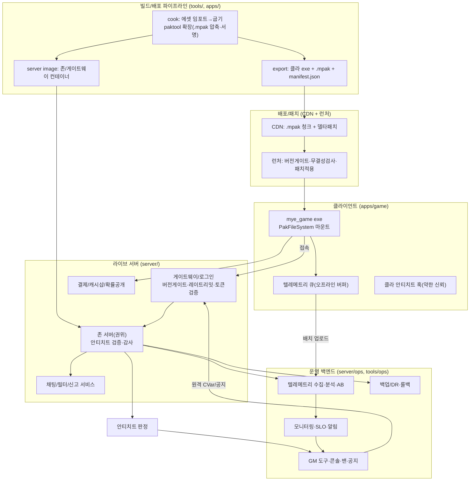

# 09. 라이브옵스 · 배포 · 확장 · 보안 (LiveOps / Deploy / Ops / Security)

> 소유 범위: 게임을 "**출시하고 운영하고 지키는**" 모든 배관 — 빌드/익스포트(스탠드얼론 게임 exe + `.pak` 쿡),
> 클라 패치·CDN·런처, 서버 배포·오케스트레이션·오토스케일, 텔레메트리/분석/AB, 안티치트(서버권위·무결성·행동탐지),
> 채팅·이름 필터·신고·제재·GM 도구, 결제·확률공개, 모니터링·SLO·장애복구·백업/DR, 법규(GDPR·청소년보호·게임법)·연령등급.
> **"만드는 도구"(00~08)를 "돌아가는 라이브 서비스"로 승격**하는 계층이며, 픽셀 2.5D MMORPG의 수백~수천 동접·지연·복제·치트를 전제로 한다.
> 이 문서는 [06-netcode.md](06-netcode.md)·[07-server-world.md](07-server-world.md)·[08-persistence-account.md](08-persistence-account.md)가 정의하는
> 넷코드/서버권위/영속화 위에 **운영·보안·상용화 표면**을 얹는다.

---

## 1. 목표 · 범위

### 1.1 목표

- **원버튼 배포본.** 프로젝트(`.myeproj` + 씬 + 스크립트 + 에셋)를 단일 클라이언트 exe + 서명된 `.mpak` 번들 + 서버 컨테이너 이미지로 굽는 재현 가능한 파이프라인.
  MyEngine은 이미 `PakWriter`/`PakFileSystem`/`paktool`([04-asset-pipeline.md](../04-asset-pipeline.md))을 갖췄으므로 **`.pak`을 확장(압축·서명·버전·델타)** 해 배포 매체로 승격한다.
- **끊김 없는 운영.** 점검(maintenance)·롤아웃·롤백을 다운타임 최소로 수행. 블루그린·카나리·버전게이트로 "구클라 접속 거부/신클라 강제 업데이트"를 게이트한다.
- **서버 권위 + 무결성.** 클라이언트는 **신뢰하지 않는 입력 소스**다. 이동·전투·경제의 진실은 서버([07-server-world.md](07-server-world.md))가 쥐고,
  이 문서는 그 위에서 **탐지·속도제한·제재·감사(audit)** 를 정의한다.
- **관찰 가능성(observability).** 모든 프로세스(클라·게이트웨이·존서버·DB)가 구조화 로그·메트릭·트레이스를 낸다.
  MyEngine의 `Log`(카테고리×심각도, `ILogSink` 플러그인)·`Config`(계층 오버라이드)를 원격 싱크·원격 CVar로 확장한다.
- **상용화·컴플라이언스.** 결제·캐시샵·구독·환불·확률형아이템 확률공개(한국 게임산업법 확률표시 의무), GDPR/개인정보·청소년보호(셧다운 이력·결제한도)·연령등급(GRAC/ESRB/PEGI)을 **데이터드리븐**으로 처리.

### 1.2 범위(In) / 비범위(Out)

| In (이 문서 소유) | Out (다른 문서 소유) |
|---|---|
| 익스포트/쿡 파이프라인, 스탠드얼론 게임 exe 앱, 런처, 패치/델타/CDN | RHI·렌더 파이프라인 → [02-rendering.md](../02-rendering.md) |
| 서버 배포·오케스트레이션·오토스케일·리전, 블루그린·카나리 | 씬/ECS/복제 데이터모델 → [03-scene-world.md](../03-scene-world.md), [07-server-world.md](07-server-world.md) |
| 텔레메트리·분석·대시보드·AB·SLO·알림 | 넷코드 전송·스냅샷·예측/보정 → [06-netcode.md](06-netcode.md) |
| 안티치트(탐지·속도제한·무결성·제재 실행) | **권위 시뮬레이션 규칙 자체**(이동/전투 판정) → [07-server-world.md](07-server-world.md) |
| 채팅/이름 필터·신고·밴·GM 도구·콘솔 | 계정 인증·세션토큰·DB 스키마 → [08-persistence-account.md](08-persistence-account.md) |
| 결제·캐시샵·구독·환불·확률공개, 법규·연령등급 | 게임플레이 프레임워크(스탯/인벤/퀘) → [05-gameplay-framework.md](05-gameplay-framework.md) |
| 백업/DR·카오스·부하테스트 | 에디터 원격 제어 프로토콜 → [08-mcp.md](../08-mcp.md) |

---

## 2. 핵심 개념 · 아키텍처

### 2.1 전체 그림



### 2.2 설계 원칙(MyEngine 규약과 정합)

1. **재현 가능 빌드.** 쿡은 결정적(deterministic)이어야 한다 — 동일 소스 → 동일 `.mpak` 해시. `AtlasPacker`가 이미 "결정적 면적정렬"([04](../04-asset-pipeline.md))이므로 이 계약을 전 파이프라인으로 확장한다.
2. **클라 불신(zero-trust client).** 클라이언트 안티치트는 **탐지 보조**일 뿐 판정 근거가 아니다. 모든 판정은 서버. `Expected<T,Error>`로 검증 실패를 값으로 전파(예외 불사용 규약).
3. **프로세스 분리 = 격리.** MCP([08](../08-mcp.md))가 "엔진 크래시해도 서버는 산다"를 택했듯, 게임 서버도 **게이트웨이/존/DB/채팅**을 분리해 한 프로세스 장애가 전체를 내리지 않게 한다.
4. **데이터드리븐 운영.** 밴 사유·확률표·요금제·AB 버킷·피처플래그는 **코드가 아니라 데이터**(JSON/DB). `Config`의 `RuntimeOverlay` 스코프를 **서버 푸시 CVar**로 실체화한다.
5. **감사 우선(audit-first).** 제재·환불·아이템 지급·확률 롤은 전부 append-only 감사 로그로 남긴다(분쟁·법규 대응). `ISaveParticipant`의 "참여자가 자기 섹션 소유" 패턴을 감사 이벤트에 재사용.
6. **관찰 가능성 내장.** 새 `TelemetryModule`·`ILogSink` 원격 싱크로 로그/메트릭을 일급으로. Fatal 자동 플러시([01](../01-core-platform.md))를 크래시 업로드로 연결.

### 2.3 신뢰 경계(trust boundary)

```
[신뢰 안 함] 클라 입력·클라 안티치트 신호·클라 시각(clock) · 클라 위치 주장
     │  (게이트웨이에서 인증·레이트리밋·버전게이트)
[반신뢰] 인증된 세션(토큰 유효) — 여전히 이동/전투는 서버 재계산
     │  (존서버 권위 검증 + 안티치트 판정)
[신뢰] 서버 권위 상태 · 감사 로그 · DB(08) · GM 액션(권한검증됨)
```

---

## 3. 기능 목록

우선순위: **P0**=출시 필수(없으면 서비스 불가), **P1**=출시 직후 필수, **P2**=안정 운영, **P3**=성숙 운영, **P4**=고도화.
상태: **있음**(재사용)·**부분**(확장)·**신규**.

### 3.1 빌드 · 익스포트 · 배포

| 기능 | 우선순위 | 상태 | 엔진 매핑 |
|---|---|---|---|
| 스탠드얼론 게임 exe(`apps/game`, 데이터드리븐 부트) | P0 | 신규 | `App.h`/`GuardedMain` 재사용, `CreateApplication`을 프로젝트 로더로 구현. 현재 부재(갭). `RuntimeModule` 배선 재사용 |
| `.pak` → `.mpak` 확장(압축·CRC·버전 헤더) | P0 | 부분 | `PakFile.h` v1 평문 → v2: `zstd` 블록압축 + per-entry CRC32 + `formatVersion`/`buildId`. `PakWriter`/`PakFileSystem` 확장 |
| 쿡 파이프라인(임포트→굽기→검증) | P0 | 부분 | `tools/cook`. 임포터(04) 재사용, 결정적 출력. `paktool` 확장 |
| `.mpak` 서명·무결성(Ed25519) | P1 | 신규 | `PakFileSystem::Open`에 서명검증 추가. 위변조 pak 마운트 거부 |
| 빌드 매니페스트(`manifest.json`: 버전·해시·최소클라) | P0 | 신규 | `tools/export`. 런처·버전게이트가 소비 |
| 델타/증분 패치(청크 diff) | P1 | 신규 | `.mpak`을 고정크기 청크로 분할, 청크 해시 리스트 → bsdiff/zstd-patch |
| 런처(버전게이트·무결성·패치적용) | P1 | 신규 | `apps/launcher`(별도 경량 exe). manifest 대조·재다운·실행 |
| CDN 배포·버전드 pak | P1 | 신규 | `tools/publish` → 오브젝트 스토리지 업로드, `latest.json` 채널(stable/beta) |
| 서버 컨테이너 이미지(존/게이트웨이) | P0 | 신규 | `server/Dockerfile.*` + `--headless`([01]) 리눅스 빌드 시드(현재 win32 하드코딩 갭) |
| 오케스트레이션(k8s/compose) | P1 | 신규 | `server/deploy/`(Helm/compose), 존=StatefulSet, 게이트웨이=Deployment |
| 블루그린 · 카나리 롤아웃 | P2 | 신규 | 게이트웨이 라우팅 가중치 + 버전 라벨. 드레인(신접속 차단→기존 세션 이관) |
| 리전(멀티 리전 배치·핑 기반 라우팅) | P3 | 신규 | 게이트웨이 리전 셀렉터, 존 로컬리티. [07] 존 그래프와 연동 |
| 오토스케일(존 인스턴스 증감) | P3 | 신규 | 존 부하(동접·CPU) 메트릭 → 스케일러. 존은 상태보유(신중한 드레인) |

### 3.2 관찰 가능성 · 라이브옵스

| 기능 | 우선순위 | 상태 | 엔진 매핑 |
|---|---|---|---|
| 구조화 로깅 + 원격 싱크 | P0 | 부분 | `Log.h`/`ILogSink` 재사용 → `RemoteLogSink`(NDJSON/OTLP). JSON 라인 포맷 추가 |
| 크래시 리포팅(미니덤프 + 업로드) | P0 | 부분 | `CrashHandler.h`(Phase-0 로그만·갭) → MiniDumpWriteDump + 세션/빌드 메타 + 업로드 |
| 텔레메트리(이벤트·메트릭 수집) | P0 | 신규 | `engine/telemetry` `TelemetryModule` — 이벤트 큐·오프라인 버퍼·배치 업로드 |
| 서버 푸시 CVar / 피처플래그 | P1 | 부분 | `Config` `RuntimeOverlay` 스코프(현재 저장 안 함·미배선 갭) → 원격 수신 채널 |
| 대시보드(동접·수익·리텐션) | P2 | 신규 | `tools/ops` 또는 외부(Grafana). 텔레메트리 집계 소비 |
| AB 테스트(버킷·플래그·지표) | P2 | 신규 | 계정ID 해시 → 버킷, CVar로 변형 주입, 텔레메트리로 지표 |
| SLO · 알림(에러율·지연·다운) | P2 | 신규 | 메트릭 임계 → 알림(pager). SLO 정의(가용성 99.5% 등) |
| 점검(maintenance) 공지·게이트 | P1 | 신규 | 게이트웨이 `maintenanceMode` CVar → 접속 거부 + 공지 페이로드 |
| 롤백(빌드·데이터·DB) | P1 | 신규 | manifest 이전 버전 재지정 + DB 스냅샷 복원([08]) |

### 3.3 안티치트 · 보안

| 기능 | 우선순위 | 상태 | 엔진 매핑 |
|---|---|---|---|
| 서버 권위 검증(이동/전투/경제) | P0 | 신규 | [07] 소유(시뮬), 본 문서=위반 탐지·기록 래퍼 |
| 스피드핵/텔레포트 탐지 | P0 | 신규 | 이동 델타 vs 서버 이동상한(존서버 이동 검증에 후킹). `AntiCheatModule` |
| 레이트리밋(패킷·액션·API) | P0 | 부분 | 게이트웨이/존 토큰버킷. `JobSystem` IO큐([01]) 활용, 세션별 카운터 |
| 무결성 검사(클라 바이너리·pak 해시) | P1 | 부분 | 런처가 manifest 해시 대조 + 서버가 접속 시 pak 해시 챌린지 |
| 메모리/디버거 탐지(클라 보조) | P2 | 신규 | 클라 훅(약한 신뢰) — 신호만 서버 전송, 판정은 통계 |
| 봇/오토파밍 탐지(행동 통계) | P2 | 신규 | 텔레메트리 기반 이상탐지(입력 규칙성·24h 활동·경로 반복) |
| RMT/작업장 대응(경제 이상탐지) | P3 | 신규 | 거래 그래프 분석([08] 거래로그) → 의심 클러스터 플래그 |
| 밴/제재 실행(계정·기기·IP) | P1 | 신규 | `SanctionService` — 밴 스코프·기간·사유·감사. 게이트웨이가 거부 |
| 세션 토큰·리플레이 방지 | P0 | 신규 | [08] 토큰 발급, 본 문서=nonce·만료·재사용 거부 |
| 입력 커맨드 프레임 캡처(안티치트/리플레이) | P2 | 부분 | `InputState`(스냅샷·직렬화 없음 갭) → 타임스탬프 커맨드 프레임 버퍼 |

### 3.4 커뮤니티 · CS · 제재 운영

| 기능 | 우선순위 | 상태 | 엔진 매핑 |
|---|---|---|---|
| 채팅 필터(욕설·스팸·개인정보) | P0 | 신규 | `ChatFilterService` — 사전+정규식+정규화(우회 탐지). 채널별 정책 |
| 이름 필터(캐릭터/길드명 검증) | P0 | 신규 | 생성 시점 필터 + 예약어. 유니코드 homoglyph 정규화 |
| 신고 시스템(사유·증거·큐) | P1 | 신규 | `ReportService` — 신고 큐 + 최근 채팅/행동 스냅샷 첨부 |
| GM 도구/콘솔(조회·순간이동·지급) | P1 | 부분 | MCP `RemoteControl`([08]) 패턴 재사용 → GM 전용 원격 커맨드+권한 |
| 공지/브로드캐스트(전서버·존) | P1 | 부분 | `Config` 푸시 + 게이트웨이 브로드캐스트. `EventBus`([01]) 로컬 팬아웃 |
| 밴 항소·감사 뷰 | P3 | 신규 | 감사 로그 조회 UI(`tools/ops`) |

### 3.5 상용화 · 컴플라이언스

| 기능 | 우선순위 | 상태 | 엔진 매핑 |
|---|---|---|---|
| 결제(스토어/PG 연동·검증) | P1 | 신규 | `server/pay` — 영수증 서버검증, 멱등 지급([08] 인벤 연동) |
| 캐시샵·상품 카탈로그 | P1 | 신규 | 데이터드리븐 상품 JSON. 지급=감사 로그 |
| 구독·배틀패스 | P3 | 신규 | 주기 상태 머신, 갱신·만료 이벤트 |
| 환불·차지백 처리 | P2 | 신규 | 지급 역연산 + 감사. 아이템 회수 정책 |
| 확률형아이템 확률공개(법규) | P0 | 신규 | 확률표 데이터화 + **서버 롤 감사** + 공개 API/문서 생성(한국 확률표시 의무) |
| 청소년보호(결제한도·이용시간 이력) | P1 | 신규 | 연령대별 정책 CVar, 결제 한도 검증([08] 계정 age) |
| GDPR/개인정보(삭제·내보내기) | P1 | 신규 | 계정 데이터 export/erase 파이프라인([08]) + 감사 |
| 연령등급/지역 게이트(GRAC 등) | P2 | 신규 | 지역별 콘텐츠 플래그(CVar), 스토어 등급 메타 |

### 3.6 신뢰성 · DR

| 기능 | 우선순위 | 상태 | 엔진 매핑 |
|---|---|---|---|
| 부하테스트(가상 클라 봇) | P1 | 신규 | `tools/loadtest` — 헤드리스 클라([01] `--headless`)로 N세션 시뮬 |
| 카오스 테스트(장애 주입) | P3 | 신규 | 존 킬·지연·패킷드롭 주입 → 복원력 검증 |
| 백업/DR(DB 스냅샷·복원) | P0 | 신규 | [08] DB 소유, 본 문서=스케줄·리텐션·복원 리허설 |
| 우아한 종료·세션 이관(드레인) | P1 | 신규 | 존 종료 시 세이브 플러시 + 재접속 유도. `OnShutdown` 역순([01]) 준수 |

---

## 4. 데이터 모델 · 스키마

### 4.1 배포 매니페스트 (`manifest.json`)

```jsonc
{
  "schemaVersion": 1,
  "buildId": "2026.07.27-1830+g1a2b3c",   // 재현가능 빌드 식별자(git desc + 타임스탬프)
  "channel": "stable",                      // stable | beta | dev
  "clientVersion": { "major": 1, "minor": 4, "patch": 2 },
  "minClientVersion": "1.4.0",              // 이보다 낮으면 강제 업데이트(버전게이트)
  "protocolVersion": 7,                     // 넷코드 와이어 프로토콜(06) — 불일치 시 접속 거부
  "platform": "windows-x64",
  "entry": "mye_game.exe",
  "paks": [
    { "name": "core.mpak",  "size": 128499200, "sha256": "…", "chunkList": "core.chunks.json" },
    { "name": "zone_village.mpak", "size": 45088768, "sha256": "…", "chunkList": "…" }
  ],
  "signature": "ed25519:BASE64…",           // manifest 전체 서명(런처가 공개키로 검증)
  "cdnBase": "https://cdn.example.com/mye/",
  "releaseNotesUrl": "…"
}
```

### 4.2 `.mpak` v2 포맷 (PakFile v1 확장)

```
[Header 64B] magic "MYEPAK02" | u32 formatVersion=2 | u32 flags(bit0=compressed,bit1=signed)
             | u32 entryCount | u64 tocOffset | u64 buildIdHash | u8[32] contentHash(TOC+data)
[Data]       각 엔트리 블롭(플래그 compressed면 zstd 블록, 원본 크기 헤더 포함)
[TOC]        entryCount 개: u32 pathLen | path(utf8,'/') | u64 dataOffset | u64 storedSize | u64 rawSize | u32 crc32 | u16 codec
[Sig 64B]    signed 플래그 시 Ed25519(contentHash)
```

> v1 `PakFileSystem::Open`은 `MYEPAK01`만 인식([PakFile.cpp:172] 버전 체크). v2는 magic으로 분기하고 v1 하위호환 로드를 유지(로컬 개발용 loose/v1, 배포용 v2 서명).

### 4.3 텔레메트리 이벤트 (`TelemetryEvent`)

```cpp
// engine/telemetry/include/mye/telemetry/Telemetry.h
namespace mye::telemetry {

enum class EventSeverity : uint8_t { Debug, Info, Warn, Error, Business };

struct TelemetryEvent {
    uint64_t    timestampUnixMs;   // 클라/서버 벽시계(서버는 권위시각)
    uint64_t    sessionId;         // 세션 상관관계 키
    uint64_t    accountId;         // 0 = 익명(로그인 전)
    std::string category;          // "combat","economy","session","crash","perf"
    std::string name;              // "player_death","item_purchase","zone_enter"
    EventSeverity severity;
    std::string  jsonProps;        // 임의 속성(정규화된 JSON, PII 스크럽 후)
    std::string  buildId;          // 빌드 상관
};

// EngineContext 서비스. 오프라인 버퍼(디스크 링) → 배치 업로드. JobSystem IO 큐 사용.
class TelemetrySystem {
public:
    MYE_SERVICE(mye::telemetry::TelemetrySystem);
    void Track(TelemetryEvent ev);                 // 논블로킹 enqueue(EventBus::Enqueue 패턴)
    void Metric(std::string_view name, double v, std::string_view unit = "");
    void Flush();                                  // 강제 배치 전송(종료·크래시 직전)
    // 서버 푸시 샘플링율·엔드포인트는 Config(RuntimeOverlay)로 주입
};
} // namespace
```

### 4.4 안티치트 위반 (`CheatSignal`) · 제재 (`Sanction`)

```cpp
// server/anticheat/CheatSignal.h  (개념 — 서버측)
enum class CheatKind : uint16_t {
    SpeedHack, Teleport, RateAbuse, PacketMalformed, IntegrityMismatch,
    ImpossibleAction, BotPattern, EconomyAnomaly, MemoryEdit
};
struct CheatSignal {
    uint64_t accountId; uint64_t sessionId; uint32_t zoneId;
    CheatKind kind; float confidence;      // 0..1 (통계 신뢰도)
    uint64_t  serverTickMs;                // 권위 시각
    std::string evidenceJson;              // 관측치(주장위치 vs 검증위치, 델타 등)
};

struct Sanction {
    uint64_t accountId;
    enum class Scope : uint8_t { Account, Device, Ip, Character } scope;
    enum class Kind  : uint8_t { Warn, Mute, Kick, TempBan, PermBan, Restrict } kind;
    int64_t  startUnix; int64_t endUnix;   // endUnix=0 → 영구
    std::string reasonCode;                // "SPEEDHACK","CHAT_ABUSE","RMT"
    uint64_t issuedByGm;                   // 0 = 자동(시스템)
    std::string auditRef;                  // 감사 로그 상관 키
};
```

### 4.5 서버 푸시 CVar / 피처플래그

```jsonc
// 게이트웨이가 접속 시 클라에 내려주고, 서버 프로세스는 폴/구독으로 갱신.
// Config RuntimeOverlay 스코프에 주입 → ConfigChangedEvent 발행(01) → 시스템이 반응.
{
  "server.maintenance": false,
  "server.maxConcurrentPerZone": 400,
  "economy.dropRateMultiplier": 1.0,        // 이벤트 기간 상향
  "feature.newTradeUi": { "enabled": true, "rollout": 0.25 },  // 25% 카나리
  "anticheat.speedTolerance": 1.15,
  "chat.filterLevel": "strict",
  "gacha.bannerId_2026summer.rates": { "SSR": 0.008, "SR": 0.09, "R": 0.902 }
}
```

### 4.6 감사 로그(append-only)

```jsonc
{ "ts": 1785000000123, "actor": "gm:42", "action": "item.grant",
  "target": "acct:99887", "detail": {"itemId":5001,"count":10}, "reason":"CS refund #123",
  "correlationId":"aud_7f3a...", "signature":"hmac:..." }
```

> 확률 롤·아이템 지급·제재·환불·GM 액션은 전부 이 포맷으로 append-only(변조탐지 HMAC 체인). 법규(확률공개·분쟁)·CS 근거로 사용.

---

## 5. 경우의 수 · 엣지케이스 (exhaustive)

### 5.1 배포 · 패치

- **구클라 접속**: manifest `minClientVersion` 미달 → 게이트웨이가 `FORCE_UPDATE` 코드 + 다운로드 URL 반환. 런처가 강제 패치.
- **신클라 vs 구서버**: `protocolVersion` 불일치 → 접속 거부(양방향). 카나리 중 신/구 프로토콜 공존 시 게이트웨이가 버전 라벨로 라우팅.
- **패치 도중 종료/전원차단**: 청크 단위 원자적 적용(temp→rename, `SaveSystem`의 원자쓰기 패턴[06] 재사용). 부분 파일은 재개(resume) 또는 재검증.
- **CDN 청크 손상/해시 불일치**: 청크 재다운(최대 N회) → 실패 시 전체 pak 재다운 → 대체 CDN 미러 폴백.
- **디스크 부족**: 패치 전 필요용량 사전검사, 부족 시 명확한 오류(부분 다운 정리).
- **서명 검증 실패(위변조 pak)**: `PakFileSystem::Open` 거부 + 텔레메트리 `integrity_fail` + 런처가 클린 재설치 유도.
- **재현 불가 빌드(비결정적 출력)**: 쿡 산출 해시 CI 대조로 조기 검출. 타임스탬프/스레드순서 비결정 요소 제거(정렬·고정 seed).
- **롤백 후 세이브 하위호환**: 신버전이 쓴 세이브를 구버전이 못 읽음 → `ISaveMigration` 다운그레이드 불가 → **롤백 게이트**로 신버전 세이브를 격리하거나 DB 스냅샷과 함께 롤백([08]).
- **블루그린 스위치 중 세션**: 기존 세션은 blue 유지(드레인), 신규는 green. 존은 상태보유라 즉시 컷 불가 → 세이브 플러시 후 재접속 유도.

### 5.2 서버 운영 · 스케일

- **존 크래시**: 감독(supervisor)이 재시작, 세션은 최근 세이브로 복구([08]). 미저장 진행은 마지막 체크포인트까지 롤백 — 체크포인트 주기 설계 필요.
- **게이트웨이 다운**: 신규 접속 불가, 기존 세션은 존과 직결 유지(게이트웨이는 접속 브로커). 다중 게이트웨이 + 헬스체크.
- **DB 다운/지연**: 존은 쓰기 큐 버퍼링 + 백프레셔([08]). 장기 다운 시 신규 로그인 차단·읽기전용 모드.
- **스플릿브레인(오케스트레이션)**: 존 리더 선출/락([08] 소유), 중복 존 인스턴스가 같은 계정을 처리하지 않게 세션 유일성 강제.
- **오토스케일 다운스케일**: 존 인스턴스 축소 시 반드시 드레인(신접속 차단→인원 0→종료). 유저 있는 존 강제 종료 금지.
- **핫 존(특정 맵 과밀)**: 채널/샤딩([07])로 분산, 동접 상한 초과 시 대기열(queue).
- **리전 지연**: 원거리 리전 접속 시 예측/보정([06])만으로 부족 → 리전 라우팅으로 근접 배치. 크로스리전 파티는 지연 감수.

### 5.3 안티치트 · 악용

- **스피드핵**: 클라 주장 이동거리 > 서버 상한(속도×dt×허용계수) → 위치 리셋(서버 권위) + `SpeedHack` 시그널 누적. 순간 스파이크는 지연 보정과 구분(누적/빈도 기반 판정).
- **텔레포트**: 인접 tick 위치 점프 > 임계(장애물·경로 무시) → 리셋 + 시그널. 정당한 워프(포탈)는 서버 발행 이벤트로 화이트리스트.
- **패킷 플러딩/조작**: 레이트리밋(토큰버킷) 초과 → 드롭+경고→킥. 스키마 위반 패킷 → 즉시 세션 종료 + 로그.
- **무결성 우회(변조 클라)**: 서버 pak 해시 챌린지 불일치 → 접속 거부. 단, 클라 안티치트는 우회 가능하므로 **결정적 검증은 서버 재계산에만 의존**.
- **경제 익스플로잇(복제/음수)**: 모든 인벤/골드 변경은 서버 트랜잭션([08]), 아이템 지급 멱등키. 음수·오버플로우 가드. 이상 급증 → 경제 이상탐지 플래그.
- **봇/오토파밍**: 입력 규칙성·24h 무휴 활동·경로 반복 통계 → 소프트 제재(캡차·이동 검증 강화)→하드밴. 오탐 방지 위해 사람 검토 큐 경유.
- **RMT/작업장**: 거래 그래프에서 일방향 골드 이동 클러스터 탐지 → 계정군 동시 제재. 신규계정 대량 거래 레이트리밋.
- **오탐(false positive)**: 지연/재접속/합법 워프가 치트로 오판 → confidence 임계 + 사람 검토 + 항소 절차. 자동 영구밴은 고신뢰(≥0.99)만.
- **탐지 회피(느린 핵)**: 통계 누적 윈도(장기)로 미세 이득도 축적 탐지. 단일 tick 임계에만 의존 금지.
- **리플레이 공격(토큰 재사용)**: nonce+만료+세션바인딩, 재사용 즉시 거부([08] 토큰).

### 5.4 채팅 · 커뮤니티

- **필터 우회(homoglyph·자간·특수문자)**: 유니코드 정규화(NFKC)+공백/구분자 제거 후 매칭. 문맥 화이트리스트(정상어 오탐 방지).
- **스팸/도배**: 채널별 레이트리밋 + 동일메시지 반복 억제 + 신규계정 채팅 제한.
- **개인정보 노출(전번·계좌)**: 정규식 패턴 마스킹 + 신고 가중.
- **신고 폭주(악의적 신고)**: 신고자 신뢰도 가중, 동일 대상 중복 신고 병합, 자동 제재는 증거 기반만.
- **이름 선점/사칭**: 예약어·GM 사칭 이름 차단, 유사도(사칭) 검사, 길드명 중복.
- **다국어 필터**: 로케일별 사전(ko/en/ja/zh — 에디터 i18n과 정렬[07]). 언어 자동감지.

### 5.5 상용화 · 법규

- **결제 이중지급**: PG 콜백 멱등키 + 영수증 서버검증. 네트워크 재시도로 인한 중복 지급 방지.
- **결제 후 지급 실패**: 지급 트랜잭션 실패 시 자동 재시도 큐 + 보상 지급 대기(고객이 돈 냈는데 미지급=최우선 알림).
- **환불/차지백**: 지급 역연산 → 잔액 음수 시 부채 기록·계정 제한. 소비된 아이템 회수 정책.
- **확률표시 의무(한국 게임법)**: 확률표 데이터화 + **서버 롤 감사 로그** + 공개 페이지 자동생성. 표기 확률과 실제 롤 분포 정합성 CI 검증.
- **청소년 결제한도**: 계정 age([08]) 기반 월 한도, 초과 결제 거부. 이용시간 이력 보관.
- **GDPR 삭제요청**: 계정+PII 삭제 파이프라인([08]), 단 감사/회계 법정보관분은 익명화 후 보존. 삭제 후 재로그인 차단.
- **연령/지역 게이트**: 지역별 콘텐츠(확률·PvP·아이템) 플래그 CVar, 스토어 등급 메타 일치.

### 5.6 관찰 가능성 · DR

- **텔레메트리 오프라인**: 디스크 링버퍼에 버퍼링, 재연결 시 배치 업로드. 링 오버플로우 시 오래된 것부터 드롭(우선순위 보존: crash/business > debug).
- **로그 폭주**: 카테고리별 샘플링·레이트리밋([01] 카테고리 필터 Phase2 활용). Fatal은 항상 통과+즉시 플러시.
- **크래시 루프**: 동일 스택 크래시 반복 → 알림 억제(dedup) + 자동 롤백 트리거 후보.
- **백업 복원 실패**: 정기 복원 리허설(DR drill)로 복원 가능성 사전 검증. 백업 무결성 해시.
- **부하테스트 vs 실트래픽**: 가상 클라는 실동작과 다를 수 있음 → 카나리 실트래픽으로 보완.
- **시각 왜곡(클라 clock)**: 텔레메트리·안티치트는 서버 권위 시각만 신뢰([06] 시간동기). 클라 벽시계는 참고용.

---

## 6. 신규 모듈 · 파일 제안

```
apps/
  game/                         # ★ P0 데이터드리븐 스탠드얼론 게임 exe (현재 부재)
    src/GameApp.cpp             #   CreateApplication → 프로젝트/씬 로더 부트(RuntimeModule 재사용)
  launcher/                     # ★ P1 패치·버전게이트·무결성 검사 경량 exe
    src/LauncherMain.cpp
engine/
  telemetry/                    # ★ P0 TelemetrySystem (EngineContext 서비스)
    include/mye/telemetry/Telemetry.h
    src/Telemetry.cpp           #   오프라인 링버퍼 + JobSystem IO 배치 업로드
  net/                          # (06 소유) — 본 문서는 레이트리밋·버전게이트 훅만 참조
tools/
  cook/                         # ★ P0 쿡: 임포트→굽기→검증 (paktool 확장, 결정적)
  export/                       # ★ P0 클라 exe + .mpak + manifest.json 생성
  publish/                      # ★ P1 CDN 업로드 + 채널(latest.json) 갱신
  loadtest/                     # ★ P1 헤드리스 가상클라 부하 시뮬 (--headless 재사용)
  ops/                          # ★ P2 대시보드·GM 콘솔·감사 뷰 (TS, MCP 패턴 재사용 가능)
server/
  gateway/                      # ★ P0 로그인·버전게이트·레이트리밋·토큰검증·라우팅
  zone/                         # (07 소유) — 본 문서는 안티치트 검증 래퍼·감사 후킹
  anticheat/                    # ★ P0 CheatSignal 판정·누적·제재 트리거
  chat/                         # ★ P0 채팅·필터·신고 서비스
  pay/                          # ★ P1 결제 검증·캐시샵·확률공개·감사
  sanction/                     # ★ P1 SanctionService (밴 스코프·기간·감사)
  ops/                          # ★ P2 텔레메트리 수집·집계·AB·SLO·알림·백업스케줄
  deploy/                       # ★ P1 Dockerfile·Helm/compose·블루그린 매니페스트
```

- **`.mpak` v2 확장은 `engine/asset/PakFile.{h,cpp}` 내에서** 수행(별도 모듈 불필요) — magic 분기 + zstd/서명 유틸 추가.
- **`RemoteLogSink`는 `engine/core`가 아니라 `engine/telemetry`에** 두어 core의 win32/의존 최소성을 유지(원격 전송은 telemetry 책임).
- **서버는 리눅스 빌드가 전제** — [01]의 win32 하드코딩 갭(Time/Config/Input/Log가 Windows.h 의존)을 **OS 추상화 seam** 도입으로 해소해야 헤드리스 리눅스 서버 exe가 가능(선행 의존).

---

## 7. 마일스톤 단계 (작고 검증 가능하게)

각 단계는 "눈으로 확인 가능한 산출물"을 게이트로 삼는다(00 §7 원칙 정렬). 로컬 단계 = **L0~L6**.

| 단계 | 산출물(검증 게이트) | 핵심 항목 | 선행 의존 |
|---|---|---|---|
| **L0 스탠드얼론 부트** | `apps/game` exe가 프로젝트를 로드해 에디터 없이 실행(loose 에셋) | `GameApp`+프로젝트 로더, RuntimeModule 재사용 | 03 씬로딩·[07-server-world] 미의존(싱글) |
| **L1 쿡·익스포트** | `tools/cook`→`.mpak` v2(압축+CRC), 게임이 pak만으로 실행. `manifest.json` 생성 | PakFile v2, 결정적 쿡, export | L0 |
| **L2 무결성·런처** | Ed25519 서명 + `apps/launcher` 버전게이트·해시검증·강제업데이트 | 서명, 델타패치 청크, 런처 | L1 |
| **L3 텔레메트리·크래시** | `TelemetryModule` 이벤트 업로드 + 미니덤프 업로드. 기본 대시보드 | Telemetry, CrashHandler Phase1, RemoteLogSink | L0, [01] |
| **L4 서버 게이트·레이트리밋·CVar** | 게이트웨이 버전게이트+레이트리밋+점검모드, 서버 푸시 CVar 반영 | gateway, RuntimeOverlay 원격 배선 | [06],[07],[08] |
| **L5 안티치트·제재·채팅** | 스피드/텔레포트 탐지→자동 시그널, 밴 실행, 채팅/이름 필터, 신고 큐, GM 콘솔 | anticheat, sanction, chat, GM | L4 |
| **L6 상용화·컴플라이언스·DR** | 결제검증+캐시샵+확률공개, GDPR export/erase, 백업/DR 리허설, 부하/카오스 | pay, gacha 공개, backup, loadtest | L4, [08] |

---

## 8. 의존성 · 타 도메인 문서 참조

### 8.1 이 문서가 의존하는 것

| 대상 | 무엇을 | 문서 |
|---|---|---|
| Core/Platform | `App`/`GuardedMain`(게임 exe), `Log`/`ILogSink`(원격싱크), `Config`/`RuntimeOverlay`(CVar), `CrashHandler`(크래시업로드), `JobSystem`(배치/레이트), `--headless`(서버·부하) | [mmorpg/01-core-platform.md](01-core-platform.md), [../01-core-platform.md](../01-core-platform.md) |
| Netcode | 버전게이트할 `protocolVersion`, 레이트리밋 대상 패킷, 서버 권위 시각·시간동기 | [06-netcode.md](06-netcode.md) |
| Server/World | 안티치트가 후킹하는 권위 이동/전투 검증, 존/샤딩/채널, 드레인 | [07-server-world.md](07-server-world.md) |
| Persistence/Account | 세션 토큰·계정 age, DB 스냅샷(백업/롤백), 거래로그(RMT), GDPR 삭제, 결제 지급 | [08-persistence-account.md](08-persistence-account.md) |
| Asset Pipeline | `PakWriter`/`PakFileSystem`/`paktool`(→.mpak v2), 임포터(쿡), 결정적 packer | [../04-asset-pipeline.md](../04-asset-pipeline.md) |
| Gameplay | 결제 지급 대상(인벤/스탯), 확률형아이템 롤 대상 | [05-gameplay-framework.md](05-gameplay-framework.md) |
| MCP | GM 도구/원격 콘솔의 프로토콜·권한 패턴(`RemoteControl`) 재사용 | [../08-mcp.md](../08-mcp.md) |

### 8.2 이 문서가 제공하는 것(다른 도메인이 소비)

- **버전게이트·점검·롤백 게이트** → 모든 클라/서버가 준수.
- **텔레메트리·감사 로그 계약** → 게임플레이·경제·결제가 이벤트를 낸다.
- **제재/밴 실행 표면** → 안티치트·CS·경제 이상탐지가 트리거.
- **서버 푸시 CVar 채널** → 라이브 밸런싱·피처플래그·AB가 소비.

### 8.3 상호참조 인덱스

- 도메인 시리즈: [00-overview 계열은 기존 docs](../00-overview.md) · [01](01-core-platform.md) · [02](02-rendering.md) · [03](03-scene-world.md) · [04](04-assets.md) · [05](05-gameplay-framework.md) · [06](06-netcode.md) · [07](07-server-world.md) · [08](08-persistence-account.md) · **09(본 문서)**
- 기존 엔진 docs: [00-overview](../00-overview.md) · [01-core-platform](../01-core-platform.md) · [02-rendering](../02-rendering.md) · [03-scene-world](../03-scene-world.md) · [04-asset-pipeline](../04-asset-pipeline.md) · [05-scripting-plugins](../05-scripting-plugins.md) · [06-runtime-systems](../06-runtime-systems.md) · [07-editor-ui](../07-editor-ui.md) · [08-mcp](../08-mcp.md)

> 주: `docs/mmorpg/*`의 01~08은 병행 설계 중이므로 파일명은 도메인 논리명으로 링크한다(파일 미생성 시 상위 `docs/`의 대응 문서를 우선 참조).

---

## 이 도메인 요약 3줄

1. **배포·운영·보안은 "만드는 도구"(00~08)를 "돌아가는 라이브 서비스"로 승격하는 계층**이며, 스탠드얼론 게임 exe(`apps/game`)·쿡/익스포트·런처·서버 컨테이너가 전부 신규지만 `App`/`PakFile`/`Config`/`Log`/`CrashHandler`/`SaveSystem`을 확장 재사용한다.
2. **보안의 제1원칙은 클라 불신 + 서버 권위**로, 안티치트는 [07]의 권위 검증에 후킹해 탐지·누적·제재하고, 무결성(서명 pak)·레이트리밋·감사 로그·확률공개가 법규·분쟁·치트 방어의 축이다.
3. **최대 갭은 (a) 데이터드리븐 게임 런타임 exe 부재, (b) `.pak` 평문(압축·서명·델타 없음), (c) 크래시/텔레메트리·원격 CVar 미배선, (d) 리눅스 서버 빌드를 막는 win32 하드코딩**이며, L0(스탠드얼론 부트)→L6(상용화·DR)로 검증 가능한 단위로 승격한다.
